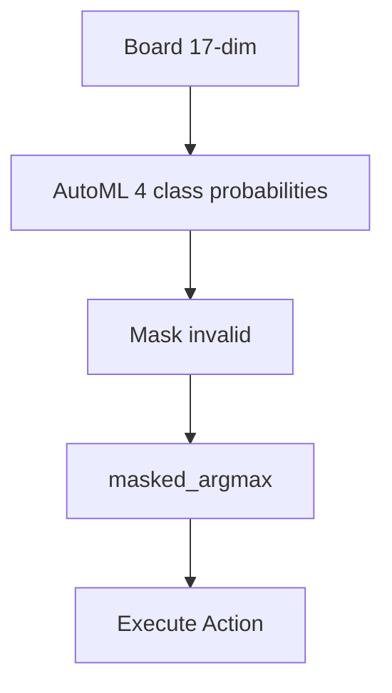

# Plan 02 — Action Decision Policy: the repository status is explicit and evidence based

> **Status: COMPLETE (2026-09-27).** Greedy validity-masked AutoML inference is implemented; the heuristic remains a separate baseline.

**Goal:** State the current implementation and evidence boundary for action decision policy.
**Builds on:** [00](../../00-scope-and-traceability.md) — the project is supervised 4×4 2048 policy learning, and framework evaluation is a separate research track.

---

## Decision and evidence

**This plan treats the supervised decision policy as implemented.** `ModelPolicy::select_move` takes the highest AutoML class probability among legal directions. `HeuristicPolicy` is an independently evaluated comparison baseline; neither policy blends outputs or uses exploration.

> **Canonical inference:** 17 features → four class probabilities → `masked_argmax` over valid directions. No blending or exploration.
> **Heuristic agent** is a **separate baseline** in `02-Environment/03-Simulation-Engine/` — not blended.

## 1. Architecture — Canonical



## 2. Greedy Policy — The Only MVP Policy

```rust
pub struct GreedyPolicy { pub model: InferenceEngine }
impl GreedyPolicy {
    pub fn decide(&self, state: &[f64;17], valid: &[u8]) -> Result<u8, ActionError> {
        let probabilities = self.model.predict_proba(state); // [f64;4]
        masked_argmax(&probabilities, valid)     // checked canonical result
    }
}
pub fn decide_action(state: &[f64;17], model: &InferenceEngine, valid: &[u8]) -> Result<u8, ActionError> {
    masked_argmax(&model.predict_proba(state), valid)
}
```
Canonical `masked_argmax` in `01-model-output-to-action.md`.

## 3. Deleted — Out of Scope (RL Hallucination)

> **Deleted for MVP:** `Epsilon-Greedy` (§3.2), `Softmax` (§3.3), `Composite` blending (§5) — all RL/exploration patterns, not supervised automl. Do not reintroduce. If exploration or heuristic comparison is needed, run a separate agent/policy outside the automl pipeline.

## 4. Path Integration

- `03-State/04-Encoding/01-state-vector.md:31` — state creation.
- `04-Actions/02-Space/02-action-constraints.md` — `valid_actions` via `would_change`.
- `04-Actions/03-Mapping/01-model-output-to-action.md` — `masked_argmax`.

## Implementation Record

- The live model policy is greedy validity-masked argmax over the AutoML four-class probability output. Heuristic play is a separate baseline policy, not blended with model inference.

---

## Verification (definition of done)

1. `test -f plans/04-Actions/03-Mapping/02-action-decision-policy.md` exits 0.
2. `grep -q '^# Plan 02 — ' plans/04-Actions/03-Mapping/02-action-decision-policy.md` exits 0.
3. `grep -q '^> \\*\\*Status:' plans/04-Actions/03-Mapping/02-action-decision-policy.md` exits 0.
4. `grep -q '^\*\*Goal:' plans/04-Actions/03-Mapping/02-action-decision-policy.md` exits 0.
5. `grep -q '^## Decision and evidence$' plans/04-Actions/03-Mapping/02-action-decision-policy.md` exits 0.
6. `grep -q '^## Open questions$' plans/04-Actions/03-Mapping/02-action-decision-policy.md` exits 0.
7. `grep -q '^## Later$' plans/04-Actions/03-Mapping/02-action-decision-policy.md` exits 0.
8. `bash /Users/evintleovonzko/Documents/works/kolosal/planout2/v2-ai-express/.claude/skills/writing-planout-plans/check-plan.sh plans/04-Actions/03-Mapping/02-action-decision-policy.md` exits 0.

## Open questions

- The action-selection implementation is complete. Its game-level quality remains unmeasured until a trained model and held-out policy evaluation are available.

## Later

- **Complete the remaining research or implementation work recorded above.** It stays deferred until its prerequisites, compute budget, and measurable acceptance evidence are available.
