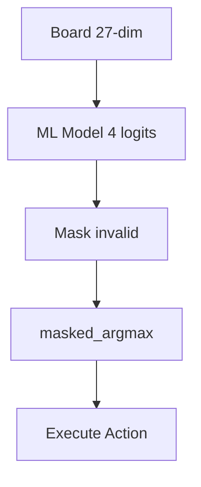

# Action Decision Policy — Greedy + masked_argmax Only

> **Canonical inference:** `27-dim → 4 logits → masked_argmax` over valid `0..3`. No blending, no exploration.
> **Heuristic agent** is a **separate baseline** in `02-Environment/03-Simulation-Engine/` — not blended.

## 1. Architecture — Canonical



## 2. Greedy Policy — The Only MVP Policy

```rust
pub struct GreedyPolicy { pub model: InferenceEngine }
impl GreedyPolicy {
    pub fn decide(&self, state: &[f64;27], valid: &[u8]) -> u8 {
        let logits = self.model.predict(state); // [f64;4]
        masked_argmax(&logits, valid)           // canonical
    }
}
pub fn decide_action(state: &[f64;27], model: &InferenceEngine, valid: &[u8]) -> u8 {
    masked_argmax(&model.predict(state), valid)
}
```
Canonical `masked_argmax` in `01-model-output-to-action.md`.

## 3. Deleted — Out of Scope (RL Hallucination)

> **Deleted for MVP:** `Epsilon-Greedy` (§3.2), `Softmax` (§3.3), `Composite` blending (§5) — all RL/exploration patterns, not supervised automl. Do not reintroduce. If exploration or heuristic comparison is needed, run a separate agent/policy outside the automl pipeline.

## 4. Path Integration

- `03-State/04-Encoding/01-state-vector.md:31` — state creation.
- `04-Actions/02-Space/02-action-constraints.md` — `valid_actions` via `would_change`.
- `04-Actions/03-Mapping/01-model-output-to-action.md` — `masked_argmax`.
