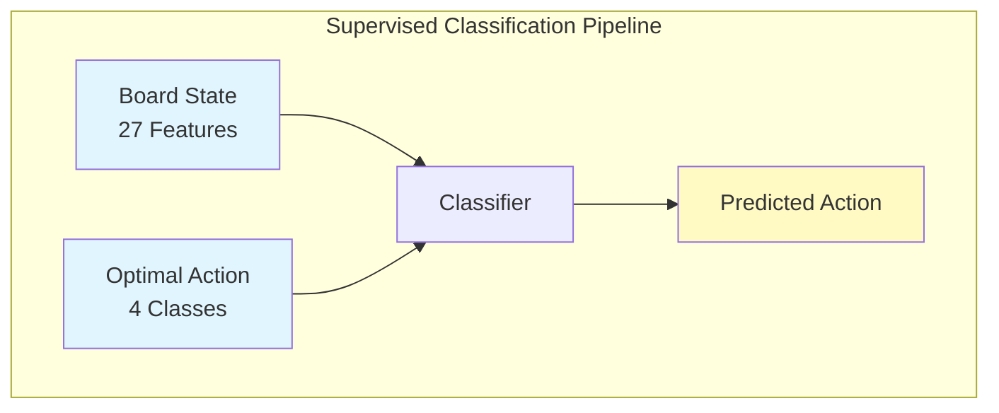
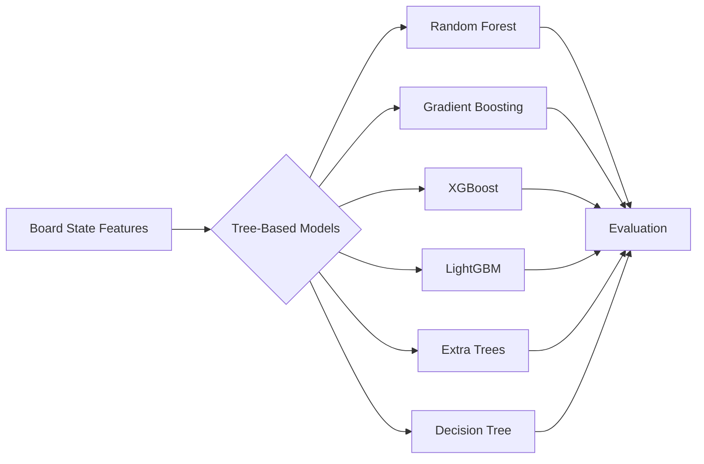
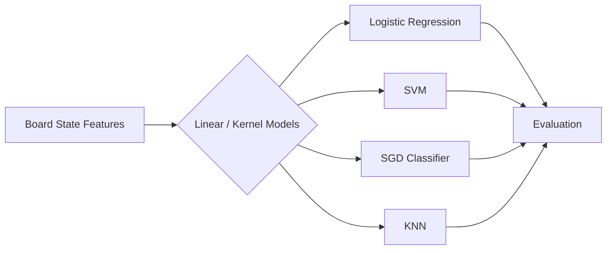
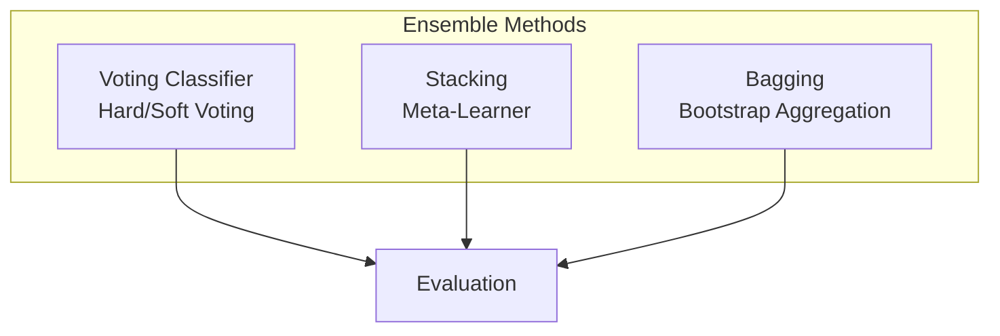
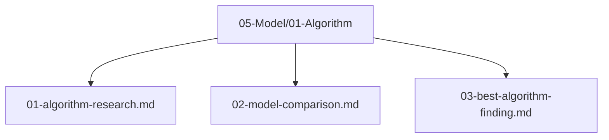

# Algorithm Research — Framework Capability and 2048 Case Study

> This is a secondary model-capability and case-study plan. The primary contribution is the Rust-native AutoML architecture defined in `plans/01-Infrastructure/01-Project/04-framework-contribution.md`.

## 1. Purpose

Document and evaluate the algorithms exposed by the Rust-native AutoML framework. Algorithm selection is a secondary evaluation dimension of the framework and its 2048 case study, not the primary thesis contribution.

## 2. Research Scope

Investigate supervised learning algorithms available in automl's `ModelType` enum. First verify each model's API, task compatibility, preprocessing requirements, serialization, and reproducibility on standard tabular tasks. Then use the verified subset to classify which move (up, down, left, right) is selected for a 2048 board state.

```mermaid
flowchart TD
    subgraph "Algorithm Research"
        subgraph "Tree-Based Models"
            RF[Random Forest]
            GBM[Gradient Boosting]
            XGB[XGBoost]
            LGBM[LightGBM]
            ET[Extra Trees]
            DT[Decision Tree]
        end
        
        subgraph "Linear Models"
            LR[Logistic Regression]
            SVM[Support Vector Machine]
            SGD[Stochastic Gradient Descent]
            KNN[K-Nearest Neighbors]
        end
        
        subgraph "Ensemble Methods"
            VB[Voting Classifier]
            ST[Stacking]
            BG[Bagging]
        end
    end
    
    RF --> Evaluation
    GBM --> Evaluation
    XGB --> Evaluation
    LGBM --> Evaluation
    ET --> Evaluation
    DT --> Evaluation
    LR --> Evaluation
    SVM --> Evaluation
    SGD --> Evaluation
    KNN --> Evaluation
    VB --> Evaluation
    ST --> Evaluation
    BG --> Evaluation
    
    Evaluation[Evaluation & Benchmarking]
```

## 3. Algorithm Candidates

### 3.1 Supervised Learning for Sequential Games

2048 is a sequential decision-making game, but automl provides only supervised learning models. We bridge this gap by framing the problem as **multi-class classification**:

- **Input**: A 27-dimensional feature vector representing the board state
- **Output**: One of 4 actions (up, down, left, right)
- **Training data**: Generated by simulating games and recording (state, rollout_labeled_action) pairs

Each board state maps to a single optimal action. By collecting enough state-action pairs, we train a classifier that predicts the best move given any board configuration. This approach does not learn a value function or policy network as in RL — it directly learns the mapping from states to actions.

### 3.2 Tree-Based Models

Tree-based models are the strongest candidates due to their ability to handle non-linear relationships in board state features and their inherent capacity to capture interaction effects between features (e.g., monotonicity × empty tiles).

### 3.3 Linear and Kernel Models

Linear models and SVMs provide baselines that are faster to train and may generalize better with limited data, though they cannot capture complex feature interactions as effectively as tree-based models.

### 3.4 Ensemble Methods

Ensemble methods combine multiple base classifiers to improve prediction accuracy and robustness.

## 4. Evaluation Criteria — Canonical

| Criterion | Weight / Role | Description | Gate? |
|-----------|---------------|-------------|-------|
| Mean Game Score | **2048 case-study ranking** | Average final game score across the declared held-out games — rank by mean, with uncertainty and practical effect | Case-study comparison |
| Valid-Action Accuracy (valid actions) | Gate | Accuracy of move prediction on valid actions only (0–3) | **≥60% gate** |
| F1 Macro | Gate | Macro-averaged F1 across 4 action classes | **≥0.55 gate** |
| Inference Speed | Informative (≤1ms) | Time to predict a move (ms) | — |
| Score Consistency | Informative | Standard deviation of game scores (lower = better) | — |

> **No proximity ratio gate.** If reported as optional analysis, proximity = `model_mean / heuristic_mean (≈512)` as a single informative ratio (e.g., 1.5×). Do not use `max_score / theoretical_limit` — theoretical limit is open/unproven. Canonical thresholds: **Mean ≥512, Valid-Action Accuracy ≥60%, F1 ≥0.55, Rank by Mean Score**.

**Note**: The task is supervised multi-class classification. The model predicts an action given a board state. R², RMSE, and MAE are NOT applicable because the model does not predict scores — it predicts discrete actions. Score is a downstream consequence of action quality.

**Note on automl capabilities**: automl provides supervised classification and regression models. It does not include RL algorithms (Q-Learning, DQN, PPO). All model selection is done via automl's `ModelType` enum which includes DecisionTree, RandomForest, GradientBoosting, XGBoost, LightGBM, SVM, KNN, LogisticRegression, SGD, AdaBoost, ExtraTrees, and others.

## 5. Research References

All algorithm research findings will be documented in `05-Model/01-Algorithm/`:

## 6. Next Steps

1. Train and benchmark candidate algorithms using automl's supervised learning models
2. Compare model performance metrics on classification accuracy and game score
3. Select the best performing algorithm
4. Document findings in `05-Model/01-Algorithm/03-best-algorithm-finding.md`
