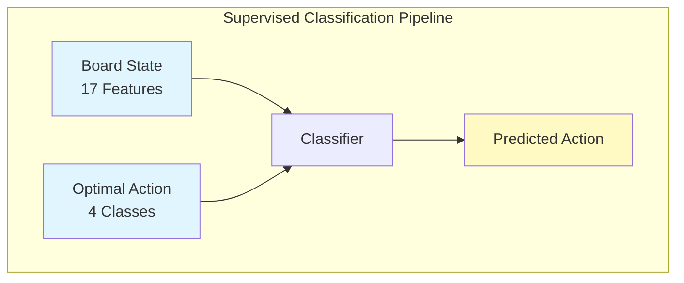
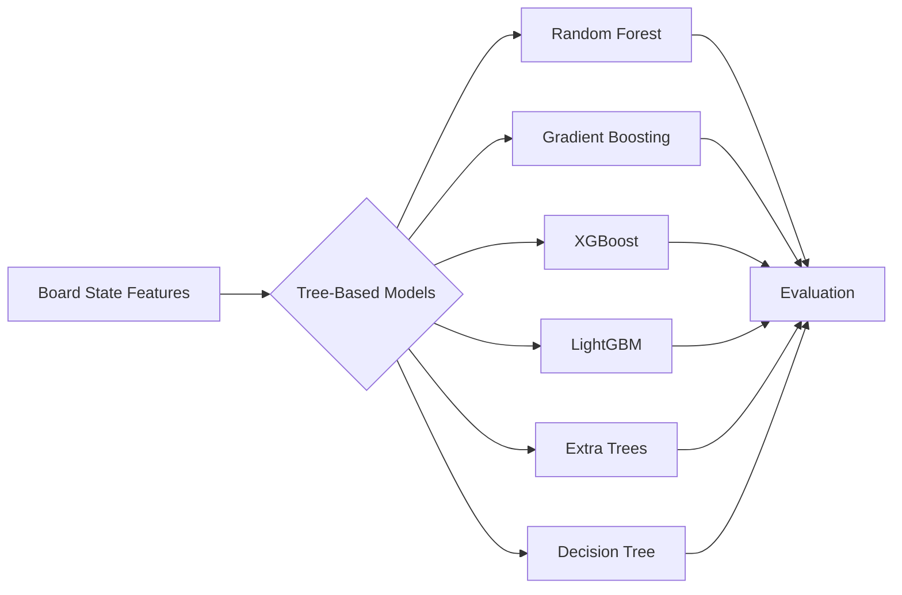
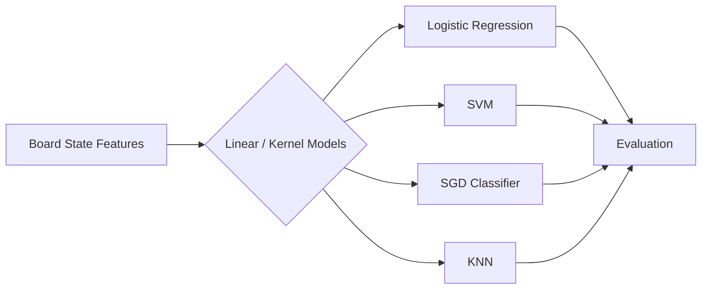
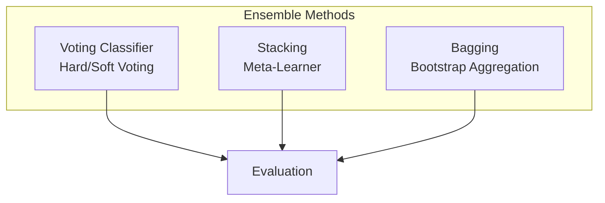
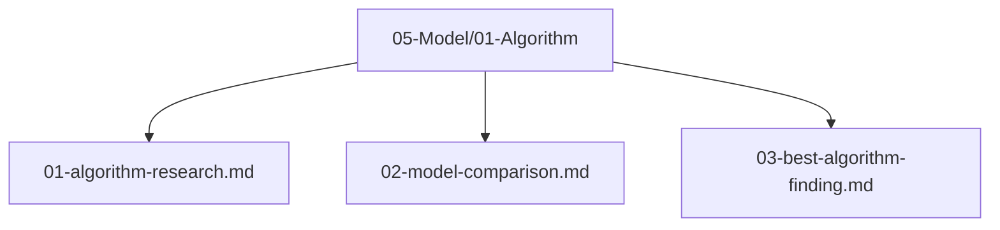

# Plan 01 — Algorithm Research: the repository status is explicit and evidence based

> **Status: PARTIAL (2026-09-27).** Framework API checks and an initial fixed-split dataset diagnostic are recorded; matched framework comparisons and 2048 candidate ranking remain pending.

**Goal:** State the current implementation and evidence boundary for algorithm research.
**Builds on:** [00](../../00-scope-and-traceability.md) — the project is supervised 4×4 2048 policy learning, and framework evaluation is a separate research track.

---

## Decision and evidence

**This plan treats algorithm capability inspection as implemented with comparative evaluation pending.** The smoke suite exercises 13 model/task combinations, but only RandomForest, ExtraTrees, AdaBoost, KNN, and NaiveBayes produce four-class probability output in the pinned integration. An initial one-split standard-dataset diagnostic is retained, but it is not a matched baseline study and does not rank candidates for 2048.

> This is a secondary model-capability and case-study plan. The primary contribution is the Rust-native AutoML architecture defined in `plans/01-Infrastructure/01-Project/04-framework-contribution.md`.

## 1. Purpose

Document and evaluate the algorithms exposed by the Rust-native AutoML framework. Algorithm selection is a secondary evaluation dimension of the framework and its 2048 case study, not the primary thesis contribution.

## 2. Research Scope

Investigate supervised learning algorithms available in automl's `ModelType` enum. First verify each model's API, task compatibility, preprocessing requirements, serialization, and reproducibility on standard tabular tasks. Then use the verified subset to classify which move (up, down, left, right) is selected for a 2048 board state.

```mermaid
flowchart TD
    subgraph "Algorithm Research"
        subgraph "Tree-Based Models"
            RF[Random Forest]
            GBM[Gradient Boosting]
            XGB[XGBoost]
            LGBM[LightGBM]
            ET[Extra Trees]
            DT[Decision Tree]
        end
        
        subgraph "Linear Models"
            LR[Logistic Regression]
            SVM[Support Vector Machine]
            SGD[Stochastic Gradient Descent]
            KNN[K-Nearest Neighbors]
        end
        
        subgraph "Ensemble Methods"
            VB[Voting Classifier]
            ST[Stacking]
            BG[Bagging]
        end
    end
    
    RF --> Evaluation
    GBM --> Evaluation
    XGB --> Evaluation
    LGBM --> Evaluation
    ET --> Evaluation
    DT --> Evaluation
    LR --> Evaluation
    SVM --> Evaluation
    SGD --> Evaluation
    KNN --> Evaluation
    VB --> Evaluation
    ST --> Evaluation
    BG --> Evaluation
    
    Evaluation[Evaluation & Benchmarking]
```

## 3. Algorithm Candidates

### 3.1 Supervised Learning for Sequential Games

2048 is a sequential decision-making game, but automl provides only supervised learning models. We bridge this gap by framing the problem as **multi-class classification**:

- **Input**: A 17-dimensional feature vector representing the board state
- **Output**: One of 4 actions (up, down, left, right)
- **Training data**: The intended corpus uses simulator-generated states with rollout-derived action labels; plan-scale data has not yet been collected.

Each board state maps to a single optimal action. By collecting enough state-action pairs, we train a classifier that predicts the best move given any board configuration. This approach does not learn a value function or policy network as in RL — it directly learns the mapping from states to actions.

### 3.2 Tree-Based Models

Tree-based models are plausible candidates for nonlinear board interactions, but no model family is assumed to perform best. Capability compatibility and empirical quality are separate questions.

### 3.3 Linear and Kernel Models

Linear models and SVMs are candidate baselines. Runtime and generalization are unmeasured here; their representational limits depend on configuration and data.

### 3.4 Ensemble Methods

Ensemble methods combine multiple base classifiers to improve prediction accuracy and robustness.

## 4. Evaluation Criteria — Canonical

| Criterion | Weight / Role | Description | Gate? |
|-----------|---------------|-------------|-------|
| Mean Game Score | 2048 case-study outcome | Average final game score across declared held-out games; report uncertainty | Protocol-defined |
| Valid-Action Accuracy (valid actions) | Diagnostic | Accuracy of move prediction on valid actions only (0–3) | diagnostic, no fixed threshold |
| F1 Macro | Diagnostic | Macro-averaged F1 across 4 action classes | diagnostic, no fixed threshold |
| Inference Speed | Informative | Time to predict a move (ms), measured on declared hardware | — |
| Score Consistency | Informative | Standard deviation of game scores (lower = better) | — |

> No score/accuracy thresholds are established by the canonical scope. Predeclare a case-study protocol before ranking. Do not interpret a 2048 score as AutoML framework evidence.

**Note**: The task is supervised multi-class classification. The model predicts an action given a board state. R², RMSE, and MAE are NOT applicable because the model does not predict scores — it predicts discrete actions. Score is a downstream consequence of action quality.

**Note on automl capabilities**: AutoML provides supervised estimators, not reinforcement-learning methods. The source smoke exercises DecisionTree, RandomForest, ExtraTrees, AdaBoost, KNN, NaiveBayes, LogisticRegression, SGD, SVM, GradientBoosting, XGBoost, LightGBM, and CatBoost; supported prediction and probability shapes differ. Only five currently satisfy the root four-class probability policy contract.

## 5. Research References

All algorithm research findings will be documented in `05-Model/01-Algorithm/`:

## 6. Next Steps

1. Train and benchmark candidate algorithms using automl's supervised learning models
2. Compare model performance metrics on classification accuracy and game score
3. Select the best performing algorithm
4. Document findings in `05-Model/01-Algorithm/03-best-algorithm-finding.md`

## Implementation Record

- `src/framework_validation.rs` smoke-checks 13 model/task combinations and confirms the four-class probability subset: RandomForest, ExtraTrees, AdaBoost, KNN, and NaiveBayes.
- An initial one-split diagnostic across three standard datasets and five candidates is retained in `reports/framework_validation/`; two seed-42 runs matched 14/15 prediction sets, with Wine KNN repeatability/serialization failure on the prior AutoML revision. The pinned determinism fix has not been checked against this matrix. Matched framework baselines and a 10k-game trained-model ranking remain incomplete. No winner or threshold pass is claimed.

---

## Verification (definition of done)

1. `test -f plans/05-Model/01-Algorithm/01-algorithm-research.md` exits 0.
2. `grep -q '^# Plan 01 — ' plans/05-Model/01-Algorithm/01-algorithm-research.md` exits 0.
3. `grep -q '^> \\*\\*Status:' plans/05-Model/01-Algorithm/01-algorithm-research.md` exits 0.
4. `grep -q '^\*\*Goal:' plans/05-Model/01-Algorithm/01-algorithm-research.md` exits 0.
5. `grep -q '^## Decision and evidence$' plans/05-Model/01-Algorithm/01-algorithm-research.md` exits 0.
6. `grep -q '^## Open questions$' plans/05-Model/01-Algorithm/01-algorithm-research.md` exits 0.
7. `grep -q '^## Later$' plans/05-Model/01-Algorithm/01-algorithm-research.md` exits 0.
8. `bash /Users/evintleovonzko/Documents/works/kolosal/planout2/v2-ai-express/.claude/skills/writing-planout-plans/check-plan.sh plans/05-Model/01-Algorithm/01-algorithm-research.md` exits 0.

## Open questions

- Complete matched standard-dataset framework validation under #103 before making general algorithm-quality claims.
- Run a predeclared 2048 case-study comparison only after an adequate labeled corpus and compute budget are available.

## Later

- **Complete the remaining research or implementation work recorded above.** It stays deferred until its prerequisites, compute budget, and measurable acceptance evidence are available.
