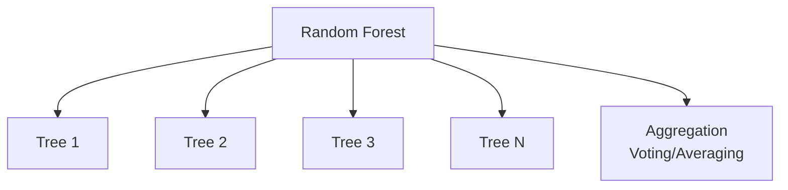
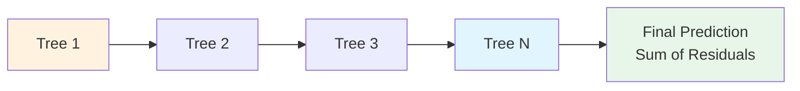
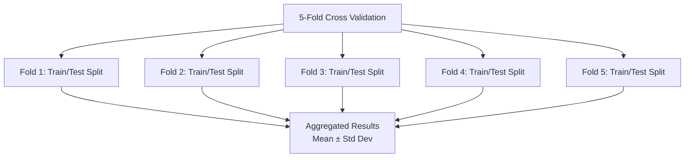

# Plan 02 — Model Comparison: the repository status is explicit and evidence based

> **Status: PLANNED.** Not yet restarted in strict sequence.

**Goal:** State the current implementation and evidence boundary for model comparison.
**Builds on:** [00](../../00-scope-and-traceability.md) — the project is supervised 4×4 2048 policy learning, and framework evaluation is a separate research track.

---

## Decision and evidence

**This plan treats its subject as partial or pending work, not as a research finding.** The rejected alternative is to infer completion from a plan title or related code alone. The ledger records this disposition: Not yet restarted in strict sequence.

> This comparison characterizes AutoML-supported models and the 2048 case study. It does not define the primary framework contribution.

## 1. Purpose

Compare multiple machine-learning algorithms to characterize the Rust-native AutoML framework and its 2048 case-study behavior. The comparison does not by itself establish that one algorithm or the framework is universally best.

## 2. Comparison Framework

All models will be evaluated using the same dataset, features, and metrics to ensure fair comparison.

```mermaid
flowchart TD
    subgraph "Comparison Framework — Classification Only"
        Data[Unified Dataset<br/>state: [f64;27] → action: u8 (0-3)]

        Data --> RF[Random Forest]
        Data --> GBM[Gradient Boosting]
        Data --> XGB[XGBoost]
        Data --> LR[Logistic Regression]
        Data --> SVM[Support Vector Machine]

        RF --> Metrics
        GBM --> Metrics
        XGB --> Metrics
        LR --> Metrics
        SVM --> Metrics

        Metrics[Evaluation Metrics<br/>Valid-Action Accuracy, F1 Macro, Mean Game Score]
    end
```

> **No NN branch, no regression metrics.** `ModelType` is classical ML only (smartcore/linfa); task is `TaskType::MultiClassification` (4 logits → `argmax`).

## 3. Models Under Comparison

### 3.1 Random Forest



### 3.2 Gradient Boosting



### 3.3 Neural Network

> **Removed from comparison**: The automl framework's `ModelType` enum does not include neural network models. The `automl` submodule (as verified by `Cargo.toml`) depends on `smartcore` and `linfa`, which are classical ML libraries without neural network support. Neural networks are out of scope unless automl adds this capability in a future version.

## 4. Comparison Metrics — Canonical

| Model | Mean Game Score (rank) | Valid-Action Accuracy (≥60%) | F1 Macro (≥0.55) | Inference Time (≤1ms) | Notes |
|-------|------------------------|------------------------------|-----------------|----------------------|-------|
| Random Forest | TBD — run after training | TBD — run after training | TBD — run after training | TBD — run after training | Baseline |
| Extra Trees | TBD — run after training | TBD — run after training | TBD — run after training | TBD — run after training | Fast ensemble |
| KNN | TBD — run after training | TBD — run after training | TBD — run after training | TBD — run after training | Non-parametric |
| AdaBoost | TBD — run after training | TBD — run after training | TBD — run after training | TBD — run after training | Verified four-class output |
| Naive Bayes | TBD — run after training | TBD — run after training | TBD — run after training | TBD — run after training | Verified four-class output |

> **Canonical:** Rank by **Mean Game Score** (≥512 beats heuristic, highest wins). Gates: Valid-Action Accuracy ≥60%, F1 ≥0.55. If proximity reported as optional analysis: `model_mean / heuristic_mean (≈512)` single ratio only, not a gate.
>
> **All metrics use game score as primary metric. Regression metrics (R², RMSE) are not applicable because the task is classification.**

### 4.1 Benchmark Loop — Actionable automl API

All candidates are benchmarked with the same `TrainingConfig` + `cross_val_score` + `GroupKFold` pattern (verified in `automl/src/training/config.rs:174` and `cross_validation.rs:49`):

```rust
use automl::{TrainingConfig, TaskType, ModelType, CVStrategy, cross_val_score};
use automl::training::CrossValidator;
use ndarray::{Array1, Array2};
use std::collections::HashMap;

// Candidates — scope aligned: benchmark + best algorithm
let candidates = vec![
    ModelType::RandomForest,
    ModelType::GradientBoosting,
    ModelType::XGBoost,
    ModelType::LightGBM,
    ModelType::CatBoost,
    ModelType::ExtraTrees,
    ModelType::SVM,
    ModelType::KNN,
    ModelType::LogisticRegression,
];

// Optional: group-aware split to prevent game-level leakage (see 04-Evaluation/02-cross-validation.md)
let groups: Array1<i64> = /* game_id per sample */;
let cv = CrossValidator::new(CVStrategy::GroupKFold { n_splits: 5 })
    .with_random_state(42);
let splits = cv.split(n_samples, None, Some(&groups))?; // verified: split(n, None, Some(&groups))

// Rank by cross-validated classification accuracy, then confirm by Mean Game Score ≥512
let mut ranked: Vec<(ModelType, f64)> = Vec::new();
for model_type in &candidates {
    let config = TrainingConfig::new(TaskType::MultiClassification, "action")
        .with_model(model_type.clone())
        .with_cv(5)
        .with_random_state(42);
    // The project wrapper must score explicit splits; automl::cross_val_score
    // discards groups and is not valid for GroupKFold.
    let splits = CrossValidator::new(CVStrategy::GroupKFold { n_splits: 5 })
        .with_random_state(42)
        .split(x.nrows(), Some(&y), Some(&groups))?;
    // train/validate each fold via TrainEngine::fit(&df) → InferenceEngine::predict
    ranked.push((model_type.clone(), score_splits(&config, &x, &y, &splits)?));
}
ranked.sort_by(|a, b| b.1.partial_cmp(&a.1).unwrap());
// Top-ranked model proceeds to downstream game-score benchmark (≥10k games):
// mean_game_score = simulator.run(&inference_engine, n_games: 10000).mean()
// Gate: mean_game_score ≥ 512 && valid_action_accuracy ≥ 60% && f1_macro ≥ 0.55
```

> **Scope:** This file benchmarks candidates; `03-best-algorithm-finding.md` selects the single winner by Mean Game Score.

## 5. Cross-Validation Results



## 6. Conclusion

Candidate availability is gated by the pinned framework's four-class probability output. The current integration candidates are RandomForest, ExtraTrees, AdaBoost, KNN, and NaiveBayes. The original GradientBoosting, XGBoost, LightGBM, SVM, and LogisticRegression entries are excluded until the framework passes multiclass probability checks. No game-performance comparison has been completed; table values remain TBD.

Based on the comparison results, the best model will be selected and documented in `05-Model/01-Algorithm/03-best-algorithm-finding.md`.

## Implementation Record

- Five supported four-class candidate names are documented, and the root CLI can train a selected candidate and benchmark a saved model. Grouped CV checks game-level integrity.
- A uniform candidate run on the same adequate dataset has not been performed; all metric cells remain TBD and there is no selected model.

---

## Verification (definition of done)

1. `test -f plans/05-Model/01-Algorithm/02-model-comparison.md` exits 0.
2. `grep -q '^# Plan 02 — ' plans/05-Model/01-Algorithm/02-model-comparison.md` exits 0.
3. `grep -q '^> \\*\\*Status:' plans/05-Model/01-Algorithm/02-model-comparison.md` exits 0.
4. `grep -q '^\*\*Goal:' plans/05-Model/01-Algorithm/02-model-comparison.md` exits 0.
5. `grep -q '^## Decision and evidence$' plans/05-Model/01-Algorithm/02-model-comparison.md` exits 0.
6. `grep -q '^## Open questions$' plans/05-Model/01-Algorithm/02-model-comparison.md` exits 0.
7. `grep -q '^## Later$' plans/05-Model/01-Algorithm/02-model-comparison.md` exits 0.
8. `bash /Users/evintleovonzko/Documents/works/kolosal/planout2/v2-ai-express/.claude/skills/writing-planout-plans/check-plan.sh plans/05-Model/01-Algorithm/02-model-comparison.md` exits 0.

## Open questions

- **The plan-scale evidence remains bounded by current results.** Not yet restarted in strict sequence. Any larger corpus or external benchmark needs a declared resource budget and retained artifacts.

## Later

- **Complete the remaining research or implementation work recorded above.** It stays deferred until its prerequisites, compute budget, and measurable acceptance evidence are available.
