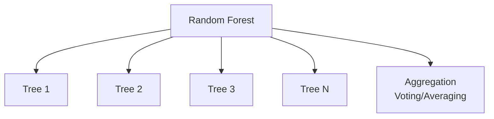
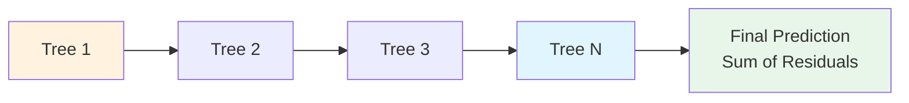
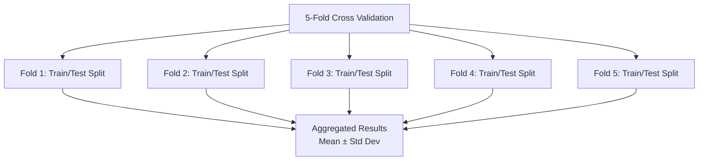

# Plan 02 — Model Comparison: the repository status is explicit and evidence based

> **Status: PARTIAL (2026-09-27).** Runnable candidates and comparison boundary are documented; matched model results remain pending.

**Goal:** State the current implementation and evidence boundary for model comparison.
**Builds on:** [00](../../00-scope-and-traceability.md) — the project is supervised 4×4 2048 policy learning, and framework evaluation is a separate research track.

---

## Decision and evidence

**This plan treats candidate compatibility as audited and comparison results as pending.** The root smoke verifies 13 estimator/task combinations; only RandomForest, ExtraTrees, AdaBoost, KNN, and NaiveBayes currently produce the four-class probability output used by `ModelPolicy`. No uniform algorithm benchmark or model-game comparison has been run.

> This comparison characterizes AutoML-supported models and the 2048 case study. It does not define the primary framework contribution.

## 1. Purpose

Compare multiple machine-learning algorithms to characterize the Rust-native AutoML framework and its 2048 case-study behavior. The comparison does not by itself establish that one algorithm or the framework is universally best.

## 2. Comparison Framework

All models will be evaluated using the same dataset, features, and metrics to ensure fair comparison.

```mermaid
flowchart TD
    subgraph "Comparison Framework — Classification Only"
        Data[Unified Dataset<br/>state: [f64;17] → action: u8 (0-3)]

        Data --> RF[Random Forest]
        Data --> GBM[Gradient Boosting]
        Data --> XGB[XGBoost]
        Data --> LR[Logistic Regression]
        Data --> SVM[Support Vector Machine]

        RF --> Metrics
        GBM --> Metrics
        XGB --> Metrics
        LR --> Metrics
        SVM --> Metrics

        Metrics[Evaluation Metrics<br/>Valid-Action Accuracy, F1 Macro, Mean Game Score]
    end
```

> The task is four-class classification, and the live policy consumes class probabilities. Candidate support is version/task specific; verify it before comparison. No neural-network model is included in this candidate set.

## 3. Models Under Comparison

### 3.1 Random Forest



### 3.2 Gradient Boosting



### 3.3 Neural Network

> **Removed from comparison**: The automl framework's `ModelType` enum does not include neural network models. The `automl` submodule (as verified by `Cargo.toml`) depends on `smartcore` and `linfa`, which are classical ML libraries without neural network support. Neural networks are out of scope unless automl adds this capability in a future version.

## 4. Comparison Metrics — Canonical

| Model | Mean Game Score (rank) | Valid-Action Accuracy | F1 Macro | Inference Time | Notes |
|-------|------------------------|------------------------------|-----------------|----------------------|-------|
| RandomForest | Not measured | Not measured | Not measured | Not measured | Four-class output smoke passes |
| ExtraTrees | Not measured | Not measured | Not measured | Not measured | Four-class output smoke passes |
| KNN | Not measured | Not measured | Not measured | Not measured | Four-class output smoke passes |
| AdaBoost | Not measured | Not measured | Not measured | Not measured | Four-class output smoke passes |
| NaiveBayes | Not measured | Not measured | Not measured | Not measured | Four-class output smoke passes |

> Predeclare the case-study ranking rule and uncertainty analysis before running candidates. The canonical scope sets no score or classification thresholds. Game results characterize the 2048 application only.
>
> **All metrics use game score as primary metric. Regression metrics (R², RMSE) are not applicable because the task is classification.**

### 4.1 Benchmark Loop — Actionable automl API

For a valid comparison, use the same game-group splits and protocol for all verified candidates. The root `grouped_cross_validate` wrapper materializes group-safe folds; generic `automl::cross_val_score` does not preserve groups.

```rust
use automl::{TrainingConfig, TaskType, ModelType, CVStrategy, cross_val_score};
use automl::training::CrossValidator;
use ndarray::{Array1, Array2};
use std::collections::HashMap;

// Candidates — scope aligned: benchmark + best algorithm
let candidates = vec![
    ModelType::RandomForest, ModelType::ExtraTrees, ModelType::AdaBoost,
    ModelType::KNN, ModelType::NaiveBayes,
];

// Optional: group-aware split to prevent game-level leakage (see 04-Evaluation/02-cross-validation.md)
let groups: Array1<i64> = /* game_id per sample */;
let cv = CrossValidator::new(CVStrategy::GroupKFold { n_splits: 5 })
    .with_random_state(42);
let splits = cv.split(n_samples, None, Some(&groups))?; // verified: split(n, None, Some(&groups))

// Report grouped-CV classification metrics, then compare held-out game outcomes
let mut ranked: Vec<(ModelType, f64)> = Vec::new();
for model_type in &candidates {
    let config = TrainingConfig::new(TaskType::MultiClassification, "action")
        .with_model(model_type.clone())
        .with_cv(5)
        .with_random_state(42);
    // The project wrapper must score explicit splits; automl::cross_val_score
    // discards groups and is not valid for GroupKFold.
    let splits = CrossValidator::new(CVStrategy::GroupKFold { n_splits: 5 })
        .with_random_state(42)
        .split(x.nrows(), Some(&y), Some(&groups))?;
    // train/validate each fold via TrainEngine::fit(&df) → InferenceEngine::predict
    ranked.push((model_type.clone(), score_splits(&config, &x, &y, &splits)?));
}
ranked.sort_by(|a, b| b.1.partial_cmp(&a.1).unwrap());
// Top-ranked model proceeds to downstream game-score benchmark after protocol declaration:
// mean_game_score = simulator.run(&inference_engine, n_games: 10000).mean()
// Report uncertainty and protocol; do not infer general framework quality from game score
```

> **Scope:** This file benchmarks candidates; `03-best-algorithm-finding.md` records a case-study selection only after matched evaluation.

## 5. Cross-Validation Results



## 6. Conclusion

Candidate availability is gated by the pinned framework's four-class probability output. The current integration candidates are RandomForest, ExtraTrees, AdaBoost, KNN, and NaiveBayes. The other smoke-tested estimators did not meet that output contract. No common-data algorithm comparison or game-performance comparison has been completed; table values remain unmeasured.

Based on the comparison results, the best model will be selected and documented in `05-Model/01-Algorithm/03-best-algorithm-finding.md`.

## Implementation Record

- Five four-class probability candidates are identified by `src/framework_validation.rs`; group-aware evaluation is available through `src/training.rs`.
- A uniform candidate run on the same adequate dataset has not been performed; all metric cells remain unmeasured and no model has been selected.

---

## Verification (definition of done)

1. `test -f plans/05-Model/01-Algorithm/02-model-comparison.md` exits 0.
2. `grep -q '^# Plan 02 — ' plans/05-Model/01-Algorithm/02-model-comparison.md` exits 0.
3. `grep -q '^> \\*\\*Status:' plans/05-Model/01-Algorithm/02-model-comparison.md` exits 0.
4. `grep -q '^\*\*Goal:' plans/05-Model/01-Algorithm/02-model-comparison.md` exits 0.
5. `grep -q '^## Decision and evidence$' plans/05-Model/01-Algorithm/02-model-comparison.md` exits 0.
6. `grep -q '^## Open questions$' plans/05-Model/01-Algorithm/02-model-comparison.md` exits 0.
7. `grep -q '^## Later$' plans/05-Model/01-Algorithm/02-model-comparison.md` exits 0.
8. `bash /Users/evintleovonzko/Documents/works/kolosal/planout2/v2-ai-express/.claude/skills/writing-planout-plans/check-plan.sh plans/05-Model/01-Algorithm/02-model-comparison.md` exits 0.

## Open questions

- Declare a dataset, split protocol, candidate configurations, seed matrix, metrics, and resource budget before executing the comparison. Retain raw fold metrics and game-level outcomes.

## Later

- **Complete the remaining research or implementation work recorded above.** It stays deferred until its prerequisites, compute budget, and measurable acceptance evidence are available.
