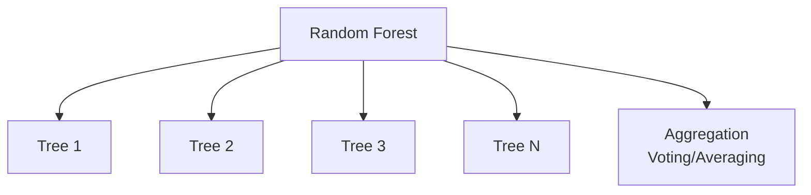
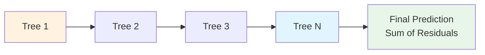
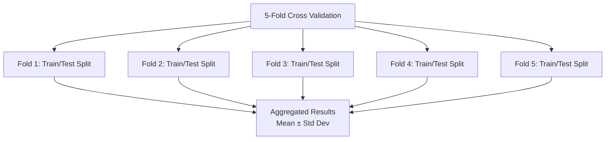
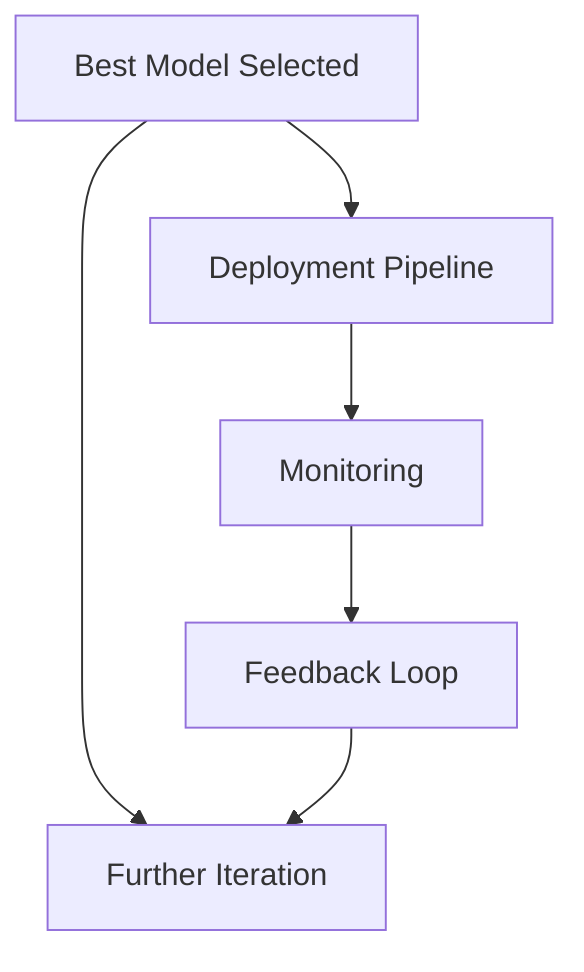

# Model Comparison

## 1. Purpose

Compare multiple machine learning algorithms to determine which performs best for the 2048 game prediction task.

## 2. Comparison Framework

All models will be evaluated using the same dataset, features, and metrics to ensure fair comparison.

```mermaid
flowchart TD
    subgraph "Comparison Framework — Classification Only"
        Data[Unified Dataset<br/>state: [f64;27] → action: u8 (0-3)]

        Data --> RF[Random Forest]
        Data --> GBM[Gradient Boosting]
        Data --> XGB[XGBoost]
        Data --> LR[Logistic Regression]
        Data --> SVM[Support Vector Machine]

        RF --> Metrics
        GBM --> Metrics
        XGB --> Metrics
        LR --> Metrics
        SVM --> Metrics

        Metrics[Evaluation Metrics<br/>Valid-Action Accuracy, F1 Macro, Mean Game Score]
    end
```

> **No NN branch, no regression metrics.** `ModelType` is classical ML only (smartcore/linfa); task is `TaskType::MultiClassification` (4 logits → `argmax`).

## 3. Models Under Comparison

### 3.1 Random Forest



### 3.2 Gradient Boosting



### 3.3 Neural Network

> **Removed from comparison**: The automl framework's `ModelType` enum does not include neural network models. The `automl` submodule (as verified by `Cargo.toml`) depends on `smartcore` and `linfa`, which are classical ML libraries without neural network support. Neural networks are out of scope unless automl adds this capability in a future version.

## 4. Comparison Metrics — Canonical

| Model | Mean Game Score (rank) | Valid-Action Accuracy (≥60%) | F1 Macro (≥0.55) | Inference Time (≤1ms) | Notes |
|-------|------------------------|------------------------------|-----------------|----------------------|-------|
| Random Forest | — | — | — | — | Baseline |
| Gradient Boosting | — | — | — | — | Strong candidate |
| XGBoost | — | — | — | — | High performance |
| LightGBM | — | — | — | — | Fast training |
| Extra Trees | — | — | — | — | Fast ensemble |
| SVM | — | — | — | — | Kernel-based |
| KNN | — | — | — | — | Non-parametric |
| Logistic Regression | — | — | — | — | Linear baseline |

> **Canonical:** Rank by **Mean Game Score** (≥512 beats heuristic, highest wins). Gates: Valid-Action Accuracy ≥60%, F1 ≥0.55. If proximity reported as optional analysis: `model_mean / heuristic_mean (≈512)` single ratio only, not a gate.
>
> **All metrics use game score as primary metric. Regression metrics (R², RMSE) are not applicable because the task is classification.**

## 5. Cross-Validation Results



## 6. Key Findings



## 7. Conclusion

Based on the comparison results, the best model will be selected and documented in `05-Model/01-Algorithm/03-best-algorithm-finding.md`.
