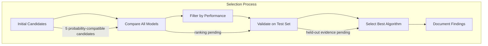
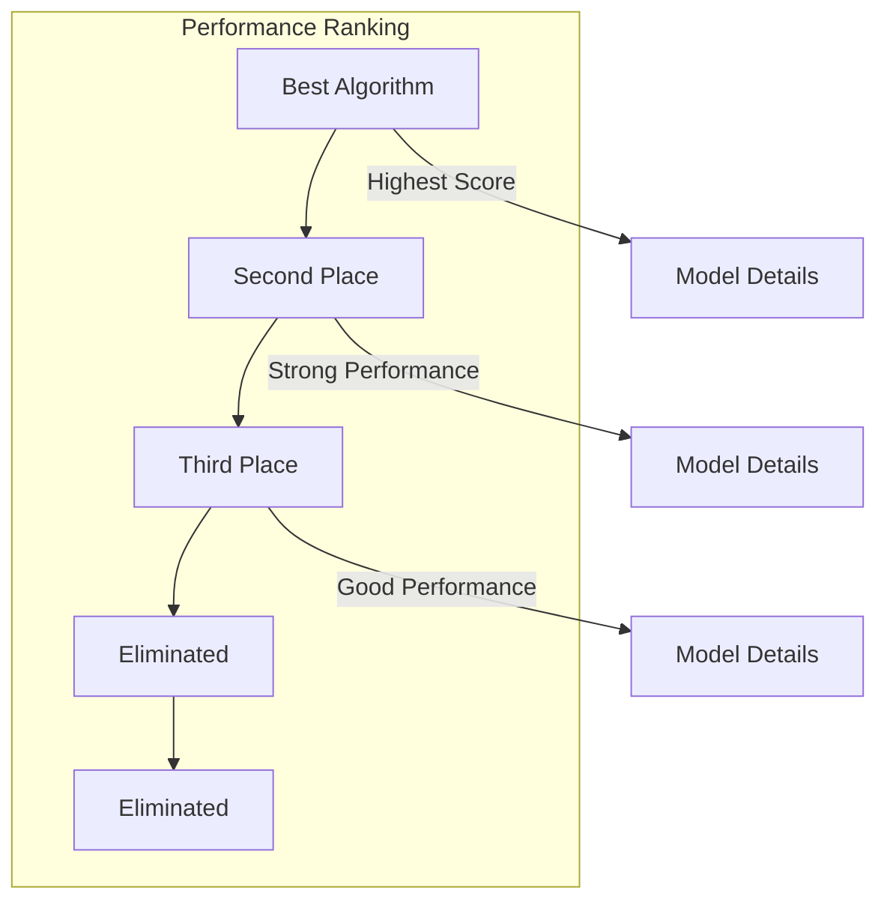
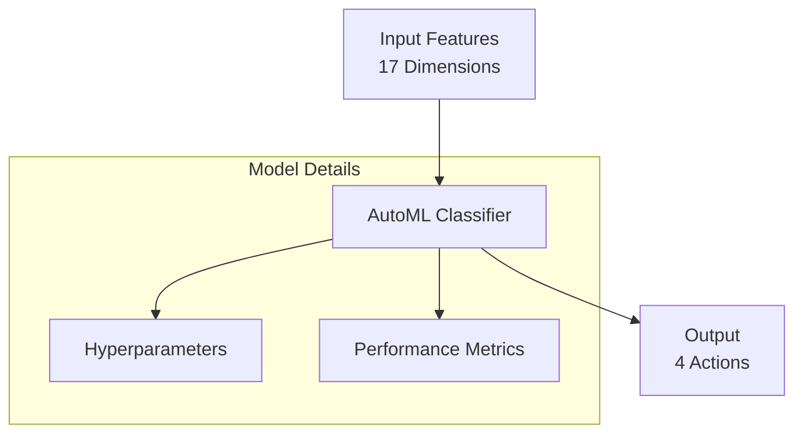
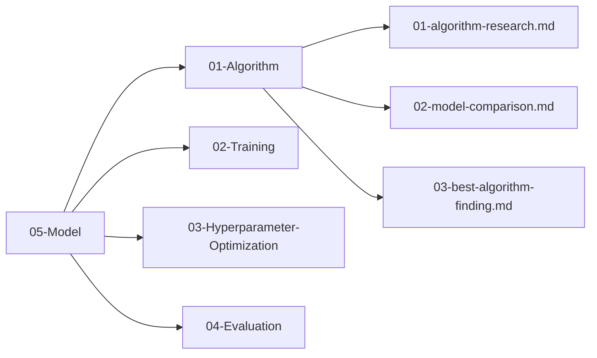

# Plan 03 — Best Algorithm Finding: the repository status is explicit and evidence based

> **Status: PARTIAL (2026-09-27).** No winner is selected; the comparison depends on a predeclared protocol and adequate evaluation data.

**Goal:** State the current implementation and evidence boundary for best algorithm finding.
**Builds on:** [00](../../00-scope-and-traceability.md) — the project is supervised 4×4 2048 policy learning, and framework evaluation is a separate research track.

---

## Decision and evidence

**This plan records a pending result, not an inferred winner.** The comparison has not been run on a common adequate dataset or held-out game set. The canonical scope requires separating 2048 case-study evidence from general framework claims; it defines no universal score or classification thresholds.

## 1. Purpose

Document the model-selection result for the 2048 case study and explain its relationship to the Rust-native AutoML framework. “Best” means best under the declared case-study protocol, not globally best.

## 2. Selection Process

No best algorithm has been selected. A selection requires matched results from the candidate comparison ticket and a declared 2048 protocol.

## 3. Candidate Summary

## 4. Final Model Architecture

## 5. Performance Metrics — Classification + Game-Score Benchmark

| Metric | Value | Target | Status |
|--------|-------|--------|--------|
| Mean Game Score (benchmark) | TBD — run after training | Predeclared practical comparison | Pending — case-study ranking |
| Valid-Action Accuracy | TBD — run after training | Report with uncertainty | Pending — diagnostic |
| F1 Macro (weighted, valid actions) | TBD — run after training | Report with uncertainty | Pending — diagnostic |
| Inference Time | TBD — run after training | Report hardware and distribution | Pending — framework/application efficiency |
| Training Time | TBD — run after training | Report configuration and budget | Pending — framework efficiency |

> **No R² / RMSE** — task is four-class classification; game score is a downstream case-study outcome, not a regression target. Values remain unmeasured until the comparison protocol runs.

### 5.1 Verified Policy Candidates

Only candidates that pass the pinned framework's four-class probability contract are eligible for this case study. Compatibility is not a performance ranking.

| Model | Category | Four-class policy output | Case-study result |
|-------|----------|--------------------------|-------------------|
| RandomForest | Tree ensemble | Verified | Unmeasured |
| ExtraTrees | Tree ensemble | Verified | Unmeasured |
| AdaBoost | Boosting | Verified | Unmeasured |
| KNN | Instance-based | Verified | Unmeasured |
| NaiveBayes | Probabilistic classifier | Verified | Unmeasured |

### 5.2 Model-family claims

No model-family performance claim is supported by current evidence. Tree-based
methods are hypotheses for future comparison; their tabular reputation does not
replace measurements on the declared dataset and task.

### 5.3 Evaluation protocol requirement

Before selecting a model, specify the candidate set that satisfies the four-class
probability contract, data and game-group splits, seeds, simulator settings,
primary outcome, diagnostics, uncertainty method, and resource budget. The
repository currently has no approved thresholds or fixed game count. Report
2048 results as application evidence only; use the separate standard-dataset
framework-validation track for framework claims.

## 6. Algorithm Rationale

Selection must follow the predeclared case-study protocol and report uncertainty. No winner or threshold is currently supported.

> **Scope aligned:** This file's job is **benchmark comparison + best algorithm selection**. Deployment/monitoring is out of scope (see `06-Data/` and `07-Benchmarking/` if needed).

## 7. Findings Summary

All findings are documented in the `05-Model/` directory:

## 8. Next Steps

1. Integrate selected algorithm into training pipeline
2. Configure hyperparameters using `05-Model/03-Hyperparameter-Optimization/`
3. Evaluate performance using `05-Model/04-Evaluation/`
4. Begin full training cycle

## Implementation Record

- Selection protocol remains incomplete; matched model and game-score evaluations have not been executed. The winner is intentionally left unselected and metric tables remain TBD.
- Status: research execution pending; do not select a model from architecture expectations or smoke runs.

---

## Verification (definition of done)

1. `test -f plans/05-Model/01-Algorithm/03-best-algorithm-finding.md` exits 0.
2. `grep -q '^# Plan 03 — ' plans/05-Model/01-Algorithm/03-best-algorithm-finding.md` exits 0.
3. `grep -q '^> \\*\\*Status:' plans/05-Model/01-Algorithm/03-best-algorithm-finding.md` exits 0.
4. `grep -q '^\*\*Goal:' plans/05-Model/01-Algorithm/03-best-algorithm-finding.md` exits 0.
5. `grep -q '^## Decision and evidence$' plans/05-Model/01-Algorithm/03-best-algorithm-finding.md` exits 0.
6. `grep -q '^## Open questions$' plans/05-Model/01-Algorithm/03-best-algorithm-finding.md` exits 0.
7. `grep -q '^## Later$' plans/05-Model/01-Algorithm/03-best-algorithm-finding.md` exits 0.
8. `bash /Users/evintleovonzko/Documents/works/kolosal/planout2/v2-ai-express/.claude/skills/writing-planout-plans/check-plan.sh plans/05-Model/01-Algorithm/03-best-algorithm-finding.md` exits 0.

## Open questions

- The case-study candidate ranking remains pending an adequate rollout-labeled corpus, a declared compute budget, matched training settings, and held-out game evaluation. The current standard-dataset diagnostic and API checks do not select a 2048 model.

## Later

- **Complete the remaining research or implementation work recorded above.** It stays deferred until its prerequisites, compute budget, and measurable acceptance evidence are available.
