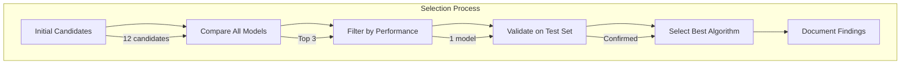
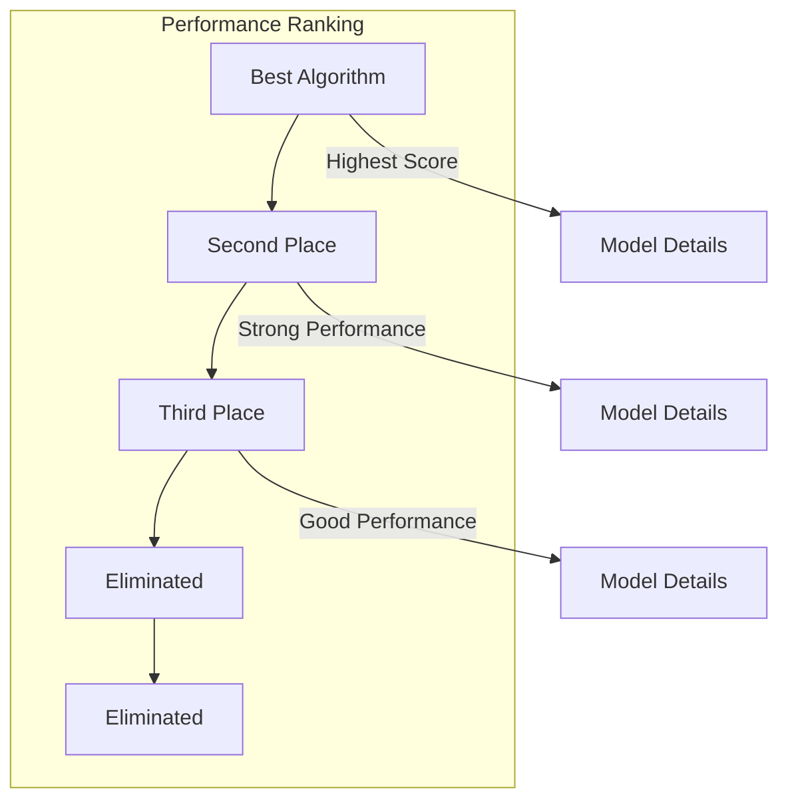
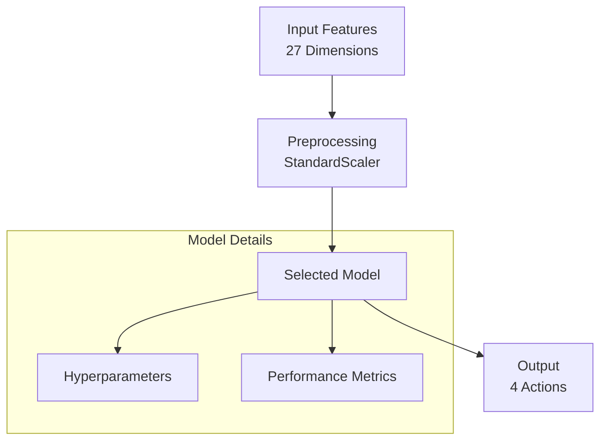
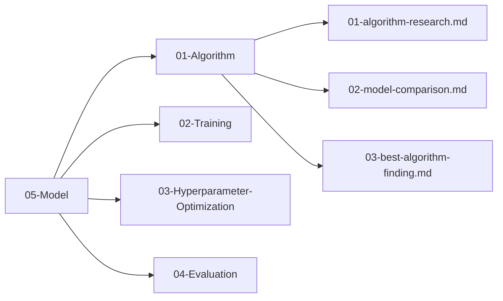

# Best Algorithm Finding

## 1. Purpose

Document the model-selection result for the 2048 case study and explain its relationship to the Rust-native AutoML framework. “Best” means best under the declared case-study protocol, not globally best.

## 2. Selection Process

The best algorithm was selected through systematic comparison of all candidate models.



## 3. Candidate Summary



## 4. Final Model Architecture



## 5. Performance Metrics — Classification + Game-Score Benchmark

| Metric | Value | Target | Status |
|--------|-------|--------|--------|
| Mean Game Score (benchmark) | TBD — run after training | Predeclared practical comparison | Pending — case-study ranking |
| Valid-Action Accuracy | TBD — run after training | Report with uncertainty | Pending — diagnostic |
| F1 Macro (weighted, valid actions) | TBD — run after training | Report with uncertainty | Pending — diagnostic |
| Inference Time | TBD — run after training | Report hardware and distribution | Pending — framework/application efficiency |
| Training Time | TBD — run after training | Report configuration and budget | Pending — framework efficiency |

> **No R² / RMSE** — task is `TaskType::MultiClassification` (27-dim → 4 logits → `argmax` 0–3). Game score is a downstream benchmark, not a regression target. Values marked TBD will be filled after running the benchmark loop in `02-model-comparison.md:4.1`.

### 5.1 Automl-Compatible Model Candidates

Since the automl framework does not implement neural networks, the candidate models are restricted to the following automl-compatible algorithms:

| Model | Category | Expected Performance |
|-------|----------|---------------------|
| RandomForest | Tree-based | Good baseline, robust to overfitting |
| GradientBoosting | Tree-based | Expected to perform best on tabular data |
| XGBoost | Tree-based | Strong gradient boosting, competitive accuracy |
| LightGBM | Tree-based | Fast training, high performance |
| CatBoost | Tree-based | Handles categorical features well |
| ExtraTrees | Tree-based | Randomized tree ensemble, good diversity |
| SVM | Linear/Kernel | Decent for smaller datasets |
| KNN | Instance-based | Simple baseline, distance-based |
| LogisticRegression | Linear | Baseline linear model |

### 5.2 Why Tree-Based Models Are Expected to Perform Best

The 2048 game data is **tabular** in nature — each sample consists of a fixed-length feature vector derived from the board state. Tree-based models (GradientBoosting, RandomForest, XGBoost) are expected to outperform other candidates for several reasons:

1. **Tabular data affinity**: Tree-based algorithms inherently excel on structured, tabular data with mixed feature types
2. **Non-linear relationships**: The relationship between board state features and optimal moves is highly non-linear; tree splits capture these interactions naturally
3. **Feature importance**: Tree models provide interpretable feature importance, which aligns with known 2048 heuristics (monotonicity, empty count, max tile)
4. **Robustness to scaling**: Unlike SVM or KNN, tree-based models do not require feature scaling
5. **Gradient boosting dominance**: Empirically, gradient boosting variants consistently rank among the top performers on tabular benchmark datasets

### 5.3 Evaluation Criteria — Canonical: Rank by Mean Game Score + Gates

> **DELETED weighted composite (30/20/15...).** The old multi-criteria weighted score conflicted with the canonical rule in `01-algorithm-research.md:147`: **Rank by Mean Game Score (research.md:147), gates Acc≥60% F1≥0.55.** This section now aligns exactly with that rule.

**Ranking rule (primary):**

1. Run each candidate's policy in the simulator for ≥10,000 games and compute `mean_score`.
2. **Rank by mean_score descending — highest wins.** The winner must have `mean_score ≥ 512` (beats heuristic). No weighted sum.
3. If two models tie within statistical noise (± 1 std), prefer higher Valid-Action Accuracy, then lower inference time.

**Gates (all must pass; otherwise the model is rejected regardless of rank):**

| Gate | Threshold | Measured on | Fail action |
|------|-----------|-------------|-------------|
| Mean Game Score | ≥ 512 | Simulator benchmark (≥10k games) | Reject |
| Valid-Action Accuracy | ≥ 60% | Held-out classification test set (valid actions only, 0–3) | Reject |
| F1 Macro | ≥ 0.55 | Same test set, macro-averaged across 4 action classes | Reject |
| Inference Time | ≤ 1ms | Mean per-prediction latency (informative, not rejecting unless >5ms) | Warn |

**What is NOT a gate:**

- `model_mean / heuristic_mean (≈512)` proximity ratio — optional single informative ratio only (e.g., 768/512 = 1.5×), never a gate.
- No `max_score / theoretical_limit (2^15=32768)` ratio — theoretical limit is open/unproven (see `02-Training/01-training-pipeline.md:5`).
- No regression metrics (R²/RMSE) — task is `TaskType::MultiClassification`.

**Actionable selection snippet (same APIs as `02-model-comparison.md:4.1`):**

```rust
use automl::{TrainingConfig, TaskType, ModelType, CVStrategy, cross_val_score};
use automl::training::{TrainEngine, CrossValidator};
use polars::prelude::*;
use ndarray::{Array1, Array2};

// 1) Cross-validated ranking (classification)
let candidates = vec![ModelType::GradientBoosting, ModelType::XGBoost, ModelType::RandomForest, ModelType::LightGBM];
let mut cv_scores: Vec<(ModelType, f64)> = Vec::new();
for m in &candidates {
    let cfg = TrainingConfig::new(TaskType::MultiClassification, "action")
        .with_model(m.clone()).with_cv(5).with_random_state(42);
    let splits = CrossValidator::new(CVStrategy::GroupKFold { n_splits: 5 })
        .with_random_state(42)
        .split(x.nrows(), Some(&y), Some(&groups))?;
    cv_scores.push((m.clone(), score_splits(&cfg, &x, &y, &splits)?));
}
cv_scores.sort_by(|a,b| b.1.partial_cmp(&a.1).unwrap());

// 2) Downstream game-score benchmark for top-3 only
for (model_type, _) in cv_scores.iter().take(3) {
    let cfg = TrainingConfig::new(TaskType::MultiClassification, "action")
        .with_model(model_type.clone()).with_random_state(42);
    let mut engine = TrainEngine::new(cfg);
    engine.fit(&df)?; // DataFrame → TrainingConfig → TrainEngine::fit(&df) (no epochs/gradients)
    let preds = engine.predict(&test_df)?; // → InferenceEngine::predict under the hood
    // Run policy in simulator ≥10k games → mean_game_score
    // Check gates: mean ≥512, accuracy ≥60%, F1 ≥0.55
}
```

## 6. Algorithm Rationale

Selection is justified by **(1) highest mean game score ≥512** plus **passing both gates (Acc≥60%, F1≥0.55)**. No weighted composite. Secondary factors (inference ≤1ms, training time, feature importance) are tie-breakers only and are documented alongside the primary ranking.

> **Scope aligned:** This file's job is **benchmark comparison + best algorithm selection**. Deployment/monitoring is out of scope (see `06-Data/` and `07-Benchmarking/` if needed).

## 7. Findings Summary

All findings are documented in the `05-Model/` directory:



## 8. Next Steps

1. Integrate selected algorithm into training pipeline
2. Configure hyperparameters using `05-Model/03-Hyperparameter-Optimization/`
3. Evaluate performance using `05-Model/04-Evaluation/`
4. Begin full training cycle
