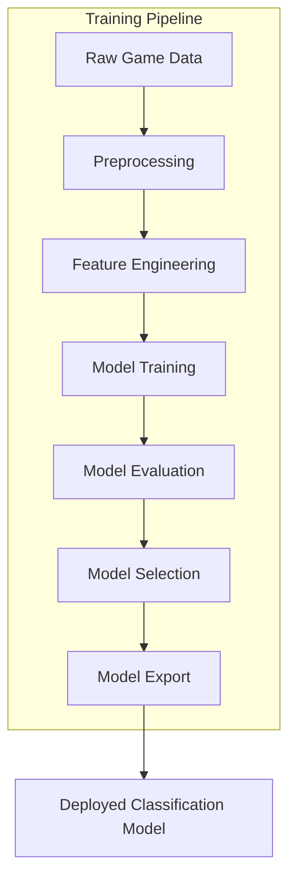
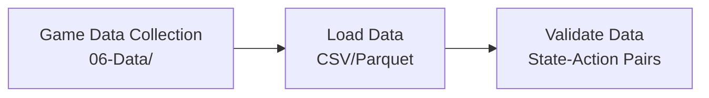
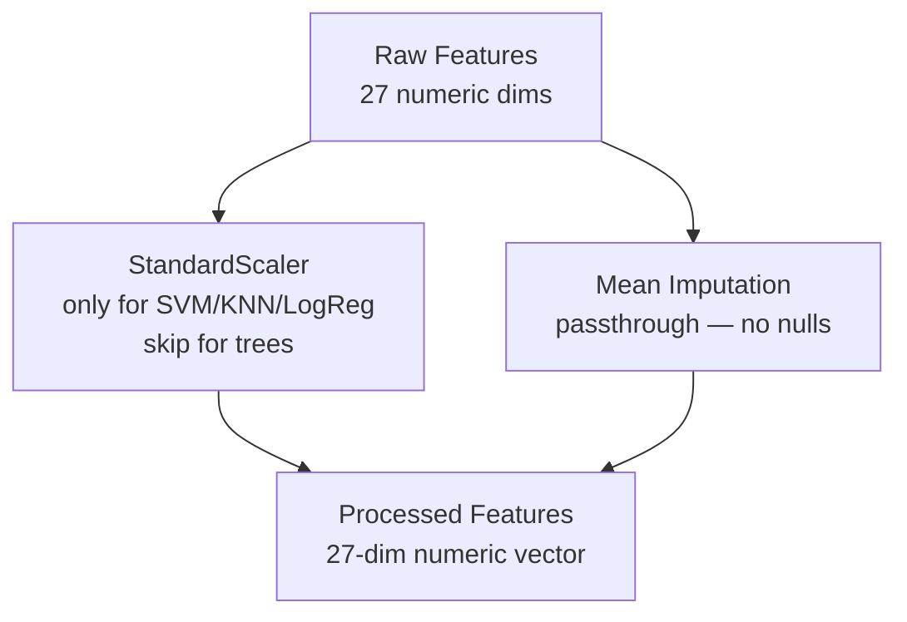
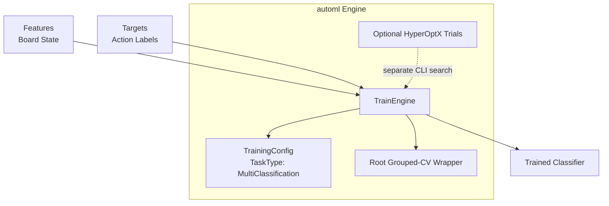
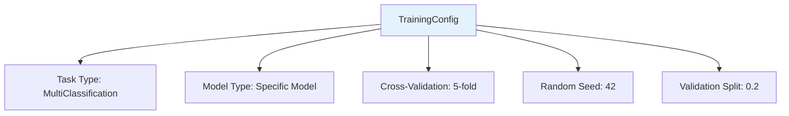
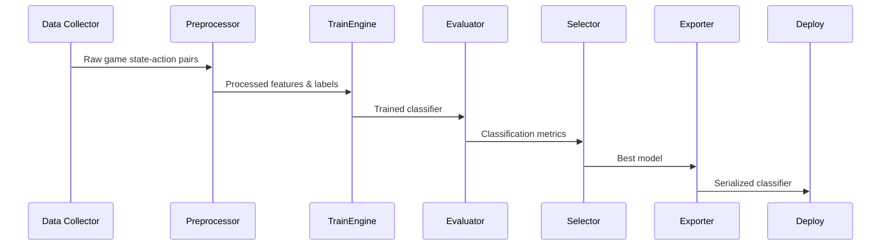
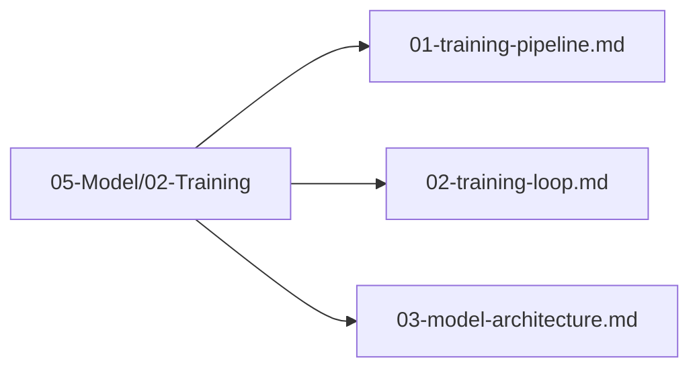

# Plan 01 — Training Pipeline: the repository status is explicit and evidence based

> **Status: PARTIAL (2026-09-26).** CLI CSV/metadata loading, chronological holdout, grouped CV, fitting, and model export exist; the complete final evaluation/refit workflow remains pending.

**Goal:** State the current implementation and evidence boundary for training pipeline.
**Builds on:** [00](../../00-scope-and-traceability.md) — the project is supervised 4×4 2048 policy learning, and framework evaluation is a separate research track.

---

## Decision and evidence

**This plan treats the executable training path as implemented with evaluation lifecycle gaps.** The root CLI loads canonical CSV and aligned sidecar, holds out later game IDs, runs group-aware CV on development rows, fits an AutoML model, and saves it. The final untouched-test diagnostics and selected-model refit flow are not implemented.

## 1. Purpose

Document the current training path from collected supervised rows to an action classifier. Labels are rollout-derived actions, not proven optimal moves.

## 2. Pipeline Overview

The training pipeline follows a structured flow from raw game data to a deployable classification model.



## 3. Pipeline Stages

### 3.1 Data Ingestion



### 3.2 Preprocessing

> The canonical feature values are deterministic numeric values. The root training path does not fit an AutoML `DataPreprocessor`; stored CSV features are consumed directly. The 27-value schema and tile-range issue are documented in the state tickets.



### 3.3 Training Execution



## 4. Pipeline Configuration



**Configuration Details:**
- **Task Type**: `MultiClassification` — 4 output classes (0=up, 1=down, 2=left, 3=right)
- **Model Type**: The currently verified four-class probability candidates are RandomForest, ExtraTrees, AdaBoost, KNN, and NaiveBayes
- **Purpose**: Each model is trained independently to enable ceiling comparison, NOT auto-selected
- **Labels**: Integer-encoded actions where 0=up, 1=down, 2=left, 3=right

### Implemented CLI Protocol and Current Limitation

The root `train` command requires the canonical data CSV and its aligned metadata sidecar. By default, it reserves the final 15% of distinct chronological game IDs before any grouped CV or fitting (`--development-fraction 0.85`); the holdout rows never enter the training DataFrame. Grouped CV runs only on the earlier development groups. The pinned AutoML `TrainEngine::fit` then makes its own seeded, stratified row-level validation split from that development data and fits the model on the remaining rows. The API has no switch to fit the complete development partition or to pass groups into its internal split. Consequently this is a safe test holdout, but not yet the full plan's chronological 70/15/15 train/validation/test model-selection protocol; final test scoring and refitting after selection still need a dedicated workflow. The generated `data-collector split` outputs provide explicit 70/15/15 game partitions for analysis and diagnostics.

The integration supports four-probability output from RandomForest, ExtraTrees, AdaBoost, KNN, and NaiveBayes. `cv_folds` is implemented in the root grouped-CV wrapper, not through `TrainEngine` internal fit.

## 5. Theoretical Limit Justification

The theoretical maximum score is **not a fixed constant** — it is bounded by 2048 game mechanics and depends on optimal play. This section justifies the ranking approach:

**Upper bound derivation**:
- A 4×4 board has at most 16 cells
- Maximum tile value is 2^15 = 32768 (reaching 2^16 would require 17 cells, exceeding board size)
- The maximum achievable score is the sum of all merges during a perfect game
- A perfect game would merge tiles from 2 → 4 → 8 → ... → 32768, with each merge contributing its value to the score
- The exact maximum score is an open problem (no proven optimal strategy exists)

**Evidence boundary**: no theoretical maximum score or winning model is asserted here. Any model comparison must declare its case-study protocol, baseline, game count, and uncertainty analysis before evaluation.

```rust
pub struct ProximityConfig {
    pub baseline_agent: AgentType,  // Heuristic agent as reference
    pub baseline_mean_score: f64,   // ~512 from benchmark data
}

impl ProximityConfig {
    pub fn mean_score(&self, scores: &[u64]) -> f64 {
        scores.iter().sum::<u64>() as f64 / scores.len() as f64
    }
    
    /// Rank models by mean score across all benchmark games
    pub fn rank_models(&self, model_scores: &HashMap<ModelType, Vec<u64>>) -> Vec<ModelType> {
        let mut ranked: Vec<(ModelType, f64)> = model_scores
            .iter()
            .map(|(model, scores)| (*model, self.mean_score(scores)))
            .collect();
        ranked.sort_by(|a, b| b.1.partial_cmp(&a.1).unwrap());
        ranked.into_iter().map(|(m, _)| m).collect()
    }
}
```

**Why not use 32768 as the theoretical limit?** Because no agent has ever been proven to achieve this score, and it's unclear whether it's even achievable on a 4×4 board. Instead, models are ranked by mean game score across ≥10,000 benchmark games, and the winner is the model with the highest mean score confirmed by statistical significance testing.

## 6. Pipeline Execution Flow



## 7. Pipeline Files Location

All pipeline files are organized under `05-Model/02-Training/`:



## 8. Next Steps

1. Configure training parameters for multi-class classification
2. Execute training loop with supervised game data
3. Validate model architecture and classification accuracy

## Implementation Record

- The root CLI validates canonical training data and aligned metadata, reserves chronological test games, runs grouped CV on development games, fits a selected verified candidate, and exports a JSON model. Current CV reports fold accuracy; final untouched-test diagnostics and refit-after-selection remain pending.
- Fitted preprocessing and a complete train/validation/test selection-and-refit lifecycle are not part of the live pipeline. The explicit split command creates game-disjoint CSV partitions for downstream workflows.

---

## Verification (definition of done)

1. `test -f plans/05-Model/02-Training/01-training-pipeline.md` exits 0.
2. `grep -q '^# Plan 01 — ' plans/05-Model/02-Training/01-training-pipeline.md` exits 0.
3. `grep -q '^> \\*\\*Status:' plans/05-Model/02-Training/01-training-pipeline.md` exits 0.
4. `grep -q '^\*\*Goal:' plans/05-Model/02-Training/01-training-pipeline.md` exits 0.
5. `grep -q '^## Decision and evidence$' plans/05-Model/02-Training/01-training-pipeline.md` exits 0.
6. `grep -q '^## Open questions$' plans/05-Model/02-Training/01-training-pipeline.md` exits 0.
7. `grep -q '^## Later$' plans/05-Model/02-Training/01-training-pipeline.md` exits 0.
8. `bash /Users/evintleovonzko/Documents/works/kolosal/planout2/v2-ai-express/.claude/skills/writing-planout-plans/check-plan.sh plans/05-Model/02-Training/01-training-pipeline.md` exits 0.

## Open questions

- Final untouched-test scoring, complete classification diagnostics, and refitting after model selection remain to be implemented. Training evidence also depends on an adequate labeled corpus with retained provenance.

## Later

- **Complete the remaining research or implementation work recorded above.** It stays deferred until its prerequisites, compute budget, and measurable acceptance evidence are available.
