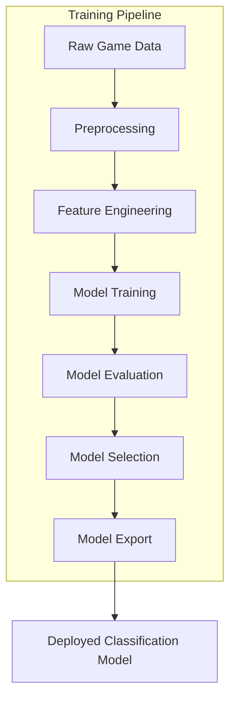
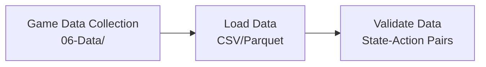
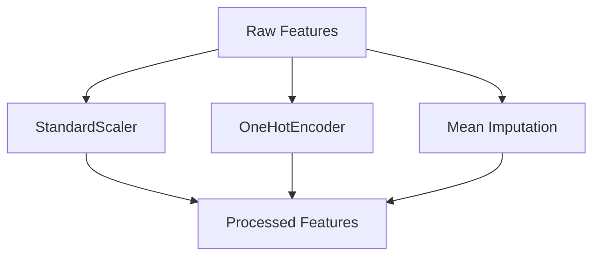
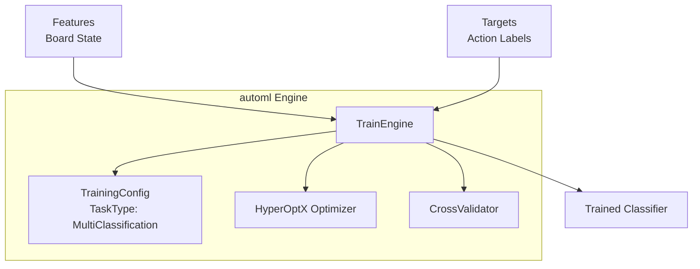
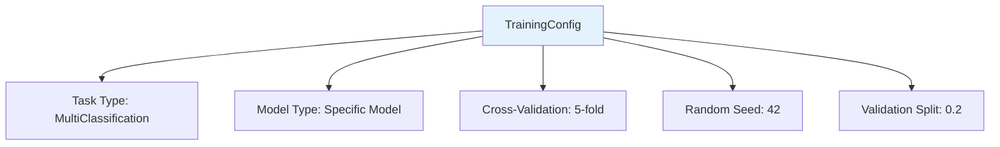
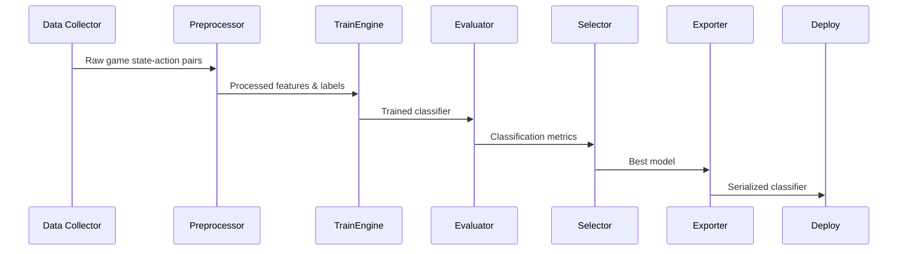
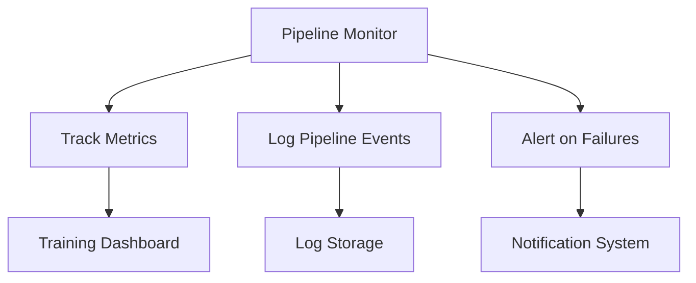
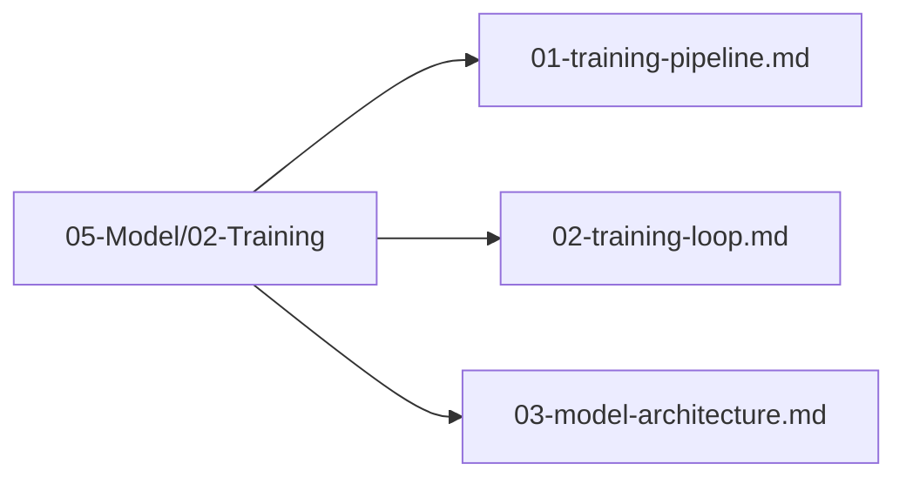

# Training Pipeline

## 1. Purpose

Define the complete training pipeline that takes collected game data and produces a trained supervised classification model capable of predicting optimal moves in the 2048 game.

## 2. Pipeline Overview

The training pipeline follows a structured flow from raw game data to a deployable classification model.



## 3. Pipeline Stages

### 3.1 Data Ingestion



### 3.2 Preprocessing



### 3.3 Training Execution



## 4. Pipeline Configuration



**Configuration Details:**
- **Task Type**: `MultiClassification` — 4 output classes (0=up, 1=down, 2=left, 3=right)
- **Model Type**: Specific models from `ModelType` enum — each candidate (RandomForest, GradientBoosting, XGBoost, LightGBM, CatBoost, ExtraTrees, SVM, KNN) trained separately for comparison
- **Purpose**: Each model is trained independently to enable ceiling comparison, NOT auto-selected
- **Labels**: Integer-encoded actions where 0=up, 1=down, 2=left, 3=right

## 5. Theoretical Limit Justification

The theoretical maximum score is **not a fixed constant** — it is bounded by 2048 game mechanics and depends on optimal play. This section justifies the ranking approach:

**Upper bound derivation**:
- A 4×4 board has at most 16 cells
- Maximum tile value is 2^15 = 32768 (reaching 2^16 would require 17 cells, exceeding board size)
- The maximum achievable score is the sum of all merges during a perfect game
- A perfect game would merge tiles from 2 → 4 → 8 → ... → 32768, with each merge contributing its value to the score
- The exact maximum score is an open problem (no proven optimal strategy exists)

**Practical approach**: Instead of claiming a specific theoretical limit, models are **ranked by mean game score** across ≥10,000 benchmark games. The winner is the model with the highest mean score, confirmed by statistical significance testing.
- Heuristic agent achieves ~512 mean score through established strategies (monotonicity, corner placement, empty tile preservation)
- This serves as the **meaningful benchmark**: the model must exceed heuristic performance to be considered useful
- Proximity ratio is computed as `model_score / heuristic_baseline_score`, NOT `model_score / theoretical_max`

```rust
pub struct ProximityConfig {
    pub baseline_agent: AgentType,  // Heuristic agent as reference
    pub baseline_mean_score: f64,   // ~512 from benchmark data
}

impl ProximityConfig {
    pub fn mean_score(&self, scores: &[u64]) -> f64 {
        scores.iter().sum::<u64>() as f64 / scores.len() as f64
    }
    
    /// Rank models by mean score across all benchmark games
    pub fn rank_models(&self, model_scores: &HashMap<ModelType, Vec<u64>>) -> Vec<ModelType> {
        let mut ranked: Vec<(ModelType, f64)> = model_scores
            .iter()
            .map(|(model, scores)| (*model, self.mean_score(scores)))
            .collect();
        ranked.sort_by(|a, b| b.1.partial_cmp(&a.1).unwrap());
        ranked.into_iter().map(|(m, _)| m).collect()
    }
}
```

**Why not use 32768 as the theoretical limit?** Because no agent has ever been proven to achieve this score, and it's unclear whether it's even achievable on a 4×4 board. Instead, models are ranked by mean game score across ≥10,000 benchmark games, and the winner is the model with the highest mean score confirmed by statistical significance testing.

## 6. Pipeline Execution Flow



## 7. Pipeline Monitoring



## 8. Pipeline Files Location

All pipeline files are organized under `05-Model/02-Training/`:



## 9. Next Steps

1. Configure training parameters for multi-class classification
2. Execute training loop with supervised game data
3. Validate model architecture and classification accuracy
