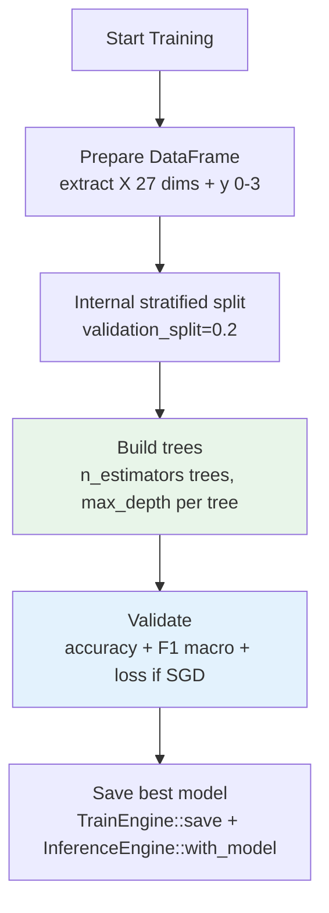
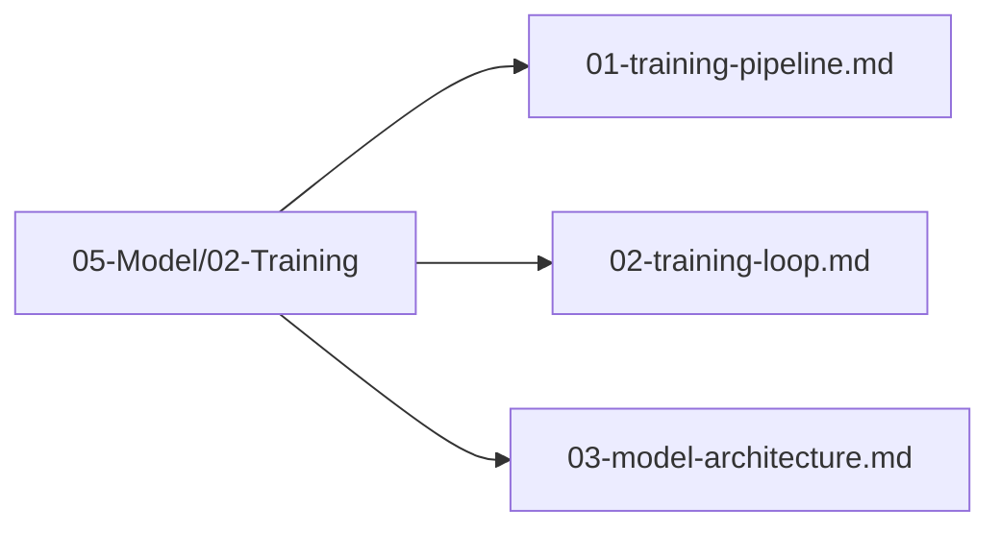

# Training Loop

## 1. Purpose

Define the training loop for classical tree-based models on the 2048 task. Unlike neural networks, automl's tree models **do not** use epochs, forward/backward passes, gradients, or optimizers — training is a single `fit` that builds trees from the DataFrame.

## 2. Training Loop Overview

Training is **not** iterative weight updates. It is: DataFrame → `TrainingConfig` → `TrainEngine::fit(&df)` → `InferenceEngine::predict`.

```mermaid
flowchart TD
    subgraph "Classical Training Loop — No NN"
        DF[DataFrame<br/>27 numeric features + action 0-3]
        DF --> Config[TrainingConfig<br/>TaskType::MultiClassification<br/>ModelType::GradientBoosting<br/>cv_folds=5, random_state=42]
        Config --> Engine[TrainEngine::new(config)]
        Engine --> Fit[engine.fit(&df)<br/>builds trees — no forward/backward]
        Fit --> Save[engine.save(path) / metrics]
        Save --> Infer[InferenceEngine::with_model(engine)<br/>predict(&df) → action 0-3]
    end
```

> **No Optimizer / Scheduler / backward / gradient.** Those concepts do not exist in `automl/src/training/engine.rs`. `n_estimators` is the number of trees, **not** epochs.
> Note: n_estimators is not epochs — it counts trees, not gradient steps.

## 3. Loop Architecture

```mermaid
flowchart TD
    subgraph "Training Loop Components — Classical Only"
        DF[DataFrame<br/>polars]
        Config[TrainingConfig]
        Engine[TrainEngine]
        Infer[InferenceEngine]
        CV[CrossValidator<br/>GroupKFold / TimeSeriesSplit]
    end

    DF -->|&df| Engine
    Config -->|new(task, target).with_model().with_cv()| Engine
    Engine -->|fit| Infer
    Infer -->|predict| Metrics[Valid-Action Accuracy + F1 Macro + Mean Game Score]
    CV -->|split(n, None, Some(&groups))| Engine
```

No `DataLoader`, no `Optimizer`, no `LossFn`, no `Scheduler` — those were NN hallucinations and are deleted.

## 4. Training Stages

### 4.1 Initialization

```mermaid
flowchart LR
    Config[Load TrainingConfig<br/>MultiClassification / action]
    Config --> Engine[Initialize TrainEngine::new(config)]
    Engine --> Load[Load DataFrame<br/>state-action pairs]
    Load --> Fit[Call engine.fit(&df)]
    Fit --> Eval[Evaluate via metrics + cross_val_score]
```

### 4.2 Single-Pass Fit (Not Epoch Loop)



There is **no** `for epoch in 0..n_epochs` loop. `n_estimators` controls how many trees are grown (e.g., 100 trees), not how many gradient steps are taken. Boosting variants grow trees sequentially to correct residuals, but this is internal to the model — not an outer epoch loop.

## 5. Training Loop Implementation

Verified against `automl/src/training/config.rs:72` and `engine.rs:140`:

```rust
use automl::{TrainingConfig, TaskType, ModelType};
use automl::training::TrainEngine;
use automl::inference::{InferenceEngine, InferenceConfig};
use polars::prelude::*;

// 1) DataFrame with 27 numeric features + target column "action" (u8 0-3)
let df: DataFrame = load_state_action_pairs()?; // see 06-Data/

// 2) Config — note: task is MultiClassification, not regression
let config = TrainingConfig::new(TaskType::MultiClassification, "action")
    .with_model(ModelType::GradientBoosting)   // or RandomForest, XGBoost, LightGBM, CatBoost, ExtraTrees
    .with_cv(5)                                // cv_folds = 5
    .with_random_state(42)                     // random_seed = Some(42)
    // Optional tree params:
    // .with_n_estimators(150)  — number of trees, NOT epochs
    // .with_max_depth(6)
    // .with_learning_rate(0.1) — shrinkage for boosting only
    ;

// 3) Fit — single call, no forward/backward/gradient/update_weights
let mut engine = TrainEngine::new(config);
engine.fit(&df)?; // builds trees, computes metrics on internal validation split

// 4) Inspect metrics
if let Some(m) = engine.metrics() {
    println!("accuracy={:?} f1={:?} training_time={}", m.accuracy, m.f1_macro, m.training_time_secs);
}

// 5) Inference — wrap in InferenceEngine for serving
let inference = InferenceEngine::new(InferenceConfig::new())
    .with_model(engine); // consumes TrainEngine
let preds: Array1<f64> = inference.predict(&test_df)?; // → action 0-3 as f64
// Alternative direct: engine.predict(&test_df) without InferenceEngine wrapper

// 6) Cross-validated variant (group-aware, no leakage — see 04-Evaluation/02-cross-validation.md)
use automl::{CrossValidator, CVStrategy, cross_val_score};
let cv = CrossValidator::new(CVStrategy::GroupKFold { n_splits: 5 }).with_random_state(42);
let splits = cv.split(n_samples, None, Some(&groups))?; // verified API
// Use the project-owned grouped-CV wrapper; automl::cross_val_score currently
// passes groups=None and therefore cannot run GroupKFold correctly.
let splits = CrossValidator::new(CVStrategy::GroupKFold { n_splits: 5 })
    .with_random_state(42)
    .split(x.nrows(), Some(&y), Some(&groups))?;
// Gate: cv_results.mean_score must correspond to Valid-Action Accuracy ≥60% and later Mean Game Score ≥512
```

**Key API notes:**

- `TrainingConfig::new(TaskType::MultiClassification, "action").with_model(...).with_n_estimators(100).with_cv(5).with_random_state(42)` — all builders verified in `config.rs:172`.
- `TrainEngine::fit(&df)` takes a `&DataFrame`, not arrays — it extracts `target_column` internally via `prepare_data`.
- `InferenceEngine::predict(&df)` (or `engine.predict(&df)`) returns `Array1<f64>` of predicted actions — no `predict_proba` needed for ranking, but available for threshold analysis.
- `n_estimators` is **not** `n_epochs` — there is no `n_epochs` field. The hallucinated `self.config.n_epochs` and `engine.backward(&loss)` / `update_weights()` never existed.

## 6. Convergence & Early Stopping

Classical trees do **not** converge via loss curves. Early stopping is an optional field on `TrainingConfig`:

```rust
pub early_stopping: bool,              // default true
pub early_stopping_rounds: usize,      // default 50 — rounds without improvement before stopping
```

- For **boosting** models (GradientBoosting, XGBoost, LightGBM, CatBoost), `early_stopping_rounds` stops adding trees when validation F1/accuracy stalls.
- For **bagging** models (RandomForest, ExtraTrees), `early_stopping` is inert — more trees monotonically reduce variance; tune `n_estimators` directly.
- For **SGD** (`ModelType::SGD`), `epoch_history: Vec<EpochRecord>` is populated and `max_iter` controls iterations, but SGD is the only iterative learner — not the primary 2048 model.

Do **not** plot epoch loss curves or attach a `Scheduler` — those are NN concepts.

## 7. Checkpoint Management

Checkpoints are model serialization, not epoch snapshots.

```mermaid
flowchart TD
    Engine[TrainEngine after fit]
    Engine --> Save[engine.save(path)<br/>serde_json to disk]
    Save --> Load[TrainEngine::load(path)<br/>or InferenceEngine::load(config, None, path)]
    Load --> Resume[Continue inference — no resume-training loop]
    
    Save --> Storage[Model Storage<br/>JSON serialized TrainedModel]
```

- Save best model immediately after `fit` — no patience counter, no `save_checkpoint()` per epoch.
- `TrainEngine::save` / `load` are the only checkpoint APIs (see `engine.rs:222`).
- Rollback is re-loading the previous JSON, not rewinding an optimizer state.

## 8. Training Files

All training loop files are in `05-Model/02-Training/`:



## 9. Next Steps

1. Select model type in `03-model-architecture.md` via `TrainingConfig::new(MultiClassification, "action").with_model(...)`
2. Run fit with group-aware CV (`GroupKFold {n_splits:5}.with_random_state(42).split(n, None, Some(&groups))`)
3. Evaluate gates: Valid-Action Accuracy ≥60%, F1 ≥0.55, Mean Game Score ≥512 (see `04-Evaluation/`)
