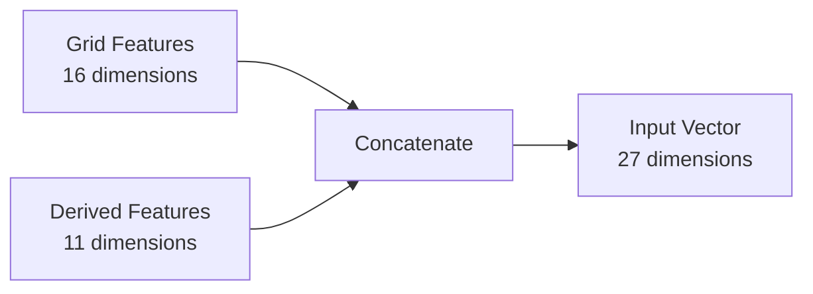
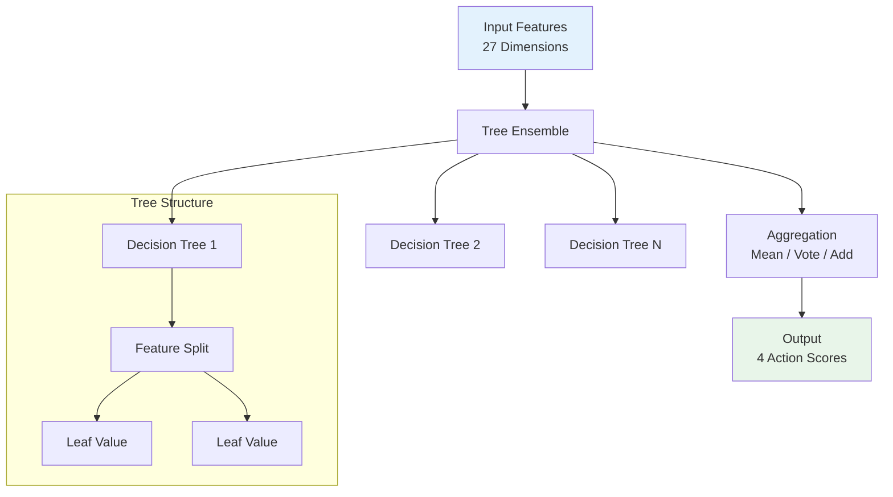
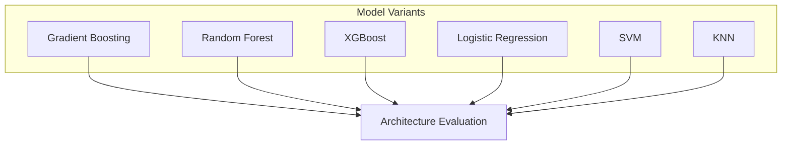
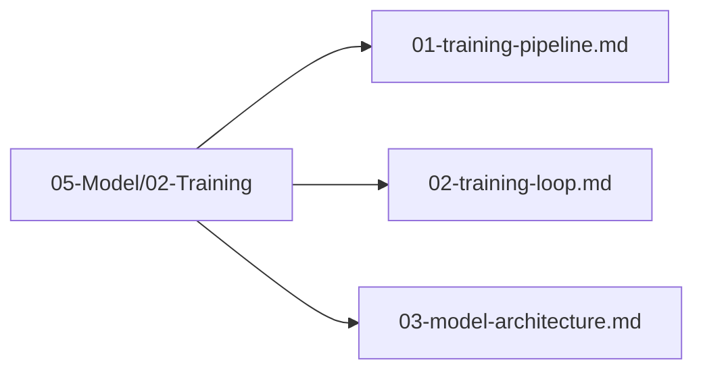

# Plan 03 — Model Architecture: the repository status is explicit and evidence based

> **Status: PLANNED.** Not yet restarted in strict sequence.

**Goal:** State the current implementation and evidence boundary for model architecture.
**Builds on:** [00](../../00-scope-and-traceability.md) — the project is supervised 4×4 2048 policy learning, and framework evaluation is a separate research track.

---

## Decision and evidence

**This plan treats its subject as partial or pending work, not as a research finding.** The rejected alternative is to infer completion from a plan title or related code alone. The ledger records this disposition: Not yet restarted in strict sequence.

## 1. Purpose

Define the architecture of the machine learning model used to predict optimal moves in the 2048 game.

## 2. Architecture Overview

The model architecture is designed to consume 27-dimensional board state features and output 4 directional actions using tree-based ensemble methods.

### 2.1 Tree-Based Model Architecture

Tree-based models are the primary architecture for this project. Each model type has a distinct structure optimized for tabular data:

| Model Type | Structure | Key Parameters |
|------------|-----------|----------------|
| RandomForest | Ensemble of decision trees | n_estimators, max_depth, min_samples_split |
| GradientBoosting | Sequential additive trees | n_estimators, learning_rate, max_depth, subsample |
| XGBoost | Regularized gradient boosting | n_estimators, max_depth, learning_rate, reg_lambda |
| LightGBM | Leaf-wise growing trees | n_estimators, max_depth, num_leaves, learning_rate |
| CatBoost | Ordered boosting with categorical handling | n_estimators, depth, learning_rate |
| ExtraTrees | Randomized decision tree ensemble | n_estimators, max_depth, min_samples_split |

### 2.2 Feature Input Layer



### 2.3 Tree Ensemble Architecture



### 2.4 Model Variants



### 2.5 Tree-Based Model Architecture Details

```rust
pub struct TreeModelArchitecture {
    pub model_type: ModelType,           // GradientBoosting, RandomForest, XGBoost, etc.
    pub n_estimators: usize,             // Number of trees in the ensemble
    pub max_depth: usize,                // Maximum depth of each tree
    pub learning_rate: f64,              // Shrinkage parameter for boosting
    pub min_samples_split: usize,        // Minimum samples to split a node
    pub max_features: Option<usize>,     // Features considered per split
    pub subsample: Option<f64>,          // Row subsampling rate
    pub regularization: f64,             // L1/L2 regularization strength
}

// ModelType is defined as an enum in `automl/src/training/config.rs:22`:
// pub enum ModelType { DecisionTree, RandomForest, GradientBoosting, XGBoost,
//                      LightGBM, CatBoost, LinearRegression, LogisticRegression,
//                      Ridge, Lasso, ElasticNet, PolynomialRegression, SVM,
//                      KNN, NaiveBayes, AdaBoost, ExtraTrees, SGD,
//                      GaussianProcess, KMeans, DBSCAN, SOM, Auto }
// Use the enum variants directly (e.g., ModelType::RandomForest, ModelType::Auto) — not a custom struct.
```

### 2.6 Actionable TrainingConfig — Verified API (config.rs:174)

Tree architecture is instantiated via `TrainingConfig`, not a custom struct. `n_estimators` is the tree count (not epochs).

```rust
use automl::{TrainingConfig, TaskType, ModelType};

// Minimal: task + target column
let config = TrainingConfig::new(TaskType::MultiClassification, "action")
    .with_model(ModelType::RandomForest)
    .with_n_estimators(150)
    .with_max_depth(8)
    .with_cv(5)
    .with_random_state(42);

// Boosting variant with learning rate
let gb_config = TrainingConfig::new(TaskType::MultiClassification, "action")
    .with_model(ModelType::GradientBoosting)
    .with_n_estimators(200)
    .with_max_depth(6)
    .with_learning_rate(0.08)
    .with_cv(5)
    .with_random_state(42);

// XGBoost / LightGBM / CatBoost / ExtraTrees / SVM / KNN likewise:
// .with_model(ModelType::XGBoost) / LightGBM / CatBoost / ExtraTrees / SVM / KNN
// Then: TrainEngine::new(config).fit(&df) → InferenceEngine::predict

// Early stopping (optional, not epochs):
// TrainingConfig { early_stopping: true, early_stopping_rounds: 50, ..Default::default() }
```

> **Keep §2.1 tree variants table** as the canonical reference for which `ModelType` to pass to `with_model`. The `TrainingConfig` snippet above is the actionable instantiation.

## 3. Architecture Files Location

All model architecture files are in `05-Model/02-Training/`:



## 4. Next Steps

1. Select final model architecture
2. Configure hyperparameters in `05-Model/03-Hyperparameter-Optimization/`
3. Train and evaluate the model

## Implementation Record

- The implementation uses pinned AutoML classical models. Candidate API validation found only five candidates that return the required four action probabilities in this integration. Architecture and hyperparameter examples for unsupported candidates remain references and are not live choices.
- No neural-network architecture is present. Candidate performance has not been compared on the required data.

---

## Verification (definition of done)

1. `test -f plans/05-Model/02-Training/03-model-architecture.md` exits 0.
2. `grep -q '^# Plan 03 — ' plans/05-Model/02-Training/03-model-architecture.md` exits 0.
3. `grep -q '^> \\*\\*Status:' plans/05-Model/02-Training/03-model-architecture.md` exits 0.
4. `grep -q '^\*\*Goal:' plans/05-Model/02-Training/03-model-architecture.md` exits 0.
5. `grep -q '^## Decision and evidence$' plans/05-Model/02-Training/03-model-architecture.md` exits 0.
6. `grep -q '^## Open questions$' plans/05-Model/02-Training/03-model-architecture.md` exits 0.
7. `grep -q '^## Later$' plans/05-Model/02-Training/03-model-architecture.md` exits 0.
8. `bash /Users/evintleovonzko/Documents/works/kolosal/planout2/v2-ai-express/.claude/skills/writing-planout-plans/check-plan.sh plans/05-Model/02-Training/03-model-architecture.md` exits 0.

## Open questions

- **The plan-scale evidence remains bounded by current results.** Not yet restarted in strict sequence. Any larger corpus or external benchmark needs a declared resource budget and retained artifacts.

## Later

- **Complete the remaining research or implementation work recorded above.** It stays deferred until its prerequisites, compute budget, and measurable acceptance evidence are available.
