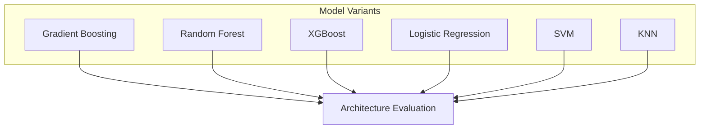
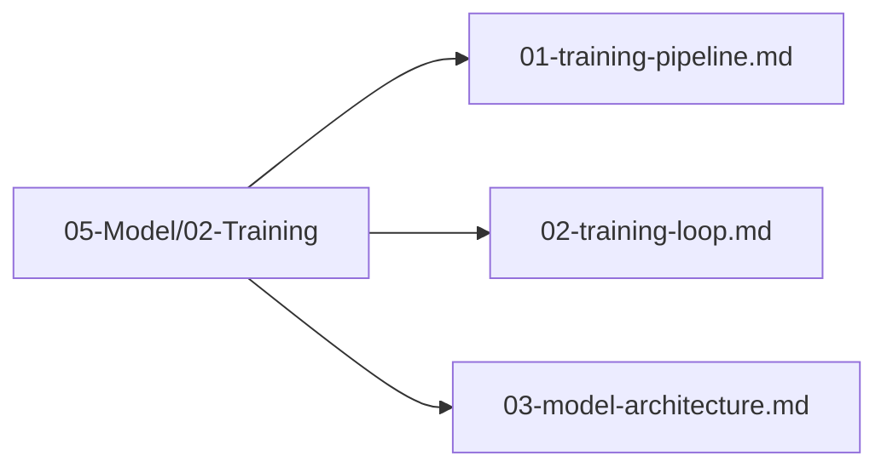

# Plan 03 — Model Architecture: the repository status is explicit and evidence based

> **Status: PARTIAL (2026-09-27).** The integration uses AutoML classical classifiers; five four-class probability candidates are verified, but performance and final selection remain open.

**Goal:** State the current implementation and evidence boundary for model architecture.
**Builds on:** [00](../../00-scope-and-traceability.md) — the project is supervised 4×4 2048 policy learning, and framework evaluation is a separate research track.

---

## Decision and evidence

**This plan treats the model interface as implemented and architecture selection as pending evidence.** The root policy requires 17 numeric features and four class probabilities. RandomForest, ExtraTrees, AdaBoost, KNN, and NaiveBayes pass the integration smoke. No model family is established as best.

## 1. Purpose

Define the architecture of the machine learning model used to predict optimal moves in the 2048 game.

## 2. Architecture Overview

The classifier consumes the canonical 17-value vector and predicts one of four action labels. The verified candidates include both tree ensembles and non-tree models; no architecture winner has been selected.

### 2.1 Tree-Based Model Architecture

The root CLI currently exposes five candidates with four-class probability output. The table describes only that compatible set:

| Model Type | Structure | Key Parameters |
|------------|-----------|----------------|
| RandomForest | Ensemble of decision trees | n_estimators, max_depth, min_samples_split |
| ExtraTrees | Randomized decision tree ensemble | n_estimators, max_depth |
| AdaBoost | Boosted estimator | framework-specific parameters |
| KNN | Nearest-neighbor classifier | neighbors and distance settings |
| NaiveBayes | Probabilistic classifier | framework-specific parameters |

### 2.2 Feature Input Layer


### 2.3 Tree Ensemble Architecture


### 2.4 Model Variants



### 2.5 Tree-Based Model Architecture Details

```rust
// Illustrative only: the root uses AutoML TrainingConfig, not this custom struct.
pub struct TreeModelArchitecture {
    pub model_type: ModelType,           // GradientBoosting, RandomForest, XGBoost, etc.
    pub n_estimators: usize,             // Number of trees in the ensemble
    pub max_depth: usize,                // Maximum depth of each tree
    pub learning_rate: f64,              // Shrinkage parameter for boosting
    pub min_samples_split: usize,        // Minimum samples to split a node
    pub max_features: Option<usize>,     // Features considered per split
    pub subsample: Option<f64>,          // Row subsampling rate
    pub regularization: f64,             // L1/L2 regularization strength
}

// ModelType is defined as an enum in `automl/src/training/config.rs:22`:
// pub enum ModelType { DecisionTree, RandomForest, GradientBoosting, XGBoost,
//                      LightGBM, CatBoost, LinearRegression, LogisticRegression,
//                      Ridge, Lasso, ElasticNet, PolynomialRegression, SVM,
//                      KNN, NaiveBayes, AdaBoost, ExtraTrees, SGD,
//                      GaussianProcess, KMeans, DBSCAN, SOM, Auto }
// Use the enum variants directly (e.g., ModelType::RandomForest, ModelType::Auto) — not a custom struct.
```

### 2.6 Actionable TrainingConfig — Verified API (config.rs:174)

Tree architecture is instantiated via `TrainingConfig`, not a custom struct. `n_estimators` is the tree count (not epochs).

```rust
use automl::{TrainingConfig, TaskType, ModelType};

// Minimal: task + target column
let config = TrainingConfig::new(TaskType::MultiClassification, "action")
    .with_model(ModelType::RandomForest)
    .with_n_estimators(150)
    .with_max_depth(8)
    .with_cv(5)
    .with_random_state(42);

// Boosting variant with learning rate
let gb_config = TrainingConfig::new(TaskType::MultiClassification, "action")
    .with_model(ModelType::GradientBoosting)
    .with_n_estimators(200)
    .with_max_depth(6)
    .with_learning_rate(0.08)
    .with_cv(5)
    .with_random_state(42);

// XGBoost / LightGBM / CatBoost / ExtraTrees / SVM / KNN likewise:
// .with_model(ModelType::XGBoost) / LightGBM / CatBoost / ExtraTrees / SVM / KNN
// Then: TrainEngine::new(config).fit(&df) → InferenceEngine::predict

// Early stopping (optional, not epochs):
// TrainingConfig { early_stopping: true, early_stopping_rounds: 50, ..Default::default() }
```

> The root CLI accepts `random_forest`, `extra_trees`, `adaboost`, `knn`, and `naive_bayes`. The AutoML `TrainingConfig` API is the actual configuration interface; the custom struct is illustrative only.

## 3. Architecture Files Location

All model architecture files are in `05-Model/02-Training/`:



## 4. Next Steps

1. Select final model architecture
2. Configure hyperparameters in `05-Model/03-Hyperparameter-Optimization/`
3. Train and evaluate the model

## Implementation Record

- The implementation uses pinned AutoML classical models and the root CLI checks for exactly four probability columns before saving. Supported candidates are RandomForest, ExtraTrees, AdaBoost, KNN, and NaiveBayes.
- HyperOptX search currently supports only RandomForest and ExtraTrees. No neural-network architecture is present; candidate performance remains unmeasured.

---

## Verification (definition of done)

1. `test -f plans/05-Model/02-Training/03-model-architecture.md` exits 0.
2. `grep -q '^# Plan 03 — ' plans/05-Model/02-Training/03-model-architecture.md` exits 0.
3. `grep -q '^> \\*\\*Status:' plans/05-Model/02-Training/03-model-architecture.md` exits 0.
4. `grep -q '^\*\*Goal:' plans/05-Model/02-Training/03-model-architecture.md` exits 0.
5. `grep -q '^## Decision and evidence$' plans/05-Model/02-Training/03-model-architecture.md` exits 0.
6. `grep -q '^## Open questions$' plans/05-Model/02-Training/03-model-architecture.md` exits 0.
7. `grep -q '^## Later$' plans/05-Model/02-Training/03-model-architecture.md` exits 0.
8. `bash /Users/evintleovonzko/Documents/works/kolosal/planout2/v2-ai-express/.claude/skills/writing-planout-plans/check-plan.sh plans/05-Model/02-Training/03-model-architecture.md` exits 0.

## Open questions

- Compare verified candidates on an adequate game-grouped dataset before choosing the model architecture. Preserve dependency version, configuration, seed, and evaluation outputs.

## Later

- **Complete the remaining research or implementation work recorded above.** It stays deferred until its prerequisites, compute budget, and measurable acceptance evidence are available.
