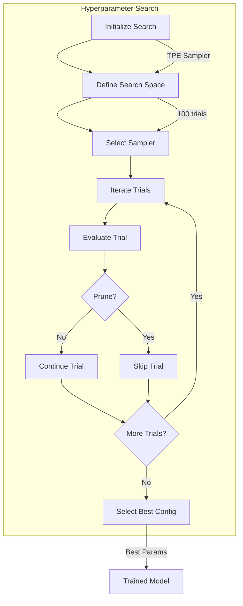
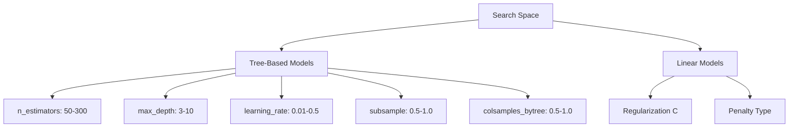
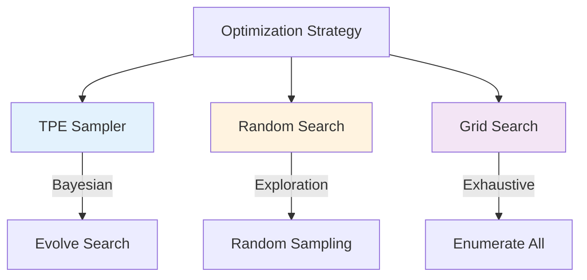
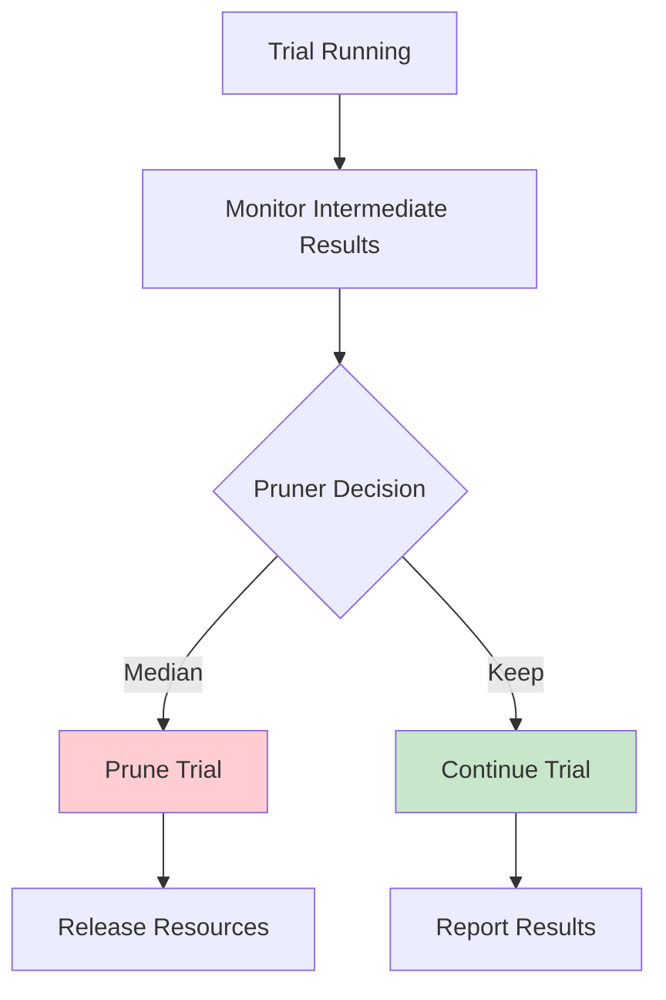
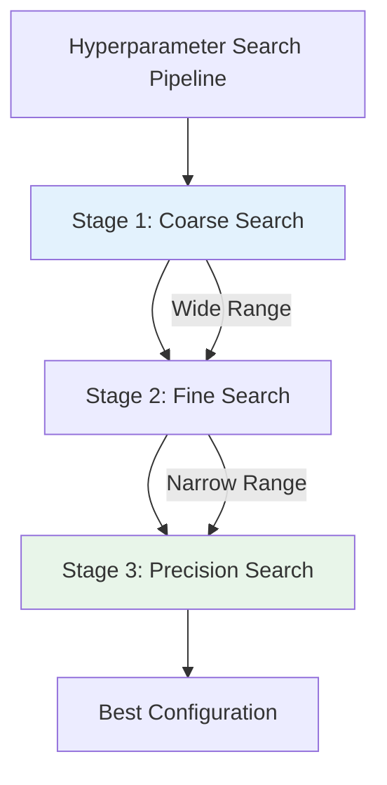
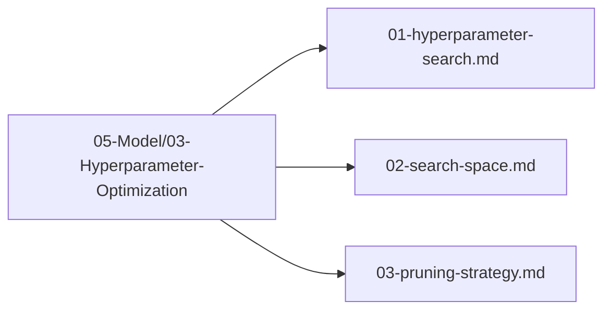

# Plan 01 — Hyperparameter Search: the repository status is explicit and evidence based

> **Status: PARTIAL (2026-09-27).** Versioned HyperOptX search is wired for RandomForest/ExtraTrees over grouped-CV accuracy; pruning and broader candidates remain unsupported.

**Goal:** State the current implementation and evidence boundary for hyperparameter search.
**Builds on:** [00](../../00-scope-and-traceability.md) — the project is supervised 4×4 2048 policy learning, and framework evaluation is a separate research track.

---

## Decision and evidence

**This plan treats grouped-CV search integration as implemented with bounded scope.** The `train` command reads schema-v1 JSON or `--tune-trials`, searches `n_estimators` and `max_depth` for RandomForest or ExtraTrees, evaluates root grouped-CV accuracy, and saves the study. Trials run serially with pruning disabled. This is exploratory model tuning; no general AutoML claim follows.

## 1. Purpose

Define the hyperparameter search strategy for optimizing the 2048 game machine learning model using the automl framework's HyperOptX optimizer.

## 2. Search Overview

The search explores two integer parameters for the supported candidates. Its objective is grouped-CV accuracy, and it does not establish a globally optimal configuration.



## 3. Search Space Definition



## 4. Optimization Strategy



## 5. Pruning Strategy



## 6. Search Configuration

```rust
use automl::{OptimizationConfig, SearchSpace, Parameter, ParameterType, OptimizeDirection, MedianPruner};

let opt_config = OptimizationConfig::default()
    .with_direction(OptimizeDirection::Maximize)
    .with_n_trials(100)
    .with_n_jobs(4);
// Pruner is separate — MedianPruner::new requires minimize flag
let pruner = MedianPruner::new(false); // false = maximize (true = minimize)

let mut search_space = SearchSpace::new();
search_space.add(Parameter::new("n_estimators", ParameterType::Int(50, 300)));
search_space.add(Parameter::new("max_depth", ParameterType::Int(3, 10)));
search_space.add(Parameter::new("learning_rate", ParameterType::Float(0.01, 0.5)));
search_space.add(Parameter::new("subsample", ParameterType::Float(0.5, 1.0)));
search_space.add(Parameter::new("colsample_bytree", ParameterType::Float(0.5, 1.0)));
```

## 7. Search Pipeline



## 8. Search Files Location

All hyperparameter search files are in `05-Model/03-Hyperparameter-Optimization/`:



## 9. Next Steps

The root integration maps sampled `n_estimators` and `max_depth` into grouped-CV fitting for RandomForest and ExtraTrees. The optimizer objective returns a completed scalar score, so intermediate reporting/pruning is unavailable; broader model-specific parameters are not wired.

1. Preserve the exact search configuration, seed, grouped-CV score, and study artifact for each run.
2. Expand to other candidates only with supported model-specific parameters and probability contracts.
3. Add pruning only when trials expose comparable intermediate metrics.

## Implementation Record

- HyperOptX trains grouped-CV objectives for RandomForest/ExtraTrees and applies the selected integer parameters to final fitting. It saves a study artifact and records configuration/seed data in the manifest.
- Pruning is disabled because there is no intermediate-reporting hook. No best configuration is claimed beyond each exploratory run.

---

## Verification (definition of done)

1. `test -f plans/05-Model/03-Hyperparameter-Optimization/01-hyperparameter-search.md` exits 0.
2. `grep -q '^# Plan 01 — ' plans/05-Model/03-Hyperparameter-Optimization/01-hyperparameter-search.md` exits 0.
3. `grep -q '^> \\*\\*Status:' plans/05-Model/03-Hyperparameter-Optimization/01-hyperparameter-search.md` exits 0.
4. `grep -q '^\*\*Goal:' plans/05-Model/03-Hyperparameter-Optimization/01-hyperparameter-search.md` exits 0.
5. `grep -q '^## Decision and evidence$' plans/05-Model/03-Hyperparameter-Optimization/01-hyperparameter-search.md` exits 0.
6. `grep -q '^## Open questions$' plans/05-Model/03-Hyperparameter-Optimization/01-hyperparameter-search.md` exits 0.
7. `grep -q '^## Later$' plans/05-Model/03-Hyperparameter-Optimization/01-hyperparameter-search.md` exits 0.
8. `bash /Users/evintleovonzko/Documents/works/kolosal/planout2/v2-ai-express/.claude/skills/writing-planout-plans/check-plan.sh plans/05-Model/03-Hyperparameter-Optimization/01-hyperparameter-search.md` exits 0.

## Open questions

- Search is limited to two integer parameters and two candidate families; trial failures currently surface through the command error path. Pruning, broader candidate coverage, and full performance studies remain future work.

## Later

- **Complete the remaining research or implementation work recorded above.** It stays deferred until its prerequisites, compute budget, and measurable acceptance evidence are available.
