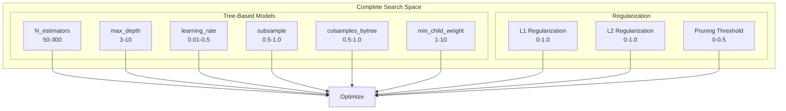
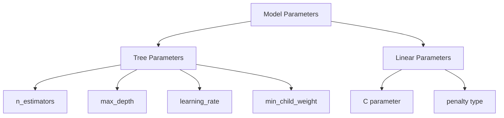
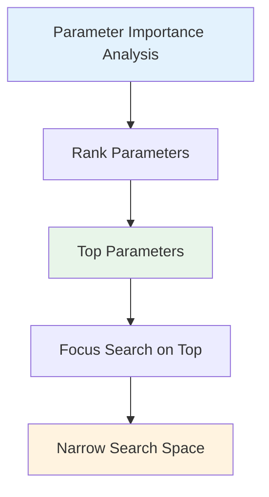
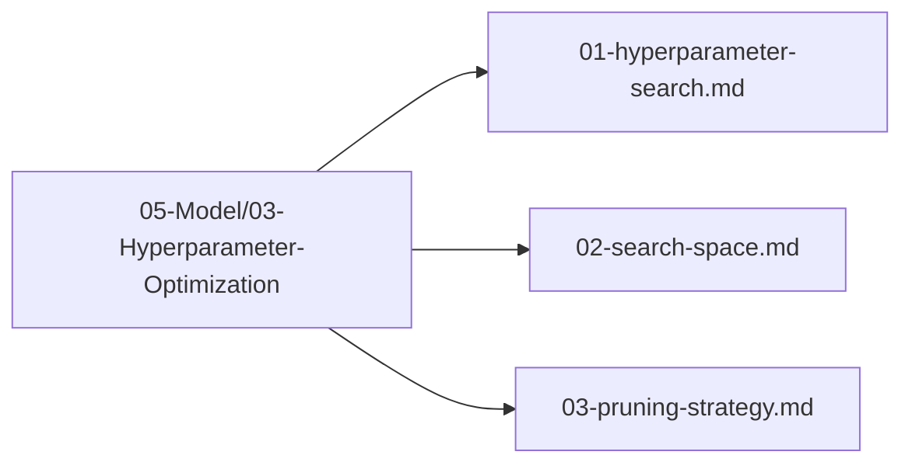

# Plan 02 — Search Space: the repository status is explicit and evidence based

> **Status: PLANNED.** Not yet restarted in strict sequence.

**Goal:** State the current implementation and evidence boundary for search space.
**Builds on:** [00](../../00-scope-and-traceability.md) — the project is supervised 4×4 2048 policy learning, and framework evaluation is a separate research track.

---

## Decision and evidence

**This plan treats its subject as partial or pending work, not as a research finding.** The rejected alternative is to infer completion from a plan title or related code alone. The ledger records this disposition: Not yet restarted in strict sequence.

## 1. Purpose

Define the complete search space for hyperparameter optimization of the 2048 game machine learning model.

## 2. Search Space Overview

The search space encompasses all hyperparameters that can be tuned to optimize model performance.



## 3. Parameter Categories

### 3.1 Model Parameters



## 4. Search Space for automl HyperOptX

```rust
use automl::{SearchSpace, Parameter, ParameterType};

let mut search_space = SearchSpace::new();

// Tree-based model parameters
search_space.add(Parameter::new("n_estimators", ParameterType::Int(50, 300)));
search_space.add(Parameter::new("max_depth", ParameterType::Int(3, 10)));
search_space.add(Parameter::new("learning_rate", ParameterType::Float(0.01, 0.5)));
search_space.add(Parameter::new("subsample", ParameterType::Float(0.5, 1.0)));
search_space.add(Parameter::new("colsample_bytree", ParameterType::Float(0.5, 1.0)));
search_space.add(Parameter::new("min_child_weight", ParameterType::Int(1, 10)));

// Note: No neural-network branch — automl ModelType is classical ML only (smartcore/linfa); NN params removed


// Regularization parameters
search_space.add(Parameter::new("l1_regularization", ParameterType::Float(0.0, 1.0)));
search_space.add(Parameter::new("l2_regularization", ParameterType::Float(0.0, 1.0)));
```

## 5. Parameter Importance



## 6. Search Space Files

All search space definitions are in `05-Model/03-Hyperparameter-Optimization/`:



## 7. Capability Notes and Next Steps

The generic space above includes parameters that do not map to every supported AutoML model and does not prove that `TrainEngine` consumes sampled parameters. The current integration does not apply HyperOptX trial parameters to `TrainingConfig`; the framework optimizer smoke test only validates optimizer API behavior. Model-specific tuning is pending an adapter that maps supported parameters and uses grouped CV on development games.

1. Freeze a model-specific search space for verified four-class candidates.
2. Implement and validate parameter-to-`TrainingConfig` mapping.
3. Execute grouped-CV search on development games only, with a declared compute budget.
4. Select using validation/CV metrics; evaluate the untouched game-score test set once.

## Implementation Record

- Generic search-space documentation is retained for reference, but several parameters are unsupported or model-specific. No frozen candidate-specific mapping, fitted search, or parameter-importance analysis exists yet.

---

## Verification (definition of done)

1. `test -f plans/05-Model/03-Hyperparameter-Optimization/02-search-space.md` exits 0.
2. `grep -q '^# Plan 02 — ' plans/05-Model/03-Hyperparameter-Optimization/02-search-space.md` exits 0.
3. `grep -q '^> \\*\\*Status:' plans/05-Model/03-Hyperparameter-Optimization/02-search-space.md` exits 0.
4. `grep -q '^\*\*Goal:' plans/05-Model/03-Hyperparameter-Optimization/02-search-space.md` exits 0.
5. `grep -q '^## Decision and evidence$' plans/05-Model/03-Hyperparameter-Optimization/02-search-space.md` exits 0.
6. `grep -q '^## Open questions$' plans/05-Model/03-Hyperparameter-Optimization/02-search-space.md` exits 0.
7. `grep -q '^## Later$' plans/05-Model/03-Hyperparameter-Optimization/02-search-space.md` exits 0.
8. `bash /Users/evintleovonzko/Documents/works/kolosal/planout2/v2-ai-express/.claude/skills/writing-planout-plans/check-plan.sh plans/05-Model/03-Hyperparameter-Optimization/02-search-space.md` exits 0.

## Open questions

- **The plan-scale evidence remains bounded by current results.** Not yet restarted in strict sequence. Any larger corpus or external benchmark needs a declared resource budget and retained artifacts.

## Later

- **Complete the remaining research or implementation work recorded above.** It stays deferred until its prerequisites, compute budget, and measurable acceptance evidence are available.
