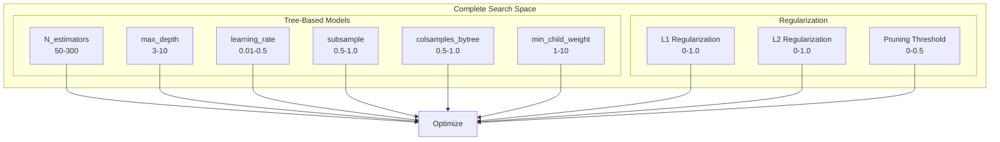
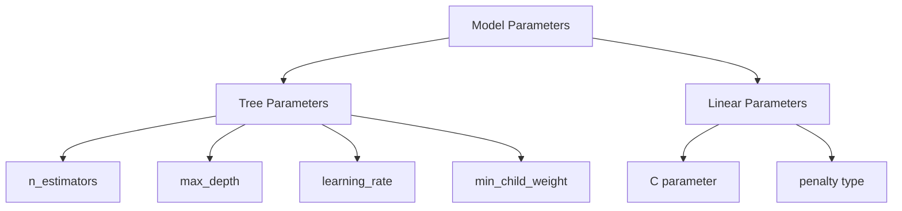
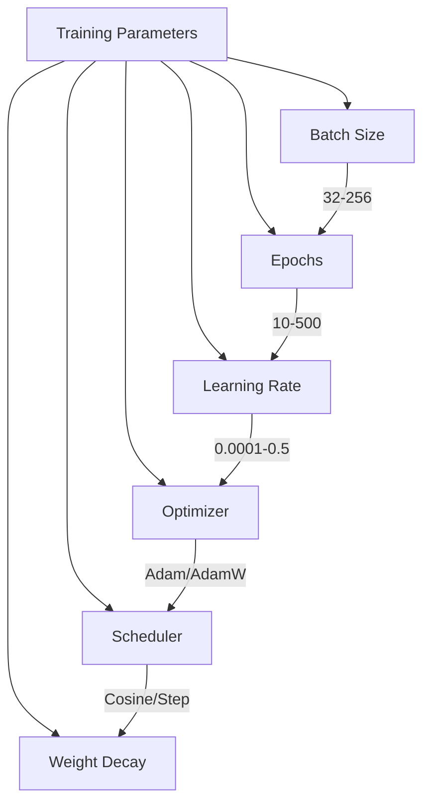
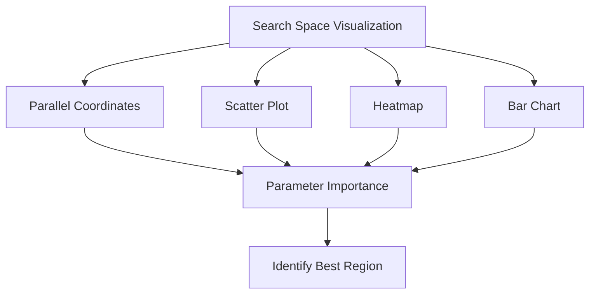
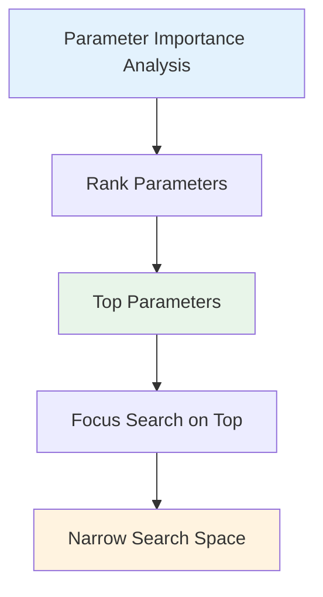
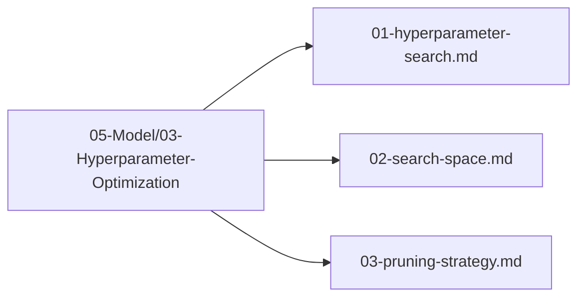

# Search Space

## 1. Purpose

Define the complete search space for hyperparameter optimization of the 2048 game machine learning model.

## 2. Search Space Overview

The search space encompasses all hyperparameters that can be tuned to optimize model performance.



## 3. Parameter Categories

### 3.1 Model Parameters



### 3.2 Training Parameters



## 4. Search Space Visualization



## 5. Search Space for automl HyperOptX

```rust
use automl::{SearchSpace, Parameter, ParameterType};

let mut search_space = SearchSpace::new();

// Tree-based model parameters
search_space.add(Parameter::new("n_estimators", ParameterType::Int(50, 300)));
search_space.add(Parameter::new("max_depth", ParameterType::Int(3, 10)));
search_space.add(Parameter::new("learning_rate", ParameterType::Float(0.01, 0.5)));
search_space.add(Parameter::new("subsample", ParameterType::Float(0.5, 1.0)));
search_space.add(Parameter::new("colsample_bytree", ParameterType::Float(0.5, 1.0)));
search_space.add(Parameter::new("min_child_weight", ParameterType::Int(1, 10)));

// Note: No neural-network branch — automl ModelType is classical ML only (smartcore/linfa); NN params removed


// Regularization parameters
search_space.add(Parameter::new("l1_regularization", ParameterType::Float(0.0, 1.0)));
search_space.add(Parameter::new("l2_regularization", ParameterType::Float(0.0, 1.0)));
```

## 6. Parameter Importance



## 7. Search Space Files

All search space definitions are in `05-Model/03-Hyperparameter-Optimization/`:



## 8. Next Steps

1. Define pruning strategy in `05-Model/03-Hyperparameter-Optimization/03-pruning-strategy.md`
2. Execute hyperparameter search
3. Select optimal configuration
