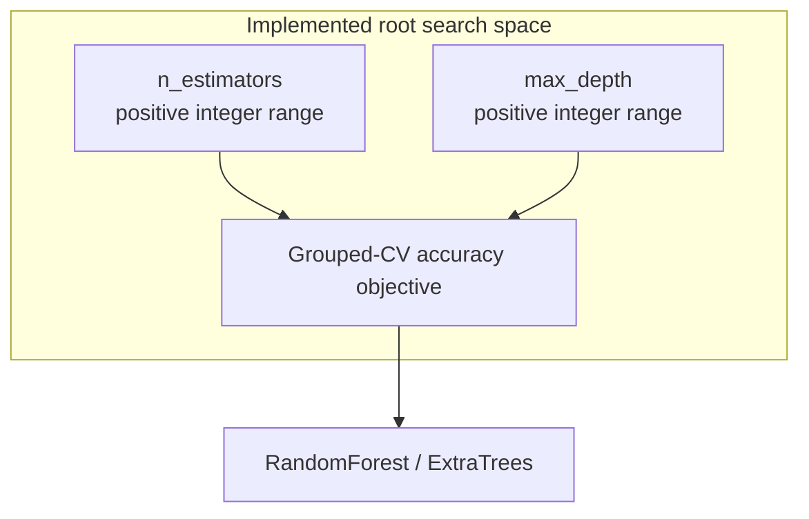
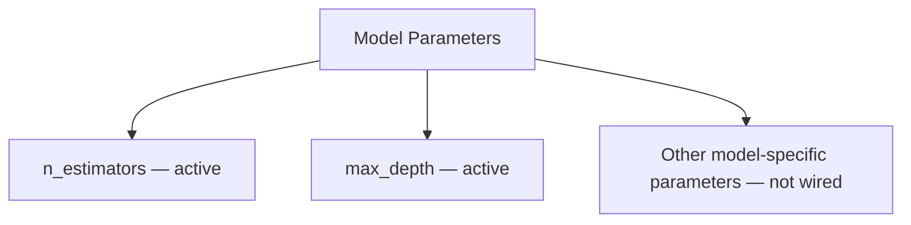
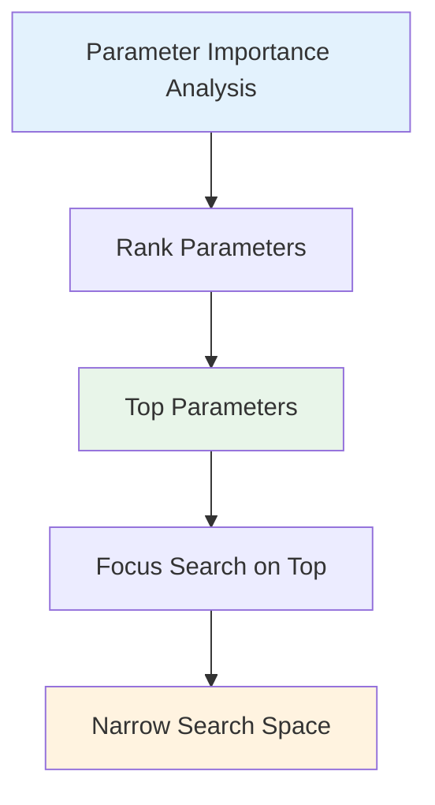
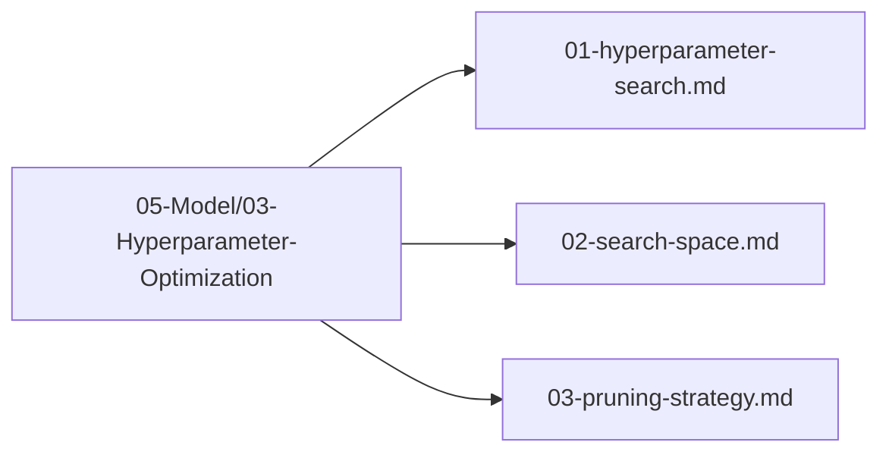

# Plan 02 — Search Space: the repository status is explicit and evidence based

> **Status: COMPLETE (2026-09-27).** The root's versioned search contract defines `n_estimators` and `max_depth` for RandomForest/ExtraTrees; unsupported parameter expansions remain outside the current search scope.

**Goal:** State the current implementation and evidence boundary for search space.
**Builds on:** [00](../../00-scope-and-traceability.md) — the project is supervised 4×4 2048 policy learning, and framework evaluation is a separate research track.

---

## Decision and evidence

**This ticket's active search-space contract is implemented.** Schema-v1 JSON configures positive integer ranges for `n_estimators` and `max_depth`, a trial count, and the TPE sampler. Root trial adapters apply the ranges only to RandomForest and ExtraTrees and use grouped-CV accuracy. Other model-specific parameters and importance rankings are optional research extensions, not part of the current contract.

## 1. Purpose

Define the complete search space for hyperparameter optimization of the 2048 game machine learning model.

## 2. Search Space Overview

The active search space is intentionally limited; it is not an exhaustive list of model hyperparameters.



## 3. Parameter Categories

### 3.1 Model Parameters



## 4. Search Space for automl HyperOptX

```rust
use automl::optimizer::SearchSpace;

let search_space = SearchSpace::new()
    .int("n_estimators", 20, 200)
    .int("max_depth", 2, 10);
```

The tracked JSON contract is `config/hyperopt-search.example.json`; its schema validator rejects unknown fields, unsupported samplers, invalid ranges, and unsupported schema versions.

## 5. Parameter Importance — Not Measured



## 6. Search Space Files

All search space definitions are in `05-Model/03-Hyperparameter-Optimization/`:



## 7. Capability Notes and Next Steps

The broader examples above include parameters that the root does not consume. The active root adapter maps sampled `n_estimators` and `max_depth` into its grouped-CV helper for RandomForest and ExtraTrees; it does not route all values through general `TrainingConfig`.

1. Extend the search only for verified candidates with validated parameter mappings.
2. Run grouped-CV tuning on development games with a declared compute budget.
3. Evaluate the selected configuration on the untouched game-score test set once.

## Implementation Record

- The active schema-v1 config validates positive integer ranges for `n_estimators` and `max_depth`; trial adapters apply them to RandomForest/ExtraTrees only. No parameter-importance analysis exists, and no broader candidate-specific search is required by the current contract.

---

## Verification (definition of done)

1. `test -f plans/05-Model/03-Hyperparameter-Optimization/02-search-space.md` exits 0.
2. `grep -q '^# Plan 02 — ' plans/05-Model/03-Hyperparameter-Optimization/02-search-space.md` exits 0.
3. `grep -q '^> \\*\\*Status:' plans/05-Model/03-Hyperparameter-Optimization/02-search-space.md` exits 0.
4. `grep -q '^\*\*Goal:' plans/05-Model/03-Hyperparameter-Optimization/02-search-space.md` exits 0.
5. `grep -q '^## Decision and evidence$' plans/05-Model/03-Hyperparameter-Optimization/02-search-space.md` exits 0.
6. `grep -q '^## Open questions$' plans/05-Model/03-Hyperparameter-Optimization/02-search-space.md` exits 0.
7. `grep -q '^## Later$' plans/05-Model/03-Hyperparameter-Optimization/02-search-space.md` exits 0.
8. `bash /Users/evintleovonzko/Documents/works/kolosal/planout2/v2-ai-express/.claude/skills/writing-planout-plans/check-plan.sh plans/05-Model/03-Hyperparameter-Optimization/02-search-space.md` exits 0.

## Open questions

- No required search-space definition remains open. Any expansion requires candidate-specific validation and grouped-CV evidence.

## Later

- **No broader search-space implementation is required now.** Tune-run results and parameter-importance research remain in the separate HPO evaluation ticket.
