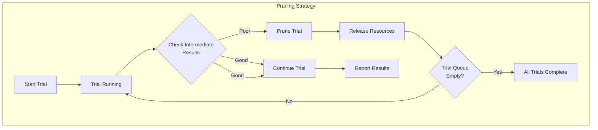
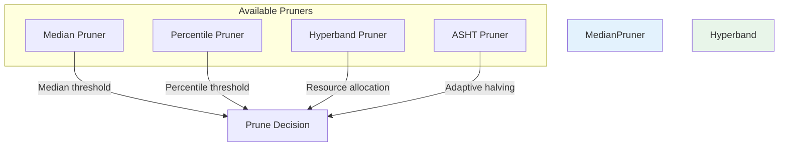
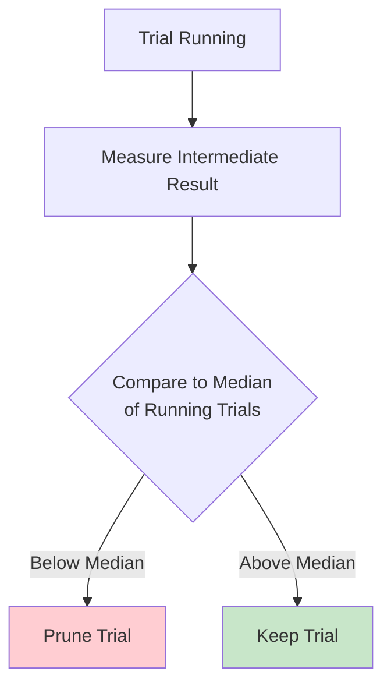
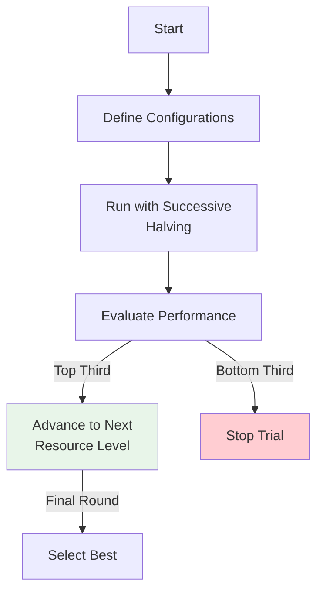
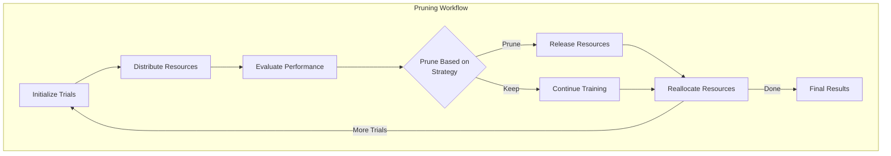
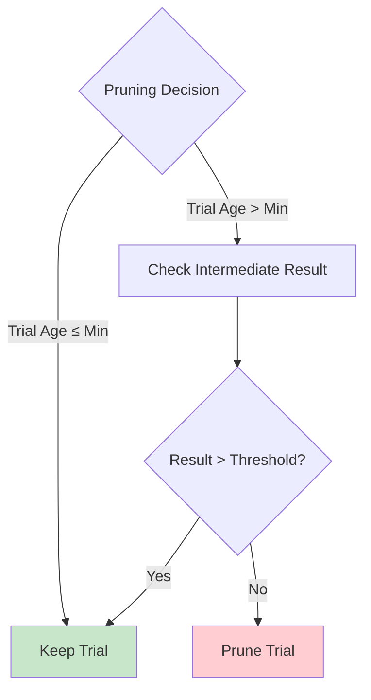
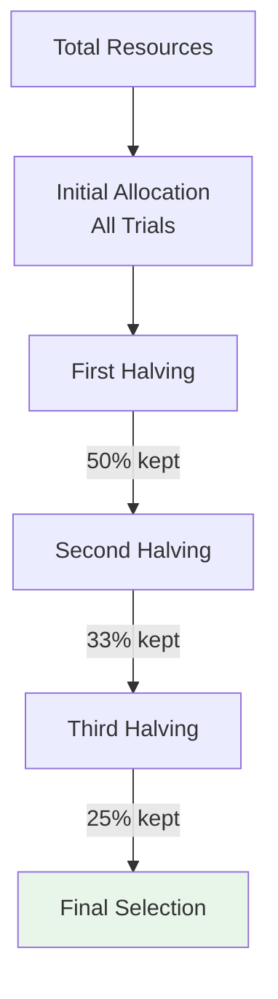
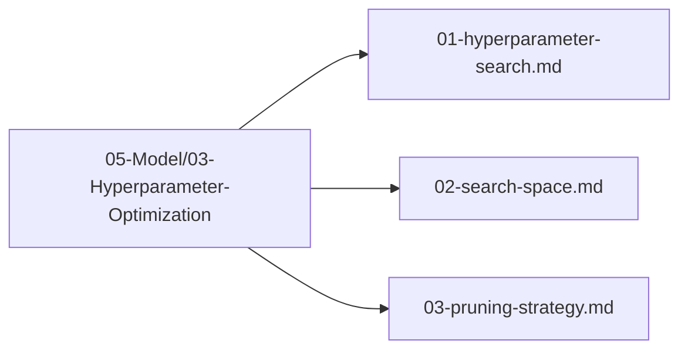

# Pruning Strategy

## 1. Purpose

Define the pruning strategy for eliminating poorly performing hyperparameter trials during the optimization process.

## 2. Pruning Overview

Pruning stops unpromising trials early to save computational resources and focus on the most promising hyperparameter configurations.



## 3. Pruner Types



### 3.1 Median Pruner



### 3.2 Hyperband Pruner



## 4. Pruning Configuration

```rust
use automl::{MedianPruner, PercentilePruner, HyperbandPruner};

// Median Pruner — requires minimize flag
let median_pruner = MedianPruner::new(false) // false = maximize, true = minimize
    .with_n_startup_trials(5)
    .with_n_warmup_steps(5);

// Percentile Pruner — new(percentile, minimize)
let percentile_pruner = PercentilePruner::new(25.0, false);

// Hyperband Pruner — new(min_resource, max_resource, minimize)
let hyperband_pruner = HyperbandPruner::new(1, 81, false)
    .with_reduction_factor(3.0);
```

## 5. Pruning Workflow



## 6. Pruning Decision Logic



## 7. Resource Allocation



## 8. Pruning Strategy Files

All pruning strategy files are in `05-Model/03-Hyperparameter-Optimization/`:



## 9. Next Steps

1. Execute hyperparameter search with pruning
2. Collect best configuration
3. Proceed to model evaluation
