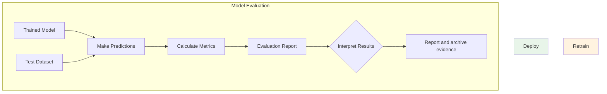
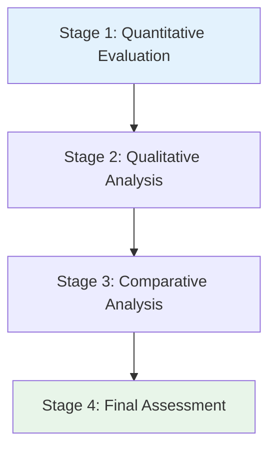
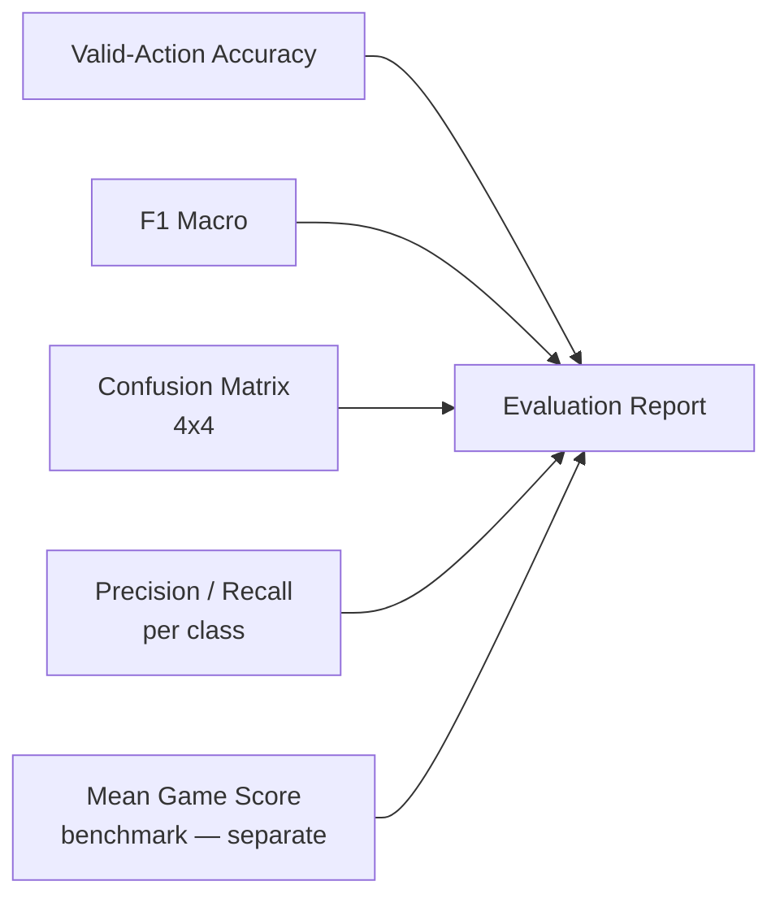
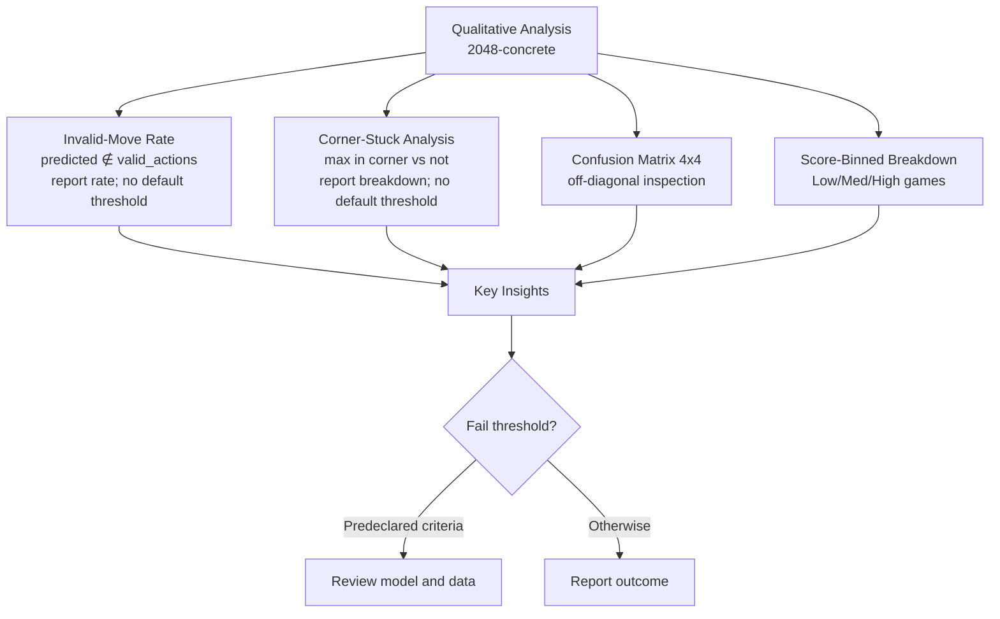
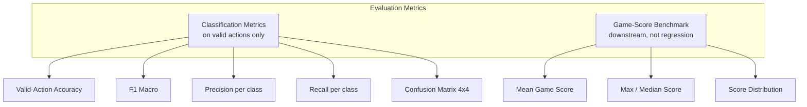
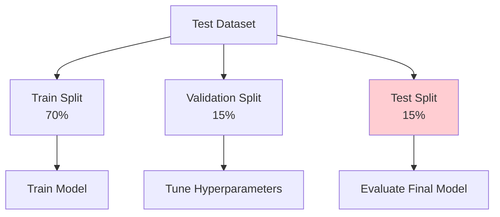
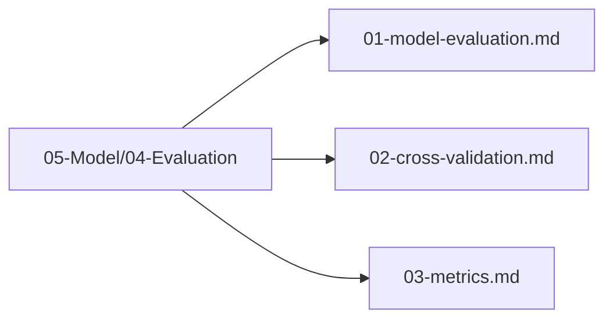

# Plan 01 — Model Evaluation: the repository status is explicit and evidence based

> **Status: PARTIAL (2026-09-27).** Seeded game-score and paired-score evaluation tooling exists; classification diagnostics and held-out model results remain pending.

**Goal:** State the current implementation and evidence boundary for model evaluation.
**Builds on:** [00](../../00-scope-and-traceability.md) — the project is supervised 4×4 2048 policy learning, and framework evaluation is a separate research track.

---

## Decision and evidence

**This plan treats evaluation tooling as partially implemented and outcome claims as pending.** Root tooling can benchmark a saved policy on seeded games and compute score summaries and paired statistics. It does not yet emit 2048 case-study classification diagnostics or qualitative analyses, and no trained model has been evaluated on an adequate held-out corpus. The separate standard-dataset runner reports classifier metrics, but those results do not substitute for game-policy evaluation.

## 1. Purpose

Define the evaluation methodology for assessing the performance of the trained 2048 game machine learning model.

## 2. Evaluation Overview

The model evaluation process measures how well the trained model performs on unseen board states.

## 3. Evaluation Stages

### 3.1 Quantitative Evaluation — Classification Only (No Regression)

> **Canonical task:** four-action classification from 17 features. The policy consumes four class probabilities and masks illegal moves. Game score is a downstream application outcome. No score regression metrics apply to the action target.

### 3.2 Qualitative Analysis — Concrete (2048-specific)

> **Not generic.** The model predicts actions 0–3 (up/down/left/right) from a 17-dim board state. Qualitative analysis must check whether predicted moves are **legal and strategically sensible**, not just statistically accurate.

**Analyses to run (with concrete definitions):**

1. **Invalid-move rate** — fraction of predictions where the predicted action does not change the board (no tiles move/merge). Compute on the test set by replaying each state through the 2048 engine: `invalid = predicted ∉ valid_actions(state)`. No threshold is predeclared; define this analysis before running it. The live policy masks invalid moves at inference.

2. **Corner-stuck analysis** — heuristic 2048 play keeps the max tile in a corner. A corner-conditioned breakdown could be a future analysis if the held-out sample and metric are defined before inspection; the current feature vector does not include max-tile position.

3. **Confusion matrix inspection (4×4)** — look for systematic confusions (e.g., `up↔down` or `left↔right` swaps) that correlate with vertical/horizontal board symmetry. A uniform error pattern suggests underfitting; a strong off-diagonal (e.g., 30% of `left` misclassified as `right`) suggests feature leakage or label noise from rollout sampling.

4. **Score-binned breakdown** — if run, define bins from the declared game protocol before examining outcomes. Report action diagnostics and score summaries per bin; do not use illustrative score cutoffs as acceptance gates.

## 4. Evaluation Metrics — Classification + Game-Score Benchmark Only

> **No regression metrics** (R² / RMSE / MAE) and **no ranking metrics** (NDCG / MAP) — deleted. The model predicts actions, not scores or rankings. Game score is a downstream benchmark measured by running the policy in the simulator.

## 5. Test Dataset Structure — Planned Roles

## 6. Evaluation Pipeline

## 7. Evaluation Files Location

All evaluation files are in `05-Model/04-Evaluation/`:

## 8. Next Steps

1. Use the implemented game-grouped CV and chronological holdout with a retained labeled dataset.
2. Implement case-study classification diagnostics and validate them against known predictions.
3. Compare held-out policy outcomes with declared baselines under a predeclared protocol.

## Implementation Record

- Root tooling can benchmark a saved model on seeded games, collect score summaries, compare paired results, and compute bootstrap/nonparametric statistics. The standard-dataset diagnostic reports confusion/F1 for tabular tasks; the 2048 case-study path lacks those classification metrics, valid-action diagnostics, corner-state, and score-binned analyses.
- No trained model has been evaluated on an adequate held-out dataset. No performance gates are established by canonical scope.

---

## Verification (definition of done)

1. `test -f plans/05-Model/04-Evaluation/01-model-evaluation.md` exits 0.
2. `grep -q '^# Plan 01 — ' plans/05-Model/04-Evaluation/01-model-evaluation.md` exits 0.
3. `grep -q '^> \\*\\*Status:' plans/05-Model/04-Evaluation/01-model-evaluation.md` exits 0.
4. `grep -q '^\*\*Goal:' plans/05-Model/04-Evaluation/01-model-evaluation.md` exits 0.
5. `grep -q '^## Decision and evidence$' plans/05-Model/04-Evaluation/01-model-evaluation.md` exits 0.
6. `grep -q '^## Open questions$' plans/05-Model/04-Evaluation/01-model-evaluation.md` exits 0.
7. `grep -q '^## Later$' plans/05-Model/04-Evaluation/01-model-evaluation.md` exits 0.
8. `bash /Users/evintleovonzko/Documents/works/kolosal/planout2/v2-ai-express/.claude/skills/writing-planout-plans/check-plan.sh plans/05-Model/04-Evaluation/01-model-evaluation.md` exits 0.

## Open questions

- Implement and validate held-out classification diagnostics, then run them with a trained model on game-disjoint data. Predeclare any qualitative thresholds and retain analysis artifacts.

## Later

- **Complete the remaining research or implementation work recorded above.** It stays deferred until its prerequisites, compute budget, and measurable acceptance evidence are available.
