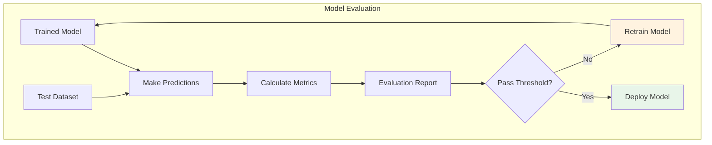
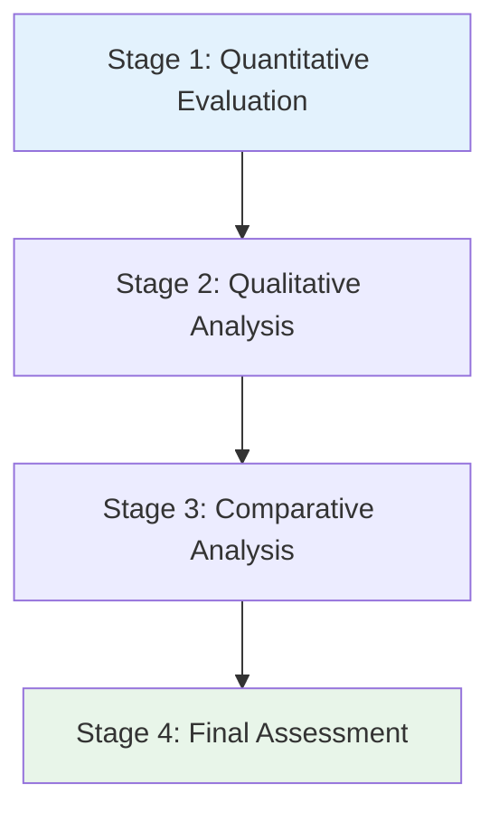
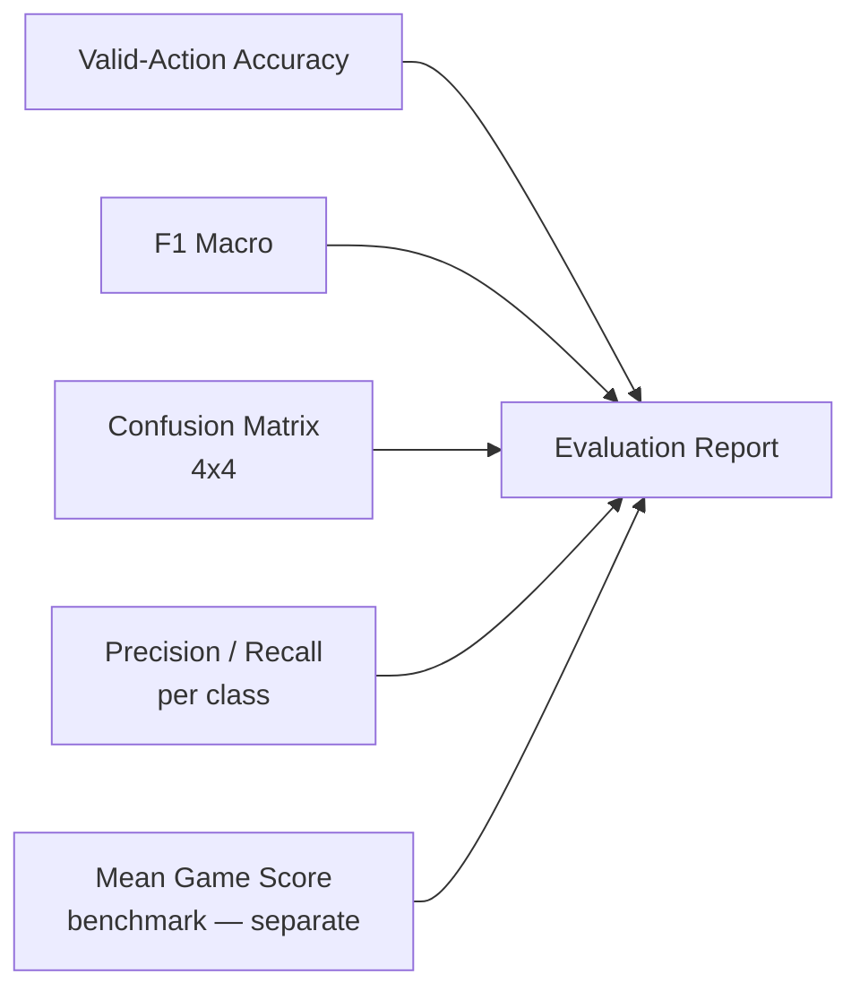
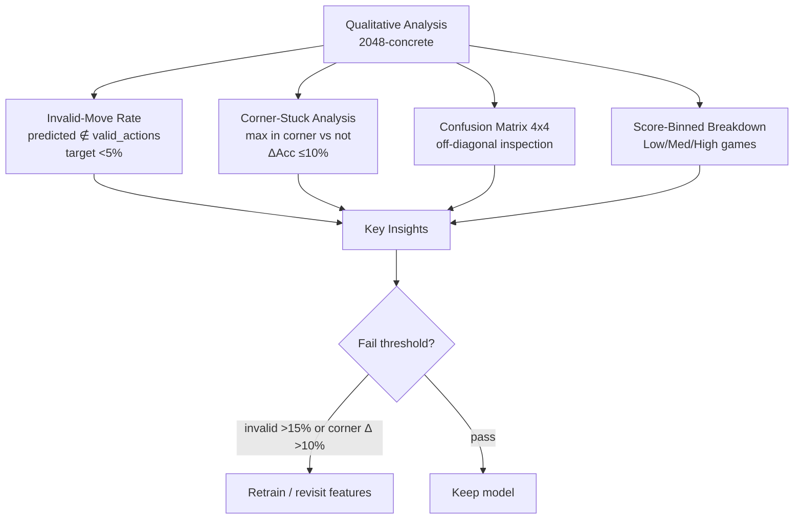
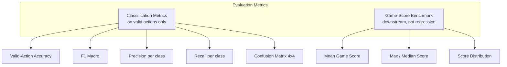
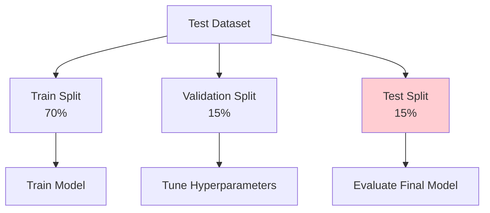
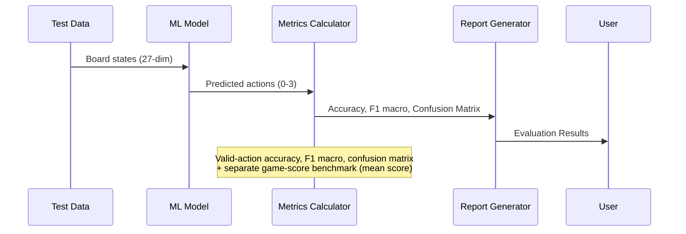
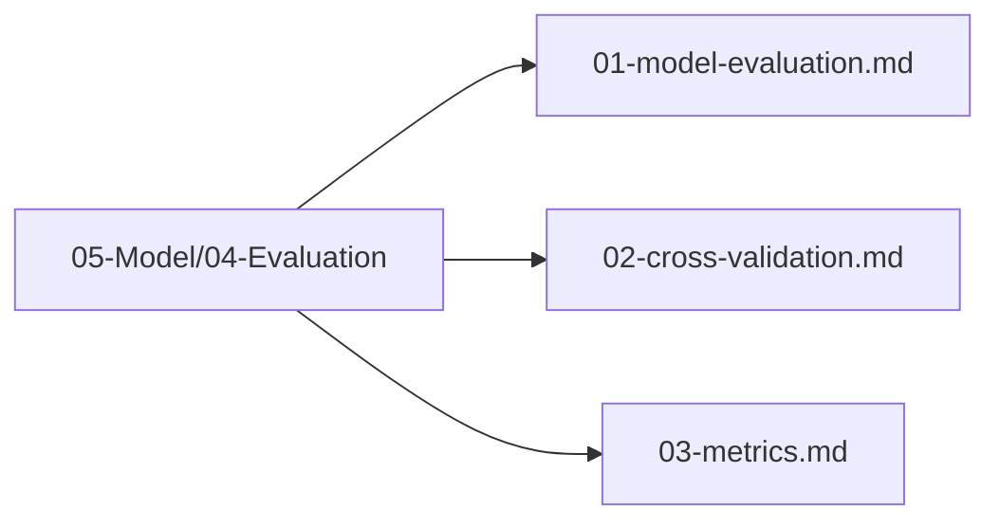

# Plan 01 — Model Evaluation: the repository status is explicit and evidence based

> **Status: PLANNED.** Not yet restarted in strict sequence.

**Goal:** State the current implementation and evidence boundary for model evaluation.
**Builds on:** [00](../../00-scope-and-traceability.md) — the project is supervised 4×4 2048 policy learning, and framework evaluation is a separate research track.

---

## Decision and evidence

**This plan treats its subject as partial or pending work, not as a research finding.** The rejected alternative is to infer completion from a plan title or related code alone. The ledger records this disposition: Not yet restarted in strict sequence.

## 1. Purpose

Define the evaluation methodology for assessing the performance of the trained 2048 game machine learning model.

## 2. Evaluation Overview

The model evaluation process measures how well the trained model performs on unseen board states.

## 3. Evaluation Stages

### 3.1 Quantitative Evaluation — Classification Only (No Regression)

> **Canonical metrics:** `TaskType::MultiClassification` (27-dim → 4 logits → `argmax` over actions 0–3). No R² / RMSE / MAE — the model does not predict scores.

### 3.2 Qualitative Analysis — Concrete (2048-specific)

> **Not generic.** The model predicts actions 0–3 (up/down/left/right) from a 27-dim board state. Qualitative analysis must check whether predicted moves are **legal and strategically sensible**, not just statistically accurate.

**Analyses to run (with concrete definitions):**

1. **Invalid-move rate** — fraction of predictions where the predicted action does not change the board (no tiles move/merge). Compute on the test set by replaying each state through the 2048 engine: `invalid = predicted ∉ valid_actions(state)`. Target: **<5%** invalid; gates are still Valid-Action Accuracy ≥60% and F1 ≥0.55, but invalid-rate is a hard qualitative fail if >15%.

2. **Corner-stuck analysis** — heuristic 2048 play keeps the max tile in a corner. Sample 500 mid-game states where `max_tile` is in a corner vs. 500 where it is not. Measure Valid-Action Accuracy separately. If corner-stuck accuracy is >10% lower, the model is not capturing monotonicity — revisit derived features (monotonicity, max-tile position, empty count) per `02-Training/03-model-architecture.md:2.1`.

3. **Confusion matrix inspection (4×4)** — look for systematic confusions (e.g., `up↔down` or `left↔right` swaps) that correlate with vertical/horizontal board symmetry. A uniform error pattern suggests underfitting; a strong off-diagonal (e.g., 30% of `left` misclassified as `right`) suggests feature leakage or label noise from rollout sampling.

4. **Score-binned breakdown** — stratify test games into Low (<256), Medium (256–512), High (>512) score bins. Report Valid-Action Accuracy and Mean Game Score per bin. High-score games should not have markedly lower accuracy; if they do, the model overfits early-game states (where most training data comes from).

## 4. Evaluation Metrics — Classification + Game-Score Benchmark Only

> **No regression metrics** (R² / RMSE / MAE) and **no ranking metrics** (NDCG / MAP) — deleted. The model predicts actions, not scores or rankings. Game score is a downstream benchmark measured by running the policy in the simulator.

## 5. Test Dataset Structure

## 6. Evaluation Pipeline

## 7. Evaluation Files Location

All evaluation files are in `05-Model/04-Evaluation/`:

## 8. Next Steps

1. Perform cross-validation
2. Calculate detailed metrics
3. Compare with baseline models

## Implementation Record

- Root tooling can benchmark a saved model on seeded games, collect score summaries, compare paired results, and compute bootstrap/nonparametric statistics. Classification confusion/F1 plus corner-state, score-binned, and invalid-rate qualitative analyses remain incomplete.
- No trained model has been evaluated against the declared gates on a plan-scale held-out dataset.

---

## Verification (definition of done)

1. `test -f plans/05-Model/04-Evaluation/01-model-evaluation.md` exits 0.
2. `grep -q '^# Plan 01 — ' plans/05-Model/04-Evaluation/01-model-evaluation.md` exits 0.
3. `grep -q '^> \\*\\*Status:' plans/05-Model/04-Evaluation/01-model-evaluation.md` exits 0.
4. `grep -q '^\*\*Goal:' plans/05-Model/04-Evaluation/01-model-evaluation.md` exits 0.
5. `grep -q '^## Decision and evidence$' plans/05-Model/04-Evaluation/01-model-evaluation.md` exits 0.
6. `grep -q '^## Open questions$' plans/05-Model/04-Evaluation/01-model-evaluation.md` exits 0.
7. `grep -q '^## Later$' plans/05-Model/04-Evaluation/01-model-evaluation.md` exits 0.
8. `bash /Users/evintleovonzko/Documents/works/kolosal/planout2/v2-ai-express/.claude/skills/writing-planout-plans/check-plan.sh plans/05-Model/04-Evaluation/01-model-evaluation.md` exits 0.

## Open questions

- **The plan-scale evidence remains bounded by current results.** Not yet restarted in strict sequence. Any larger corpus or external benchmark needs a declared resource budget and retained artifacts.

## Later

- **Complete the remaining research or implementation work recorded above.** It stays deferred until its prerequisites, compute budget, and measurable acceptance evidence are available.
