# Plan 02 — Cross-Validation: the repository status is explicit and evidence based

> **Status: PARTIAL (2026-09-27).** Root group-aware CV implementation is present; only fold accuracy is reported and adequate-corpus evaluation remains pending.

**Goal:** State the current implementation and evidence boundary for cross-validation.
**Builds on:** [00](../../00-scope-and-traceability.md) — the project is supervised 4×4 2048 policy learning, and framework evaluation is a separate research track.

---

## Decision and evidence

**This plan treats group-aware fold execution as implemented, with results and broader temporal protocols pending.** The root wrapper obtains group folds, verifies no game overlap, fits each fold, and reports accuracy. GroupKFold preserves game membership but does not guarantee chronological ordering.

## 1. Purpose

Define the cross-validation strategy for robust evaluation of the 2048 game machine learning model.

## 2. Cross-Validation Overview

Cross-validation ensures the model generalizes well by training and evaluating on different data splits.

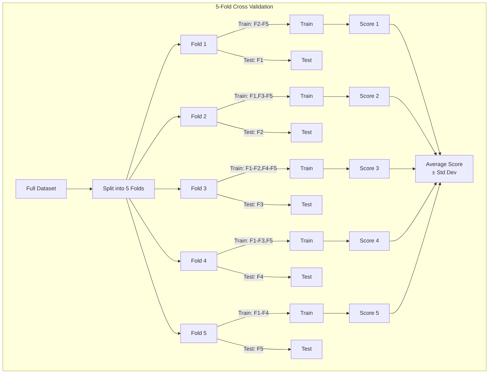

## 3. Cross-Validation Strategies

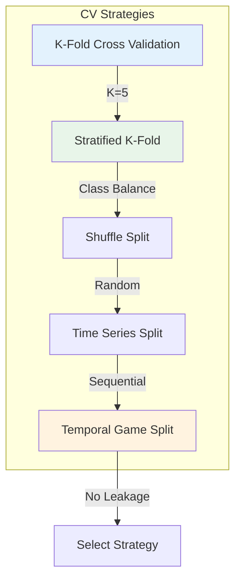

### 3.1 Stratified K-Fold

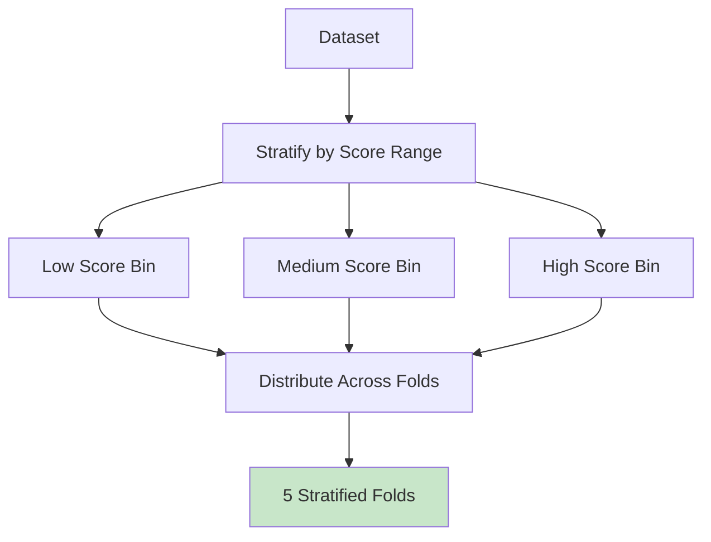

### 3.2 Shuffle Split

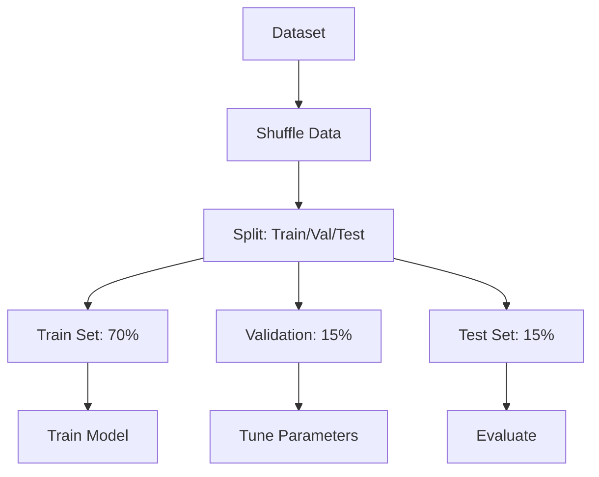

### 3.3 Temporal Data Problem: Why Random CV Leaks

Game data has an inherent temporal structure that violates the i.i.d. assumption of standard K-Fold cross-validation. Each game produces a sequence of board states where later states depend on earlier states. Random CV shuffles all states together, causing the following leakage problems:

1. **Future state leakage**: A model trained on states from game epoch 50 can "predict" states from game epoch 10 (because they share similar board patterns), but this does not reflect real generalization to truly unseen game sequences
2. **Sequence contamination**: Adjacent moves within a single game are highly correlated — placing a train state from move 80 and a test state from move 82 in different folds means the model has seen essentially the same game trajectory
3. **Score correlation**: States from high-scoring games tend to cluster together (good opening sequences lead to good mid-game states), so random splitting can put correlated high-score states in both train and test sets

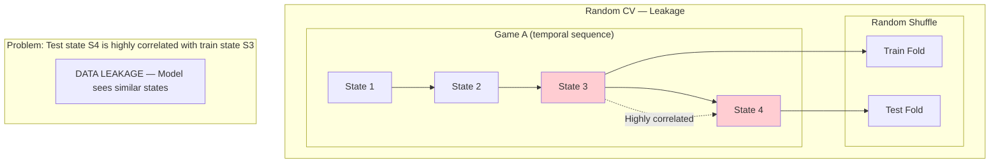

### 3.4 Group-Aware and Temporal Cross-Validation Strategies

To prevent data leakage, we keep entire games together within a single fold:

**Core Principle**: Group integrity via `GroupKFold { n_splits: 5 }` keeps all states from one game in the same fold. For true temporal ordering (train on earlier games, test on later), use `TimeSeriesSplit { n_splits: 5, max_train_size: None }` — `GroupKFold` itself is group-aware but **not** temporally ordered.

**Split Strategy**:

1. **Game-level splitting**: Each game is assigned a group ID
2. **Group integrity**: `GroupKFold { n_splits: 5 }` ensures no game is split across folds
3. **Temporal ordering** (when needed): Use `TimeSeriesSplit` for forward-chaining; `GroupKFold` alone does not sort chronologically
4. **Forward-chaining splits** (TimeSeriesSplit): Train on earlier games, test on later games
5. **No overlap**: A game's states appear in exactly one fold

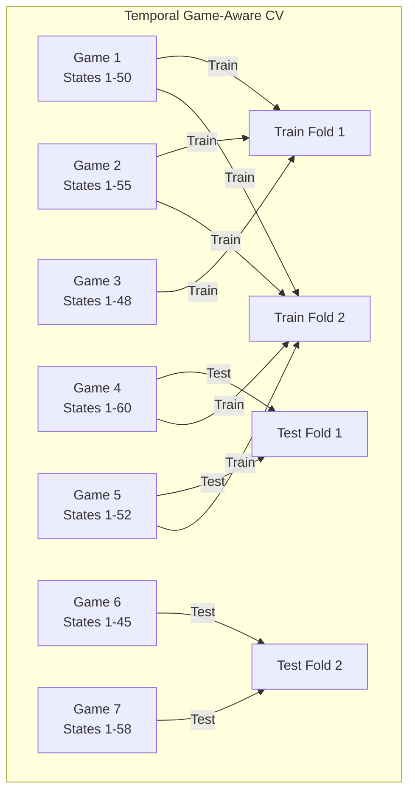

**Implementation**:

```rust
use automl::{CrossValidator, CVStrategy};

let cv = CrossValidator::new(CVStrategy::GroupKFold { n_splits: 5 })
    .with_random_state(42);

let splits = cv.split(n_samples, None, Some(&groups))?;
// Do not call automl::cross_val_score for GroupKFold: the current helper
// passes groups=None internally. Score these splits in the project wrapper,
// which receives the group array and trains/evaluates each returned split.
```

**Fold definitions for 5-fold temporal CV**:

```
Total games: 100 (chronologically ordered)

Fold 1: Train = Games 1-80,  Test = Games 81-84
Fold 2: Train = Games 1-84,  Test = Games 85-88
Fold 3: Train = Games 1-88,  Test = Games 89-92
Fold 4: Train = Games 1-92,  Test = Games 93-96
Fold 5: Train = Games 1-96,  Test = Games 97-100
```

When using `TimeSeriesSplit`, every test set contains only later rows. For the canonical dataset, the project wrapper calls `CrossValidator::split(..., Some(&groups))` directly, then scores each split. The current automl `cross_val_score` helper is not group-aware and must not be used for this experiment.

**Key Properties**:
- No game appears in both train and test sets (GroupKFold guarantee)
- With TimeSeriesSplit, test games chronologically follow training games; GroupKFold alone preserves groups but not order
- TimeSeriesSplit uses an expanding window (training set grows over time); GroupKFold uses standard group partitioning
- Game states within a test game are never seen during training

### 3.5 Stratified Temporal CV (Recommended)

No stratified-temporal splitter is implemented. Any future combined strategy needs an explicit algorithm and validation; do not infer it from GroupKFold.

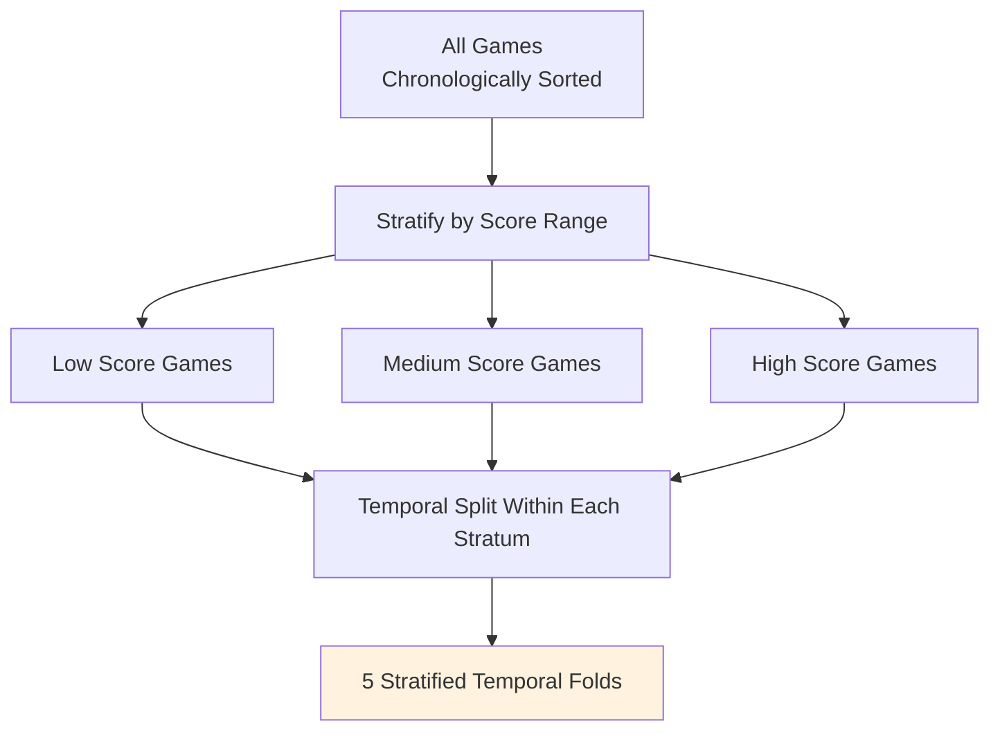

The diagram above is a conceptual proposal, not an implemented splitter or validated recommendation.

## 4. Cross-Validation Configuration

```rust
use automl::{CrossValidator, CVStrategy};

// Recommended: Group-aware CV (keeps each game's states together; not temporal — use TimeSeriesSplit for temporal)
let cv = CrossValidator::new(CVStrategy::GroupKFold { n_splits: 5 })
    .with_random_state(42);
let splits = cv.split(n_samples, None, Some(&groups))?;
// For true temporal ordering use: CVStrategy::TimeSeriesSplit { n_splits: 5, max_train_size: None }

// Alternative: Stratified K-Fold (preserves class distribution)
let cv_stratified = CrossValidator::new(CVStrategy::StratifiedKFold { n_splits: 5, shuffle: true })
    .with_random_state(42);
let splits = cv_stratified.split(n_samples, Some(&y), None)?;
```

**Configuration Notes**:
- Use `GroupKFold { n_splits: 5 }` for group integrity; use `TimeSeriesSplit { n_splits: 5, max_train_size: None }` for true temporal forward-chaining
- For `StratifiedKFold` set `shuffle` via the enum field: `StratifiedKFold { n_splits: 5, shuffle: true }` (no separate `with_shuffle` builder)
- Always pass `groups` to `split()` for GroupKFold; pass `y` for StratifiedKFold
- Never shuffle game IDs if temporal ordering matters — `TimeSeriesSplit` respects order by design

## 5. Cross-Validation Process

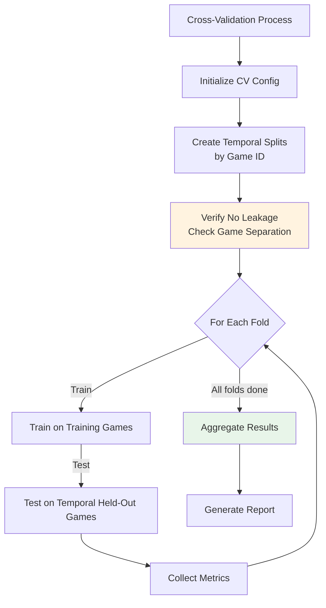

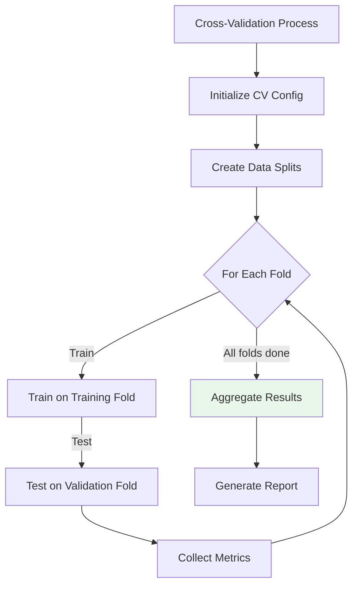

## 6. Results Aggregation — Classification Metrics + Game-Score Benchmark

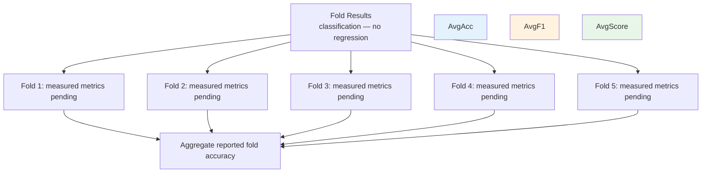

> **No R².** Metrics are valid-action accuracy, F1 macro, and downstream mean game score.

## 7. Cross-Validation Files

All cross-validation files are in `05-Model/04-Evaluation/`:

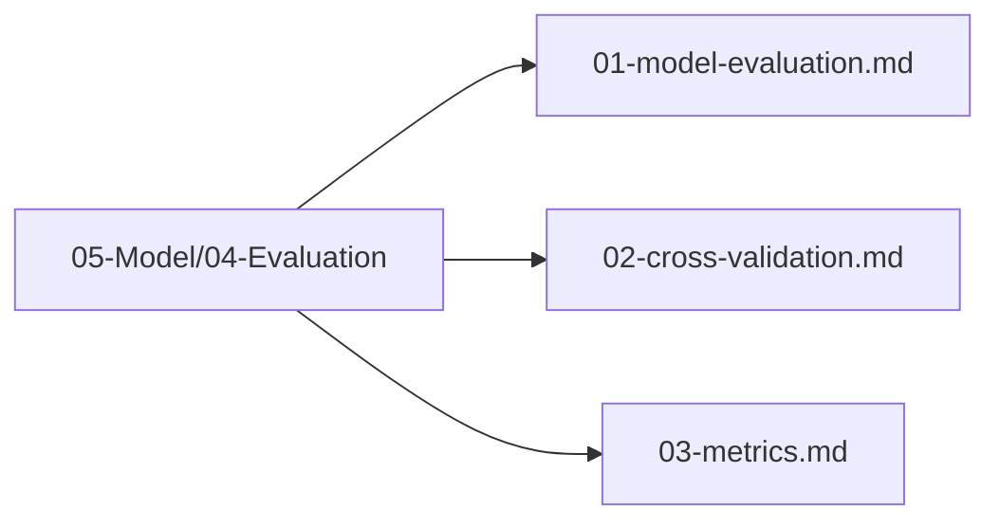

## 8. Next Steps

1. Define evaluation metrics
2. Execute cross-validation with temporal splits
3. Analyze results
4. Verify no data leakage between folds

## Implementation Record

- The project wrapper runs seeded group folds, explicitly checks there is no game ID overlap, fits each training fold, and reports fold and mean accuracy. It does not provide chronological forward chaining, stratified-temporal folds, F1, or per-fold game-score metrics.
- Validation on an adequate plan-scale corpus has not yet been run; the wrapper is implementation plumbing, not experiment results.

---

## Verification (definition of done)

1. `test -f plans/05-Model/04-Evaluation/02-cross-validation.md` exits 0.
2. `grep -q '^# Plan 02 — ' plans/05-Model/04-Evaluation/02-cross-validation.md` exits 0.
3. `grep -q '^> \\*\\*Status:' plans/05-Model/04-Evaluation/02-cross-validation.md` exits 0.
4. `grep -q '^\*\*Goal:' plans/05-Model/04-Evaluation/02-cross-validation.md` exits 0.
5. `grep -q '^## Decision and evidence$' plans/05-Model/04-Evaluation/02-cross-validation.md` exits 0.
6. `grep -q '^## Open questions$' plans/05-Model/04-Evaluation/02-cross-validation.md` exits 0.
7. `grep -q '^## Later$' plans/05-Model/04-Evaluation/02-cross-validation.md` exits 0.
8. `bash /Users/evintleovonzko/Documents/works/kolosal/planout2/v2-ai-express/.claude/skills/writing-planout-plans/check-plan.sh plans/05-Model/04-Evaluation/02-cross-validation.md` exits 0.

## Open questions

- Validate fold behavior and metric reporting on an adequate game corpus. Treat chronological holdout as a separate outer split; GroupKFold itself is not temporal.

## Later

- **Complete the remaining research or implementation work recorded above.** It stays deferred until its prerequisites, compute budget, and measurable acceptance evidence are available.
