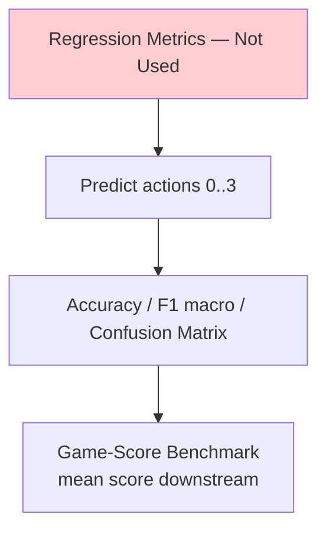
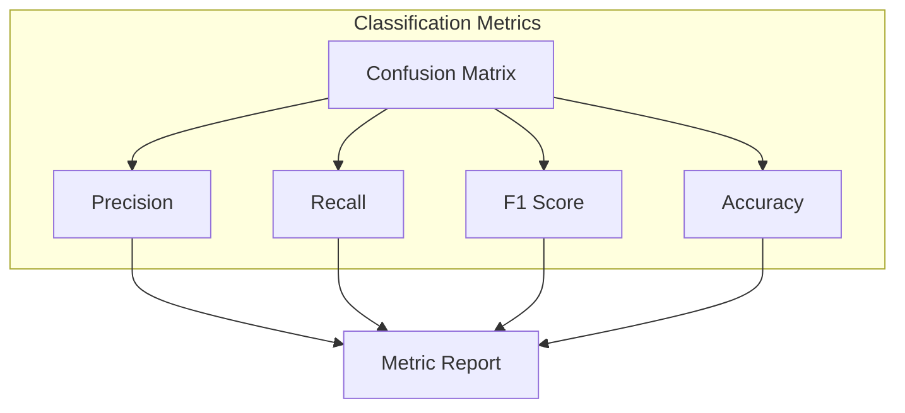
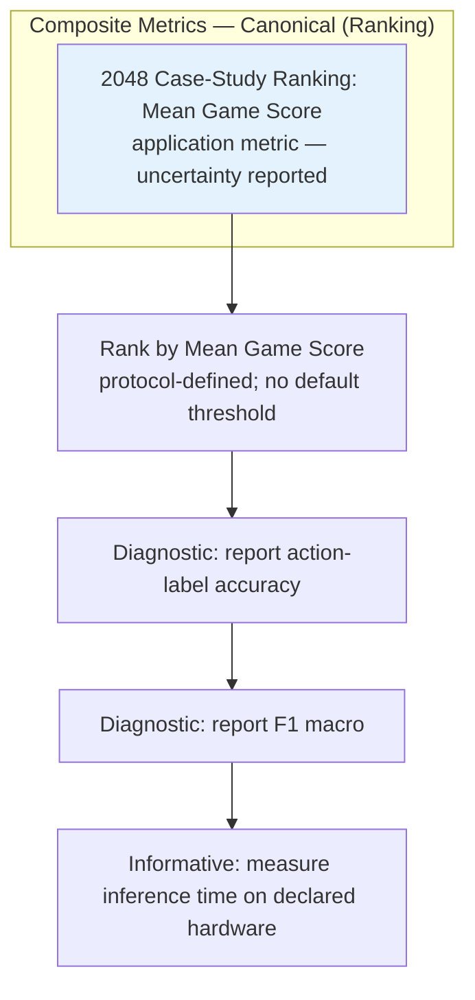
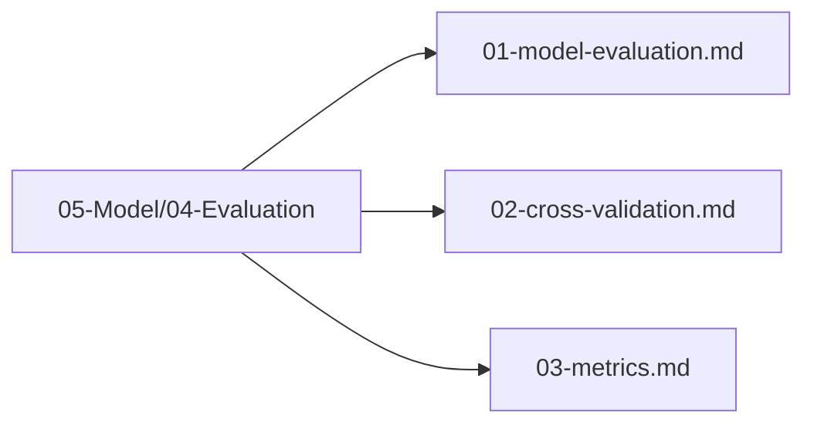

# Plan 03 — Metrics: the repository status is explicit and evidence based

> **Status: PARTIAL (2026-09-27).** Score and generic classifier-summary helpers exist; 2048 held-out classification diagnostics and trained-policy results remain pending.

**Goal:** State the current implementation and evidence boundary for metrics.
**Builds on:** [00](../../00-scope-and-traceability.md) — the project is supervised 4×4 2048 policy learning, and framework evaluation is a separate research track.

---

## Decision and evidence

**Score summaries and generic classification helpers are implemented; 2048 training integration and outcomes remain pending.** `src/evaluation.rs` summarizes score distributions, bootstrap intervals, action frequencies, and paired/unpaired score comparisons. It also computes accuracy, macro precision/recall/F1, and a confusion matrix. The root `train` command does not yet write these classification diagnostics for a 2048 model; the standard-dataset runner uses them on its separate framework-validation track.

## 1. Purpose

Define the evaluation metrics used to assess the 2048 game machine learning model performance.

## 2. Metrics Overview

The framework's primary validation metrics are task-appropriate classification quality, resource use, reproducibility, and artifact correctness on standard tabular tasks. In the 2048 case study, the task is **multi-class classification** (4 actions) with **game score** as a downstream application metric. Regression metrics (R², RMSE, MAE) are not used for the action target because the model predicts actions, not scores.

```mermaid
flowchart TD
    subgraph "Metrics Categories — Canonical"
        Primary[Framework Metrics]
        Secondary[Application Metrics]
        Tertiary[Resource and Reproducibility Metrics]
        Optional[Optional Analysis — Not a Gate]
    end
    
    Primary --> FrameworkQuality[Task quality, correctness, and reproducibility]
    
    Secondary --> Acc[Valid-Action Accuracy<br/>(on valid actions only)]
    Secondary --> F1[F1 Macro<br/>(across 4 classes)]
    Secondary --> Precision[Precision]
    Secondary --> Recall[Recall]
    
    Tertiary --> Speed[Inference Speed and Resource Use]
    Tertiary --> Consistency[Score Std Dev]
    Tertiary --> Ceiling[Max Tile Reached]

    Optional -.-> ProxOpt[Proximity = model/heuristic<br/>single ratio if reported — not a gate]
```

**Critical distinction**: Every training label is a legal action for its state. For raw classifier diagnostics, compare the unmasked four-class prediction to that label and count an illegal prediction as incorrect. Runtime policy selection masks illegal actions before choosing a move; report that policy behavior separately from raw label accuracy.

```rust
pub fn masked_accuracy(
    predicted: u8, 
    actual: u8, 
    valid_actions: &[u8]
) -> bool {
    // Raw classifier accuracy: invalid predictions count as incorrect.
    // Runtime policy evaluation separately applies masked_argmax.
    valid_actions.contains(&predicted) && predicted == actual
}
```

## 3. Regression Metrics — Not Used

> The task is four-action classification from 17 features. Regression metrics are not applicable to the action target. Game score is a downstream 2048 outcome and is summarized separately.



## 4. Classification Metrics



### 4.1 Confusion Matrix

```mermaid
flowchart TD
    CM[Confusion Matrix<br/>4x4 Matrix<br/>Actions: Up, Down, Left, Right]
    CM --> TP[True Positives]
    CM --> FP[False Positives]
    CM --> FN[False Negatives]
    CM --> TN[True Negatives]
    
    CM --> AccCalc[Accuracy = diagonal sum / total]
    CM --> PrecCalc[Per-class precision = TP/(TP+FP)]
    CM --> RecCalc[Per-class recall = TP/(TP+FN)]
    CM --> F1Calc[Per-class F1; report macro mean]
```

`src/evaluation.rs::summarize_classification` implements these fixed-class summaries. Macro averages include every caller-declared class, including classes absent from a sample.

### 4.2 F1 Score

```mermaid
flowchart LR
    Prec[Precision] --> F1[F1 Score]
    Rec[Recall] --> F1
    F1 --> |2 * P * R / (P + R)| Report[Report]
    
    style F1 fill:#e8f5e9
```

## 5. Composite Metrics



No acceptance thresholds or composite ranking rule are defined by the canonical scope. Predeclare them in a case-study protocol before comparing policies.

## 6. Metric Targets — Canonical (Single Source of Truth)

| Metric | Target | Category | Gate? |
|--------|--------|----------|-------|
| **Mean Game Score** | Report distribution and uncertainty | 2048 case-study outcome | Protocol-defined |
| Action-Label Accuracy | Generic helper implemented; not wired to 2048 training CLI | Classification diagnostic | Pending 2048 integration/results |
| F1 Macro | Generic helper implemented; not wired to 2048 training CLI | Classification diagnostic | Pending 2048 integration/results |
| Inference Speed | Measure on declared hardware | Resource metric | Informative |

> If a model/heuristic ratio is reported, define both evaluation populations and uncertainty; it is descriptive, not a default acceptance threshold.

Game-score summaries do not prove general AutoML quality. Classification metrics describe action-label prediction; game outcomes describe the 2048 case study.

## 7. Metric Calculation Pipeline

```mermaid
sequenceDiagram
    participant Pred as Predictions
    participant Actual as Actual Values
    participant Calc as Metric Calculator
    participant Store as Metric Store
    
    Pred->>Calc: Predicted actions (0-3)
    Actual->>Calc: True actions (0-3)
    Calc->>Calc: Generic helper computes accuracy, macro F1, confusion matrix
    Calc->>Store: Store metrics
    Store --> Report[Generate Report]

    Note over Calc: Accuracy, Precision, Recall, F1 macro<br/>+ separate game-score benchmark (mean score)
```

## 8. Metrics Files Location

All metrics files are in `05-Model/04-Evaluation/`:



## 9. Next Steps

1. Wire the generic classification helper into a declared 2048 held-out evaluation.
2. Record raw and legal-action-masked policy predictions distinctly.
3. Interpret game outcomes under the predeclared protocol.

## Implementation Record

- `src/evaluation.rs` implements descriptive score summaries, bootstrap intervals, action-frequency summaries, paired sign tests, Mann–Whitney U, Holm adjustment, effect-size helpers, and generic classification summaries (accuracy, macro precision/recall/F1, confusion matrix).
- Generic classification summaries are used by the standard-dataset diagnostic but are not wired to the 2048 `train`/evaluation path. No held-out trained-policy metrics or scope-defined performance gates exist.

---

## Verification (definition of done)

1. `test -f plans/05-Model/04-Evaluation/03-metrics.md` exits 0.
2. `grep -q '^# Plan 03 — ' plans/05-Model/04-Evaluation/03-metrics.md` exits 0.
3. `grep -q '^> \\*\\*Status:' plans/05-Model/04-Evaluation/03-metrics.md` exits 0.
4. `grep -q '^\*\*Goal:' plans/05-Model/04-Evaluation/03-metrics.md` exits 0.
5. `grep -q '^## Decision and evidence$' plans/05-Model/04-Evaluation/03-metrics.md` exits 0.
6. `grep -q '^## Open questions$' plans/05-Model/04-Evaluation/03-metrics.md` exits 0.
7. `grep -q '^## Later$' plans/05-Model/04-Evaluation/03-metrics.md` exits 0.
8. `bash /Users/evintleovonzko/Documents/works/kolosal/planout2/v2-ai-express/.claude/skills/writing-planout-plans/check-plan.sh plans/05-Model/04-Evaluation/03-metrics.md` exits 0.

## Open questions

- Implement classification metrics with explicit class and valid-action handling; verify them on fixed examples before reporting results. Retain metric artifacts and predeclared evaluation protocol.

## Later

- **Complete the remaining research or implementation work recorded above.** It stays deferred until its prerequisites, compute budget, and measurable acceptance evidence are available.
