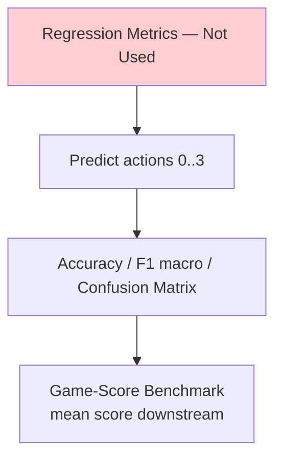
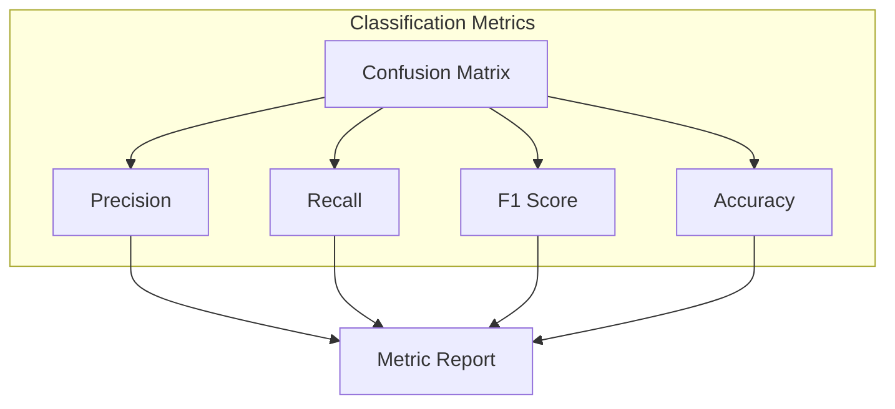
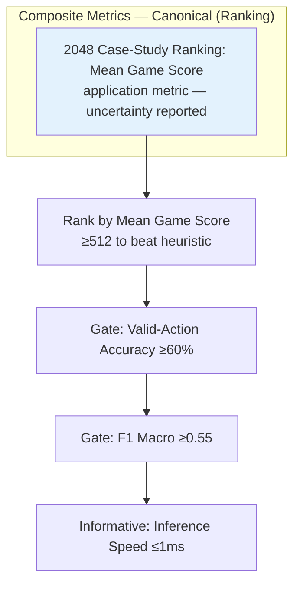
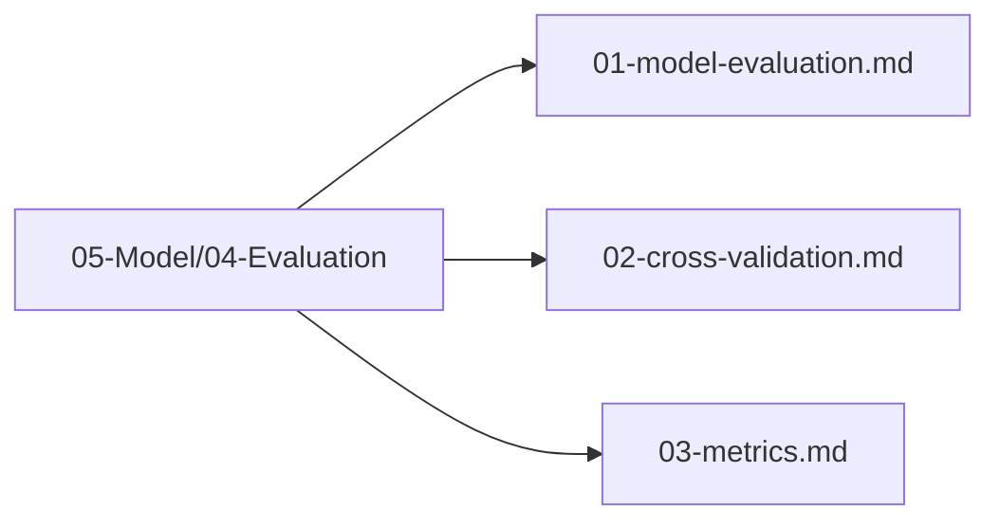

# Metrics — Framework Validation and 2048 Case Study

## 1. Purpose

Define the evaluation metrics used to assess the 2048 game machine learning model performance.

## 2. Metrics Overview

The framework's primary validation metrics are task-appropriate classification quality, resource use, reproducibility, and artifact correctness on standard tabular tasks. In the 2048 case study, the task is **multi-class classification** (4 actions) with **game score** as a downstream application metric. Regression metrics (R², RMSE, MAE) are not used for the action target because the model predicts actions, not scores.

```mermaid
flowchart TD
    subgraph "Metrics Categories — Canonical"
        Primary[Framework Metrics]
        Secondary[Application Metrics]
        Tertiary[Resource and Reproducibility Metrics]
        Optional[Optional Analysis — Not a Gate]
    end
    
    Primary --> FrameworkQuality[Task quality, correctness, and reproducibility]
    
    Secondary --> Acc[Valid-Action Accuracy<br/>(on valid actions only)]
    Secondary --> F1[F1 Macro<br/>(across 4 classes)]
    Secondary --> Precision[Precision]
    Secondary --> Recall[Recall]
    
    Tertiary --> Speed[Inference Speed and Resource Use]
    Tertiary --> Consistency[Score Std Dev]
    Tertiary --> Ceiling[Max Tile Reached]

    Optional -.-> ProxOpt[Proximity = model/heuristic<br/>single ratio if reported — not a gate]
```

**Critical distinction**: Classification accuracy is measured ONLY on **valid actions** (actions that change the board state). Predicting an invalid move (no board change) is always wrong — the model should never select an invalid action. This is enforced by masking invalid actions before prediction.

```rust
pub fn masked_accuracy(
    predicted: u8, 
    actual: u8, 
    valid_actions: &[u8]
) -> bool {
    // Invalid predictions count as incorrect
    valid_actions.contains(&predicted) && predicted == actual
}
```

## 3. Regression Metrics — Not Used

> **Deleted.** The task is `TaskType::MultiClassification` (27-dim → 4 logits → `argmax` over actions `0..3`). Regression metrics **R² / RMSE / MAE / MAPE are not applicable** because the model does not predict scores. Score is a downstream game-score benchmark (mean game score in `02-Environment/02-Rules/01-scoring-rules.md`), not a regression target. See **§6 Metric Targets** (mean game score) and `03-State/02-Score/` for score-as-feature vs. score-as-benchmark distinction.



## 4. Classification Metrics



### 4.1 Confusion Matrix

```mermaid
flowchart TD
    CM[Confusion Matrix<br/>4x4 Matrix<br/>Actions: Up, Down, Left, Right]
    CM --> TP[True Positives]
    CM --> FP[False Positives]
    CM --> FN[False Negatives]
    CM --> TN[True Negatives]
    
    CM --> AccCalc[Accuracy = (TP+TN)/Total]
    CM --> PrecCalc[Precision = TP/(TP+FP)]
    CM --> RecCalc[Recall = TP/(TP+FN)]
    CM --> F1Calc[F1 = 2*Prec*Rec/(Prec+Rec)]
```

### 4.2 F1 Score

```mermaid
flowchart LR
    Prec[Precision] --> F1[F1 Score]
    Rec[Recall] --> F1
    F1 --> |2 * P * R / (P + R)| Report[Report]
    
    style F1 fill:#e8f5e9
```

## 5. Composite Metrics



**Canonical: Rank by Mean Game Score; gates are Mean ≥512, Valid-Action Accuracy ≥60%, F1 ≥0.55. No weighted proximity ratio composite. If proximity reported, it's optional single ratio `model/heuristic` (≈512), not a weighted component.**

## 6. Metric Targets — Canonical (Single Source of Truth)

| Metric | Target | Category | Gate? |
|--------|--------|----------|-------|
| **Mean Game Score** | **≥ 512 (beats heuristic ~512)** | **Primary — ranking** | **Gate + ranking: highest mean wins** |
| Valid-Action Accuracy | ≥ 60% (on valid actions 0–3) | Secondary | **Gate** |
| F1 Macro | ≥ 0.55 (across 4 classes) | Secondary | **Gate** |
| Inference Speed | ≤ 1ms | Tertiary | Informative |

> **No proximity gate.** If reported as optional analysis, proximity = `model_mean / heuristic_mean` (≈512) as a single ratio (e.g., 768/512=1.5×). Targets `≥0.05 / ≥1.5 / >0.3/>0.5` are deprecated and removed. Canonical is `Mean ≥512, Valid-Action Accuracy ≥60%, F1 ≥0.55, Rank by Mean Score`.

**Note on targets**: The heuristic agent achieves ~512 mean score. The model must exceed this to be considered useful. R², RMSE, and MAE are NOT used — the model predicts actions, not scores.

## 7. Metric Calculation Pipeline

```mermaid
sequenceDiagram
    participant Pred as Predictions
    participant Actual as Actual Values
    participant Calc as Metric Calculator
    participant Store as Metric Store
    
    Pred->>Calc: Predicted actions (0-3)
    Actual->>Calc: True actions (0-3)
    Calc->>Calc: Compute classification metrics
    Calc->>Store: Store metrics
    Store --> Report[Generate Report]

    Note over Calc: Accuracy, Precision, Recall, F1 macro<br/>+ separate game-score benchmark (mean score)
```

## 8. Metrics Files Location

All metrics files are in `05-Model/04-Evaluation/`:



## 9. Next Steps

1. Run cross-validation experiments
2. Collect metric results
3. Compare against targets
