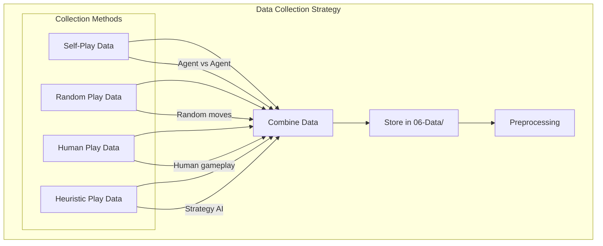
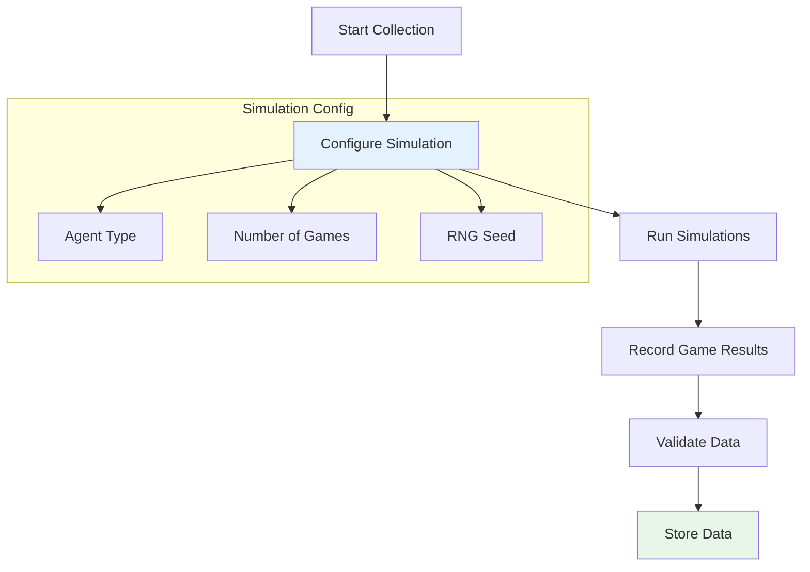
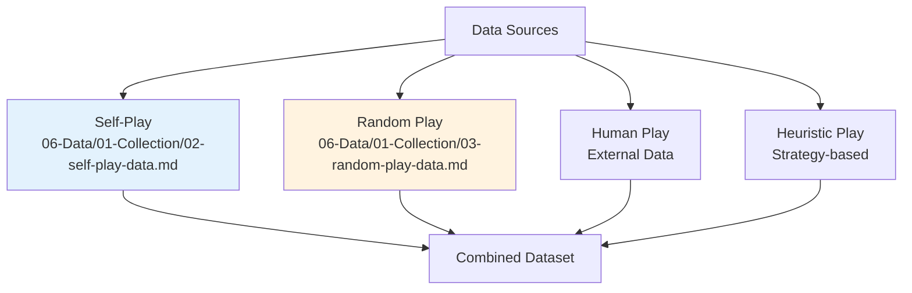
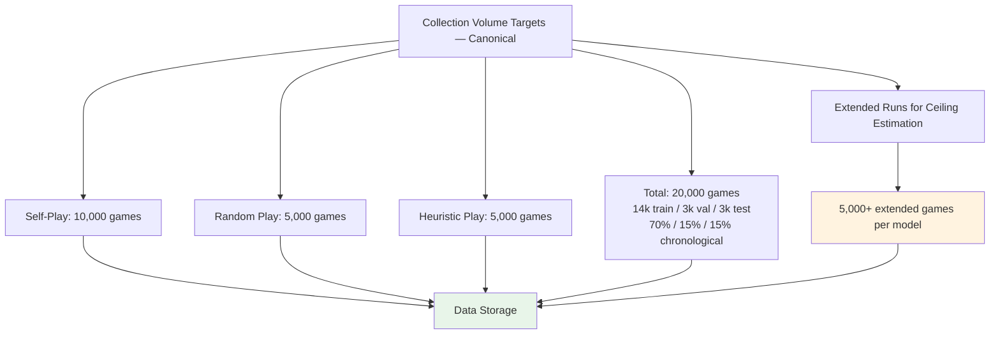
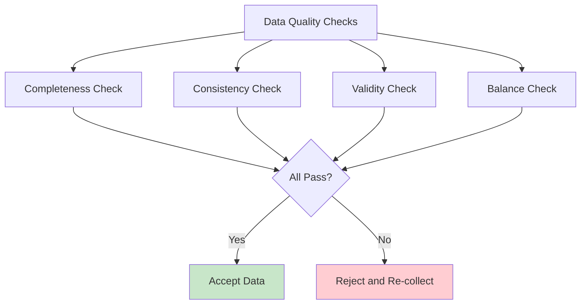
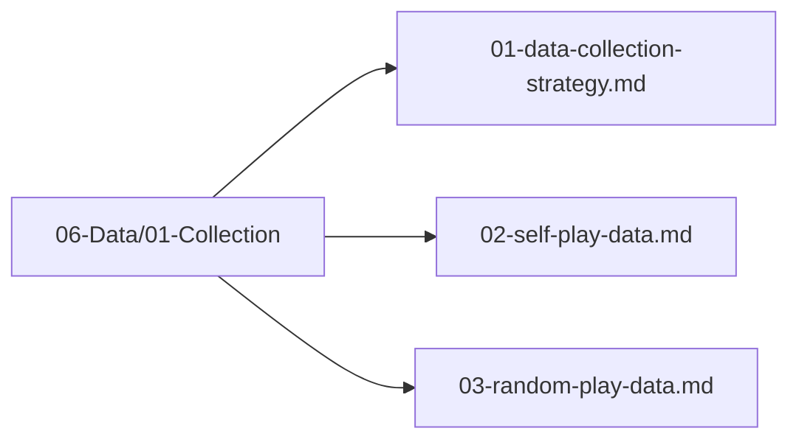

# Data Collection Strategy

## 1. Purpose

Define the strategy for collecting training data for the 2048 game machine learning model.

## 2. Data Collection Overview

Data is collected through multiple game simulation strategies to ensure diverse and comprehensive training data.



## 3. Collection Pipeline



## 4. Data Sources



## 5. Collection Volume



> **Canonical volumes (configurable):** Total **20,000 games** → **14,000 train / 3,000 val / 3,000 test** after chronological 70/15/15 split by `game_id` (`shuffle=false`). Breakdown: 10k self-play + 5k random + 5k heuristic = 20k. Volumes are **configurable** via `SelfPlayConfig.n_games` / `RandomPlayConfig.n_games` etc. but must preserve 70/15/15 chronological `GroupKFold` proportions and sum to the configured total. Do not use inconsistent 5k vs 10k contradictions across docs — this section is the source of truth.

## 6. Theoretical Limit Estimation

To establish the performance ceiling for each model:
- Extended sessions (500+ moves per game) until game over
- Multiple independent runs with different seeds
- Track running maximum to identify convergence
- Compute mean score across all games for each model
- Use confidence intervals to quantify score estimates
- **Models are ranked by mean score** (heuristic baseline ~512 serves as practical reference)

## 7. Data Quality Checks



## 8. Data Pipeline Definition

This section defines exactly how a game play is converted to CSV rows for training.

### 8.1 Sample Generation — Supervised Classification Only

A game with **N moves** produces **N training samples**. Each sample is a supervised row:

```
(state_features[27], action: u8, score: u64 /* metadata only */)
```

| Component | Type | Size | Role | Description |
|-----------|------|------|------|-------------|
| `state_features` | array | 27 | `X` | Board state feature vector at turn t (27-dim) |
| `action` | u8 | 1 | `y` (ONLY label) | Direction taken at turn t (0=Up, 1=Down, 2=Left, 3=Right) — `TaskType::MultiClassification` |
| `score` | u64 | 1 | metadata only | Game score at this state — for analysis/benchmarking, never as `y` |

> **No `reward` column.** `reward` / `next_state` / `done` are RL constructs and are not used. DataFrame row is `state_features: [f64;27], action: u8, score: u64 (metadata)`.

### 8.2 State-to-Feature Mapping

The board state at turn t is encoded into a 27-dimensional feature vector (16 grid + 11 derived in canonical order):

```
Feature Vector = [
    grid_0, grid_1, ..., grid_15,            // 16 dimensions: tile values on the 4x4 grid (normalized)
    empty_count,                              // 1: empty cells / 16
    max_tile_log,                             // 1: log2(max_tile)/15
    monotonicity,                             // 1: monotonicity score (0-1)
    smoothness,                               // 1: smoothness score (0-1)
    merges_available,                         // 1: possible merges / 16
    score_normalized,                         // 1: log10(score+1)/6.0
    adjacency_merge_score,                    // 1: adjacent mergeable pairs / 16
    corner_max,                               // 1: max tile in corner / 32768
    edge_tiles_occupied,                      // 1: edge tiles occupied / 12
    col_worst,                                // 1: minimum column sum normalized
    row_worst                                 // 1: minimum row sum normalized
]
```

Each grid cell value is normalized by dividing by 32768. Derived features are computed from the grid layout using standard 2048 heuristic formulas; score uses canonical `log10(score+1)/6.0`.

### 8.3 Action Label Generation (Rollout-Based)

The action taken at turn t by the agent is NOT the training label. **There is no ground truth "optimal action" for any board state.** We use **rollout-based heuristic labeling**:

1. For each board state, evaluate all valid actions
2. For each action, simulate 100 random plays to game end
3. The action with the highest average final score becomes the label

```rust
pub struct RolloutLabeler {
    simulator: GameSimulator,
    n_rollouts: usize,  // 100
}

impl RolloutLabeler {
    /// Returns (best_action, expected_score) for a given board state
    pub fn label(&self, board: &Board) -> (u8, f64) {
        let valid = board.get_valid_moves();
        let mut best_action = valid[0];
        let mut best_score = 0.0f64;
        
        for &action in &valid {
            let mut total_score = 0.0;
            for _ in 0..self.n_rollouts {
                let result = self.simulator.simulate_from(board, action);
                total_score += result.final_score as f64;
            }
            let avg_score = total_score / self.n_rollouts as f64;
            if avg_score > best_score {
                best_score = avg_score;
                best_action = action;
            }
        }
        
        (best_action, best_score)
    }
}
```

**Why this matters**: The original agent's action at turn t was chosen by a random or heuristic agent, not by an oracle. Without rollout-based relabeling, the model learns to mimic suboptimal behavior. The rollout label approximates optimal play by evaluating long-term outcomes.

### 8.4 Action as Target Label (After Relabeling)

The relabeled action becomes the **target label** for supervised training:
- `0` = move up (highest rollout score)
- `1` = move down (highest rollout score)
- `2` = move left (highest rollout score)
- `3` = move right (highest rollout score)

### 8.5 Self-Play Data: Label Regeneration Required

Self-play data (02-self-play-data.md) generates `(state, action)` pairs where the action is determined by the agent's current policy. These actions are **NOT** optimal labels. All self-play data must undergo **Section 7.3 rollout relabeling** before use in training. The original agent action is discarded.

### 8.6 Score Metadata (Not a Reward Signal)

> **No `reward` / RL signal.** The supervised label is `action`. Score is stored only as metadata for analysis.

- **Score metadata**: `score: u64` — current cumulative game score at this state; `score_normalized = log10(score+1)/6.0` is feature index 21
- **Not a target**: Do not train to predict `score`; do not use `score delta`, `final score`, or `reward` as `y`
- **Invalid move handling**: Invalid moves (no board change) are **masked out** before `argmax`; they are never valid labels and never produce a sample — no `-10.0` penalty column

### 8.7 Concrete Example — Supervised Row

A game with **100 moves** produces **100 training samples** (classification rows). CSV is **27 feature columns + 1 action label = 28 columns total** (`grid_0..row_worst,action`); `score` is optional metadata, not a training column:

```csv
grid_0,grid_1,grid_2,grid_3,grid_4,grid_5,grid_6,grid_7,grid_8,grid_9,grid_10,grid_11,grid_12,grid_13,grid_14,grid_15,empty_count,max_tile_log,monotonicity,smoothness,merges_available,score_normalized,adjacency_merge_score,corner_max,edge_tiles_occupied,col_worst,row_worst,action
0.0,0.0,0.00006,0.00012,0.0,0.0,0.0,0.0,0.0,0.0,0.0,0.0,0.0,0.0,0.0,0.0,0.875,0.2,0.85,0.72,0.125,0.15,0.03,0.06,0.5,0.02,0.03,2
0.0,0.00006,0.00012,0.00024,0.0,0.0,0.0,0.0,0.0,0.0,0.0,0.0,0.0,0.0,0.0,0.0,0.8125,0.2667,0.80,0.70,0.1875,0.20,0.04,0.07,0.45,0.03,0.04,0
0.00006,0.00012,0.0,0.00006,0.00012,0.0,0.0,0.0,0.0,0.0,0.0,0.0,0.0,0.0,0.0,0.0,0.75,0.3333,0.78,0.68,0.25,0.25,0.05,0.08,0.42,0.04,0.05,3
0.00006,0.00006,0.00012,0.00024,0.00006,0.0,0.0,0.0,0.0,0.0,0.0,0.0,0.0,0.0,0.0,0.0,0.6875,0.4,0.75,0.65,0.3125,0.30,0.06,0.09,0.40,0.05,0.06,1
```

> `score` (u64) is optional metadata for analysis only — not in training CSV. If stored, add as trailing `,score` column (e.g. `,124`) but never as `y`. No `reward` column.

Example row breakdown:
- `grid_0..row_worst` (27 dims): The feature vector at turn t — indices 0-15 `grid_0..grid_15`, 16 `empty_count`, 17 `max_tile_log`, 18 `monotonicity`, 19 `smoothness`, 20 `merges_available`, 21 `score_normalized`, 22 `adjacency_merge_score`, 23 `corner_max`, 24 `edge_tiles_occupied`, 25 `col_worst`, 26 `row_worst` (parseable: exactly 28 comma-separated values per row: 27 floats + 1 u8 action)
- `action: 2`: The action with the highest rollout score (NOT necessarily the original agent action) — the ONLY label (`u8` 0–3)
- `score: 124` (if present as trailing metadata): Cumulative game score **metadata** for analysis only (never as `y`)

Verification: `head -1 file.csv | tr ',' '\n' | wc -l` → 28; `awk -F, 'NR>1{print NF}' file.csv | sort -u` → 28.

### 8.8 Train/Validation/Test Split for Sequential Data (Chronological GroupKFold, No Shuffle)

Because game data is sequential (each game is a correlated trajectory), standard random splitting would cause data leakage. The split is done **by `game_id` with `shuffle=false` and chronological ordering — grouped by `game_id`, no shuffle, no stratification across time**:

| Split | Percentage | Method | Canonical 20k total |
|-------|-----------|--------|---------------------|
| **Train** | 70% | First 70% of games chronologically (`GroupKFold` grouped by `game_id`, `shuffle=false`) | 14,000 games |
| **Validation** | 15% | Next 15% of games chronologically | 3,000 games |
| **Test** | 15% | Final 15% of games chronologically | 3,000 games |

Rules:
- **Entire games** go to one split — never split a single game across splits (`GroupKFold` with `groups=game_id`; see `05-Model/04-Evaluation/02-cross-validation.md`).
- **No shuffle** (`shuffle=false`). Games are assigned in chronological collection order: First 70% → train, next 15% → val, last 15% → test. **Do NOT shuffle before assignment — shuffling leaks future states into train** and violates temporal ordering.
- **No stratification across time.** Do not rebalance splits by score or any other label across time; chronological order is preserved. Stratification across the time axis would leak future distribution into train.
- Each split respects chronological order; collection methods are interleaved only insofar as they were run chronologically — do not intermix to break time order.
- No game appears in more than one split.
- The split ensures the model is evaluated on game trajectories it has never seen during training and that are strictly future relative to train.
- **Volumes are configurable** — 20,000 (14k/3k/3k) is the canonical default; adjust via config but preserve 70/15/15 chronological `GroupKFold` proportions.

### 8.9 CSV File Format — Classification Only

All training data is stored as CSV files with the following schema (**27 feature columns + `action` label = 28 columns total**, `grid_0..row_worst,action`; `score` is optional metadata):

```
columns: grid_0,grid_1,grid_2,grid_3,grid_4,grid_5,grid_6,grid_7,grid_8,grid_9,grid_10,grid_11,grid_12,grid_13,grid_14,grid_15,empty_count,max_tile_log,monotonicity,smoothness,merges_available,score_normalized,adjacency_merge_score,corner_max,edge_tiles_occupied,col_worst,row_worst,action:u8[,score:u64]
# canonical header (27+1): grid_0,grid_1,grid_2,grid_3,grid_4,grid_5,grid_6,grid_7,grid_8,grid_9,grid_10,grid_11,grid_12,grid_13,grid_14,grid_15,empty_count,max_tile_log,monotonicity,smoothness,merges_available,score_normalized,adjacency_merge_score,corner_max,edge_tiles_occupied,col_worst,row_worst,action
# optional metadata column: score (u64) — for analysis only, never as `y`; no `reward` column
encoding: UTF-8
delimiter: comma
header: yes
```

Files are stored per storage spec in `06-Data/03-Storage/` (canonical) or `data/`:
- `06-Data/03-Storage/self_play.csv` (or `data/self_play.csv`)
- `06-Data/03-Storage/random_play.csv` (or `data/random_play.csv`)
- `06-Data/03-Storage/heuristic_play.csv` (or `data/heuristic_play.csv`)
> Previous paths `06-Data/01-Collection/*.csv` were inconsistent with `06-Data/03-Storage/01-dataset-storage.md`; storage location is `06-Data/03-Storage/` (see `06-Data/03-Storage/01-dataset-storage.md`).

## 9. Data Collection Files Location



## 10. Next Steps

1. Collect self-play data
2. Collect random play data
3. Validate and store collected data
