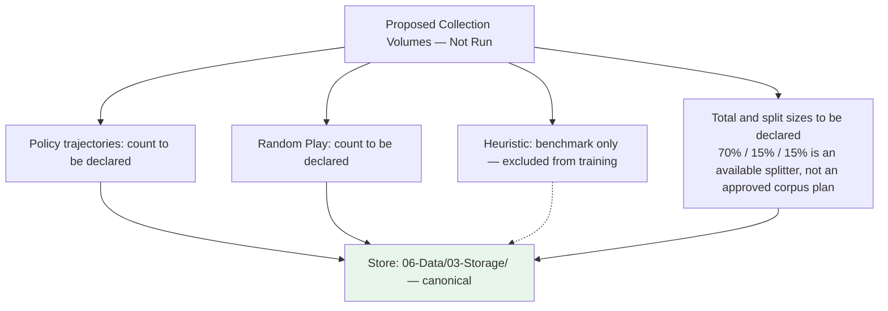

# Plan 01 — Data Collection Strategy: the repository status is explicit and evidence based

> **Status: PARTIAL (2026-09-27).** Checkpointed random-play collection and rollout relabeling exist; self-play, canonical corpus, post-split relabeling, and cache remain pending.

**Goal:** State the current implementation and evidence boundary for data collection strategy.
**Builds on:** [00](../../00-scope-and-traceability.md) — the project is supervised 4×4 2048 policy learning, and framework evaluation is a separate research track.

---

## Decision and evidence

**This plan treats the random collection path as implemented with corpus and protocol gaps.** The CLI records random trajectories, relabels each state using seeded rollouts, and writes checkpointed CSV, metadata, and manifest. There is no separate configurable self-play source or persistent label cache; relabeling currently occurs before any train/test split.

## 1. Purpose

Define the strategy for collecting training data for the 2048 game machine learning model.

## 2. Data Sources

Two proposed supervised sources (no HumanPlay — out of scope) would feed the canonical dataset. The heuristic agent is benchmark-only; no fixed corpus split is approved:

| Source | Plan file | Proposed target | Current status |
|--------|------|-------|------|
| Policy trajectories | `02-self-play-data.md` | To be declared | No dedicated collector/corpus yet |
| Random play | `03-random-play-data.md` | To be declared | Collector implemented; proposed corpus not collected |
| Heuristic play | Benchmark-only | 0 training games | Separate rule-based baseline |

The implemented random source produces `(state_features[17], action: u8)` rows after `RolloutLabeler` relabeling (default 100 simulations per valid action). Self-play generation is not implemented. Tile spawn is stochastic 90% `2` / 10% `4` per move.

## 3. Collection Pipeline

Configure → collect seeded random trajectories → rollout-relabel actions → checkpoint CSV and metadata parts → assemble, validate, and write manifest. The collector does not currently split first or cache labels.

## 4. Collection Volume



> Corpus sizes and split protocol are not approved. Preserve whole-game grouping and record seeds, source type, configurations, and manifests for any collected data.

## 5. Empirical Score Evaluation — No Theoretical Limit Claim

The project does not estimate a theoretical maximum score. For a declared case-study protocol, report the observed game-score distribution, uncertainty, seeds, and simulator configuration. A largest observed score is a sample maximum, not a theoretical ceiling. Rank policies by held-out mean score only when the predeclared comparison protocol and adequate evaluation corpus are available.

## 6. Data Quality Checks

- Completeness: all 17+action columns present, `NF==18`, no NaN/Inf.
- Consistency: `game_id` groups intact for `GroupKFold`.
- Validity: `action` ∈ {0,1,2,3} and in `valid_moves`; header regex `grid_0..score_normalized,action`.
- Class distribution: retain observed frequencies and report them; do not rebalance without a separate protocol.

## 7. Data Pipeline Definition

This section defines exactly how a game play is converted to CSV rows for training.

### 8.1 Sample Generation — Supervised Classification Only

A game with **N moves** produces **N training samples**. Each sample is a supervised row:

```
(state_features[17], action: u8, score: u64 /* metadata only */)
```

| Component | Type | Size | Role | Description |
|-----------|------|------|------|-------------|
| `state_features` | array | 17 | `X` | Board state feature vector at turn t (17-dim) |
| `action` | u8 | 1 | `y` (ONLY label) | Direction taken at turn t (0=Up, 1=Down, 2=Left, 3=Right) — `TaskType::MultiClassification` |
| `score` | u64 | 1 | metadata only | Game score at this state — for analysis/benchmarking, never as `y` |

> **No `reward` column.** `reward` / `next_state` / `done` are RL constructs and are not used. DataFrame row is `state_features: [f64;17], action: u8, score: u64 (metadata)`.

### 8.2 State-to-Feature Mapping

The board state at turn t is encoded into 17 values: row-major cells 0–15,
each divided by 32768, followed by `log10(score+1)/6` at index 16. Values are
finite and nonnegative; values above one are accepted. Derived heuristic
measurements are not appended to the canonical model input.

### 8.3 Action Label Generation (Rollout-Based)

The action taken at turn t by the agent is NOT the training label. **There is no ground truth "optimal action" for any board state.** We use **rollout-based heuristic labeling**:

1. For each board state, evaluate all valid actions
2. For each action, simulate 100 seeded random continuations, capped by the configured move limit
3. Derive each rollout seed with wrapping additions: `base_seed + game_id * 1_000_000 + move_idx * 1_000 + action_id + rollout_id * 4`
4. The action with the highest average final score becomes the label; ties follow the fixed `Direction::ALL` order

The design proposal calls for labels after game-level train/validation/test assignment and a cache keyed by `(dataset_version, game_id, move_idx, base_seed)`. Current collection relabels before splitting and has no persistent cache. A future implementation should report total states, rollouts, wall time, and cache behavior.

```rust
pub struct RolloutLabeler {
    simulator: GameSimulator,
    n_rollouts: usize,  // 100
}

impl RolloutLabeler {
    /// Returns (best_action, expected_score) for a given board state
    pub fn label(&self, board: &Board) -> (u8, f64) {
        let valid = board.get_valid_moves();
        let mut best_action = valid[0];
        let mut best_score = 0.0f64;
        
        for &action in &valid {
            let mut total_score = 0.0;
            for _ in 0..self.n_rollouts {
                let result = self.simulator.simulate_from(board, action);
                total_score += result.final_score as f64;
            }
            let avg_score = total_score / self.n_rollouts as f64;
            if avg_score > best_score {
                best_score = avg_score;
                best_action = action;
            }
        }
        
        (best_action, best_score)
    }
}
```

**Why this matters**: The original agent's action at turn t was chosen by a random or heuristic agent, not by an oracle. Without rollout-based relabeling, the model learns to mimic suboptimal behavior. The rollout label is a stochastic heuristic target; it is not proven optimal play.

### 8.4 Action as Target Label (After Relabeling)

The relabeled action becomes the **target label** for supervised training:
- `0` = move up (highest rollout score)
- `1` = move down (highest rollout score)
- `2` = move left (highest rollout score)
- `3` = move right (highest rollout score)

### 8.5 Self-Play Data: Label Regeneration Required

Self-play data (02-self-play-data.md) generates `(state, action)` pairs where the action is determined by the agent's current policy. These actions are **NOT** optimal labels. All self-play data must undergo **Section 7.3 rollout relabeling** before use in training. The original agent action is discarded.

### 8.6 Score Metadata (Not a Reward Signal)

> **No `reward` / RL signal.** The supervised label is `action`. Score is stored only as metadata for analysis.

- **Score metadata**: `score: u64` — current cumulative game score at this state; `score_normalized = log10(score+1)/6.0` is feature index 16
- **Not a target**: Do not train to predict `score`; do not use `score delta`, `final score`, or `reward` as `y`
- **Invalid move handling**: Invalid moves (no board change) are **masked out** before `argmax`; they are never valid labels and never produce a sample — no `-10.0` penalty column

### 8.7 Concrete Example — Supervised Row

A game with **100 moves** produces **100 training samples** (classification rows). CSV is **17 feature columns + 1 action label = 18 columns total** (`grid_0..score_normalized,action`); `score` is optional metadata, not a training column:

```csv
grid_0,grid_1,grid_2,grid_3,grid_4,grid_5,grid_6,grid_7,grid_8,grid_9,grid_10,grid_11,grid_12,grid_13,grid_14,grid_15,score_normalized,action
0.0,0.000061,0.000122,0.000244,0.0,0.0,0.0,0.0,0.0,0.0,0.0,0.0,0.0,0.0,0.0,0.0,0.050172,2
0.0,0.000061,0.000122,0.000244,0.0,0.0,0.0,0.0,0.0,0.0,0.0,0.0,0.0,0.0,0.0,0.0,0.050172,0
```

> `score` (u64) is optional metadata for analysis only — not in training CSV. If stored, add as trailing `,score` column (e.g. `,124`) but never as `y`. No `reward` column.

Example row breakdown:
- `grid_0..score_normalized` (17 dims): The feature vector at turn t — indices 0–15 `grid_0..grid_15`, 16 `score_normalized` (parseable: exactly 18 comma-separated values per row: 17 floats + 1 u8 action)
- `action: 2`: The action with the highest rollout score (NOT necessarily the original agent action) — the ONLY label (`u8` 0–3)
- `score: 124` (if present as trailing metadata): Cumulative game score **metadata** for analysis only (never as `y`)

Verification: `validate_csv` checks the exact 18-column v2 header and every row.

### 8.8 Train/Validation/Test Split by Chronological Game ID (No Shuffle)

Because game data is sequential (each game is a correlated trajectory), standard random splitting would cause data leakage. The split is done **by `game_id` with `shuffle=false` and chronological ordering — grouped by `game_id`, no shuffle, no stratification across time**:

| Split | Percentage | Method | Example only |
|-------|-----------|--------|---------------------|
| **Train** | 70% | First 70% of games in collection order, kept intact by `game_id` | Count depends on declared corpus |
| **Validation** | 15% | Next 15% of games in collection order | Count depends on declared corpus |
| **Test** | 15% | Final 15% of games in collection order | Count depends on declared corpus |

Rules:
- **Entire games** go to one split — never split a single game across splits. Use the chronological holdout splitter; AutoML's `GroupKFold` is not chronological.
- **No shuffle** (`shuffle=false`). Games are assigned by collection order: first 70% → train, next 15% → validation, final 15% → test. Collection order is not calendar time; the purpose is to reserve disjoint later-collected game IDs for evaluation.
- **No stratification across time.** Do not rebalance splits by score or any other label across time; chronological order is preserved. Stratification across the time axis would leak future distribution into train.
- Each split respects collection order; do not describe this as chronological time-series validation for independently seeded games.
- No game appears in more than one split.
- Within the training partition, `GroupKFold` may be used for model selection because game trajectories are the grouping unit; its folds are group-disjoint but not time-ordered.
- The split ensures the model is evaluated on game trajectories it has never seen during training and that have later collection IDs.
- **Volumes are configurable** — choose corpus and split sizes after declaring the study design and compute budget; no target is currently approved or generated.

### 8.9 CSV File Format — Classification Only

All training data is stored as CSV files with the following schema (**17 feature columns + `action` label = 18 columns total**, `grid_0..score_normalized,action`; `score` is optional metadata):

```
columns: grid_0,grid_1,grid_2,grid_3,grid_4,grid_5,grid_6,grid_7,grid_8,grid_9,grid_10,grid_11,grid_12,grid_13,grid_14,grid_15,score_normalized,action:u8
# canonical header (17+1): grid_0,grid_1,grid_2,grid_3,grid_4,grid_5,grid_6,grid_7,grid_8,grid_9,grid_10,grid_11,grid_12,grid_13,grid_14,grid_15,score_normalized,action
# optional metadata column: score (u64) — for analysis only, never as `y`; no `reward` column
encoding: UTF-8
delimiter: comma
header: yes
```

Files are stored per storage spec in `06-Data/03-Storage/` (canonical) or `data/`:
- `06-Data/03-Storage/self_play.csv` (or `data/self_play.csv`)
- `06-Data/03-Storage/random_play.csv` (or `data/random_play.csv`)
- `06-Data/03-Storage/heuristic_play.csv` (or `data/heuristic_play.csv`)
> Previous paths `06-Data/01-Collection/*.csv` were inconsistent with `06-Data/03-Storage/01-dataset-storage.md`; storage location is `06-Data/03-Storage/` (see `06-Data/03-Storage/01-dataset-storage.md`).

## 8. Data Collection Files Location

Files in `06-Data/01-Collection/`: `01-data-collection-strategy.md` (this hub), `02-self-play-data.md`, `03-random-play-data.md`.

## 9. Next Steps

1. Collect self-play data
2. Collect random play data
3. Validate and store collected data

## Implementation Record

- Random trajectories are rollout-relabeled through a seeded, fixed-thread, checkpointed command. It writes validated training CSV, aligned provenance sidecar, and hash-bearing manifest.
- The proposed 15k single-policy plus 5k random corpus, post-split label cache, and class/action distribution report have not been produced. The collector labels before splitting and has no persistent cache. This affects the evaluation/data protocol and must be decided before calling a generated corpus canonical.

---

## Verification (definition of done)

1. `test -f plans/06-Data/01-Collection/01-data-collection-strategy.md` exits 0.
2. `grep -q '^# Plan 01 — ' plans/06-Data/01-Collection/01-data-collection-strategy.md` exits 0.
3. `grep -q '^> \\*\\*Status:' plans/06-Data/01-Collection/01-data-collection-strategy.md` exits 0.
4. `grep -q '^\*\*Goal:' plans/06-Data/01-Collection/01-data-collection-strategy.md` exits 0.
5. `grep -q '^## Decision and evidence$' plans/06-Data/01-Collection/01-data-collection-strategy.md` exits 0.
6. `grep -q '^## Open questions$' plans/06-Data/01-Collection/01-data-collection-strategy.md` exits 0.
7. `grep -q '^## Later$' plans/06-Data/01-Collection/01-data-collection-strategy.md` exits 0.
8. `bash /Users/evintleovonzko/Documents/works/kolosal/planout2/v2-ai-express/.claude/skills/writing-planout-plans/check-plan.sh plans/06-Data/01-Collection/01-data-collection-strategy.md` exits 0.

## Open questions

- The 20k rollout-labeled corpus is unrun. The retained two-game pilot projects roughly 228 hours by linear extrapolation, with high uncertainty; a larger pilot and declared budget are required. Checkpoint/resume support exists. Resolve whether labeling must follow the train/test split before describing a canonical run.

## Later

- **Complete the remaining research or implementation work recorded above.** It stays deferred until its prerequisites, compute budget, and measurable acceptance evidence are available.
