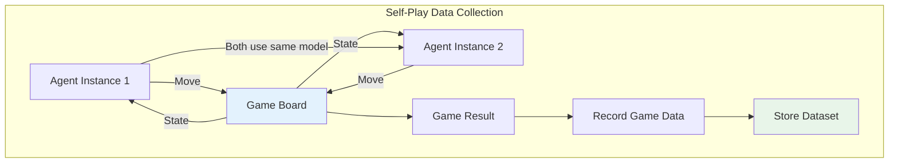
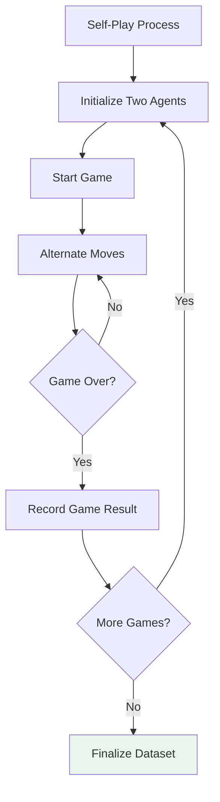
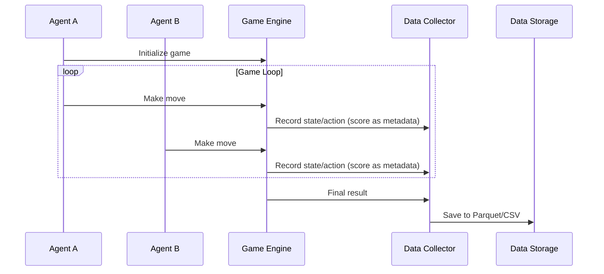
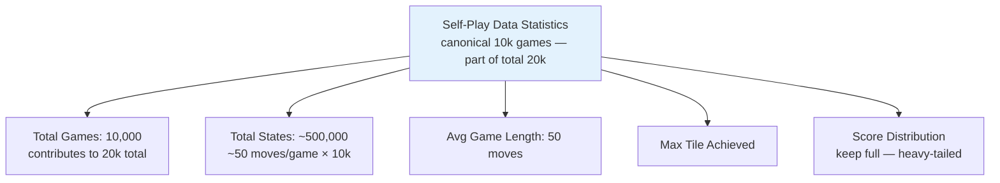
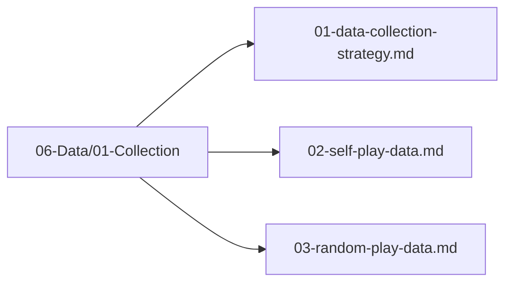

# Self-Play Data

## 1. Purpose

Collect training data from self-play games where the AI agent plays against itself, generating high-quality game sequences.

## 2. Self-Play Overview

Self-play is the primary method for generating training data, as it produces games where the agent learns from its own experience.



## 3. Self-Play Process



## 4. Data Generation — Supervised Classification Row Only

```mermaid
flowchart TD
    subgraph "Data Per Game — Classification"
        State[Board State at Each Turn<br/>→ 27-dim features (X)]
        Action[Action Taken<br/>→ label 0..3 (y)]
        ScoreMeta[Score After Move<br/>→ metadata only]
    end

    State --> Sample[Training Sample<br/>state_features: [f64;27], action: u8]
    Action --> Sample
    ScoreMeta -.->|metadata| Sample

    Sample --> Dataset[Training Dataset<br/>TaskType::MultiClassification]

    style Sample fill:#fff3e0
    style Dataset fill:#e3f2fd
```

> **No `NextState` / `Done` / `Reward`.** Those are RL tuple fields and are not used. Stored score, if any, is `score: u64` metadata for analysis only.

## 5. Self-Play Configuration

```rust
pub struct SelfPlayConfig {
    pub n_games: usize,              // Number of self-play games — canonical 10,000 (part of total 20k; configurable)
    pub agent1: AgentType,           // First agent type
    pub agent2: AgentType,           // Second agent type
    pub save_interval: usize,        // Save every N games
    pub output_path: String,         // Output path: 06-Data/03-Storage/ (canonical; or data/)
    pub seed: u64,                   // Random seed
}
```

> **Canonical volumes (configurable):** Self-play **10,000 games** is the canonical contribution to the total **20,000 games** (10k self + 5k random + 5k heuristic → 14k train / 3k val / 3k test via chronological 70/15/15 `GroupKFold` `shuffle=false`). See `01-data-collection-strategy.md` §5. `n_games` is configurable but preserve proportions.

## 6. Self-Play Data Flow



## 7. Data Statistics (Canonical — Configurable)



> Canonical: 10k self-play games → ~500k states (50 avg). Part of total 20k (14k train / 3k val / 3k test after 70/15/15 chronological split). Configurable — adjust `n_games` but keep 70/15/15 chronological `GroupKFold` (`shuffle=false`).

## 7. Label Regeneration (REQUIRED)

Self-play data is useful for **state coverage** but NOT for labels. The actions taken by self-play agents are determined by the agent's current policy — they are NOT optimal labels.

**All self-play data MUST be relabeled via rollout-based labeling** (see `06-Data/01-Collection/01-data-collection-strategy.md` Section 7.3) before training.

The original agent action is discarded. The rollout label (action with highest average score over 100 random simulations) becomes the training target.

## 8. Self-Play Data Files Location



## 9. Next Steps

1. Configure self-play simulation
2. Run self-play games
3. Collect and store game data
