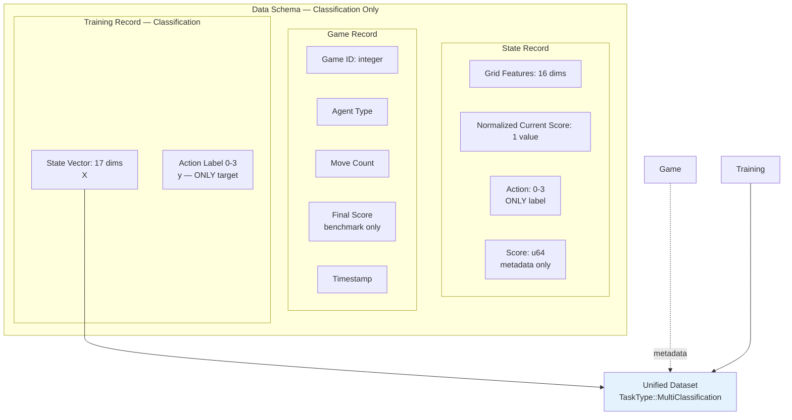
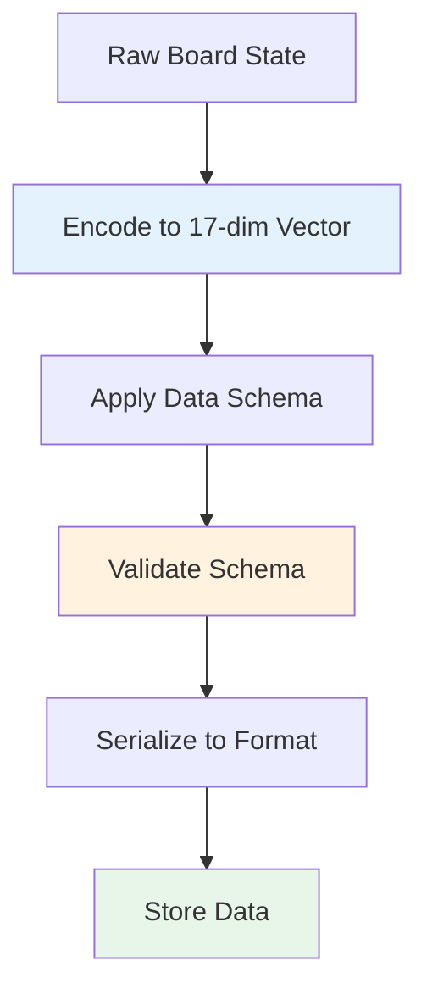
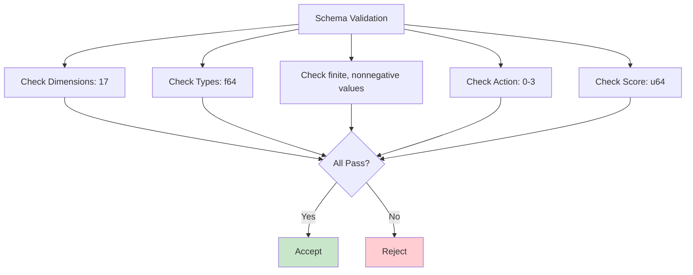
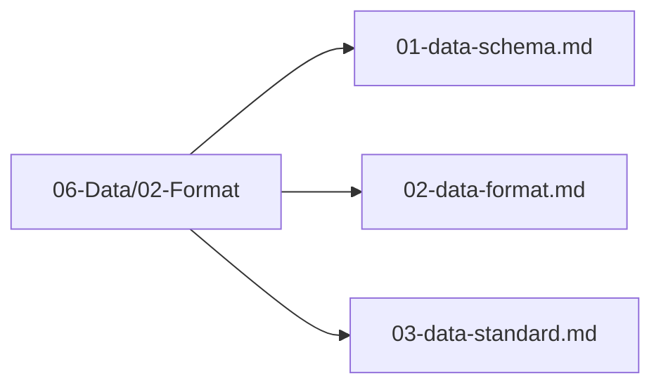

# Plan 01 — Data Schema: the repository status is explicit and evidence based

> **Status: PARTIAL (2026-09-27).** Versioned CSV columns and sidecar are validated; Parquet is unsupported.

**Goal:** State the current implementation and evidence boundary for data schema.
**Builds on:** [00](../../00-scope-and-traceability.md) — the project is supervised 4×4 2048 policy learning, and framework evaluation is a separate research track.

---

## Decision and evidence

**The v2 CSV schema is implemented.** The training CSV has 17 features and integer `action`; game/move/raw-score provenance is written to an aligned sidecar. Validation checks the exact header, width, finite/nonnegative features, and action range. Values above one are valid. Parquet is unsupported.

## 1. Purpose

Define the data schema for all training and evaluation data used in the 2048 game machine learning pipeline.

## 2. Data Schema Overview

The data schema defines the structure of all data records, ensuring consistency across the pipeline.



## 3. State Feature Schema

The model state has 17 values: row-major grid cells at indices 0–15,
divided by 32768, and `score_normalized` at index 16, encoded as
`log10(score+1)/6`. Finite, nonnegative values above one are valid.

## 4. Schema Definition

```rust
pub struct TrainingSample {
    pub state_features: [f64; 17],
    pub action: u8, // 0–3 classification label; only target
    // raw score, game ID, and move index are stored in aligned metadata
}
```

Move count and game history are not model inputs. Raw score is provenance; its
normalized current value is already feature index 16. No reward, next-state,
or done columns are part of the supervised schema.

## 5. Data Format Flow



## 6. Schema Validation



## 7. Schema Files Location

All data schema files are in `06-Data/02-Format/`:



## 8. CSV Schema for AutoML — 17 features + action

> **Training CSV is exactly 18 columns:** `grid_0..grid_15,score_normalized,action`. Raw score and provenance are stored in a separate aligned sidecar, never appended to training data. No `done`, `reward`, or `next_state` columns.

The automl framework consumes data in CSV format. The following defines the exact schema expected.

### 8.1 Column Definitions

| Column Name | Data Type | Description |
|-------------|-----------|-------------|
| `grid_0` | `f64` | Tile value at grid position (0,0) |
| `grid_1` | `f64` | Tile value at grid position (0,1) |
| `grid_2` | `f64` | Tile value at grid position (0,2) |
| `grid_3` | `f64` | Tile value at grid position (0,3) |
| `grid_4` | `f64` | Tile value at grid position (1,0) |
| `grid_5` | `f64` | Tile value at grid position (1,1) |
| `grid_6` | `f64` | Tile value at grid position (1,2) |
| `grid_7` | `f64` | Tile value at grid position (1,3) |
| `grid_8` | `f64` | Tile value at grid position (2,0) |
| `grid_9` | `f64` | Tile value at grid position (2,1) |
| `grid_10` | `f64` | Tile value at grid position (2,2) |
| `grid_11` | `f64` | Tile value at grid position (2,3) |
| `grid_12` | `f64` | Tile value at grid position (3,0) |
| `grid_13` | `f64` | Tile value at grid position (3,1) |
| `grid_14` | `f64` | Tile value at grid position (3,2) |
| `grid_15` | `f64` | Tile value at grid position (3,3) |
| `score_normalized` | `f64` | `log10(score+1)/6.0`; finite and non-negative, not globally capped at 1 |
| `action` | `u8` | Target label: 0=Up, 1=Down, 2=Left, 3=Right |

### 8.2 Data Formats

Supported formats for training data:
- **CSV** (`.csv`) — Primary format for automl ingestion
- Parquet — not implemented in the root data pipeline

### 8.3 Example Row

CSV has **17 feature columns + 1 action label = 18 columns total**:

```csv
grid_0,grid_1,grid_2,grid_3,grid_4,grid_5,grid_6,grid_7,grid_8,grid_9,grid_10,grid_11,grid_12,grid_13,grid_14,grid_15,score_normalized,action
0.0,0.000061,0.000122,0.000244,0.0,0.0,0.0,0.0,0.0,0.0,0.0,0.0,0.0,0.0,0.0,0.0,0.050172,2
```

### 8.4 Game State to CSV Row Mapping

Each CSV row represents a single **state-action pair** extracted from a game trajectory:

1. A game is played from start to finish (or until a terminal state).
2. At each step, the current board state is captured as the 17-dimensional feature vector.
3. The action taken at that step is recorded as the target label (`action` column).
4. The resulting row is added to the training dataset.
5. Multiple games are concatenated into a single CSV file.
6. Rows are stored as a flat table; game and move identifiers remain aligned in the sidecar for group splits and provenance.

```
Game 1:
  State(step 0) + Action(up)     → Row 1
  State(step 1) + Action(right)  → Row 2
  State(step 2) + Action(down)   → Row 3
  ...
Game 2:
  State(step 0) + Action(left)   → Row N
  ...
```

### 8.5 Data Type Summary

- All `grid_*` features: `f64` (tile values as f64, 0.0 for empty cells)
- `score_normalized`: `f64`, `log10(score+1)/6` at index 16
- `action` target: `u8` (integer class label: 0, 1, 2, or 3)
- CSV delimiter: `,` (comma)
- Header row: present (column names as defined above)
- Missing values: none expected; all features are deterministically computed from board state

## 9. Next Steps

1. Implement schema validation
2. Apply schema to all data pipelines
3. Generate training CSV from game replay data

## Implementation Record

- Exact 17-feature plus integer-action CSV schema is implemented, with separate score/game/move metadata. Validation rejects wrong header/width, non-finite or negative features, and invalid action IDs.
- Parquet is not implemented. CSV labels are not rechecked for legality against source boards because boards are not in the canonical training table. Features above one are accepted when tiles exceed 32768 or scores exceed 1,000,000.

---

## Verification (definition of done)

1. `test -f plans/06-Data/02-Format/01-data-schema.md` exits 0.
2. `grep -q '^# Plan 01 — ' plans/06-Data/02-Format/01-data-schema.md` exits 0.
3. `grep -q '^> \\*\\*Status:' plans/06-Data/02-Format/01-data-schema.md` exits 0.
4. `grep -q '^\*\*Goal:' plans/06-Data/02-Format/01-data-schema.md` exits 0.
5. `grep -q '^## Decision and evidence$' plans/06-Data/02-Format/01-data-schema.md` exits 0.
6. `grep -q '^## Open questions$' plans/06-Data/02-Format/01-data-schema.md` exits 0.
7. `grep -q '^## Later$' plans/06-Data/02-Format/01-data-schema.md` exits 0.
8. `bash /Users/evintleovonzko/Documents/works/kolosal/planout2/v2-ai-express/.claude/skills/writing-planout-plans/check-plan.sh plans/06-Data/02-Format/01-data-schema.md` exits 0.

## Open questions

- If action legality must be revalidated during ingestion, add a board-bearing audit format separately from canonical training features.

## Later

- **Complete the remaining research or implementation work recorded above.** It stays deferred until its prerequisites, compute budget, and measurable acceptance evidence are available.
