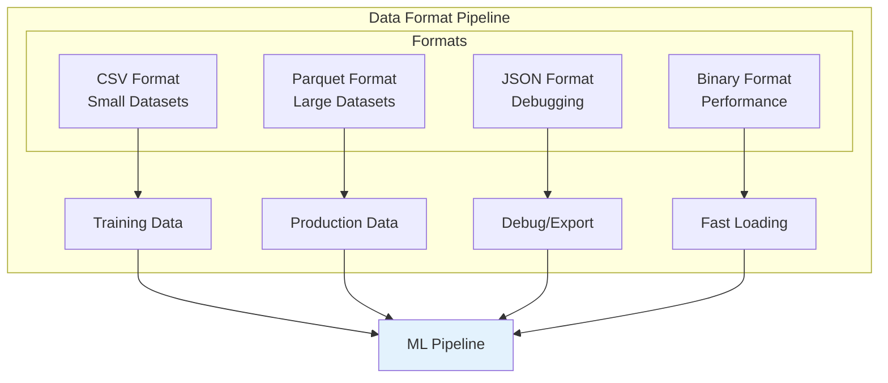
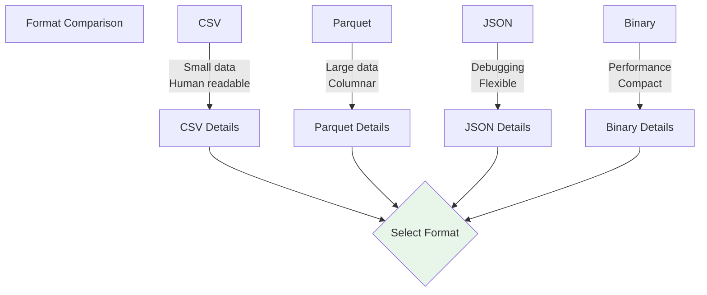
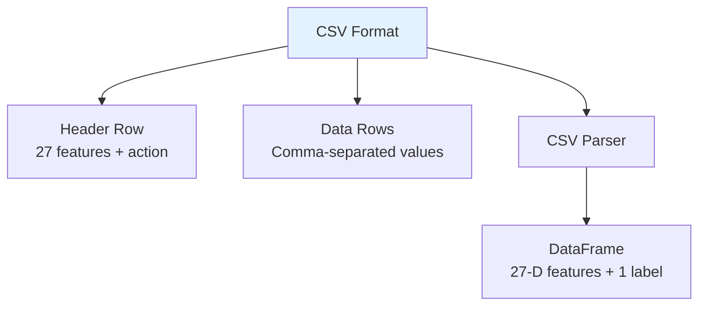
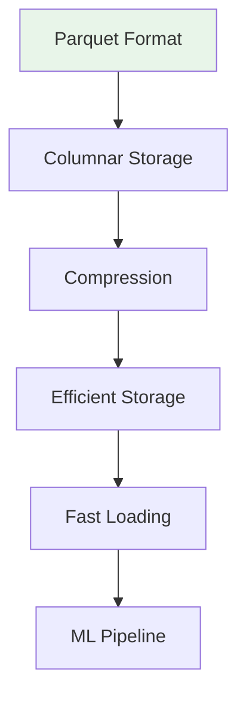
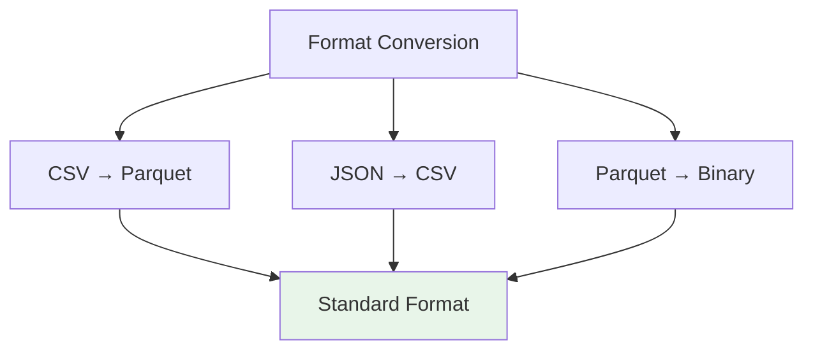
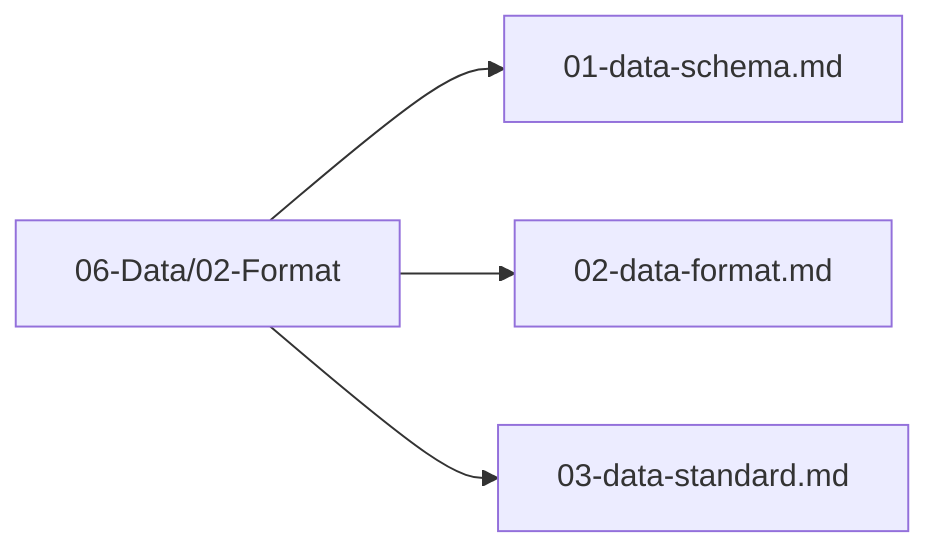

# Data Format

## 1. Purpose

Define the data formats used for storing and exchanging 2048 game training data.

## 2. Data Format Overview

Multiple data formats are supported for different stages of the ML pipeline.



## 3. Format Comparison



## 4. CSV Format



### CSV Structure

Canonical training CSV is **27 feature columns + 1 action label = 28 columns total**. Score is **not** a training label — it is stored separately only for analysis.

```
# Header (27 features + action)
grid_0,grid_1,grid_2,grid_3,grid_4,grid_5,grid_6,grid_7,grid_8,grid_9,grid_10,grid_11,grid_12,grid_13,grid_14,grid_15,empty_count,max_tile_log,monotonicity,smoothness,merges_available,score_normalized,adjacency_merge_score,corner_max,edge_tiles_occupied,col_worst,row_worst,action
# Example row (16 grid normalized + 11 derived normalized + action)
0.0,0.00006,0.00012,0.00024,0.0,0.0,0.0,0.0,0.0,0.0,0.0,0.0,0.0,0.0,0.0,0.0,0.875,0.2,0.85,0.72,0.125,0.15,0.03,0.06,0.5,0.02,0.03,2
# Optional separate analysis file may include raw score column, but it is NOT the classification label
```

## 5. Parquet Format



### Parquet Schema

```rust
use polars::prelude::*;

/// Create DataFrame for classification training: 27-D feature table + action labels.
/// Scores are NOT mixed into the feature/label table — they are for analysis only.
fn create_dataframe(states: &[[f64; 27]], actions: &[u8]) -> DataFrame {
    // States: N × 27 canonical features (grid_0..row_worst)
    // Labels: N action classes (0=Up,1=Down,2=Left,3=Right)
    // Optional: store raw scores separately for analysis (e.g., `scores: &[u64]` as metadata, not as feature/label)
    // Stored in 06-Data/03-Storage/
    todo!()
}

/// Optional helper to store scores for analysis (not used as training label)
fn create_score_metadata(scores: &[u64]) -> Series {
    Series::new("score_raw".into(), scores)
}
```

## 6. JSON Format

```mermaid
flowchart TD
    JSON[JSON Format]
    JSON --> State[State Object]
    JSON --> Action[Action Value]
    JSON --> Score[Score Value]
    JSON --> Metadata[Metadata]
    
    State --> Grid[Grid: [u32; 16]]
    State --> Features[Derived Features]
    
    style JSON fill:#fff3e0
```

### JSON Structure

```json
{
    "state": {
        "grid": [2, 4, 8, 16, 32, 64, 128, 256, 512, 1024, 2048, 0, 0, 0, 0, 0],
        "score": 4092,
        "empty_count": 5,
        "max_tile_log": 11.0,
        "monotonicity": 0.8
    },
    "action": 1,
    "score": 2048,
    "game_over": false
}
```

## 7. Format Conversion Pipeline



## 8. Format Files Location

All data format files are in `06-Data/02-Format/`:



## 9. Next Steps

1. Select appropriate format for each pipeline stage
2. Implement format converters
