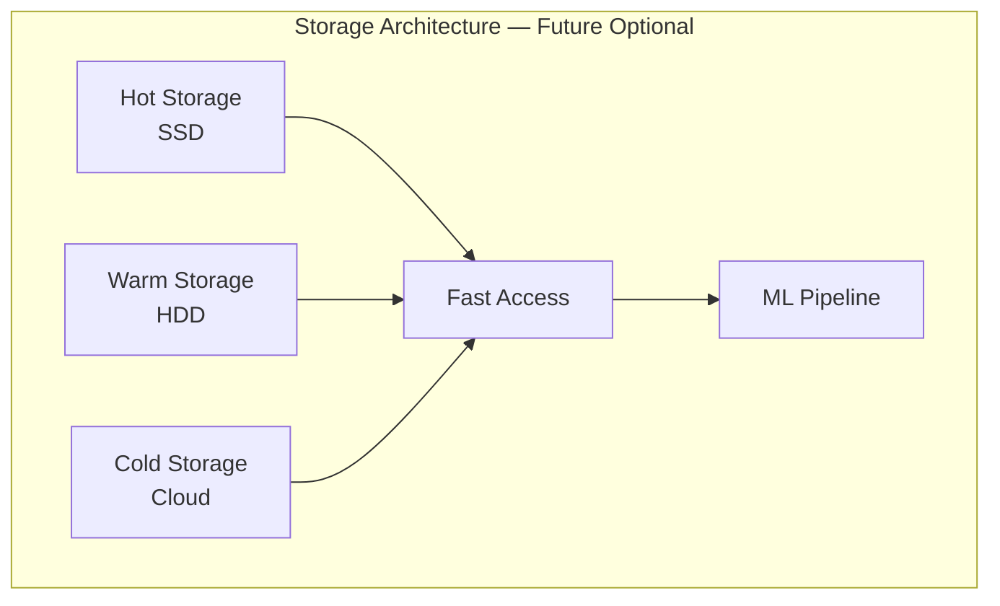
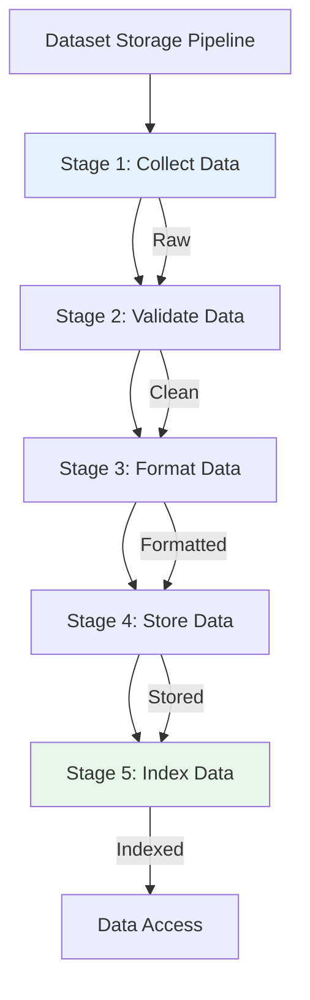
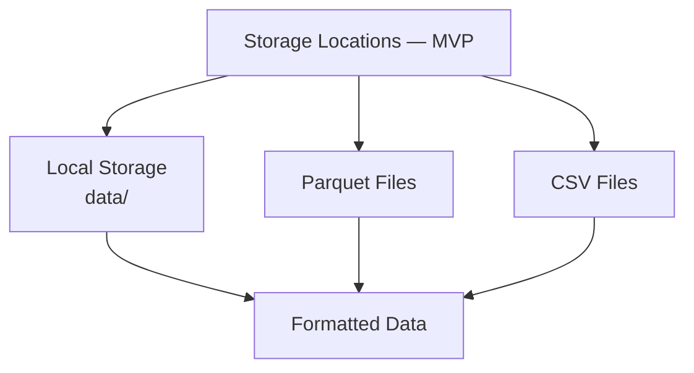
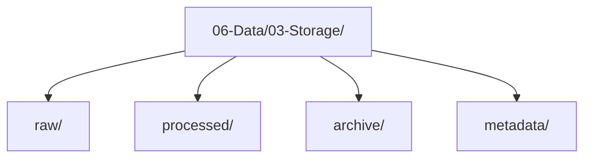
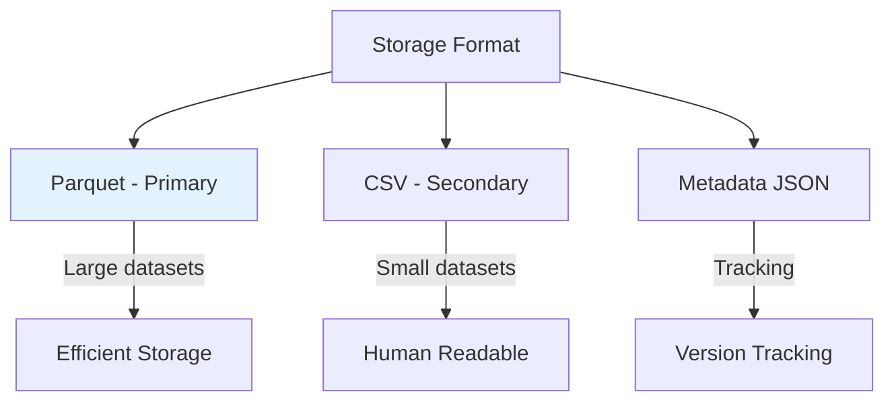
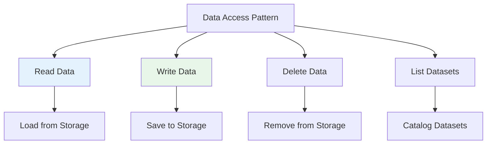
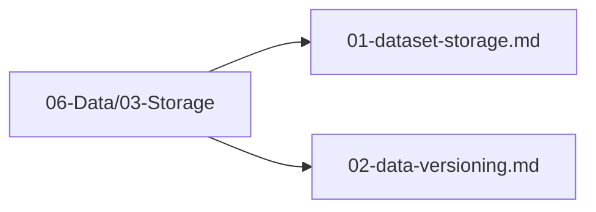

# Plan 01 — Dataset Storage: the repository status is explicit and evidence based

> **Status: PLANNED.** Not yet restarted in strict sequence.

**Goal:** State the current implementation and evidence boundary for dataset storage.
**Builds on:** [00](../../00-scope-and-traceability.md) — the project is supervised 4×4 2048 policy learning, and framework evaluation is a separate research track.

---

## Decision and evidence

**This plan treats its subject as partial or pending work, not as a research finding.** The rejected alternative is to infer completion from a plan title or related code alone. The ledger records this disposition: Not yet restarted in strict sequence.

## 1. Purpose

Define the storage strategy for 2048 game training datasets, ensuring efficient and reliable data persistence.

## 2. Storage Overview — MVP Local Only

> **MVP: Simple local `data/raw, data/processed, data/results` — no tiered storage.** Hot/Warm/Cold (SSD/HDD/Cloud) is over-engineering for <5GB; future optional only.

Datasets are stored locally for MVP:

```
data/
├── raw/        # Raw game logs
├── processed/  # Cleaned CSV/Parquet for training
└── results/    # Model outputs / benchmarks
```

<details><summary>Future optional tiered storage (out of scope for MVP, <5GB)</summary>


</details>

## 3. Storage Pipeline



## 4. Storage Locations — MVP Local Only

> **MVP: local `data/` only.** Parquet/CSV both acceptable; cache layer is future optional.



### 4.1 Local Storage Structure — MVP

> **MVP: `data/raw, data/processed, data/results` local.** No archive/metadata tiering for <5GB.

```
data/
├── raw/        # *.parquet / *.csv raw logs
├── processed/  # *.parquet cleaned (MVP)
└── results/    # benchmarks / reports
```

<details><summary>Future optional structure (out of scope)</summary>


</details>

## 5. Data Storage Format



## 6. Storage Configuration

Canonical path is `06-Data/03-Storage/` with `data/` as symlink for runtime. No dual-source confusion.

```rust
use std::path::PathBuf;
pub struct DatasetStorageConfig {
    pub storage_path: PathBuf, // canonical: "06-Data/03-Storage/" (symlinked as data/)
}
```

> Deleted `partition_by`/`cache_size`/`compression` — over-engineering for <5GB. MVP is `data/raw, data/processed, data/results` local only.

## 7. Data Access Pattern



## 8. Storage Files Location

All dataset storage files are in `06-Data/03-Storage/`:



## 9. Next Steps

The local CSV MVP is implemented: `data-collector collect` writes training rows, row-aligned metadata CSV, and a JSON manifest; `split` emits grouped chronological partitions; validation checks the exact model schema. Dataset manifests include row counts, source revision, and CSV SHA-256. Parquet support, a catalog/index layer, and a dataset cache are not implemented and remain optional until measured dataset size justifies them.

## Implementation Record

- Local collection uses a caller-selected path (default `data/raw/random_play.csv`); metadata and JSON manifest are emitted alongside. `split` writes chronological game-level CSV partitions. No storage catalog, managed index, or Parquet writer exists.

---

## Verification (definition of done)

1. `test -f plans/06-Data/03-Storage/01-dataset-storage.md` exits 0.
2. `grep -q '^# Plan 01 — ' plans/06-Data/03-Storage/01-dataset-storage.md` exits 0.
3. `grep -q '^> \\*\\*Status:' plans/06-Data/03-Storage/01-dataset-storage.md` exits 0.
4. `grep -q '^\*\*Goal:' plans/06-Data/03-Storage/01-dataset-storage.md` exits 0.
5. `grep -q '^## Decision and evidence$' plans/06-Data/03-Storage/01-dataset-storage.md` exits 0.
6. `grep -q '^## Open questions$' plans/06-Data/03-Storage/01-dataset-storage.md` exits 0.
7. `grep -q '^## Later$' plans/06-Data/03-Storage/01-dataset-storage.md` exits 0.
8. `bash /Users/evintleovonzko/Documents/works/kolosal/planout2/v2-ai-express/.claude/skills/writing-planout-plans/check-plan.sh plans/06-Data/03-Storage/01-dataset-storage.md` exits 0.

## Open questions

- **The plan-scale evidence remains bounded by current results.** Not yet restarted in strict sequence. Any larger corpus or external benchmark needs a declared resource budget and retained artifacts.

## Later

- **Complete the remaining research or implementation work recorded above.** It stays deferred until its prerequisites, compute budget, and measurable acceptance evidence are available.
