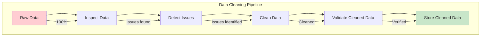
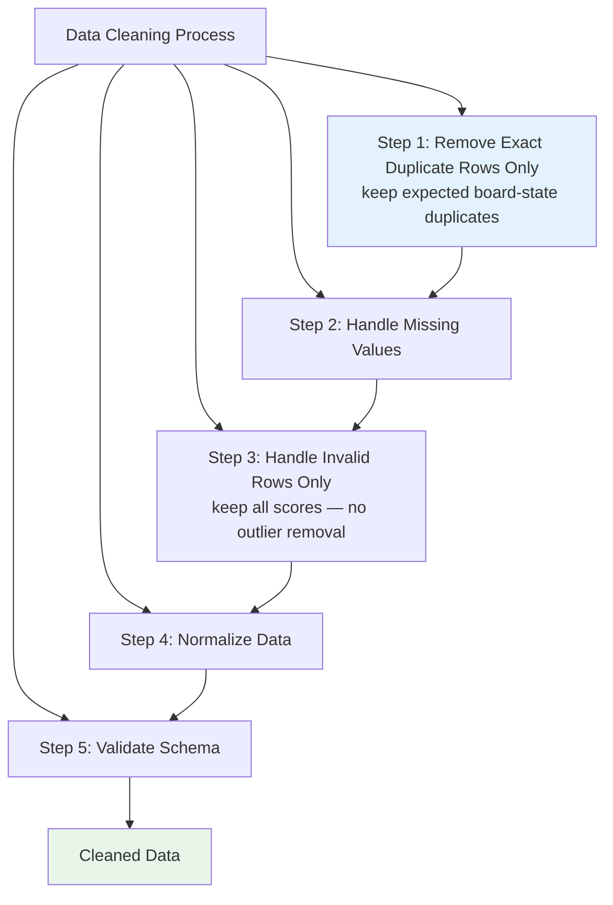
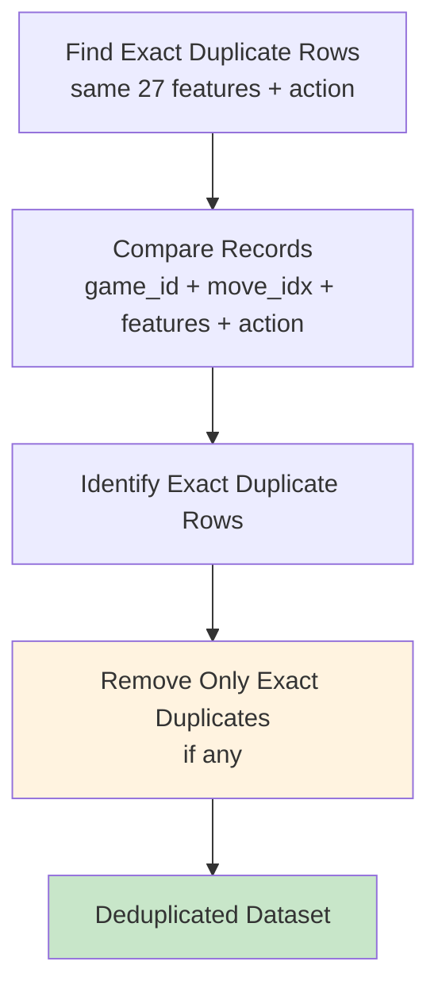
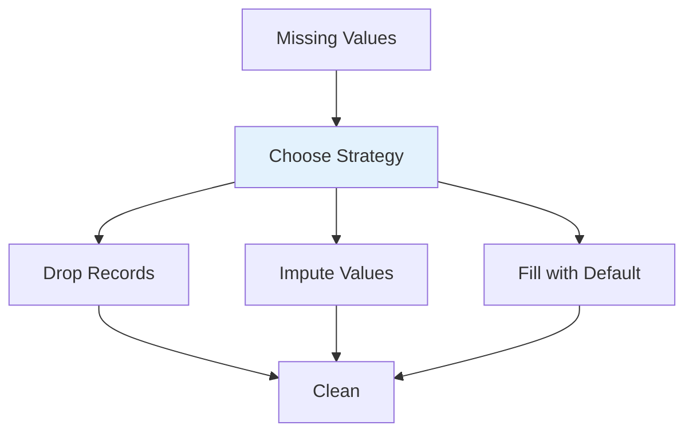
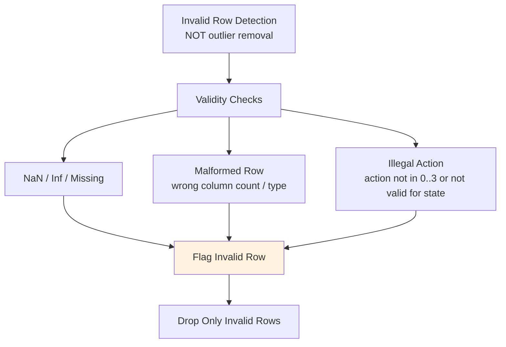
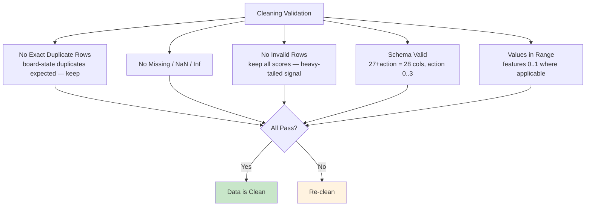
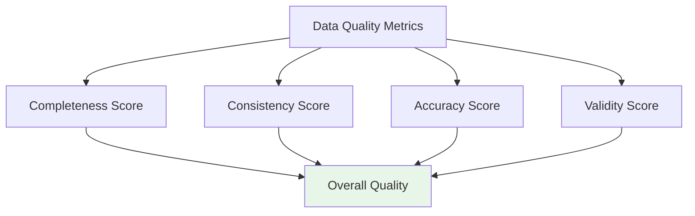
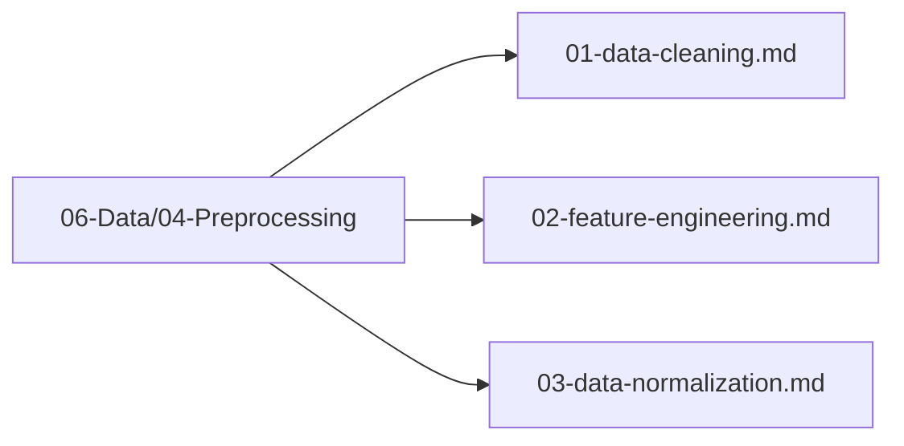

# Plan 01 — Data Cleaning: the repository status is explicit and evidence based

> **Status: PLANNED.** Not yet restarted in strict sequence.

**Goal:** State the current implementation and evidence boundary for data cleaning.
**Builds on:** [00](../../00-scope-and-traceability.md) — the project is supervised 4×4 2048 policy learning, and framework evaluation is a separate research track.

---

## Decision and evidence

**This plan treats its subject as partial or pending work, not as a research finding.** The rejected alternative is to infer completion from a plan title or related code alone. The ledger records this disposition: Not yet restarted in strict sequence.

## 1. Purpose

Define the data cleaning process to ensure high-quality training data for the 2048 game ML model.

## 2. Data Cleaning Overview

Data cleaning removes errors, inconsistencies, and invalid data points from the raw dataset.



## 3. Cleaning Process



### 3.1 Duplicate Removal — Do NOT Naively Drop All Duplicates



> **Duplicate board states are expected, especially early-game** (e.g., initial boards and early random tiles repeat across games). **Do NOT naively drop all rows with duplicate board states** — many distinct games share identical early states and they are valid signal.
> **Only drop exact duplicate rows** where the entire row (`27 features + action` + optional `score` metadata) is byte-identical *and* represents a true ingest duplication (same `game_id` + `move_idx` ingested twice). If in doubt, keep the row. Deduplication key must include `game_id`/`move_idx` or the full 27+action row, not board state alone. Grouping for CV remains by `game_id` (`GroupKFold`, `shuffle=false`).

### 3.2 Missing Value Handling



### 3.3 Invalid Row Handling — NOT Outlier Removal (Scores Are Heavy-Tailed Signal)



> **Do NOT use Isolation Forest, IQR, or Z-Score to filter scores.** Game scores are **heavy-tailed and are signal** — high scores correspond to rare high-tile boards that the model must learn to achieve (max score / max tile). Flagging high scores as "outliers" discards the most valuable training examples and biases evaluation.
> **Keep all scores.** Only remove rows that are **invalid**: NaN/Inf/missing features, malformed rows (wrong `NF` ≠ 28), or illegal `action` (not 0–3 or not in `valid_moves` for that state). No score-based truncation, no top/bottom percentile filtering.

## 4. Cleaning Configuration

```rust
pub struct DataCleaningConfig {
    pub remove_exact_duplicate_rows: bool, // only exact 27+action duplicate rows, not board-state duplicates
    pub impute_strategy: ImputeStrategy, // automl uses ImputeStrategy (not ImputationStrategy)
    pub validate_schema: bool,
    // No outlier_method / outlier_threshold — scores are heavy-tailed signal; keep all scores.
    // Only invalid rows (NaN/Inf/malformed/illegal action) are removed.
}
```

> **Removed `OutlierMethod` / `outlier_threshold`.** Isolated type deleted — outlier removal on scores is disallowed. If an `OutlierMethod` enum exists elsewhere, delete it or deprecate it and keep only invalid-row handling.

## 5. Cleaning Validation



### 5.1 GroupKFold Leakage Note (Chronological, No Shuffle)

Cleaning **must not shuffle or leak groups**. For any downstream split or CV (see `05-Model/04-Evaluation/02-cross-validation.md`):

- `GroupKFold` **groups by `game_id`** so all states from one game stay in one fold — it is **group-aware, not temporally ordered** on its own.
- For temporal correctness, **sort games chronologically and use `shuffle=false`**: First 70% games chronologically → train, next 15% → val, last 15% → test; `GroupKFold` (or `TimeSeriesSplit` for strict forward-chaining) with `groups=game_id`. **Never shuffle games** before assignment — shuffling leaks future states into train.
- Stratification across time is disallowed for sequential splits.

## 6. Data Quality Metrics



## 7. Cleaning Files Location

All data cleaning files are in `06-Data/04-Preprocessing/`:



## 8. Next Steps

1. Execute data cleaning pipeline
2. Validate cleaned data
3. Proceed to feature engineering

## Implementation Record

- Collection validation checks schema, finite values, ranges, and action IDs; the preprocess CLI currently validates rather than cleaning or deduplicating rows. It does not verify state-dependent action legality or remove exact duplicate ingests.

---

## Verification (definition of done)

1. `test -f plans/06-Data/04-Preprocessing/01-data-cleaning.md` exits 0.
2. `grep -q '^# Plan 01 — ' plans/06-Data/04-Preprocessing/01-data-cleaning.md` exits 0.
3. `grep -q '^> \\*\\*Status:' plans/06-Data/04-Preprocessing/01-data-cleaning.md` exits 0.
4. `grep -q '^\*\*Goal:' plans/06-Data/04-Preprocessing/01-data-cleaning.md` exits 0.
5. `grep -q '^## Decision and evidence$' plans/06-Data/04-Preprocessing/01-data-cleaning.md` exits 0.
6. `grep -q '^## Open questions$' plans/06-Data/04-Preprocessing/01-data-cleaning.md` exits 0.
7. `grep -q '^## Later$' plans/06-Data/04-Preprocessing/01-data-cleaning.md` exits 0.
8. `bash /Users/evintleovonzko/Documents/works/kolosal/planout2/v2-ai-express/.claude/skills/writing-planout-plans/check-plan.sh plans/06-Data/04-Preprocessing/01-data-cleaning.md` exits 0.

## Open questions

- **The plan-scale evidence remains bounded by current results.** Not yet restarted in strict sequence. Any larger corpus or external benchmark needs a declared resource budget and retained artifacts.

## Later

- **Complete the remaining research or implementation work recorded above.** It stays deferred until its prerequisites, compute budget, and measurable acceptance evidence are available.
