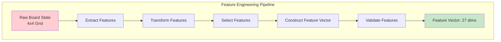
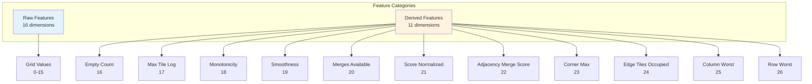
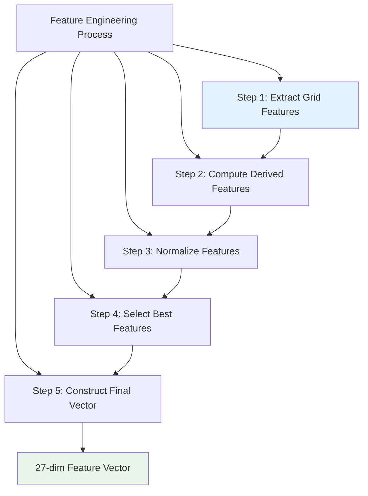
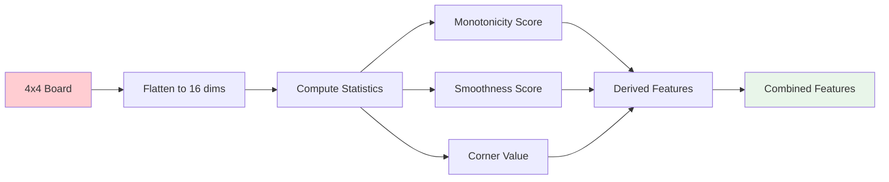
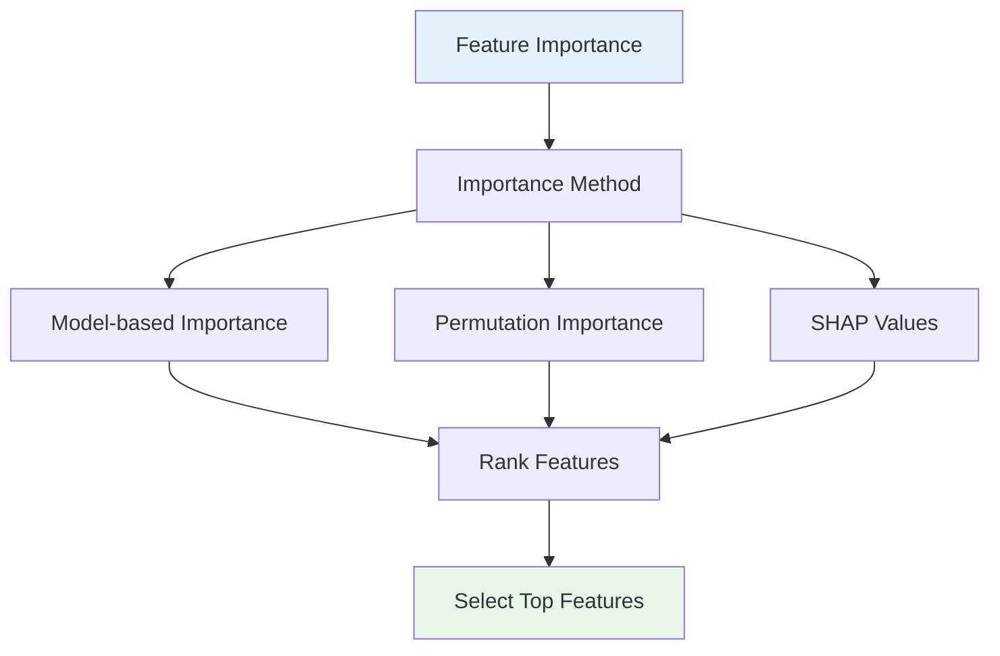
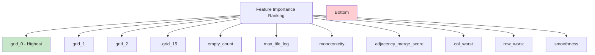
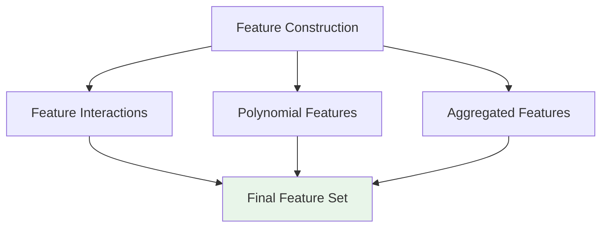
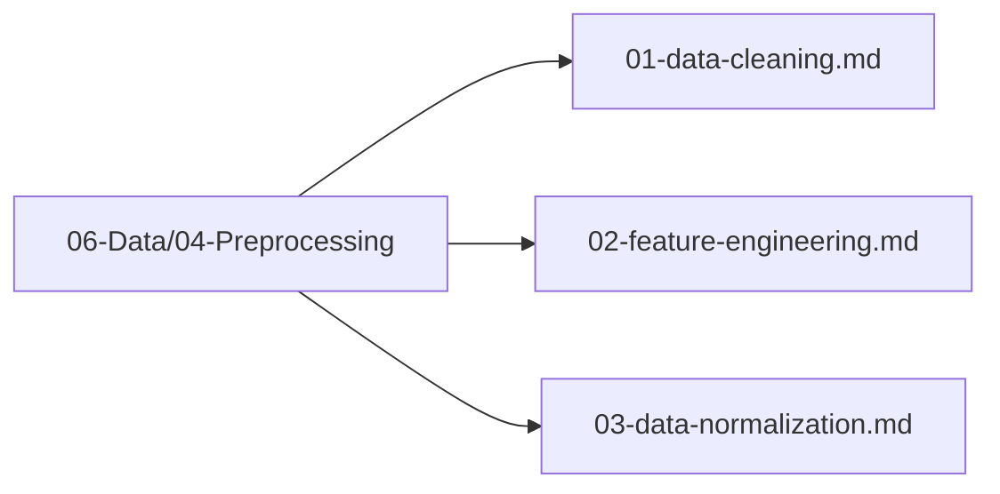

# Feature Engineering

## 1. Purpose

Define the feature engineering process to extract meaningful features from raw 2048 game board states.

## 2. Feature Engineering Overview

Feature engineering transforms raw board data into informative features that improve ML model performance.



## 3. Feature Types



## 4. Feature Engineering Process



### 4.1 Feature Extraction Flow



## 5. Feature Importance



### 5.1 Feature Importance Ranking



## 6. Feature Construction



## 7. Feature Engineering Configuration

```rust
pub struct FeatureEngineeringConfig {
    pub extract_grid: bool,
    pub compute_derived: bool,
    pub normalize: bool,
    pub select_features: bool,
    pub target_dimensions: usize,  // 27
}
```

## 8. Feature Files Location

All feature engineering files are in `06-Data/04-Preprocessing/`:



## 9. Next Steps

1. Extract features from raw board data
2. Compute derived features
3. Validate feature quality
