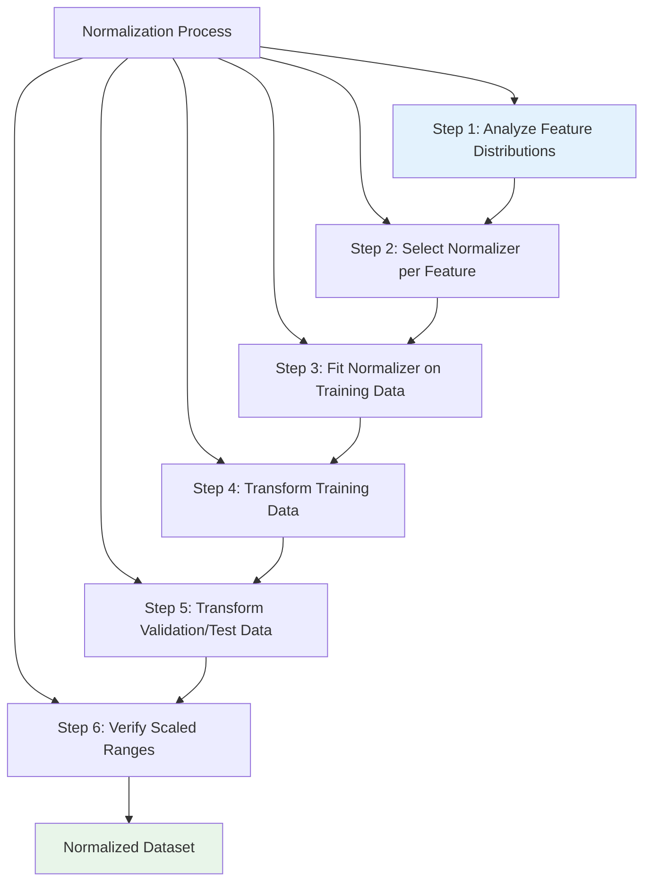
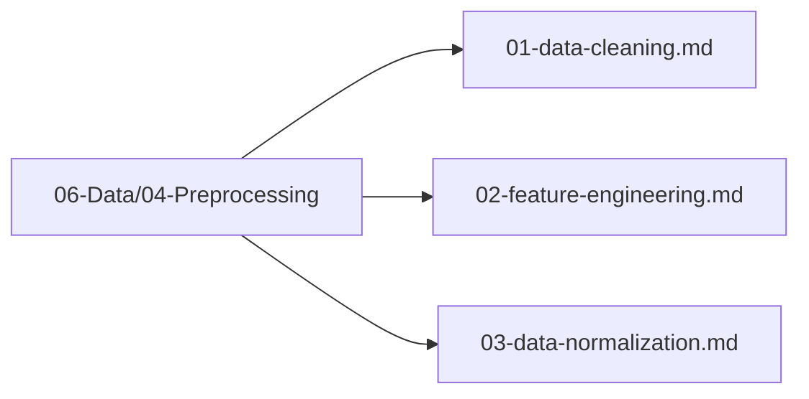

# Data Normalization

## 1. Purpose

Define the data normalization process to scale features to a consistent range for optimal ML model training.

## 2. Normalization Overview

Normalization ensures all features are on a comparable scale, improving model convergence and performance.

```mermaid
flowchart TD
    subgraph "Normalization Pipeline"
        Raw[Raw Features<br/>Mixed Scales]
        Raw --> Analyze[Analyze Distributions]
        Analyze --> Select[Select Normalizer]
        Select --> Fit[Fit Normalizer]
        Fit --> Transform[Transform Features]
        Transform --> Validate[Validate Normalized]
        Validate --> Output[Normalized Features<br/>[0, 1] Range]
        
        style Raw fill:#ffcdd2
        style Output fill:#c8e6c9
    end
```

## 3. Normalization Methods

```mermaid
flowchart TB
    subgraph "Normalization Methods"
        Standard[StandardScaler<br/>Z-score Normalization]
        MinMax[MinMaxScaler<br/>Scale to [0,1]]
        Robust[RobustScaler<br/>Using Median/IQR]
        Log[Log Transform<br/>For Skewed Data]
    end
    
    Standard --> Apply[Apply to Features]
    MinMax --> Apply
    Robust --> Apply
    Log --> Apply
    
    style Standard fill:#e3f2fd
    style MinMax fill:#fff3e0
```

### 3.1 StandardScaler

```mermaid
flowchart TD
    Std[StandardScaler]
    Std --> Mean[Calculate Mean]
    Std --> StdDev[Calculate Std Dev]
    Std --> Formula[(x - μ) / σ]
    Formula --> Normalized[Normalized Feature]
    
    style Std fill:#e3f2fd
    style Normalized fill:#e8f5e9
```

### 3.2 MinMaxScaler

```mermaid
flowchart TD
    MinMax[MinMaxScaler]
    MinMax --> Min[Find Min]
    MinMax --> Max[Find Max]
    MinMax --> Formula[(x - min) / (max - min)]
    Formula --> Scaled[Scaled to [0, 1]]
    
    style MinMax fill:#e3f2fd
    style Scaled fill:#e8f5e9
```

## 4. Normalization Process



## 5. Per-Feature Normalization — Deterministic Divisors (Primary) + Optional Fitted Scaler

**Primary (deterministic, no fit):** Every feature uses a fixed divisor — no data-dependent fit, no leakage.

| Feature | Divisor / Formula | Range |
|---------|-------------------|-------|
| `grid_0..15` | `/ 32768.0` | [0,1] |
| `empty_count` | `/ 16.0` | [0,1] |
| `max_tile_log` | `log2(max)/15.0` | [0,1] |
| `monotonicity` | `/ max_possible` | [0,1] |
| `smoothness` | `1 - sum|Δlog|/max` | [0,1] |
| `merges_available` | `/ 16.0` | [0,1] |
| `score_normalized` | `log10(score+1)/6.0` | [0,~1.02] |
| `adjacency_merge_score` | `/ (16*2048)` | [0,1] |
| `corner_max` | `/ 32768.0` or binary | [0,1] |
| `edge_tiles_occupied` | `/ 12.0` | [0,1] |
| `col_worst` / `row_worst` | `/ (32768*4)` | [0,1] |

**Optional (fitted, train only):** `DataPreprocessor` with `StandardScaler` may additionally z-score the 27-dim vector — but **fit on train only**, then transform val/test (see §8). Deterministic divisors above are always applied first. `Available Moves` / `MoveCount` is not a feature — deleted (not in 27). `Moves` in old diagram = `merges_available`.

> **No contradiction:** §3–§4 `StandardScaler`/`MinMaxScaler` are the *optional fitted* path via `DataPreprocessor`; the deterministic table above is the *always-on* path. Use one or both, but never fit on val/test.

## 6. Normalization Pipeline

```mermaid
sequenceDiagram
    participant Raw as Raw Features
    participant Preprocess as DataPreprocessor
    participant Normalizer as Normalizer
    participant Norm as Normalized Features
    
    Raw->>Preprocess: Feed raw data
    Preprocess->>Normalizer: Fit on training data
    Normalizer->>Normalizer: Compute mean/std
    Normalizer->>Norm: Transform features
    Norm->>Model[ML Model]
    
    Note over Normalizer: StandardScaler<br/>MinMaxScaler<br/>RobustScaler
```

## 7. Normalization Verification

```mermaid
flowchart TD
    Verify[Normalization Verification]
    Verify --> Check1[All features in [0,1]]
    Verify --> Check2[No NaN values]
    Verify --> Check3[No Inf values]
    Verify --> Check4[Distribution preserved]
    Verify --> Check5[No data leakage]
    
    Check1 --> Pass{All Verified?}
    Check2 --> Pass
    Check3 --> Pass
    Check4 --> Pass
    Check5 --> Pass
    Pass --> |Yes| Verified[Data is Normalized]
    Pass --> |No| Fix[Re-normalize]
    
    style Verified fill:#c8e6c9
    style Fix fill:#fff3e0
```

## 8. Normalization Configuration — Two Paths

**Path A (always on):** deterministic divisors per §5 — no fit needed.

**Path B (optional fitted, train only):**
```rust
use automl::preprocessing::{DataPreprocessor, PreprocessingConfig, ScalerType, ImputeStrategy};
let mut preprocessor = DataPreprocessor::new(
    PreprocessingConfig::default()
        .with_scaler(ScalerType::Standard) // real API: with_scaler
        .with_numeric_impute(ImputeStrategy::Mean)
);
let train_norm = preprocessor.fit_transform(&train_features)?; // fit on train only
let val_norm = preprocessor.transform(&val_features)?;         // transform only
let test_norm = preprocessor.transform(&test_features)?;
```
Deterministic §5 normalization is applied before Path B. Never `fit` on val/test.

## 9. Normalization Files Location

All data normalization files are in `06-Data/04-Preprocessing/`:



## 10. Next Steps

1. Configure normalizer for each feature type
2. Execute normalization pipeline
3. Verify normalized data quality
