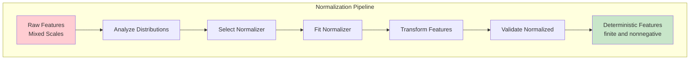
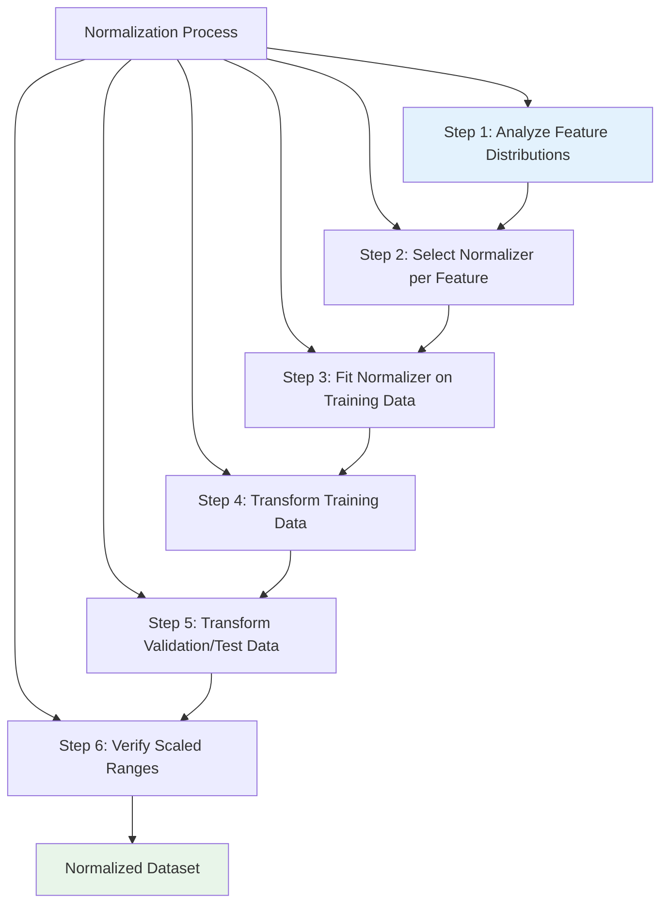
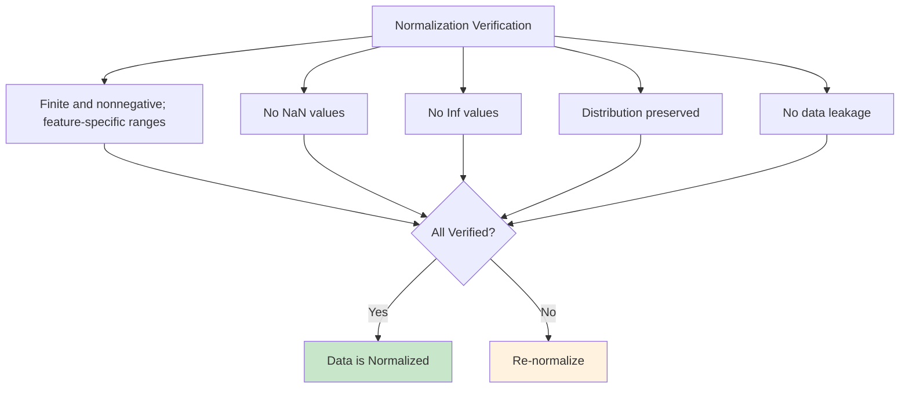
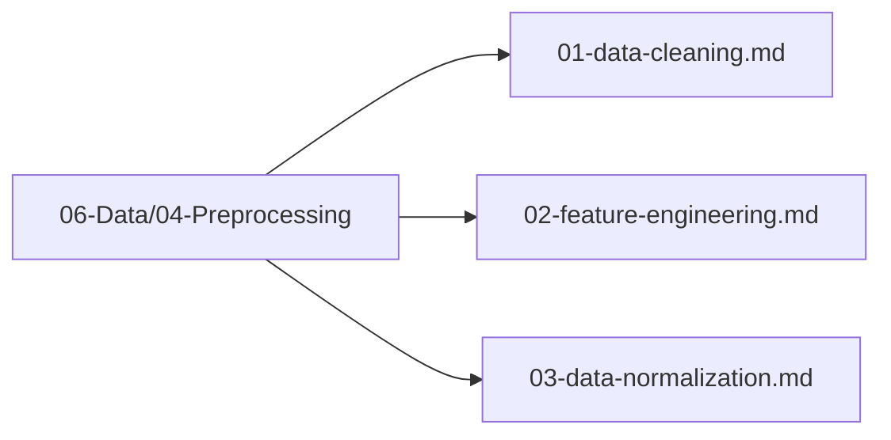

# Plan 03 — Data Normalization: the repository status is explicit and evidence based

> **Status: PARTIAL (2026-09-27).** Fixed divisors are applied during feature encoding; fitted scaler integration is absent; values above one are allowed.

**Goal:** State the current implementation and evidence boundary for data normalization.
**Builds on:** [00](../../00-scope-and-traceability.md) — the project is supervised 4×4 2048 policy learning, and framework evaluation is a separate research track.

---

## Decision and evidence

**This plan treats deterministic feature scaling as implemented and fitted preprocessing as absent.** `BoardStateMl::from_board` applies fixed divisors before storage. The root trainer consumes these values directly and does not fit or persist a `DataPreprocessor`. Values above one are valid; score is normalized at index 16.

## 1. Purpose

Define the data normalization process to scale features to a consistent range for optimal ML model training.

## 2. Normalization Overview

Normalization ensures all features are on a comparable scale, improving model convergence and performance.



## 3. Normalization Methods

```mermaid
flowchart TB
    subgraph "Normalization Methods"
        Standard[StandardScaler<br/>Z-score Normalization]
        MinMax[MinMaxScaler<br/>Scale to [0,1]]
        Robust[RobustScaler<br/>Using Median/IQR]
        Log[Log Transform<br/>For Skewed Data]
    end
    
    Standard --> Apply[Apply to Features]
    MinMax --> Apply
    Robust --> Apply
    Log --> Apply
    
    style Standard fill:#e3f2fd
    style MinMax fill:#fff3e0
```

### 3.1 StandardScaler

```mermaid
flowchart TD
    Std[StandardScaler]
    Std --> Mean[Calculate Mean]
    Std --> StdDev[Calculate Std Dev]
    Std --> Formula[(x - μ) / σ]
    Formula --> Normalized[Normalized Feature]
    
    style Std fill:#e3f2fd
    style Normalized fill:#e8f5e9
```

### 3.2 MinMaxScaler

```mermaid
flowchart TD
    MinMax[MinMaxScaler]
    MinMax --> Min[Find Min]
    MinMax --> Max[Find Max]
    MinMax --> Formula[(x - min) / (max - min)]
    Formula --> Scaled[Scaled to [0, 1]]
    
    style MinMax fill:#e3f2fd
    style Scaled fill:#e8f5e9
```

## 4. Normalization Process



## 5. Per-Feature Normalization — Deterministic Divisors (Primary) + Optional Fitted Scaler

**Primary (deterministic, no fit):** The canonical vector consists of 16 grid
values divided by 32768 and normalized current score at index 16. Values above
one are valid for tiles above 32768 or scores above 1,000,000.

| Feature | Formula | Range |
|---------|---------|-------|
| `grid_0..15` | `tile as f64 / 32768.0` | finite, nonnegative; may exceed 1 |
| `score_normalized` at index 16 | `log10(score+1)/6.0` | finite, nonnegative; may exceed 1 |

Fitted preprocessing is not in the current root training path. If added later,
fit it on training partitions only and apply that fitted instance to validation
and test. `Available Moves` and move count are not model features.

> The fitted scaler examples below are future integration guidance. The live
> path uses deterministic features only.

## 6. Normalization Pipeline

```mermaid
sequenceDiagram
    participant Raw as Raw Features
    participant Preprocess as DataPreprocessor
    participant Normalizer as Normalizer
    participant Norm as Normalized Features
    
    Raw->>Preprocess: Feed raw data
    Preprocess->>Normalizer: Fit on training data
    Normalizer->>Normalizer: Compute mean/std
    Normalizer->>Norm: Transform features
    Norm->>Model[ML Model]
    
    Note over Normalizer: StandardScaler<br/>MinMaxScaler<br/>RobustScaler
```

## 7. Normalization Verification



## 8. Normalization Configuration — Two Paths

**Path A (always on):** deterministic divisors per §5 — no fit needed.

**Path B (optional fitted, train only):**
```rust
use automl::preprocessing::{DataPreprocessor, PreprocessingConfig, ScalerType, ImputeStrategy};
let mut preprocessor = DataPreprocessor::with_config(
    PreprocessingConfig::default()
        .with_scaler(ScalerType::Standard) // real API: with_scaler
        .with_numeric_impute(ImputeStrategy::Mean)
);
let train_norm = preprocessor.fit_transform(&train_features)?; // fit on train only
let val_norm = preprocessor.transform(&val_features)?;         // transform only
let test_norm = preprocessor.transform(&test_features)?;
```
Deterministic §5 normalization is applied before Path B. Never `fit` on val/test.

## 9. Normalization Files Location

All data normalization files are in `06-Data/04-Preprocessing/`:



## 10. Next Steps

1. Configure normalizer for each feature type
2. Execute normalization pipeline
3. Verify normalized data quality

## Implementation Record

- Fixed canonical divisors are applied by `BoardStateMl::from_board` before data writing. The current data/training commands have no fitted scaler stage.
- Validators accept finite, nonnegative values without an upper bound of one. The root trainer does not apply or persist a fitted scaler.

---

## Verification (definition of done)

1. `test -f plans/06-Data/04-Preprocessing/03-data-normalization.md` exits 0.
2. `grep -q '^# Plan 03 — ' plans/06-Data/04-Preprocessing/03-data-normalization.md` exits 0.
3. `grep -q '^> \\*\\*Status:' plans/06-Data/04-Preprocessing/03-data-normalization.md` exits 0.
4. `grep -q '^\*\*Goal:' plans/06-Data/04-Preprocessing/03-data-normalization.md` exits 0.
5. `grep -q '^## Decision and evidence$' plans/06-Data/04-Preprocessing/03-data-normalization.md` exits 0.
6. `grep -q '^## Open questions$' plans/06-Data/04-Preprocessing/03-data-normalization.md` exits 0.
7. `grep -q '^## Later$' plans/06-Data/04-Preprocessing/03-data-normalization.md` exits 0.
8. `bash /Users/evintleovonzko/Documents/works/kolosal/planout2/v2-ai-express/.claude/skills/writing-planout-plans/check-plan.sh plans/06-Data/04-Preprocessing/03-data-normalization.md` exits 0.

## Open questions

- If learned scaling is added, implement fold-local fit/transform and persist the fitted parameters.

## Later

- **Complete the remaining research or implementation work recorded above.** It stays deferred until its prerequisites, compute budget, and measurable acceptance evidence are available.
