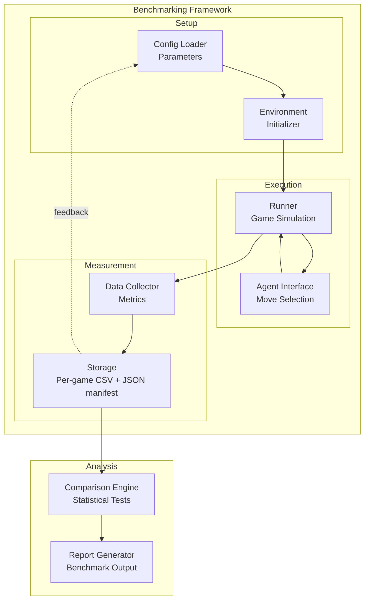
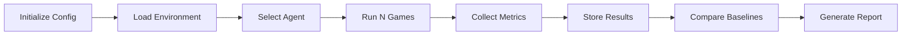
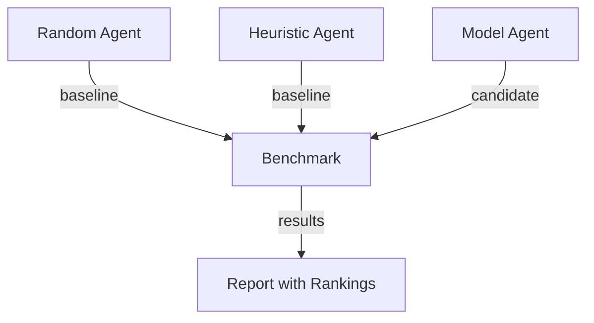
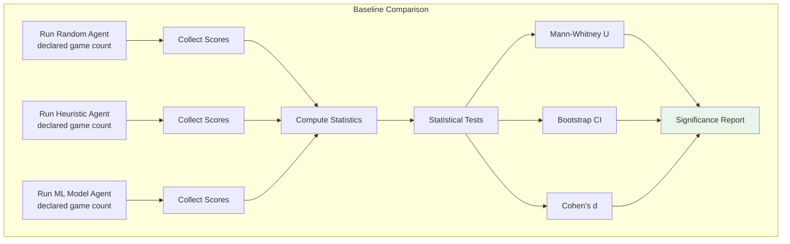

# Plan 01 — Benchmarking Framework: the repository status is explicit and evidence based

> **Status: PARTIAL (2026-09-26).** Seeded benchmark/compare commands and score statistics exist; model ranking and performance profiling remain pending.

**Goal:** State the current implementation and evidence boundary for benchmarking framework.
**Builds on:** [00](../../00-scope-and-traceability.md) — the project is supervised 4×4 2048 policy learning, and framework evaluation is a separate research track.

---

## Decision and evidence

**This plan treats the score benchmarking tools as implemented and comparative results as pending.** The CLI runs random, heuristic, or saved-model policies with seeded games; it writes per-game CSV and manifests and provides paired/unpaired score comparisons. No trained-model winner run or per-move performance profile is recorded.

## 1. Purpose

Define the benchmarking framework for evaluating the 2048 ML system's performance against baselines and targets.

## 2. Framework Overview



## 3. Benchmark Categories

| Category | Description | Baseline |
|----------|-------------|----------|
| Score | Maximum, mean, median scores | Random agent score |
| Speed | Games per second (where measured) | Descriptive metadata only |
| Convergence | Not applicable to the current one-fit classical model loop | Not measured |
| Robustness | Performance variance | Descriptive uncertainty; no pass/fail threshold |

## 4. Benchmarking Pipeline



## 5. Configuration

```rust
// Illustrative protocol fields, not a live root configuration type:
// game count, candidate policy, seed sequence, simulator settings, and output path.
// Choose game count from pilot variance and a declared compute budget.
```

## 6. Baseline Comparisons

All benchmarks compare against these baselines:



### 6.1 Baseline Definitions

#### Random Agent Baseline

The random agent selects moves uniformly at random from available actions. It serves as the absolute minimum performance floor.

| Metric | Expected Value |
|--------|---------------|
| Mean Score | ~128 |
| Median Score | ~96 |
| Max Tile | Typically 64-128 |
| Games Completed | ~30-50 moves average |

**Rationale**: A random agent has no strategy and will quickly reach a dead state. These values are historical hypotheses, not benchmark results; replace them with retained seeded measurements before citing them.

#### Heuristic Agent Baseline

The heuristic agent uses domain-specific rules to select moves: prioritize maintaining monotonicity, keeping the highest tile in a corner, and maximizing empty tiles. This represents the best non-ML approach.

| Metric | Expected Value |
|--------|---------------|
| Mean Score | ~512 |
| Median Score | ~384 |
| Max Tile | Typically 512-1024 |
| Games Completed | ~80-120 moves average |

**Rationale**: The implemented heuristic is a rule-based comparison policy; its score distribution must be reported from a seeded run rather than assumed.

#### Summary Table

| Baseline | Mean Score | Median Score | Max Tile | Notes |
|----------|-----------|-------------|----------|-------|
| Random Agent | ~128 | ~96 | 64-128 | Uniform random moves |
| Heuristic Agent | ~512 | ~384 | 512-1024 | Rule-based strategy |
| ML Model Agent | TBD | TBD | TBD | To be benchmarked |

### 6.2 Comparison Methodology

ML models are compared against baselines using the following protocol:

1. **Same game environment**: All agents run in the identical 2048 environment with the same random seed sequence
2. **Same number of games**: Each agent plays N games (see 6.3 for sample size requirements)
3. **Score collection**: Record the final score for each game
4. **Statistical comparison**: Compare the ML model's score distribution against each baseline using the tests defined in 6.4
5. **Effect size**: Report Cohen's d alongside p-values to quantify the magnitude of improvement

### 6.3 Sample Size Planning (Not Empirically Powered)

No prospective power analysis has been completed. Choose a game count using observed pilot variance, target uncertainty/effect, and a declared compute budget; no minimum, recommended count, or fixed n has been established as a guarantee.

### 6.4 Statistical Test Requirements

All comparisons must satisfy the following statistical requirements:

| Test | Purpose | Significance Level |
|------|---------|-------------------|
| Mann-Whitney U test | Compare score distributions (non-parametric) | α = 0.05 |
| Wilcoxon signed-rank test | Paired comparisons (same seed sequence) | α = 0.05 |
| Bootstrap confidence intervals | Estimate mean score uncertainty | 95% CI |
| Cohen's d | Effect size measurement | d > 0.8 = large |
| Permutation test | Validate significance of observed differences | 10,000 permutations |

**Requirements**:
- Primary test: Mann-Whitney U test (scores are non-normally distributed)
- Secondary test: Bootstrap 95% CI on the difference in means (must not include zero)
- Effect size: Cohen's d must be reported; d ≥ 0.5 is considered meaningful
- Multiple comparison correction: Bonferroni correction when comparing against multiple baselines
- Reproducibility: All tests must use fixed random seeds

### 6.5 Baseline Comparison Pipeline — Protocol to Declare Before a Run

> No canonical game count is established. Choose it from pilot variance, intended uncertainty, and a declared compute budget; do not treat historical fixed values as guarantees.



### 6.6 Winner Determination and Ranking

For the 2048 case study, the provisional winner is the model with the highest held-out mean score under the declared evaluation protocol. Models are also reported with uncertainty, practical effect, distributional metrics, and seed-level robustness. This ranking does not define the primary Rust-native AutoML framework contribution or imply globally optimal play.

**Ranking Criteria** (in priority order):
1. **Mean Score** (primary) — higher is better
2. **Median Score** (tiebreaker 1) — higher is better
3. **Score Consistency** (tiebreaker 2) — lower std dev is better

**Ranking Process:**
1. Run all models (including Random and Heuristic baselines) under identical declared conditions
2. Each model plays the preregistered game count with the same declared seed design
3. Compute mean score, median score, and std dev for each model
4. Rank by mean score (highest = rank 1)
5. If tied on mean, use median score as tiebreaker
6. If still tied, use lower std dev

**Statistical Requirements for Ranking:**
- The #1 ranked model must be statistically significantly better than #2 (Mann-Whitney U, p < 0.05 after Bonferroni correction)
- Bootstrap 95% CI on mean difference must not include zero
- If not statistically significant, the ranking is inconclusive and more games are needed

**Reporting criteria:** declare the case-study comparison and statistical procedure before evaluation; retain per-game outcomes, seeds, uncertainty, and corrected comparisons. Do not require an invented score ratio or infer framework quality from game results.

## Implementation Record

- CLI supports seeded random, heuristic, and saved-model score runs; paired comparisons; score summaries; bootstrap intervals; exact sign tests; Mann–Whitney U; Holm adjustment; and effect sizes. Results include manifests and source/file hashes.
- A model-versus-baseline ranking at the declared scale and efficiency-by-move profiling have not been completed. Random/heuristic values previously shown as expectations are unverified estimates, not results.
- The architecture diagram names the implemented per-run CSV and JSON manifest artifacts; no results database is present.

---

## Verification (definition of done)

1. `test -f plans/07-Benchmarking/01-Evaluation/01-benchmarking-framework.md` exits 0.
2. `grep -q '^# Plan 01 — ' plans/07-Benchmarking/01-Evaluation/01-benchmarking-framework.md` exits 0.
3. `grep -q '^> \\*\\*Status:' plans/07-Benchmarking/01-Evaluation/01-benchmarking-framework.md` exits 0.
4. `grep -q '^\*\*Goal:' plans/07-Benchmarking/01-Evaluation/01-benchmarking-framework.md` exits 0.
5. `grep -q '^## Decision and evidence$' plans/07-Benchmarking/01-Evaluation/01-benchmarking-framework.md` exits 0.
6. `grep -q '^## Open questions$' plans/07-Benchmarking/01-Evaluation/01-benchmarking-framework.md` exits 0.
7. `grep -q '^## Later$' plans/07-Benchmarking/01-Evaluation/01-benchmarking-framework.md` exits 0.
8. `bash /Users/evintleovonzko/Documents/works/kolosal/planout2/v2-ai-express/.claude/skills/writing-planout-plans/check-plan.sh plans/07-Benchmarking/01-Evaluation/01-benchmarking-framework.md` exits 0.

## Open questions

- Run the selected trained model on held-out game seeds after the model-selection workflow exists. Set game count from pilot variance and available compute; retain raw scores and manifests.

## Later

- **Complete the remaining research or implementation work recorded above.** It stays deferred until its prerequisites, compute budget, and measurable acceptance evidence are available.
