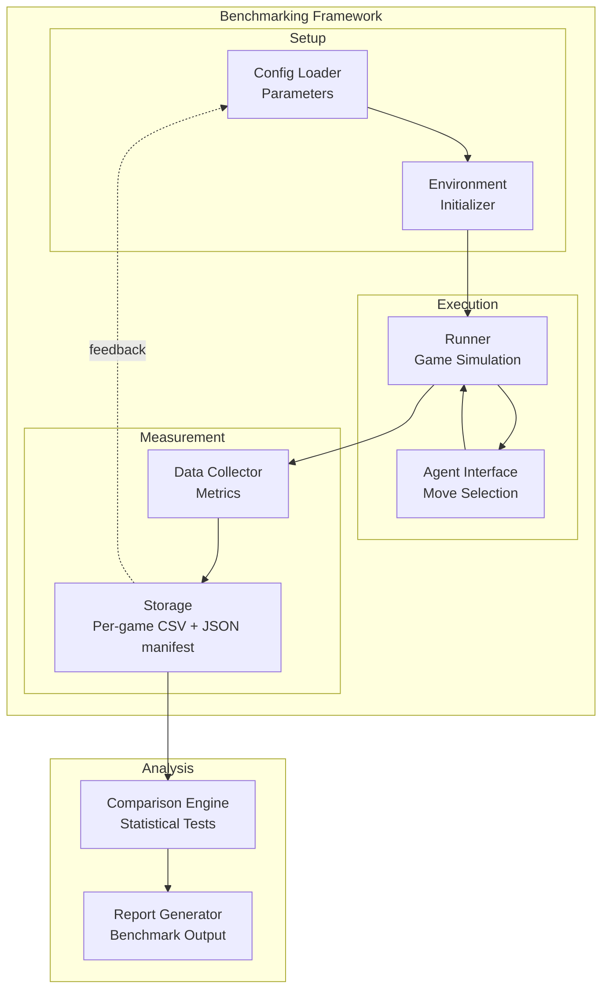
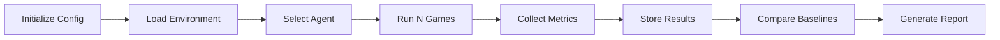
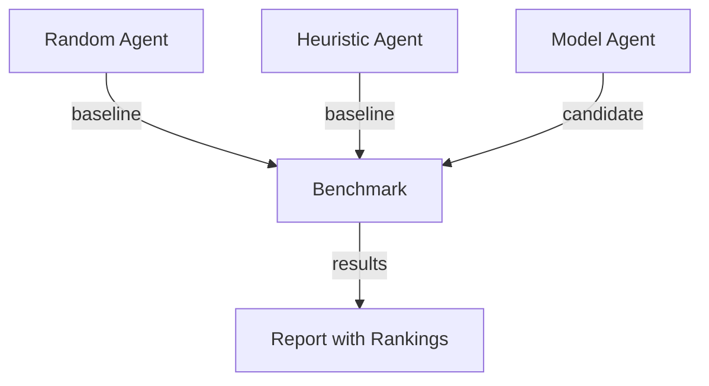
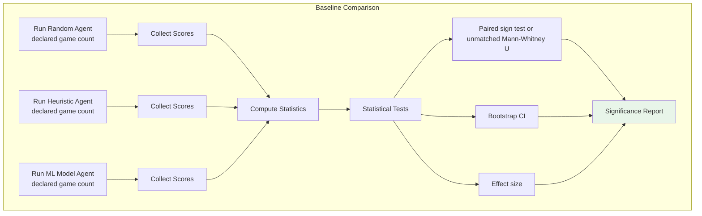

# Plan 01 — Benchmarking Framework: the repository status is explicit and evidence based

> **Status: PARTIAL (2026-09-27).** Seeded benchmark/compare commands and 10,000-game baseline plus pilot-policy score runs exist; a predeclared model ranking and performance profiling remain pending.

**Goal:** State the current implementation and evidence boundary for benchmarking framework.
**Builds on:** [00](../../00-scope-and-traceability.md) — the project is supervised 4×4 2048 policy learning, and framework evaluation is a separate research track.

---

## Decision and evidence

**This plan treats score benchmarking tools as implemented and winner comparison as pending.** The CLI runs random, heuristic, or saved-model policies with seeded games; it writes per-game CSV and manifests and provides paired/unpaired score comparisons. Retained artifacts include 10,000-game random and heuristic baselines and one 10,000-game run of a small-corpus fitted pilot policy. That pilot is descriptive evidence, not a selected-model or matched-budget comparison. Per-move performance profiling is absent.

## 1. Purpose

Define the benchmarking framework for evaluating the 2048 ML system's performance against baselines and targets.

## 2. Framework Overview


```mermaid
flowchart TD
    subgraph "Benchmarking Framework"
        subgraph "Setup"
            Config[Config Loader<br/>Parameters]
            Env[Environment<br/>Initializer]
        end
        
        subgraph "Execution"
            Run[Runner<br/>Game Simulation]
            Agent[Agent Interface<br/>Move Selection]
        end
        
        subgraph "Measurement"
            Collect[Data Collector<br/>Metrics]
            Store[Storage<br/>Per-game CSV + JSON manifest]
        end
        
        Config --> Env
        Env --> Run
        Run --> Agent
        Agent --> Run
        Run --> Collect
        Collect --> Store
    end
    
    Store -.->|feedback| Config
    
    subgraph "Analysis"
        Comp[Comparison Engine<br/>Statistical Tests]
        Report[Report Generator<br/>Benchmark Output]
    end
    
    Store --> Comp
    Comp --> Report
```

## 3. Benchmark Categories

| Category | Description | Baseline |
|----------|-------------|----------|
| Score | Maximum, mean, median scores | Random agent score |
| Speed | Games per second (where measured) | Descriptive metadata only |
| Convergence | Not applicable to the current one-fit classical model loop | Not measured |
| Robustness | Performance variance | Descriptive uncertainty; no pass/fail threshold |

## 4. Benchmarking Pipeline


```mermaid
flowchart LR
    A[Initialize Config] --> B[Load Environment]
    B --> C[Select Agent]
    C --> D[Run N Games]
    D --> E[Collect Metrics]
    E --> F[Store Results]
    F --> G[Compare Baselines]
    G --> H[Generate Report]
```

## 5. Configuration

```rust
// Illustrative protocol fields, not a live root configuration type:
// game count, candidate policy, seed sequence, simulator settings, and output path.
// Choose game count from pilot variance and a declared compute budget.
```

## 6. Baseline Comparisons

All benchmarks compare against these baselines:


```mermaid
graph TD
    R[Random Agent] -->|baseline| BM[Benchmark]
    H[Heuristic Agent] -->|baseline| BM
    M[Model Agent] -->|candidate| BM
    BM -->|results| Result[Report with Rankings]
```

### 6.1 Baseline Definitions

#### Random Agent Baseline

The random agent selects moves uniformly at random from available actions. It is one measured comparison baseline, not an asserted absolute floor.

| Metric | Measured in retained 10,000-game run |
|--------|---------------|
| Mean Score | 1,094.12 |
| Median Score | 1,050 |
| Max Score | 4,892 |
| Max tile | 512 |
| Mean moves | 118.29 |

**Protocol**: 10,000 games, seeds 84024–94023; see the raw CSV, manifest, and analysis in `reports/action-frequency/README.md`. These local results are descriptive for this protocol.

#### Heuristic Agent Baseline

The heuristic agent uses domain-specific rules to select moves: prioritize maintaining monotonicity, keeping the highest tile in a corner, and maximizing empty tiles. This represents the best non-ML approach.

| Metric | Measured in retained 10,000-game run |
|--------|---------------|
| Mean Score | 8,056.23 |
| Median Score | 7,136 |
| Max Score | 20,940 |
| Max tile | 2,048 |
| Mean moves | 521.52 |

**Protocol**: 10,000 games, seeds 84024–94023; see the raw CSV, manifest, and analysis in `reports/action-frequency/README.md`.

#### Summary Table

| Agent | Mean Score | Median Score | Max Score | Max Tile | Notes |
|-------|-----------:|--------------:|----------:|---------:|-------|
| Random | 1,094.12 | 1,050 | 4,892 | 512 | 10,000 seeded games |
| Heuristic | 8,056.23 | 7,136 | 20,940 | 2,048 | 10,000 seeded games |
| Fitted RandomForest pilot | 866.15 | 744 | 3,296 | 256 | One pilot policy, 10,000 games; not a model ranking |

### 6.2 Comparison Methodology

ML models are compared against baselines using the following protocol:

1. **Same game environment**: All agents run in the identical 2048 environment with the same random seed sequence
2. **Same number of games**: Each agent plays N games (see 6.3 for sample size requirements)
3. **Score collection**: Record the final score for each game
4. **Statistical comparison**: Declare the matched or unmatched design before the run and use the corresponding procedure described in 6.4
5. **Effect size**: Report the implemented effect-size estimate with its definition and uncertainty where available

### 6.3 Sample Size Planning (Not Empirically Powered)

No prospective power analysis has been completed. Choose a game count using observed pilot variance, target uncertainty/effect, and a declared compute budget; no minimum, recommended count, or fixed n has been established as a guarantee.

### 6.4 Statistical Test Requirements

All comparisons must satisfy the following statistical requirements:

| Procedure | Purpose | Current implementation |
|------|---------|-------------------|
| Exact sign test | Compare matched per-seed score outcomes | Implemented for paired comparisons |
| Mann–Whitney U | Compare unmatched score samples | Implemented with normal approximation and tie correction |
| Bootstrap confidence intervals | Estimate score mean and mean-difference uncertainty | Implemented; replicate count and seed are run inputs |
| Effect size | Describe the magnitude of score difference | Implemented by comparison CLI; report the selected estimator and direction |

**Requirements**:
- Choose the paired exact sign test only when outcomes are genuinely paired by the declared seed design; otherwise use the unmatched Mann–Whitney U procedure.
- Report the bootstrap interval and effect estimate descriptively; whether an interval excludes zero is not a universal acceptance gate.
- Apply Holm adjustment when making multiple comparisons in the current CLI. State the family of comparisons and procedure in the report.
- Predeclare any inferential thresholds and decision rules for each study. This repository does not establish universal alpha, effect-size, or permutation-count cutoffs.
- Record seeds for stochastic procedures, including bootstrap resampling.

### 6.5 Baseline Comparison Pipeline — Protocol to Declare Before a Run

> No canonical game count is established. Choose it from pilot variance, intended uncertainty, and a declared compute budget; do not treat historical fixed values as guarantees.


```mermaid
flowchart TD
    subgraph "Baseline Comparison"
        A[Run Random Agent<br/>declared game count] --> B[Collect Scores]
        C[Run Heuristic Agent<br/>declared game count] --> D[Collect Scores]
        E[Run ML Model Agent<br/>declared game count] --> F[Collect Scores]
        
        B --> G[Compute Statistics]
        D --> G
        F --> G
        
        G --> H[Statistical Tests]
        H --> I[Paired sign test or unmatched Mann-Whitney U]
        H --> J[Bootstrap CI]
        H --> K[Effect size]
        
        I --> L[Significance Report]
        J --> L
        K --> L
    end
    
    style L fill:#e8f5e9
```

### 6.6 Winner Determination and Ranking

For the 2048 case study, the provisional winner is the model with the highest held-out mean score under the declared evaluation protocol. Models are also reported with uncertainty, practical effect, distributional metrics, and seed-level robustness. This ranking does not define the primary Rust-native AutoML framework contribution or imply globally optimal play.

**Ranking Criteria** (in priority order):
1. **Mean Score** (primary) — higher is better
2. **Median Score** (tiebreaker 1) — higher is better
3. **Score Consistency** (tiebreaker 2) — lower std dev is better

**Ranking Process:**
1. Run all models (including Random and Heuristic baselines) under identical declared conditions
2. Each model plays the preregistered game count with the same declared seed design
3. Compute mean score, median score, and std dev for each model
4. Rank by mean score (highest = rank 1)
5. If tied on mean, use median score as tiebreaker
6. If still tied, use lower std dev

**Statistical interpretation:**
- Report the declared comparison procedure, uncertainty interval, effect estimate, and multiplicity adjustment.
- Interpret the ranking in light of the study's predeclared decision rules; this repository sets no universal significance or effect-size cutoff.
- An inconclusive estimate should be reported as such. Collecting more games requires a justified precision goal and compute budget, not an automatic response to a p-value.

**Reporting criteria:** declare the case-study comparison and statistical procedure before evaluation; retain per-game outcomes, seeds, uncertainty, and corrected comparisons. Do not require an invented score ratio or infer framework quality from game results.

## Implementation Record

- CLI supports seeded random, heuristic, and saved-model score runs; paired comparisons; score summaries; bootstrap intervals; exact sign tests; Mann–Whitney U; Holm adjustment; and effect sizes. Results include manifests and source/file hashes.
- Seeded 10,000-game runs are retained for random and heuristic baselines and one fitted RandomForest pilot policy. The pilot used a small rollout corpus; these runs do not form a predeclared matched model-selection study and no winner claim is made. Per-move profiling remains unimplemented.
- The architecture diagram names the implemented per-run CSV and JSON manifest artifacts; no results database is present.

---

## Verification (definition of done)

1. `test -f plans/07-Benchmarking/01-Evaluation/01-benchmarking-framework.md` exits 0.
2. `grep -q '^# Plan 01 — ' plans/07-Benchmarking/01-Evaluation/01-benchmarking-framework.md` exits 0.
3. `grep -q '^> \\*\\*Status:' plans/07-Benchmarking/01-Evaluation/01-benchmarking-framework.md` exits 0.
4. `grep -q '^\*\*Goal:' plans/07-Benchmarking/01-Evaluation/01-benchmarking-framework.md` exits 0.
5. `grep -q '^## Decision and evidence$' plans/07-Benchmarking/01-Evaluation/01-benchmarking-framework.md` exits 0.
6. `grep -q '^## Open questions$' plans/07-Benchmarking/01-Evaluation/01-benchmarking-framework.md` exits 0.
7. `grep -q '^## Later$' plans/07-Benchmarking/01-Evaluation/01-benchmarking-framework.md` exits 0.
8. `bash /Users/evintleovonzko/Documents/works/kolosal/planout2/v2-ai-express/.claude/skills/writing-planout-plans/check-plan.sh plans/07-Benchmarking/01-Evaluation/01-benchmarking-framework.md` exits 0.

## Open questions

- Run the selected trained model on held-out game seeds after the model-selection workflow exists. Set game count from pilot variance and available compute; retain raw scores and manifests.

## Later

- **Complete the remaining research or implementation work recorded above.** It stays deferred until its prerequisites, compute budget, and measurable acceptance evidence are available.
