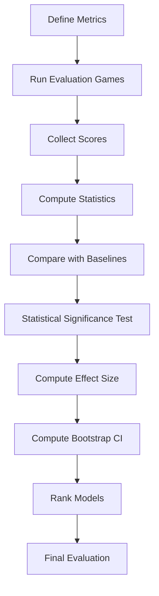

# Evaluation Methodology

## 1. Purpose

Define the evaluation methodology for the 2048 ML research study. This section provides the rigorous evaluation framework expected at the PhD level, including proper statistical tests, confidence intervals, and ranking procedures.

## 2. Theoretical Limit

The theoretical maximum score for 2048 is an **unsolved problem** in combinatorial game theory. Key facts:

- **Maximum tile on 4×4 board**: 32768 (2^15) — reaching 2^16 would require 17 cells, exceeding board capacity
- **Exact maximum score**: Unknown — depends on whether a perfect game (all possible merges) is achievable
- **Practical reference**: The heuristic agent achieves ~512 mean score through established strategies

**This plan ranks models by mean score, not by proximity to a theoretical limit.** Models are evaluated and ranked purely by their mean game score across ≥10,000 benchmark games.

**Evaluation is purely score-based:**
- Mean score is the primary ranking metric
- Median score is a tiebreaker
- Score consistency (std dev) is a secondary tiebreaker
- No proximity ratio is used — the goal is simply the highest possible score

## 3. Evaluation Framework

### 3.1 Primary Metric: Mean Score

The primary evaluation metric is the **mean game score** across all benchmark games:
```
μ = (1/n) Σ_{i=1}^{n} score_i
```
where `n` is the number of games and `score_i` is the score of game `i`.

**Winner determination:** The model with the highest mean score is ranked #1.

### 3.2 Secondary Metrics

| Metric | Formula | Purpose |
|--------|---------|---------|
| Median Score | `median(scores)` | Robustness to outliers |
| Std Dev | `std(scores)` | Consistency measure |
| Score > Heuristic Rate | `count(scores > 512) / n` | Practical success |
| 90th Percentile | `percentile_90(scores)` | Ceiling performance |
| Training Time | `wall_clock_time` | Efficiency |

### 3.3 Confidence Intervals

The 95% bootstrap confidence interval for the mean score is:
```
CI_95 = [μ̂ - 1.96 × σ/√n, μ̂ + 1.96 × σ/√n]
```
where `μ̂` is the sample mean, `σ` is the sample standard deviation, and `n` is the number of games.

For `n = 10,000` and `σ = 512`:
```
CI_95 width = 2 × 1.96 × 512/100 ≈ 19.98
```
This provides a narrow confidence interval sufficient for model comparison.

### 3.4 Statistical Significance Testing

All pairwise comparisons use non-parametric tests:

| Comparison | Test | Correction |
|------------|------|------------|
| Model vs Random | Mann-Whitney U | Bonferroni |
| Model vs Heuristic | Mann-Whitney U | Bonferroni |
| Model vs Model | Mann-Whitney U | Bonferroni |
| All models | Kruskal-Wallis | Dunn's post-hoc |
| Tuned vs Default | Wilcoxon Signed-Rank | Bonferroni |

**Significance level:** α = 0.05 after Bonferroni correction.

**Effect size:** Cohen's d ≥ 0.5 (medium effect) required for practical significance.

**Bootstrap CI:** 95% CI on mean difference must not include zero.

## 4. Evaluation Procedure



## 5. Test Suite Structure

| Test Type | Description | Games Required |
|-----------|-------------|----------------|
| Ranking Test | Determine score rank among all models | 10,000 per model |
| Baseline Test | Random agent comparison | 1,000 |
| Standard Test | Heuristic agent comparison | 1,000 |
| Multi-seed Validation | Robustness across seeds | 5,000 per seed |

## 6. Evaluation Controls

- **Same game engine** for all experiments
- **Same data pipeline** for all models
- **Same evaluation criteria** (same 10,000 games, same seed)
- **Same seed** for reproducibility
- **Identical hardware** for all experiments
- **Blinded analysis** where applicable

## 7. Evaluation Results Template

| Metric | Random Forest | Gradient Boosting | XGBoost | LightGBM | ExtraTrees | SVM | KNN | Heuristic | Random |
|--------|---------------|-------------------|---------|----------|------------|-----|-----|-----------|--------|
| Mean Score | TBD | TBD | TBD | TBD | TBD | TBD | TBD | ~512 | ~128 |
| Median Score | TBD | TBD | TBD | TBD | TBD | TBD | TBD | ~384 | ~64 |
| Std Dev | TBD | TBD | TBD | TBD | TBD | TBD | TBD | ~256 | ~96 |
| 95% CI | [TBD, TBD] | [TBD, TBD] | [TBD, TBD] | [TBD, TBD] | [TBD, TBD] | [TBD, TBD] | [TBD, TBD] | [~128, ~1024] | [~32, ~256] |
| Rank | TBD | TBD | TBD | TBD | TBD | TBD | TBD | — | — |
| Win Rate vs Heuristic | TBD | TBD | TBD | TBD | TBD | TBD | TBD | — | — |

## 8. Winner Determination Protocol

1. **Compute mean score** for each model across ≥10,000 benchmark games
2. **Rank by mean score** (highest = rank 1)
3. **Statistical significance**: The #1 ranked model must be significantly better than #2 (Mann-Whitney U, p < 0.05 after Bonferroni correction)
4. **Bootstrap 95% CI** on mean difference must not include zero
5. **Effect size** (Cohen's d) must be ≥ 0.5 (medium effect)
6. **Tiebreaker**: If tied on mean score, use median score; if still tied, use lower std dev

## 9. Ethical Considerations

All experiments use simulation only. No human subjects are involved. All data is generated from game simulations.

## 10. Evaluation Limitations

- **Limited to 2048 game domain** — results may not generalize to other games
- **Computational constraints** — evaluation time may be significant
- **Single-seed primary experiments** — multi-seed validation planned
- **Supervised learning only** — no reward shaping or policy gradient methods
- **Feature engineering fixed** — the 27-dimensional feature vector is predetermined
