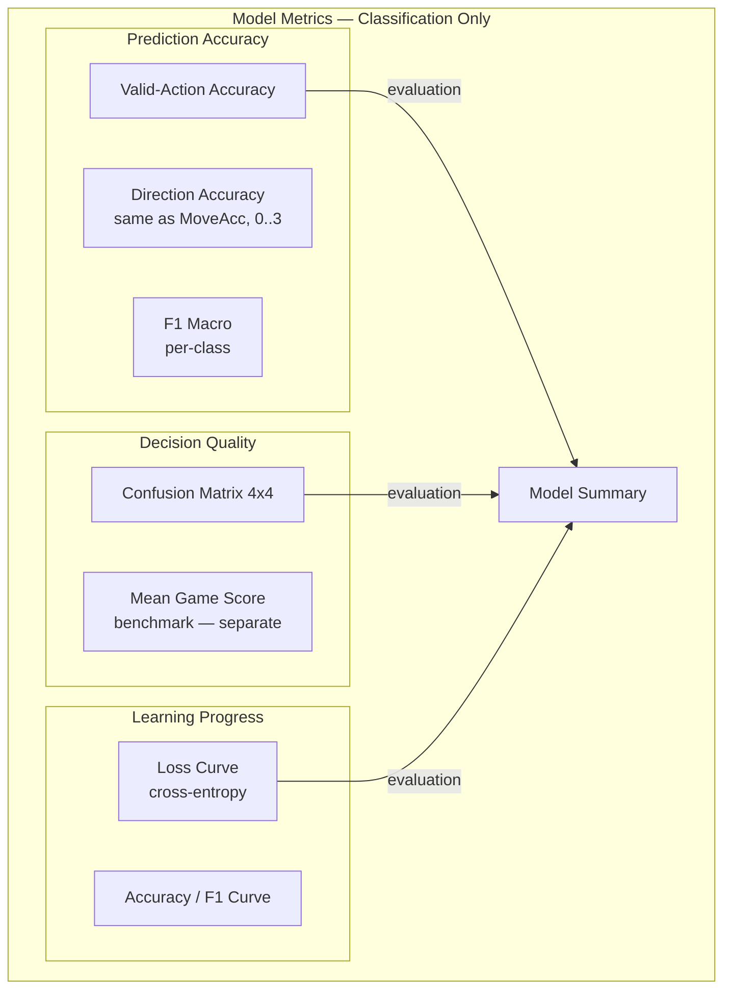
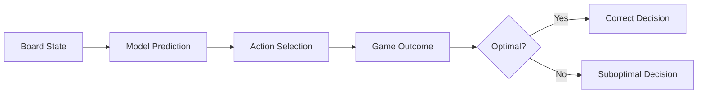
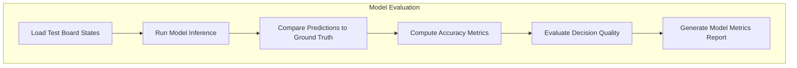
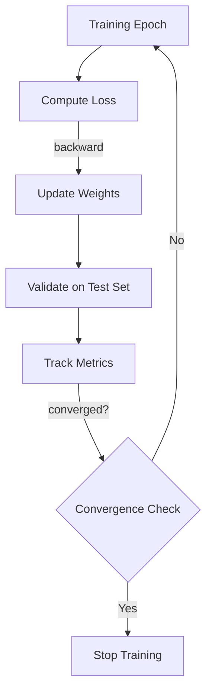
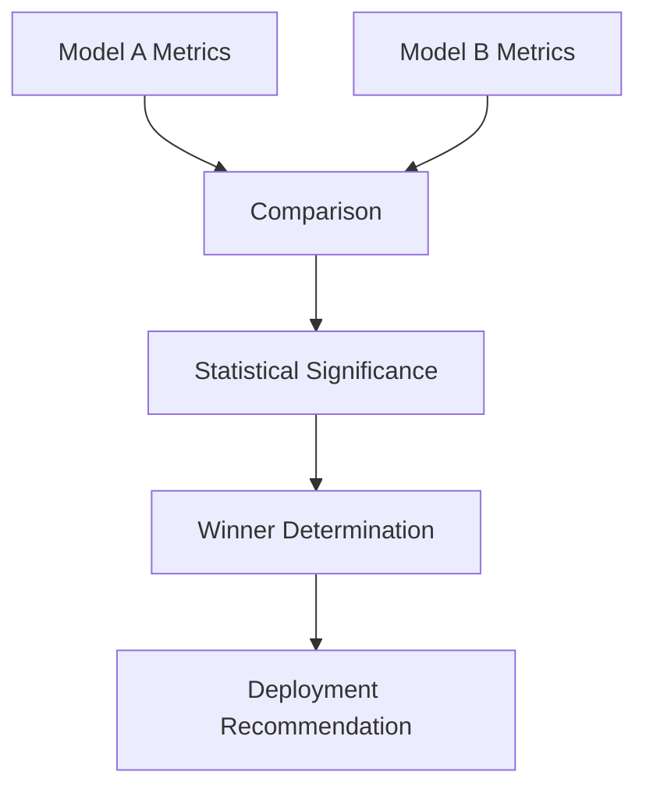

# Plan 02 — Model Metrics: the repository status is explicit and evidence based

> **Status: PARTIAL (2026-09-27).** Score summaries and reusable classification diagnostics exist; fixed-split reports, policy legal-action measurements, and training curves remain pending.

**Goal:** State the current implementation and evidence boundary for model metrics.
**Builds on:** [00](../../00-scope-and-traceability.md) — the project is supervised 4×4 2048 policy learning, and framework evaluation is a separate research track.

---

## Decision and evidence

**This plan treats score summaries and reusable classification diagnostics as implemented, while evaluation runs remain pending.** `src/evaluation.rs` computes accuracy, per-class F1, macro precision/recall/F1, and a confusion matrix from fixed label arrays; it also computes the fraction of 2048 predictions that choose a legal action. The benchmark CLI does not yet load held-out labels or report these diagnostics. Classical `TrainEngine::fit` does not expose an epoch training curve in the root workflow.

## 1. Purpose

Define metrics specifically for evaluating the ML model's predictive and decision-making capabilities in the 2048 game.

## 2. Model Metrics Framework — Classification + Game-Score Benchmark Only



> **No value/reward prediction.** No RL metrics (Q-value, TD error, reward curve, exploration rate).

## 3. Prediction Metrics — Classification Only

| Metric | Description | Purpose |
|--------|-------------|----------|
| Classification accuracy | Exact-match fraction over a declared class set | General classification diagnostic |
| Legal-Action Prediction Rate | Fraction of predictions that are legal for their corresponding board | 2048 policy validity diagnostic; distinct from label accuracy |
| F1 Macro | Macro-averaged F1 across 4 action classes | Class-balance aware metric |
| Confusion Matrix | 4×4 matrix (Up/Down/Left/Right) | Per-class error analysis |
| Mean Game Score | Mean score over ≥10k benchmark games (separate pipeline) | Downstream benchmark — not regression |

> **Case-study note**: AutoML models are evaluated by classification quality and resource metrics in framework validation. In the 2048 case study, policies are compared by held-out game-score distributions, uncertainty, practical effect, and the declared statistical protocol. The case-study winner is not a claim of globally optimal play.

> Any classification thresholds must be justified and predeclared for a specific study; canonical project scope does not set universal cutoffs.

## 4. Decision Quality Metrics



## 5. Model Evaluation Pipeline



## 6. Training Metrics — Not Available for the Current Classical Loop

```rust
pub struct TrainingMetrics {
    pub epoch: usize,
    pub loss: f64,                 // cross-entropy
    pub accuracy: f64,             // valid-action accuracy
    pub f1_macro: f64,             // F1 macro
    pub learning_rate: f64,
    pub epoch_time_ms: u64,
    pub validation_loss: f64,
    pub validation_accuracy: f64,
    pub validation_f1_macro: f64,
    pub overfitting_gap: f64,
}

pub struct ModelMetrics {
    pub valid_action_accuracy: f64,
    pub f1_macro: f64,
    pub confusion_matrix: [[usize; 4]; 4],
    pub mean_game_score: f64,      // downstream benchmark — not a training target
    // RL fields (q_value_correlation, td_error, reward_prediction_mae) — removed: not used
}
```

## 7. Loss and Convergence Tracking (Not Implemented)



## 8. Feature Importance — Post-Training Only

Post-training only — compute permutation/SHAP importance after model is trained, then rank the 27 features. No TBD table pre-training. `MoveCount` not in 27 — do not list.

## 9. Model Comparison Metrics



## 10. Quality Gates — None Defined by Canonical Scope

No universal quality gates are defined. A case-study comparison should predeclare its ranking and statistical protocol and report uncertainty.

Report metrics that are implemented and retain per-game outcomes. Add classification metrics before claiming their results; do not use hypothetical loss-convergence gates for this single-fit tree workflow.

> If a model/heuristic ratio is reported, treat it as descriptive and include the baseline estimate and uncertainty.

## Implementation Record

- `src/evaluation.rs` provides generic confusion-matrix, accuracy, per-class F1, macro precision/recall/F1, and a separate 4-action legal-prediction-rate helper. The benchmark CLI does not yet generate fixed-split classifier reports; training curves and gate automation are not implemented. No gates are defined by canonical scope.

---

## Verification (definition of done)

1. `test -f plans/07-Benchmarking/02-Metrics/02-model-metrics.md` exits 0.
2. `grep -q '^# Plan 02 — ' plans/07-Benchmarking/02-Metrics/02-model-metrics.md` exits 0.
3. `grep -q '^> \\*\\*Status:' plans/07-Benchmarking/02-Metrics/02-model-metrics.md` exits 0.
4. `grep -q '^\*\*Goal:' plans/07-Benchmarking/02-Metrics/02-model-metrics.md` exits 0.
5. `grep -q '^## Decision and evidence$' plans/07-Benchmarking/02-Metrics/02-model-metrics.md` exits 0.
6. `grep -q '^## Open questions$' plans/07-Benchmarking/02-Metrics/02-model-metrics.md` exits 0.
7. `grep -q '^## Later$' plans/07-Benchmarking/02-Metrics/02-model-metrics.md` exits 0.
8. `bash /Users/evintleovonzko/Documents/works/kolosal/planout2/v2-ai-express/.claude/skills/writing-planout-plans/check-plan.sh plans/07-Benchmarking/02-Metrics/02-model-metrics.md` exits 0.

## Open questions

- Wire the diagnostics to a fixed held-out dataset and retain predictions, labels, class ordering, and report provenance before making classifier-quality claims. Keep game score as a distinct downstream case-study outcome.

## Later

- **Complete the remaining research or implementation work recorded above.** It stays deferred until its prerequisites, compute budget, and measurable acceptance evidence are available.
