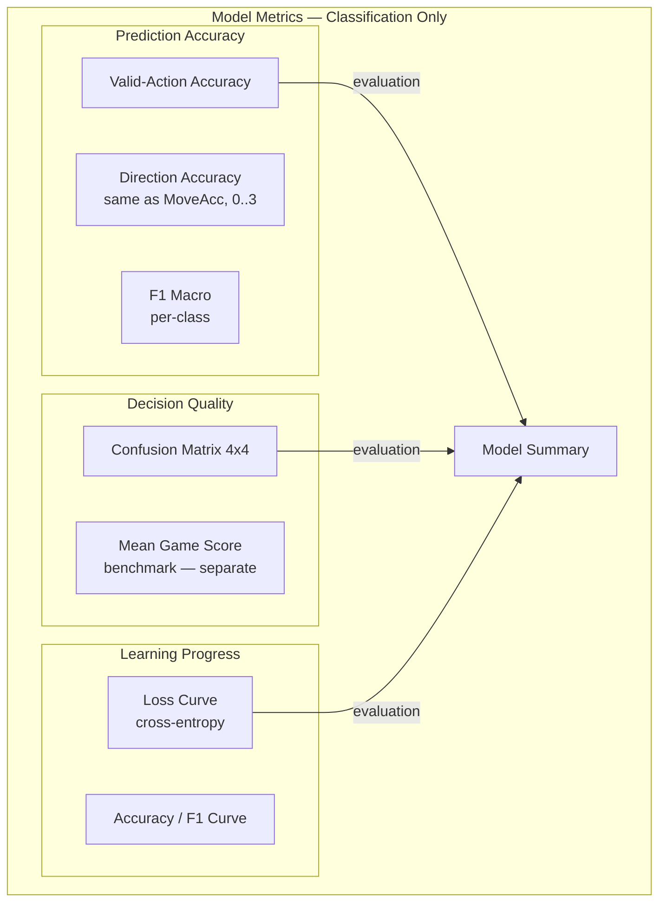
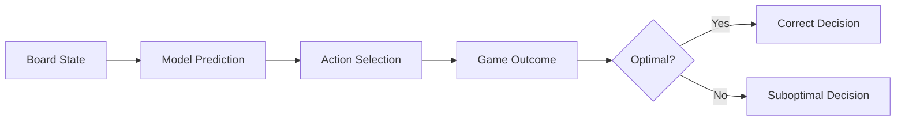
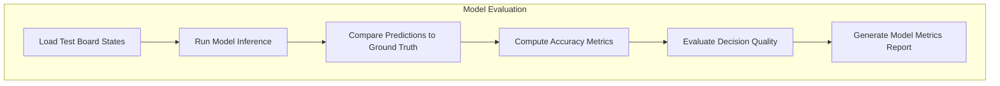
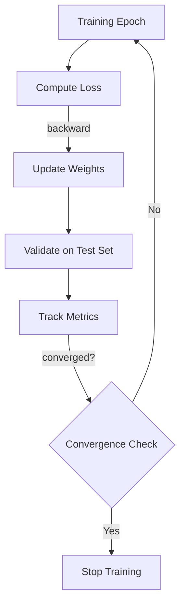
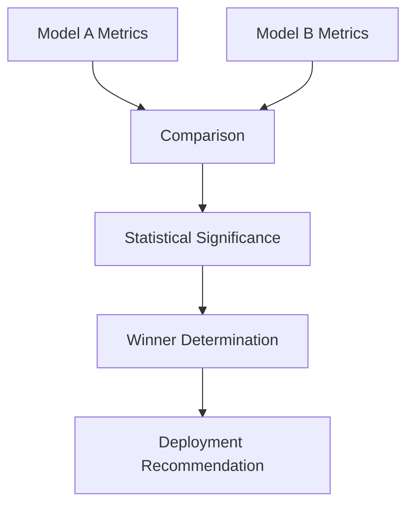

# Plan 02 — Model Metrics: the repository status is explicit and evidence based

> **Status: PLANNED.** Not yet restarted in strict sequence.

**Goal:** State the current implementation and evidence boundary for model metrics.
**Builds on:** [00](../../00-scope-and-traceability.md) — the project is supervised 4×4 2048 policy learning, and framework evaluation is a separate research track.

---

## Decision and evidence

**This plan treats its subject as partial or pending work, not as a research finding.** The rejected alternative is to infer completion from a plan title or related code alone. The ledger records this disposition: Not yet restarted in strict sequence.

## 1. Purpose

Define metrics specifically for evaluating the ML model's predictive and decision-making capabilities in the 2048 game.

## 2. Model Metrics Framework — Classification + Game-Score Benchmark Only



> **No value/reward prediction.** No RL metrics (Q-value, TD error, reward curve, exploration rate).

## 3. Prediction Metrics — Classification Only

| Metric | Description | Purpose |
|--------|-------------|----------|
| Valid-Action Accuracy | % of correct action predictions on valid moves (0–3) | Primary classification metric |
| F1 Macro | Macro-averaged F1 across 4 action classes | Class-balance aware metric |
| Confusion Matrix | 4×4 matrix (Up/Down/Left/Right) | Per-class error analysis |
| Mean Game Score | Mean score over ≥10k benchmark games (separate pipeline) | Downstream benchmark — not regression |

> **Case-study note**: AutoML models are evaluated by classification quality and resource metrics in framework validation. In the 2048 case study, policies are compared by held-out game-score distributions, uncertainty, practical effect, and the declared statistical protocol. The case-study winner is not a claim of globally optimal play.

> **Note on targets**: These targets are deliberately set as progressive milestones. A score of 45% move accuracy corresponds to significantly better than random (25% for 4 actions). Achieving >60% would be a stretch goal. The targets should be iteratively revised based on initial baseline results.

## 4. Decision Quality Metrics



## 5. Model Evaluation Pipeline



## 6. Training Metrics — Classification Only (No RL)

```rust
pub struct TrainingMetrics {
    pub epoch: usize,
    pub loss: f64,                 // cross-entropy
    pub accuracy: f64,             // valid-action accuracy
    pub f1_macro: f64,             // F1 macro
    pub learning_rate: f64,
    pub epoch_time_ms: u64,
    pub validation_loss: f64,
    pub validation_accuracy: f64,
    pub validation_f1_macro: f64,
    pub overfitting_gap: f64,
}

pub struct ModelMetrics {
    pub valid_action_accuracy: f64,
    pub f1_macro: f64,
    pub confusion_matrix: [[usize; 4]; 4],
    pub mean_game_score: f64,      // downstream benchmark — not a training target
    // RL fields (q_value_correlation, td_error, reward_prediction_mae) — removed: not used
}
```

## 7. Loss and Convergence Tracking



## 8. Feature Importance — Post-Training Only

Post-training only — compute permutation/SHAP importance after model is trained, then rank the 27 features. No TBD table pre-training. `MoveCount` not in 27 — do not list.

## 9. Model Comparison Metrics



## 10. Quality Gates — Canonical Thresholds

**Canonical ranking:** Models are **ranked by Mean Game Score** (highest mean wins, ≥10k games, Mann-Whitney U p<0.05 with Bonferroni). No proximity ratio gate for pipeline rejection.

**Acceptance thresholds (all must pass):**
1. **Mean Game Score ≥ 512** (beats heuristic baseline ~512; primary gate)
2. **Valid-Action Accuracy ≥ 60%** (on valid actions only, 0–3)
3. **F1 Macro ≥ 0.55** (weighted/macro across 4 classes)
4. Loss must converge within reasonable training time
5. Validation performance must not degrade significantly (no severe overfitting)
6. All model metrics including mean score must be logged and reproducible
7. Theoretical limit documented: max tile 32768, max score bound open — ranking is by mean score, not proximity

> **Proximity note (optional analysis only):** If reported, proximity = `model_mean_score / heuristic_baseline_mean (≈512)` as a single informative ratio (e.g., 1.5× = 768). Do **not** use as gate (`>0.3/>0.5` deprecated). No `model/theoretical_max` ratio — theoretical max is unknown.

## Implementation Record

- Downstream game score and its descriptive/statistical summaries are implemented. Classification confusion matrix, macro-F1, valid-action accuracy, training curves, and stated quality-gate automation are not implemented; classical tree fitting has no epoch curve.

---

## Verification (definition of done)

1. `test -f plans/07-Benchmarking/02-Metrics/02-model-metrics.md` exits 0.
2. `grep -q '^# Plan 02 — ' plans/07-Benchmarking/02-Metrics/02-model-metrics.md` exits 0.
3. `grep -q '^> \\*\\*Status:' plans/07-Benchmarking/02-Metrics/02-model-metrics.md` exits 0.
4. `grep -q '^\*\*Goal:' plans/07-Benchmarking/02-Metrics/02-model-metrics.md` exits 0.
5. `grep -q '^## Decision and evidence$' plans/07-Benchmarking/02-Metrics/02-model-metrics.md` exits 0.
6. `grep -q '^## Open questions$' plans/07-Benchmarking/02-Metrics/02-model-metrics.md` exits 0.
7. `grep -q '^## Later$' plans/07-Benchmarking/02-Metrics/02-model-metrics.md` exits 0.
8. `bash /Users/evintleovonzko/Documents/works/kolosal/planout2/v2-ai-express/.claude/skills/writing-planout-plans/check-plan.sh plans/07-Benchmarking/02-Metrics/02-model-metrics.md` exits 0.

## Open questions

- **The plan-scale evidence remains bounded by current results.** Not yet restarted in strict sequence. Any larger corpus or external benchmark needs a declared resource budget and retained artifacts.

## Later

- **Complete the remaining research or implementation work recorded above.** It stays deferred until its prerequisites, compute budget, and measurable acceptance evidence are available.
