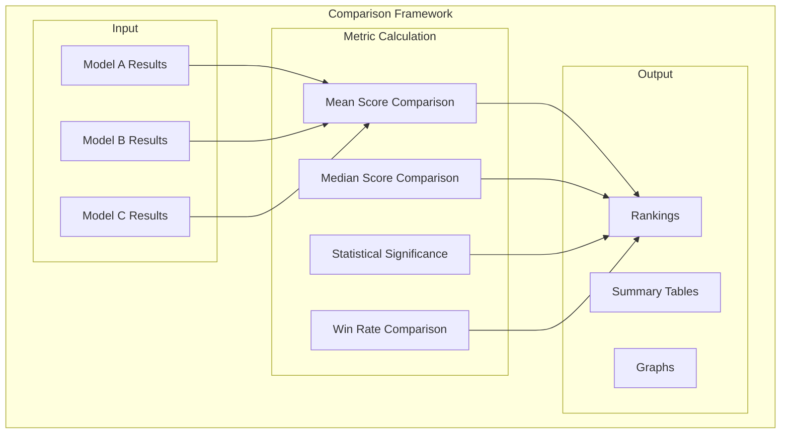
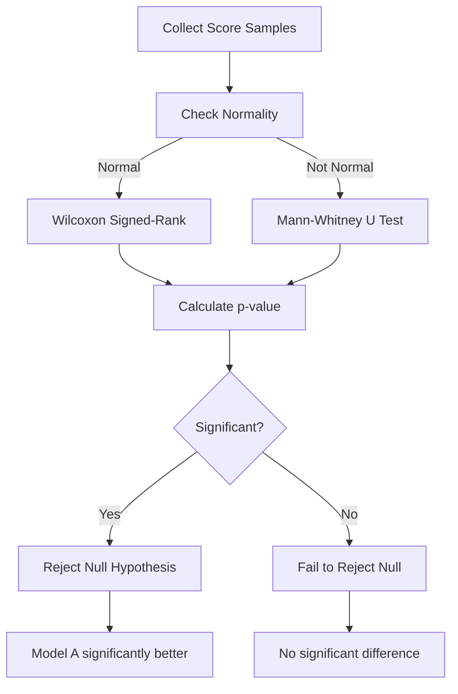
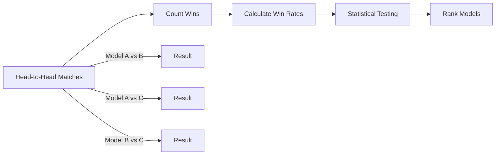
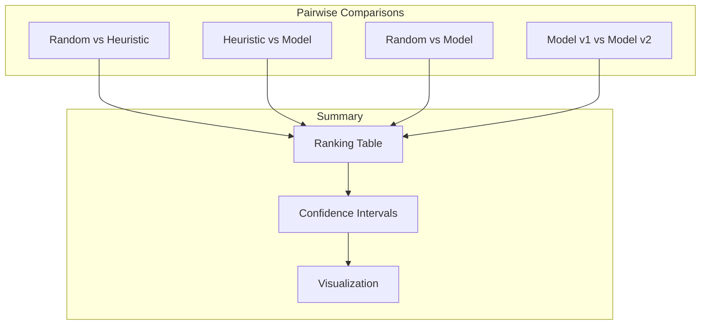
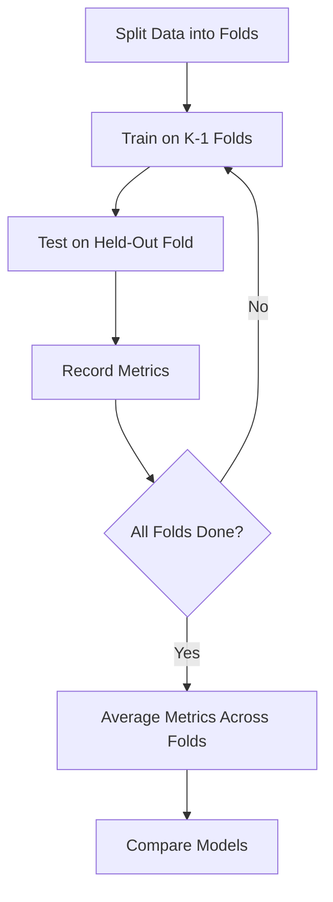

# Comparison Metrics

## 1. Purpose

Define the metrics and methods used to compare different models, algorithms, and configurations in the 2048 ML system.

## 2. Comparison Framework



## 3. Comparison Metrics Matrix

| Metric | Model A | Model B | Model C | Significance |
|--------|---------|---------|---------|-------------|
| Mean Score | 1024 | 2048 | 1536 | p < 0.05 |
| Median Score | 512 | 1024 | 768 | p < 0.05 |
| Std Dev | 512 | 256 | 384 | — |
| Win Rate | 25% | 50% | 35% | p < 0.01 |
| Games > 2048 | 10% | 30% | 20% | p < 0.05 |

## 4. Statistical Comparison Methods



## 5. Win Rate Analysis



## 6. Multi-Model Comparison



## 7. Ranking Methodology

```rust
pub struct ModelRanking {
    pub model_name: String,
    pub mean_score: f64,
    pub median_score: u64,
    pub win_rate: f64,
    pub games_above_2048: f64,
    pub rank: usize,
    pub confidence_interval: (f64, f64),
    pub is_significantly_better: bool,
}

impl ModelRanking {
    pub fn rank_models(models: &[ModelRanking]) -> Vec<ModelRanking> {
        let mut ranked = models.to_vec();
        ranked.sort_by(|a, b| b.mean_score.partial_cmp(&a.mean_score).unwrap());
        for (i, model) in ranked.iter_mut().enumerate() {
            model.rank = i + 1;
        }
        ranked
    }
}
```

## 8. Comparison Visualization


## 9. Cross-Validation Comparison



## 10. Reporting Standards

All comparison reports must include:
- Summary ranking table with confidence intervals
- Statistical significance indicators
- Visual comparison charts
- Detailed metric breakdowns
- Recommendations for model selection
