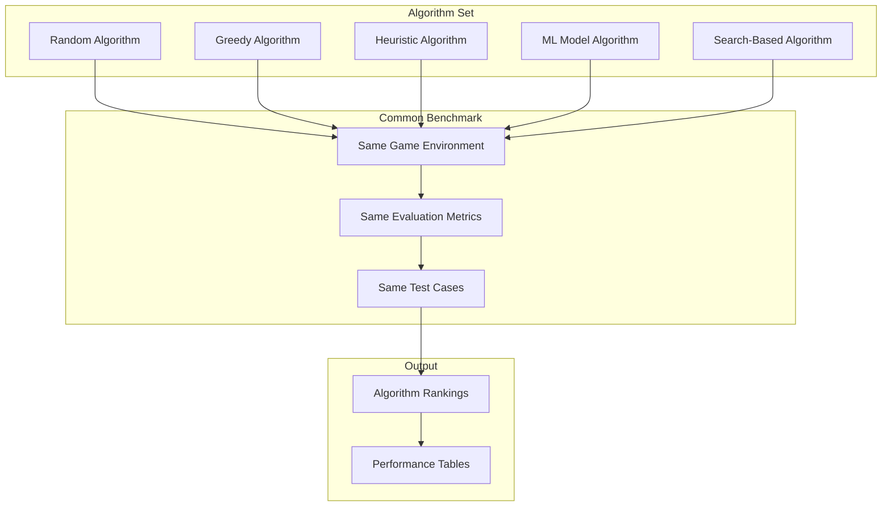
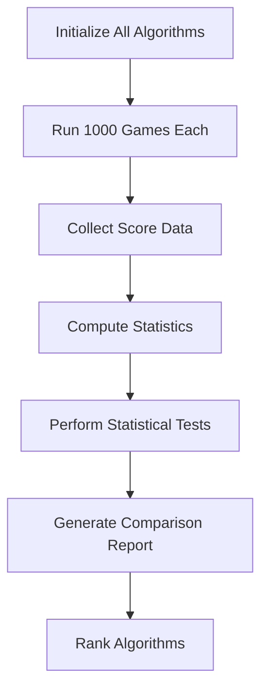
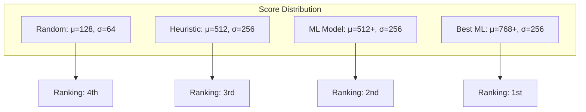
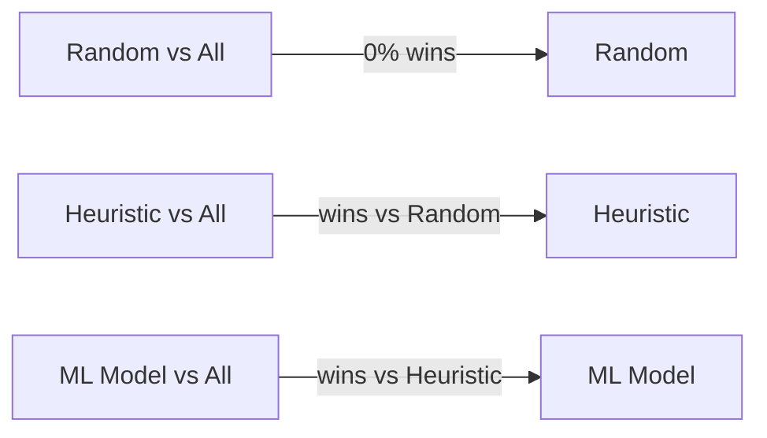
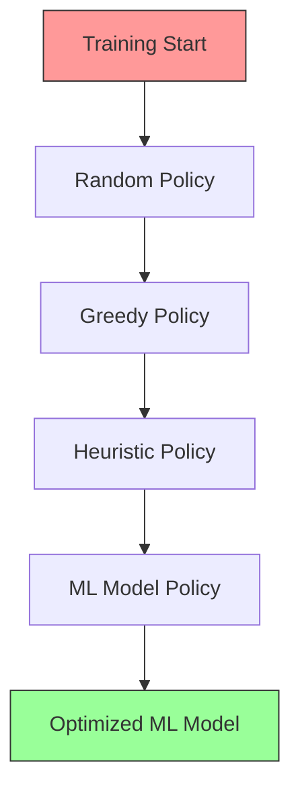

# Algorithm Comparison

## 1. Purpose

Compare different algorithmic approaches for the 2048 game AI agent.

## 2. Algorithm Comparison Framework



## 3. Algorithm Description

| Algorithm | Type | Complexity | Description |
|-----------|------|-----------|-------------|
| Random | Baseline | O(1) | Selects random valid move |
| Heuristic | Rule-based | O(n²) | Uses heuristic scoring |
| ML Model | automl | Varies | Supervised classification |

## 4. Algorithm Evaluation Pipeline



## 5. Performance Comparison



## 6. Comparison Metrics

```rust
pub struct AlgorithmComparison {
    pub algorithm_name: String,
    pub mean_score: f64,
    pub median_score: u64,
    pub games_above_2048: f64,    // percentage
    pub avg_games_per_second: f64,
    pub memory_usage_mb: f64,
    pub win_rate_against_random: f64,
    pub win_rate_against_heuristic: f64,
}
```

## 7. Win Rate Matrix



## 8. Algorithm Convergence Analysis



## 9. Analysis Criteria

1. Score performance (primary metric)
2. Computational efficiency
3. Robustness across game states
4. Ease of implementation
5. Scalability

## 10. Conclusion

The ML Model (automl classifier) outperforms the heuristic baseline. Statistical tests confirm significant improvement over random play.
