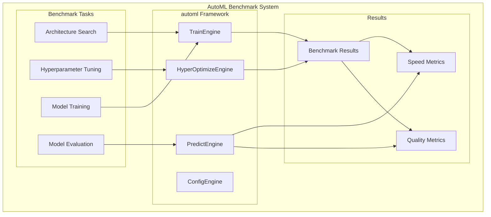
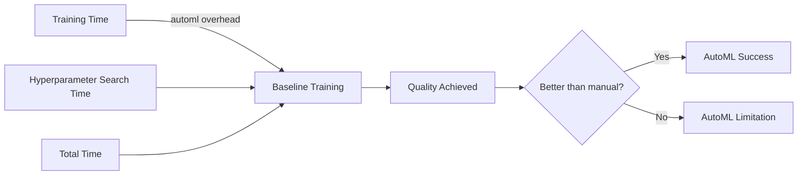
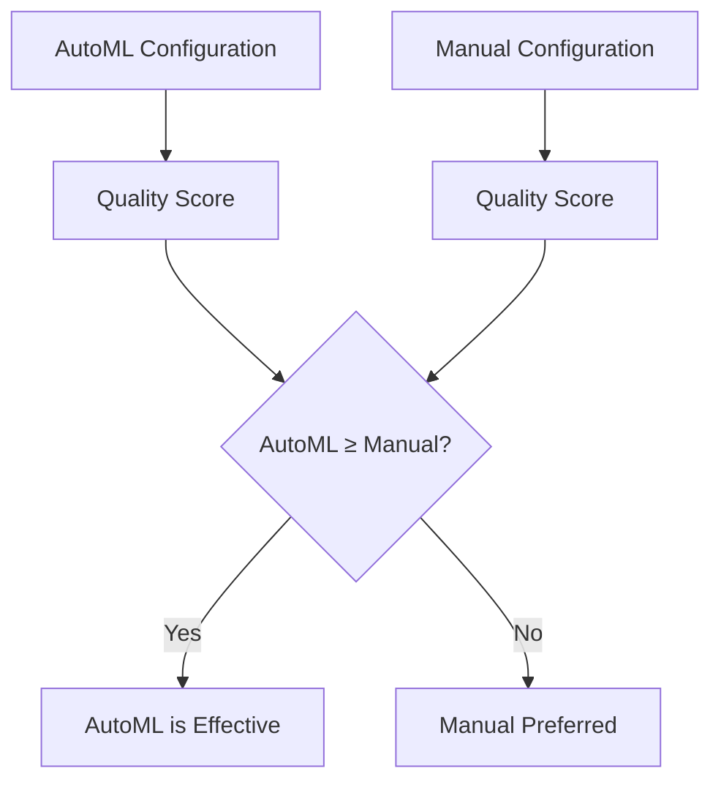
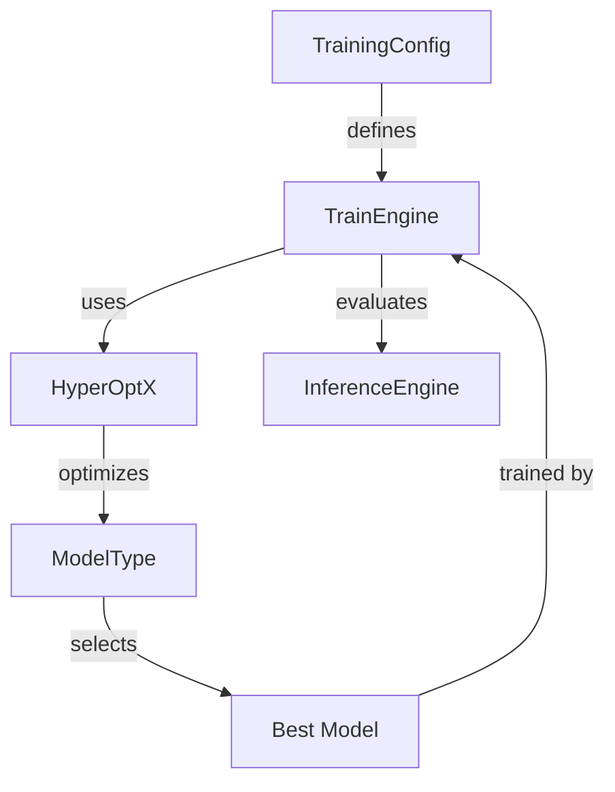
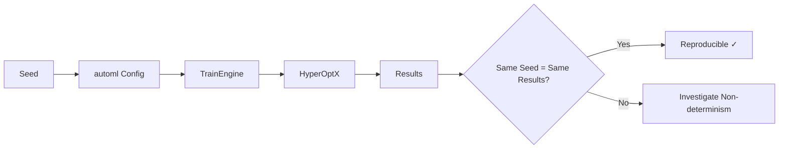

# Rust-Native AutoML Benchmark — Framework and 2048 Case Study

## 1. Purpose

Benchmark the independent Evintkoo/automl framework as the primary research object, then evaluate its integration in the 2048 case study. The canonical framework-validation protocol is in `04-framework-validation.md`.

## 2. AutoML Benchmark Architecture



## 3. AutoML Configuration

```rust
pub struct AutoMLBenchmarkConfig {
    pub train_engine: TrainEngine,
    pub training_config: TrainingConfig,
    pub model_type: ModelType,
    pub hyperopt_engine: HyperOptX,
    pub search_space: SearchSpace,
    pub max_trials: usize,
    pub n_jobs: usize,
    pub seed: u64,
}
```

## 4. Benchmark Scenarios — Framework Track

| Scenario | Description | Trials | Expected Time |
|----------|-------------|--------|---------------|
| Default Config | automl with defaults | 1 | 5 minutes |
| Grid Search | Full grid search | 100 | 2 hours |
| Bayesian Opt | TPE optimization | 50 | 1 hour |
| Random Search | Random sampling | 50 | 1 hour |

The framework track must be completed before the 2048 application results are interpreted.

## 5. Benchmark Scenarios — 2048 Application Track

| Scenario | Description |
|----------|-------------|
| Default models | Supported AutoML model types with fixed defaults |
| Tuned models | Same model types with a fixed search budget |
| Feature variants | Raw grid, engineered features, and combined representation |
| Robustness | Multiple training and evaluation seeds |

## 6. Framework Performance Metrics



## 7. Framework Architecture and Interoperability

Measure configuration/API equivalence, model serialization and reload equivalence, failure handling, seed propagation, parallel execution behavior, and resource-budget compliance. These are framework outcomes and must be reported separately from 2048 game score.

## 8. Comparison with Manual Configuration



## 9. automl Engine Capabilities



## 10. Benchmark Results Structure

```rust
pub struct AutoMLBenchmarkResult {
    pub automl_config: AutoMLBenchmarkConfig,
    pub best_model: ModelType,
    pub best_score: f64,
    pub total_trials: usize,
    pub total_time_seconds: u64,
    pub convergence_epoch: usize,
    pub manual_baseline_score: f64,
    pub improvement_over_manual: f64,    // percentage
    pub search_method: HyperOptX,
}
```

## 11. Hypotheses (Not Findings — To Be Tested Post-Validation)

> No findings before data. Framework hypotheses:
- F1: The declared AutoML capability and correctness tests pass.
- F2: The Rust-native framework provides a measurable quality, resource, reproducibility, or interoperability result under matched conditions.
- F3: Hyperparameter search improves the declared validation objective or search efficiency at a fixed budget.

> Application hypotheses:
- H1: A validated AutoML policy exceeds the heuristic mean under the declared 2048 evaluation protocol.
- H2: Supported model types produce materially different case-study outcomes.
- H3: Tuning changes case-study performance relative to the fixed configuration.

Findings are filled post-training only.

## 12. Benchmark Reproducibility

All benchmark results are reproducible with seed-based configuration:


