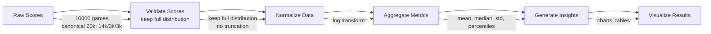

# Results Analysis

## 1. Purpose

Provide comprehensive analysis of benchmarking results for the 2048 ML system.

## 2. Pipeline — Raw → Validate (Keep Full Distribution) → Aggregate → Insights

Raw benchmark data → validate (keep full heavy-tailed distribution, no truncation) → compute mean/median/std/percentiles → comparative stats vs baselines (see `01-Evaluation/01-benchmarking-framework.md §6.4`) → conclusions.

## 3. Data Processing Pipeline — Keep Full Distribution (No Truncation)



> **Do NOT discard high scores.** Game scores are **heavy-tailed signal** — high scores (top 1%) correspond to rare high-tile achievements and are the primary signal for max score / ceiling estimation. Removing top/bottom 1% discards the most valuable tail. **Keep full distribution**, report **percentiles (p50/p90/p95/p99/max)**, and do **no truncation** or outlier filtering on scores.

## 4. Key Analysis Metrics

| Analysis Area | Metric | Method |
|--------------|--------|--------|
| Performance | Mean score trend | Time series analysis |
| Stability | Score variance | Statistical tests |
| Improvement | Score delta over time | Regression analysis |
| Consistency | Win rate stability | Confidence intervals |

## 5. Heavy-Tail §3 & Anomaly §6 — Kept as Core

> **Tail is signal.** Scores are heavy-tailed; keep full distribution, report `p50/p90/p95/p99/max` per §3. Anomaly detection is **investigation only** — log z-scores, never filter (see §6 note). These two sections are the value-add; generic trend/visualization mermaids removed.

## 6. Comparative Analysis

Compare current 10k-game run vs Random (~128) and Heuristic (~512) via Mann-Whitney U + bootstrap CI + Cohen's d (see `01-Evaluation/01-benchmarking-framework.md §6.4`). Identify key factors only post-training.

## 9. Analysis Conclusions

```rust
pub struct AnalysisConclusion {
    pub best_model: String,
    pub best_score: f64,
    pub confidence: f64,
    pub key_factors: Vec<String>,
    pub recommendations: Vec<String>,
    pub next_steps: Vec<String>,
}
```

## 10. Reporting

All analysis results are compiled into:
- Summary dashboard
- Detailed statistical report
- Visual charts and graphs
- Actionable recommendations
