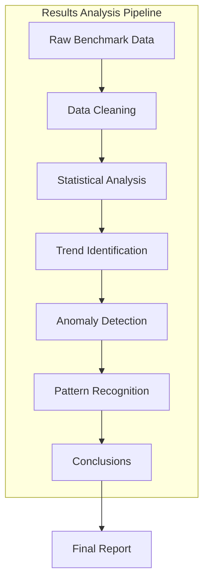
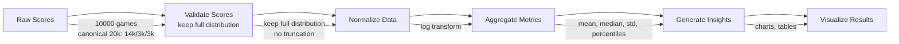
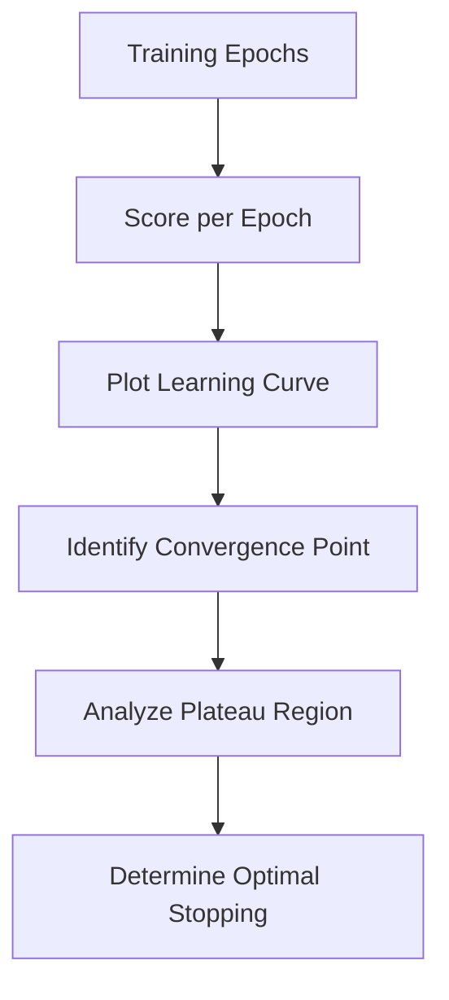
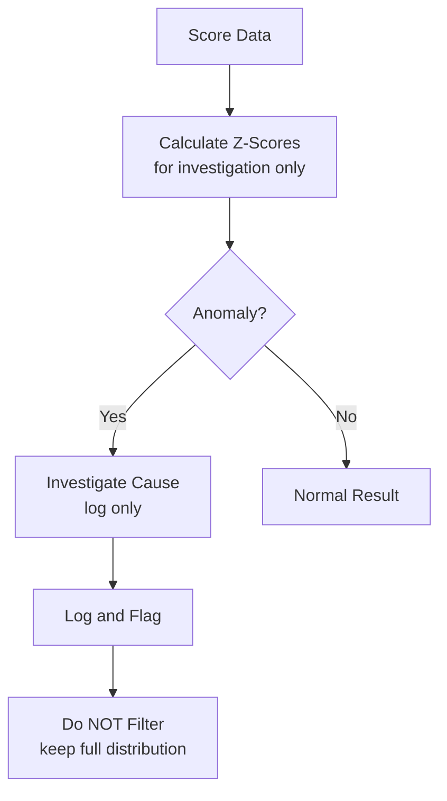
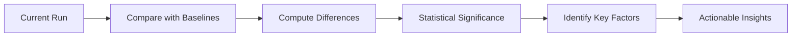
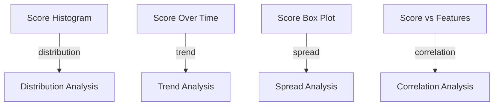

# Results Analysis

## 1. Purpose

Provide comprehensive analysis of benchmarking results for the 2048 ML system.

## 2. Results Analysis Framework



## 3. Data Processing Pipeline — Keep Full Distribution (No Truncation)



> **Do NOT discard high scores.** Game scores are **heavy-tailed signal** — high scores (top 1%) correspond to rare high-tile achievements and are the primary signal for max score / ceiling estimation. Removing top/bottom 1% discards the most valuable tail. **Keep full distribution**, report **percentiles (p50/p90/p95/p99/max)**, and do **no truncation** or outlier filtering on scores.

## 4. Key Analysis Metrics

| Analysis Area | Metric | Method |
|--------------|--------|--------|
| Performance | Mean score trend | Time series analysis |
| Stability | Score variance | Statistical tests |
| Improvement | Score delta over time | Regression analysis |
| Consistency | Win rate stability | Confidence intervals |

## 5. Trend Analysis



## 6. Anomaly Detection — For Investigation Only, Not Filtering



> High scores are heavy-tailed signal, not anomalies to remove. Z-score flagging is for **diagnostics/logging only** — do **not** filter or truncate scores before aggregation (see §3). Keep full distribution; report percentiles.

## 7. Comparative Analysis



## 8. Results Visualization



## 9. Analysis Conclusions

```rust
pub struct AnalysisConclusion {
    pub best_model: String,
    pub best_score: f64,
    pub confidence: f64,
    pub key_factors: Vec<String>,
    pub recommendations: Vec<String>,
    pub next_steps: Vec<String>,
}
```

## 10. Reporting

All analysis results are compiled into:
- Summary dashboard
- Detailed statistical report
- Visual charts and graphs
- Actionable recommendations
