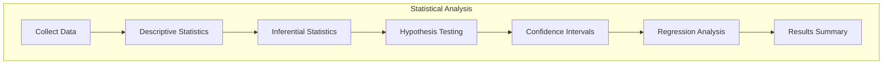
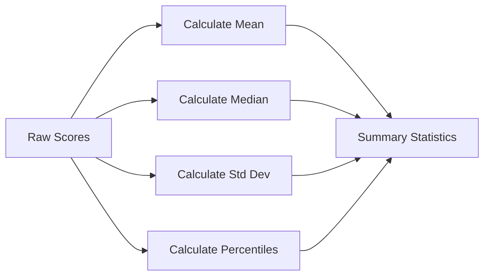
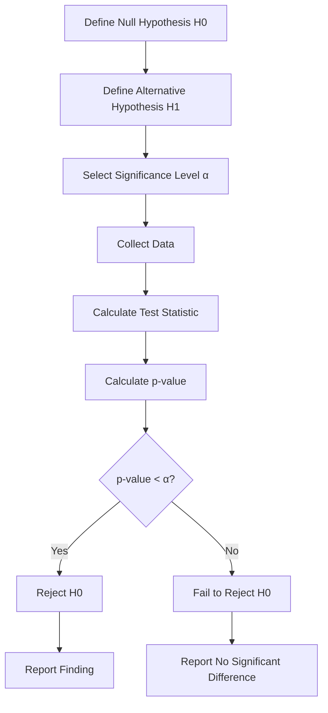
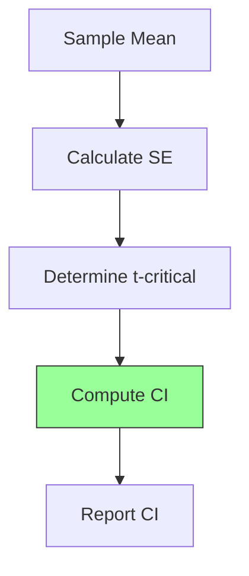
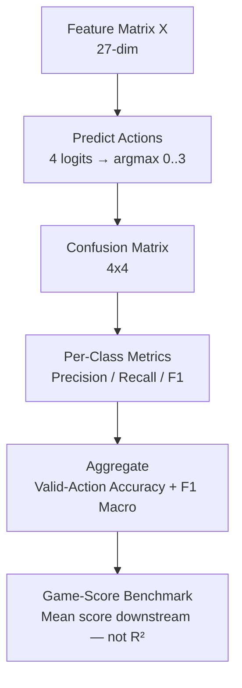
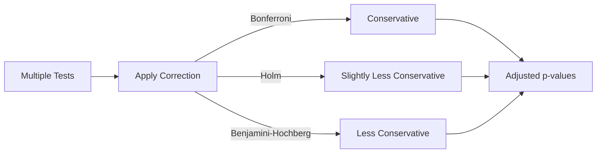
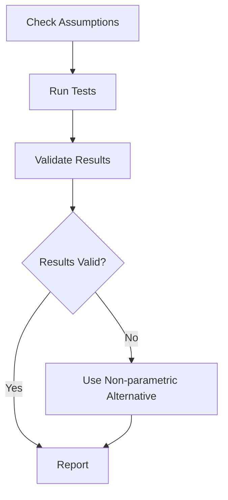

# Plan 02 — Statistical Analysis: the repository status is explicit and evidence based

> **Status: PLANNED.** Not yet restarted in strict sequence.

**Goal:** State the current implementation and evidence boundary for statistical analysis.
**Builds on:** [00](../../00-scope-and-traceability.md) — the project is supervised 4×4 2048 policy learning, and framework evaluation is a separate research track.

---

## Decision and evidence

**This plan treats its subject as partial or pending work, not as a research finding.** The rejected alternative is to infer completion from a plan title or related code alone. The ledger records this disposition: Not yet restarted in strict sequence.

> **Distinct focus vs `03-significance-testing.md`:** This file = descriptive foundations (distributions, CIs, test assumptions). `03-significance-testing.md` = winner determination protocol (adjusted α, ranking, power). No duplication — cross-ref there for ranking.

## 1. Purpose

Apply statistical methods to validate the performance of the 2048 ML system.

## 2. Statistical Analysis Framework



## 3. Descriptive Statistics



## 4. Inferential Statistics

| Test | Purpose | Assumption |
|------|---------|------------|
| Mann-Whitney U | Compare distributions | Independent samples |
| Wilcoxon | Paired comparison | Same seed sequence |
| Kruskal-Wallis | Compare multiple groups | Non-parametric |
| Chi-squared | Categorical comparison | Expected frequency ≥ 5 |

## 5. Hypothesis Testing Pipeline



## 6. Confidence Intervals



```rust
pub struct ConfidenceInterval {
    pub point_estimate: f64,
    pub lower_bound: f64,
    pub upper_bound: f64,
    pub confidence_level: f64,    // e.g., 0.95
    pub standard_error: f64,
}

impl ConfidenceInterval {
    pub fn new(mean: f64, std_err: f64, confidence: f64) -> ConfidenceInterval {
        let z_critical = match confidence {
            0.90 => 1.645,
            0.95 => 1.96,
            0.99 => 2.576,
            _ => 1.96,
        };
        ConfidenceInterval {
            point_estimate: mean,
            lower_bound: mean - z_critical * std_err,
            upper_bound: mean + z_critical * std_err,
            confidence_level: confidence,
            standard_error: std_err,
        }
    }
}
```

## 7. Classification Analysis — No Regression (Actions 0–3 Only)

> **No regression.** Task is `TaskType::MultiClassification` (27-dim → 4 logits → `argmax`). Score is a downstream game-score benchmark, not a regression target. Do not fit `score` as `y` or report R² / RMSE / MSE.



## 8. Multiple Comparison Correction



## 9. Statistical Significance Reporting

All results must report:
- Test used and assumptions checked
- p-value and confidence interval
- Effect size
- Practical significance vs statistical significance

## Implementation Record

- Implemented helpers provide descriptive score summaries, percentile bootstrap confidence intervals, Mann–Whitney U, paired exact sign test, Holm correction, and Cohen's d. Kruskal–Wallis, Wilcoxon, categorical tests, power analysis, and a completed report are absent.

## 10. Analysis Validation



---

## Verification (definition of done)

1. `test -f plans/07-Benchmarking/04-Analysis/02-statistical-analysis.md` exits 0.
2. `grep -q '^# Plan 02 — ' plans/07-Benchmarking/04-Analysis/02-statistical-analysis.md` exits 0.
3. `grep -q '^> \\*\\*Status:' plans/07-Benchmarking/04-Analysis/02-statistical-analysis.md` exits 0.
4. `grep -q '^\*\*Goal:' plans/07-Benchmarking/04-Analysis/02-statistical-analysis.md` exits 0.
5. `grep -q '^## Decision and evidence$' plans/07-Benchmarking/04-Analysis/02-statistical-analysis.md` exits 0.
6. `grep -q '^## Open questions$' plans/07-Benchmarking/04-Analysis/02-statistical-analysis.md` exits 0.
7. `grep -q '^## Later$' plans/07-Benchmarking/04-Analysis/02-statistical-analysis.md` exits 0.
8. `bash /Users/evintleovonzko/Documents/works/kolosal/planout2/v2-ai-express/.claude/skills/writing-planout-plans/check-plan.sh plans/07-Benchmarking/04-Analysis/02-statistical-analysis.md` exits 0.

## Open questions

- **The plan-scale evidence remains bounded by current results.** Not yet restarted in strict sequence. Any larger corpus or external benchmark needs a declared resource budget and retained artifacts.

## Later

- **Complete the remaining research or implementation work recorded above.** It stays deferred until its prerequisites, compute budget, and measurable acceptance evidence are available.
