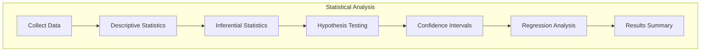
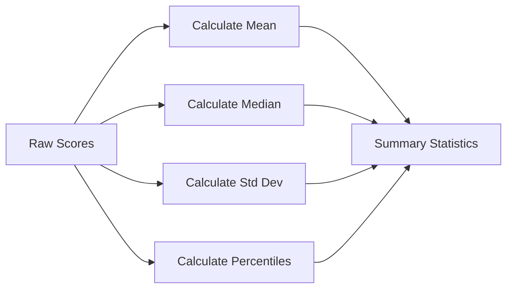
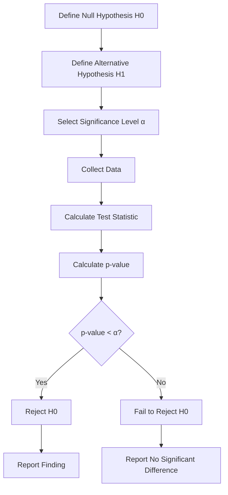
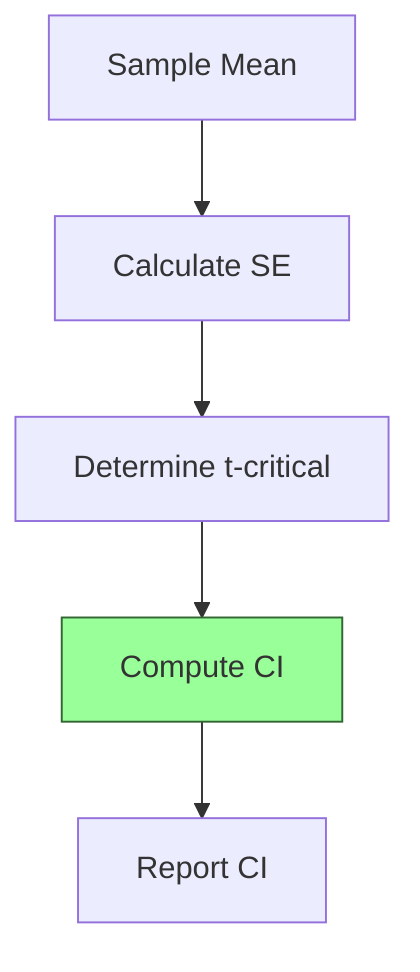
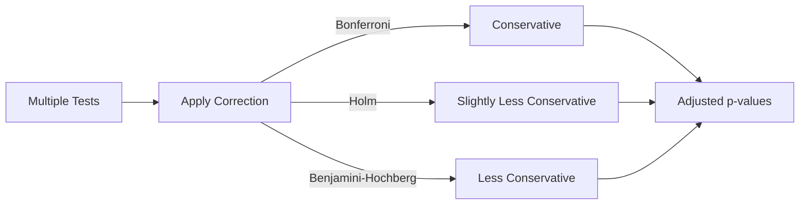
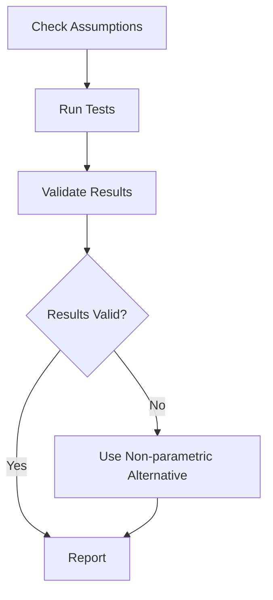

# Plan 02 — Statistical Analysis: the repository status is explicit and evidence based

> **Status: PARTIAL (2026-09-27).** Descriptive summaries, pairwise score tests, and reusable classification metrics exist; power planning and broader tests remain absent.

**Goal:** State the current implementation and evidence boundary for statistical analysis.
**Builds on:** [00](../../00-scope-and-traceability.md) — the project is supervised 4×4 2048 policy learning, and framework evaluation is a separate research track.

---

## Decision and evidence

**This plan is partial.** Available inference consists of independent Mann–Whitney U or paired exact sign tests, percentile bootstrap intervals, Holm adjustment, and Cohen's d. These helpers do not constitute the broader analysis plan or a completed research report.

> **Distinct focus vs `03-significance-testing.md`:** This file = descriptive foundations (distributions, CIs, test assumptions). `03-significance-testing.md` = winner determination protocol (adjusted α, ranking, power). No duplication — cross-ref there for ranking.

## 1. Purpose

Apply statistical methods to validate the performance of the 2048 ML system.

## 2. Statistical Analysis Framework

## 3. Descriptive Statistics

## 4. Inferential Statistics

| Test | Purpose | Assumption |
|------|---------|------------|
| Mann-Whitney U | Compare distributions | Independent samples |
| Paired exact sign test | Paired comparison | Same ordered seed sequence; ties omitted |
| Wilcoxon signed-rank | Not implemented | Planned only |
| Kruskal-Wallis | Not implemented | Planned only |
| Chi-squared | Not implemented | Planned only |

## 5. Hypothesis Testing Pipeline

## 6. Confidence Intervals

Current score-summary intervals and pairwise mean-difference intervals use percentile bootstrap resampling. They are implemented helpers, not the illustrative normal-approximation struct above; clustering of paired games is not modeled by the comparison bootstrap.

## 7. Classification Analysis — No Regression (Actions 0–3 Only)

> **No regression.** The 2048 task uses `TaskType::MultiClassification` with the canonical 17-value state and four action labels. Score is a downstream game-score benchmark, not a regression target. Do not fit `score` as `y` or report R² / RMSE / MSE.

Generic classification helpers now compute confusion matrices, accuracy, per-class F1, and macro precision/recall/F1. A separate four-action helper reports prediction legality for 2048 policies. These helpers do not yet produce a fixed-split classification report from the application evaluation CLI. Game score is a downstream outcome, not a regression target for the supervised action classifier.

## 8. Multiple Comparison Correction

## 9. Statistical Significance Reporting

All results must report:
- Test used and assumptions checked
- p-value and confidence interval
- Effect size
- Practical significance vs statistical significance

## Implementation Record

- `src/evaluation.rs` and comparison/report paths provide score summaries, bootstrap intervals, Mann–Whitney U, paired exact sign test, Holm-adjusted p-values, Cohen's d, and reusable classification summaries. The initial UCI results are descriptive single-split metrics; two-run repeatability is reported separately and is not an inferential comparison. Kruskal–Wallis, Wilcoxon, formal power analysis, explicit assumption diagnostics, and a populated 2048 case-study report remain absent.

## 10. Analysis Validation

---

## Verification (definition of done)

1. `test -f plans/07-Benchmarking/04-Analysis/02-statistical-analysis.md` exits 0.
2. `grep -q '^# Plan 02 — ' plans/07-Benchmarking/04-Analysis/02-statistical-analysis.md` exits 0.
3. `grep -q '^> \\*\\*Status:' plans/07-Benchmarking/04-Analysis/02-statistical-analysis.md` exits 0.
4. `grep -q '^\*\*Goal:' plans/07-Benchmarking/04-Analysis/02-statistical-analysis.md` exits 0.
5. `grep -q '^## Decision and evidence$' plans/07-Benchmarking/04-Analysis/02-statistical-analysis.md` exits 0.
6. `grep -q '^## Open questions$' plans/07-Benchmarking/04-Analysis/02-statistical-analysis.md` exits 0.
7. `grep -q '^## Later$' plans/07-Benchmarking/04-Analysis/02-statistical-analysis.md` exits 0.
8. `bash /Users/evintleovonzko/Documents/works/kolosal/planout2/v2-ai-express/.claude/skills/writing-planout-plans/check-plan.sh plans/07-Benchmarking/04-Analysis/02-statistical-analysis.md` exits 0.

## Open questions

- **The plan-scale evidence remains bounded by current results.** Any larger corpus or external benchmark needs a declared resource budget and retained artifacts.

## Later

- **Complete the remaining research or implementation work recorded above.** It stays deferred until its prerequisites, compute budget, and measurable acceptance evidence are available.
