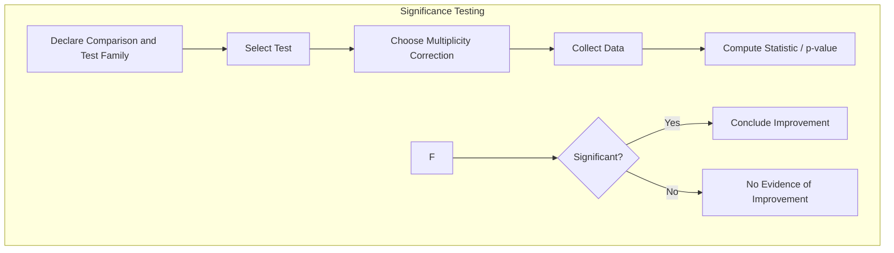
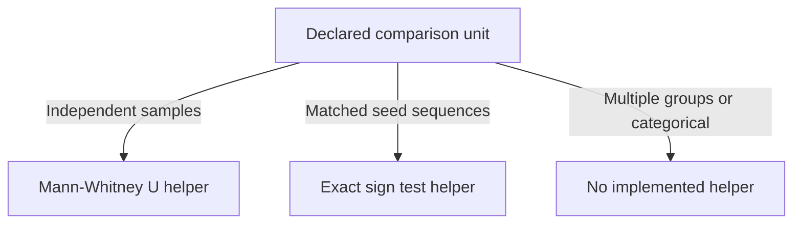
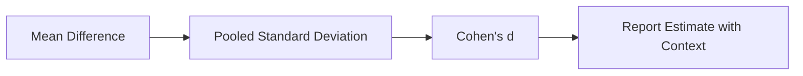
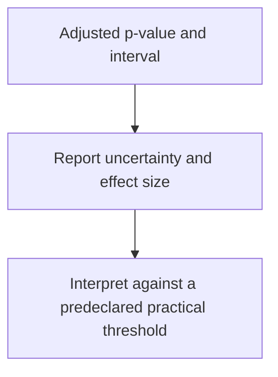

# Plan 03 — Significance Testing: the repository status is explicit and evidence based

> **Status: PARTIAL (2026-09-26).** Several test and effect-size helpers feed comparison reports; power analysis and a predeclared winner study are pending.

**Goal:** State the current implementation and evidence boundary for significance testing.
**Builds on:** [00](../../00-scope-and-traceability.md) — the project is supervised 4×4 2048 policy learning, and framework evaluation is a separate research track.

---

## Decision and evidence

**This plan is partial.** Implemented comparisons choose an independent Mann–Whitney U test or a paired exact sign test based on seed sequence equality, apply Holm adjustment, and report bootstrap mean-difference intervals and Cohen's d. There is no validated winner result or power analysis.

## 1. Purpose

Define the statistical procedures for the primary Rust-native AutoML framework benchmarks and the downstream 2048 case study. Statistical tests support claims; they do not substitute for architecture evidence, correctness testing, or a valid experimental unit.

## 2. Significance Testing Framework



## 3. Test Selection Guide



## 4. Detailed Test Procedures

### 4.1 Mann-Whitney U Test

Used only when the comparison groups are independent at the declared unit of analysis. If models are evaluated on the same game instances, use a paired or clustered procedure instead of treating games as independent observations.

**Null Hypothesis (H0):** The distributions of scores for both groups are identical.

**Alternative Hypothesis (H1):** The distributions differ (one tends to produce higher scores).

**Test Statistic:** U = min(U1, U2) where U1 and U2 are the rank sums.

**Decision rule:** compare the p-value against the preregistered threshold after the declared multiplicity correction.

The comparison report also includes Cohen's d. The implemented test helper returns a p-value; it does not return a U statistic, rank-biserial effect, or Cliff's delta.

### 4.2 Paired Exact Sign Test (Implemented)

Used by the comparison command when the ordered seed sequences match. It counts direction of non-tied paired differences and does not use their magnitudes.

It is not Wilcoxon signed-rank and does not test a rank-sum statistic. Wilcoxon remains unimplemented.

### 4.3 Multi-group Tests (Not Implemented)

Kruskal–Wallis and post-hoc Dunn tests are not implemented. Multiple model inputs currently produce pairwise rows, not a validated global multi-group test or ranking protocol.

### 4.4 Bootstrap Confidence Intervals

Used for estimating the uncertainty of mean scores.

**Procedure:**
1. Resample each input independently with replacement for the configured replicate count (the CLI currently uses 5,000)
2. Compute the mean score for each resample
3. Take the 2.5th and 97.5th percentiles as the 95% CI

## 5. Effect Size Calculation



**Reporting guidance:** Report p-values with effect sizes and uncertainty when these analyses apply. Statistical significance alone does not establish practical value.

## 6. Power Analysis

```mermaid
graph TD
    A[Define Effect Size] --> B[Set α Level]
    B --> C[Set Power (1-β)]
    C --> D[Calculate Required Sample Size]
    D --> E[Run Tests with N Samples]
    E --> F[Report Precision / Power Rationale]
```

**Sample size justification:** Do not infer power from the number of game instances alone. Predeclare the experimental unit, minimum practically meaningful improvement, expected variance, number of trained-model repetitions, and clustering structure. Framework benchmarks and 2048 game evaluations require separate power or precision calculations.

## 7. Multiple Testing Correction

### 7.1 Holm Adjustment (Implemented)

The comparison CLI applies Holm adjustment to the declared family of pairwise comparisons. The family is determined by the compared score inputs; this plan does not prescribe a fixed model/baseline matrix or universal alpha threshold.

### 7.3 Reporting Standards

Every significance test report must include:
- Whether Holm adjustment was applied
- N_comparisons value
- Declared decision threshold, if the study uses one
- Which p-values survived correction
- Test statistic value
- p-value with precision
- Effect size and interpretation
- Confidence interval
- Practical significance assessment

## 8. Decision Framework



## 9. Winner Determination Protocol

No winner determination is currently supported. A future protocol must specify game-level or seed-level experimental units, model-training repetitions, sample size/precision rationale, matched evaluation seeds, practical threshold, and multiplicity family before collecting confirmatory data. Fixed game counts and Cohen's d categories in explanatory material are not evidence-based acceptance rules.

## 10. Rust Implementation

`src/evaluation.rs` contains standalone helpers rather than the proposed `SignificanceTest` abstraction. `src/main.rs` chooses a paired exact sign test when seed sequences match, otherwise Mann–Whitney U; it writes raw and Holm-adjusted p-values, a 5,000-replicate bootstrap mean-difference interval, and Cohen's d. The comparison manifest records the test and paired-test limitation.

## 11. References

- Holm, S. (1979). A simple sequentially rejective multiple test procedure. *Scandinavian Journal of Statistics*, 6(65-70).
- Mann, H. B., & Whitney, D. R. (1947). On a test of whether one of two random variables is stochastically larger than the other. *The Annals of Mathematical Statistics*, 18(1), 50-60.
- Kruskal, W. H., & Wallis, W. A. (1952). Use of ranks in one-criterion variance analysis. *Journal of the American Statistical Association*, 47(260), 583-621.
- Efron, B., & Tibshirani, R. J. (1993). *An Introduction to the Bootstrap*. Chapman & Hall/CRC.
- Cohen, J. (1988). *Statistical Power Analysis for the Behavioral Sciences*. Lawrence Erlbaum Associates.

## Implementation Record

- Mann–Whitney U, paired exact sign test, bootstrap mean-difference CI, Holm adjustment, and Cohen's d helpers are implemented and used by the comparison command. No Kruskal–Wallis/Wilcoxon, permutation test, formal power analysis, clustered paired bootstrap, or predeclared winner study has been completed. Test choice and limitations are emitted in comparison reports.
- The two seed-42 UCI runs under AutoML `82d8483` are compared only for exact prediction repeatability; no significance test is applied to their one-split model accuracies. The earlier Wine KNN mismatch on `88a86bf` is retained as historical framework reproducibility evidence, not as a model-quality comparison.

---

## Verification (definition of done)

1. `test -f plans/07-Benchmarking/04-Analysis/03-significance-testing.md` exits 0.
2. `grep -q '^# Plan 03 — ' plans/07-Benchmarking/04-Analysis/03-significance-testing.md` exits 0.
3. `grep -q '^> \\*\\*Status:' plans/07-Benchmarking/04-Analysis/03-significance-testing.md` exits 0.
4. `grep -q '^\*\*Goal:' plans/07-Benchmarking/04-Analysis/03-significance-testing.md` exits 0.
5. `grep -q '^## Decision and evidence$' plans/07-Benchmarking/04-Analysis/03-significance-testing.md` exits 0.
6. `grep -q '^## Open questions$' plans/07-Benchmarking/04-Analysis/03-significance-testing.md` exits 0.
7. `grep -q '^## Later$' plans/07-Benchmarking/04-Analysis/03-significance-testing.md` exits 0.
8. `bash /Users/evintleovonzko/Documents/works/kolosal/planout2/v2-ai-express/.claude/skills/writing-planout-plans/check-plan.sh plans/07-Benchmarking/04-Analysis/03-significance-testing.md` exits 0.

## Open questions

- **The plan-scale evidence remains bounded by current results.** Any larger corpus or external benchmark needs a declared resource budget and retained artifacts.

## Later

- **Complete the remaining research or implementation work recorded above.** It stays deferred until its prerequisites, compute budget, and measurable acceptance evidence are available.
