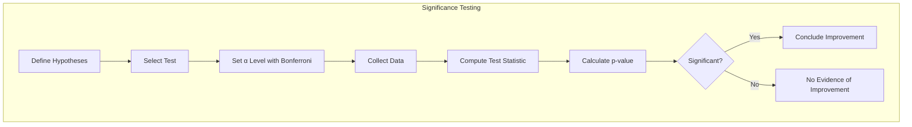
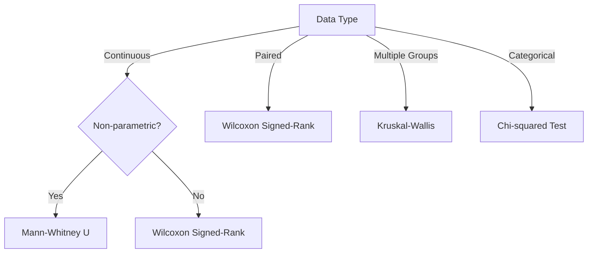
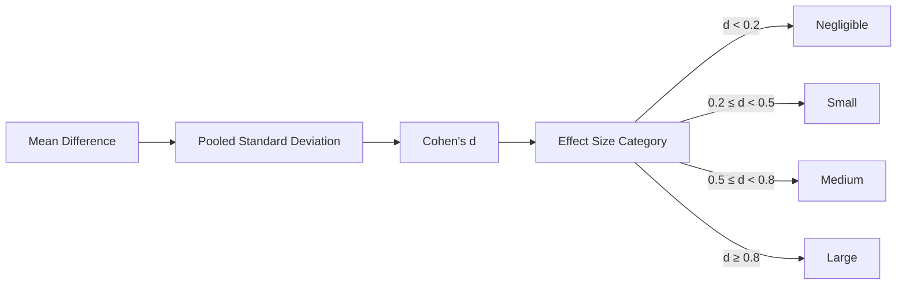
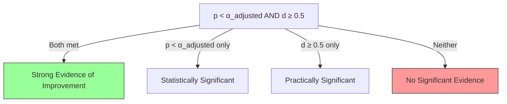

# Significance Testing

## 1. Purpose

Define the statistical procedures for the primary Rust-native AutoML framework benchmarks and the downstream 2048 case study. Statistical tests support claims; they do not substitute for architecture evidence, correctness testing, or a valid experimental unit.

## 2. Significance Testing Framework



## 3. Test Selection Guide



## 4. Detailed Test Procedures

### 4.1 Mann-Whitney U Test

Used only when the comparison groups are independent at the declared unit of analysis. If models are evaluated on the same game instances, use a paired or clustered procedure instead of treating games as independent observations.

**Null Hypothesis (H0):** The distributions of scores for both groups are identical.

**Alternative Hypothesis (H1):** The distributions differ (one tends to produce higher scores).

**Test Statistic:** U = min(U1, U2) where U1 and U2 are the rank sums.

**Significance:** p < α_adjusted (after Bonferroni correction)

**Effect Size:** r = Z / √N (Cliff's delta for non-parametric effect size)

### 4.2 Wilcoxon Signed-Rank Test

Used for paired comparisons (e.g., Tuned vs Default hyperparameters for the same model).

**Null Hypothesis (H0):** The median difference between pairs is zero.

**Alternative Hypothesis (H1):** The median difference is not zero.

**Test Statistic:** W = sum of positive ranks.

### 4.3 Kruskal-Wallis Test

Used for comparing three or more independent groups (e.g., all 7 model types).

**Null Hypothesis (H0):** All groups have identical distributions.

**Alternative Hypothesis (H1):** At least one group differs.

**Post-hoc:** Dunn's test with Bonferroni correction for pairwise comparisons.

### 4.4 Bootstrap Confidence Intervals

Used for estimating the uncertainty of mean scores.

**Procedure:**
1. Resample the data with replacement B times (B = 10,000)
2. Compute the mean score for each resample
3. Take the 2.5th and 97.5th percentiles as the 95% CI

## 5. Effect Size Calculation



**Reporting standards:** All comparisons must report both p-value AND effect size. A statistically significant result with negligible effect size is not practically meaningful.

## 6. Power Analysis

```mermaid
graph TD
    A[Define Effect Size] --> B[Set α Level]
    B --> C[Set Power (1-β)]
    C --> D[Calculate Required Sample Size]
    D --> E[Run Tests with N Samples]
    E --> F{Achieved Power ≥ 0.8?}
    F -->|Yes| G[Valid Results]
    F -->|No| H[Increase Sample Size]
```

**Sample size justification:** Do not infer power from the number of game instances alone. Predeclare the experimental unit, minimum practically meaningful improvement, expected variance, number of trained-model repetitions, and clustering structure. Framework benchmarks and 2048 game evaluations require separate power or precision calculations.

## 7. Multiple Testing Correction

### 7.1 Bonferroni Correction

When comparing against **multiple baselines** AND **multiple models**, the family-wise error rate inflates:

```
N_comparisons = n_baselines × n_models
α_adjusted = 0.05 / N_comparisons
```

**Example:** 2 baselines × 7 models = 14 comparisons → α_adjusted = 0.00357

### 7.2 Holm-Bonferroni Correction

For less conservative correction (step-down procedure):
1. Sort all p-values in ascending order
2. Compare each p-value to α/(k+1-i) where k = total tests, i = rank
3. Stop at first non-significant result

### 7.3 Reporting Standards

Every significance test report must include:
- Whether Bonferroni (or Holm-Bonferroni) was applied
- N_comparisons value
- α_adjusted value
- Which p-values survived correction
- Test statistic value
- p-value with precision
- Effect size and interpretation
- Confidence interval
- Practical significance assessment

## 8. Decision Framework



## 9. Winner Determination Protocol

For winner determination in model ranking:

1. **Compute mean score** for each model across ≥10,000 games
2. **Rank by mean score** (highest = rank 1)
3. **Statistical significance**: The #1 ranked model must be significantly better than #2 (Mann-Whitney U, p < α_adjusted)
4. **Bootstrap 95% CI** on mean difference must not include zero
5. **Effect size** (Cohen's d) must be ≥ 0.5
6. **Tiebreaker**: If tied on mean score, use median score; if still tied, use lower std dev

## 10. Rust Implementation

```rust
pub struct SignificanceTest {
    pub sample_a: Vec<u64>,
    pub sample_b: Vec<u64>,
    pub test_type: TestType,
    pub alpha: f64,
}

pub struct TestResult {
    pub test_statistic: f64,
    pub p_value: f64,
    pub is_significant: bool,
    pub confidence_interval: (f64, f64),
    pub effect_size: f64,
    pub conclusion: String,
}

impl SignificanceTest {
    pub fn run(&self) -> TestResult {
        TestResult {
            test_statistic: 0.0,
            p_value: 1.0,
            is_significant: false,
            confidence_interval: (0.0, 0.0),
            effect_size: 0.0,
            conclusion: String::new(),
        }
    }
}
```

## 11. References

- Holm, S. (1979). A simple sequentially rejective multiple test procedure. *Scandinavian Journal of Statistics*, 6(65-70).
- Mann, H. B., & Whitney, D. R. (1947). On a test of whether one of two random variables is stochastically larger than the other. *The Annals of Mathematical Statistics*, 18(1), 50-60.
- Kruskal, W. H., & Wallis, W. A. (1952). Use of ranks in one-criterion variance analysis. *Journal of the American Statistical Association*, 47(260), 583-621.
- Efron, B., & Tibshirani, R. J. (1993). *An Introduction to the Bootstrap*. Chapman & Hall/CRC.
- Cohen, J. (1988). *Statistical Power Analysis for the Behavioral Sciences*. Lawrence Erlbaum Associates.
