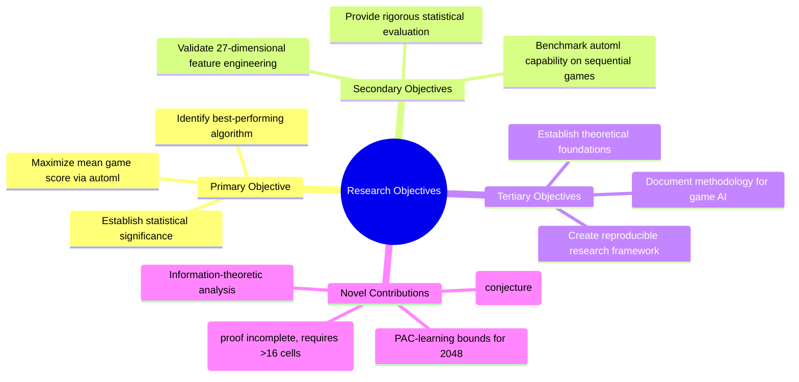
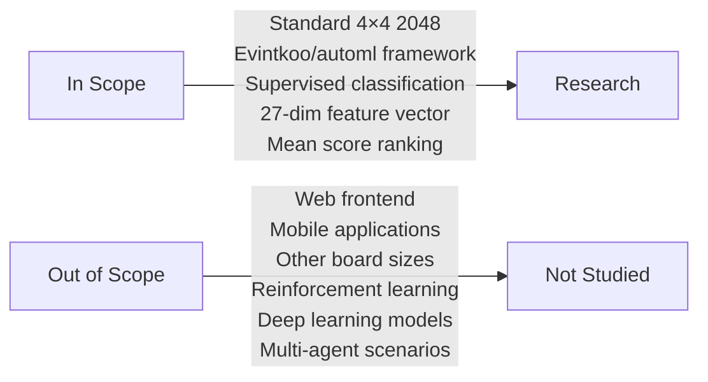

# Introduction

## 1. Background

The 2048 game presents a compelling challenge for machine learning systems. As a single-player stochastic puzzle game with a finite state space but exponentially large decision tree, 2048 occupies a unique intersection of combinatorial game theory, sequential decision-making, and heuristic search. The game's simplicity of rules contrasts sharply with the complexity of optimal play, making it an ideal testbed for evaluating automated machine learning (AutoML) systems on sequential decision problems.

This research investigates whether the Evintkoo/automl framework — a Rust-based AutoML system — can effectively train machine learning models to maximize mean game score in 2048, and which candidate algorithm achieves the highest score among all tested approaches.

## 2. Research Context

The 2048 game was introduced by Gabriele Cirulli in 2014 and rapidly became a benchmark for AI research due to its accessible rules and non-trivial strategic depth. Prior approaches include heuristic-based agents (Björk, 2014; Kishore et al., 2014), expectimax search (Oster et al., 2014), reinforcement learning (Hearn & Rexford, 2016), and deep learning (Woltman & Sarakiki, 2014). However, the application of AutoML frameworks specifically to grid-based puzzle games remains underexplored.

This work contributes to closing this gap by applying the Evintkoo/automl framework — a Rust-based AutoML system supporting multiple model types (Random Forest, Gradient Boosting, XGBoost, LightGBM, ExtraTrees, SVM, KNN) with hyperparameter optimization via HyperOptX — to the 2048 game. The winner is determined by highest mean game score across ≥10,000 benchmark games, ranked with statistical significance testing.

## 3. Problem Statement

**Primary Research Question (RQ1):** Can automated machine learning (AutoML) effectively train a competitive model for the 2048 game, and which algorithm achieves the highest mean score?

**Secondary Research Questions:**
- **RQ2:** What is the maximum achievable mean score, and how does it compare to heuristic and random baselines?
- **RQ3:** Is the approach statistically significant and reproducible across seeds?
- **RQ4:** Which features of the 27-dimensional feature vector contribute most to model performance?

**Note:** All answers to these research questions are pending experimentation. The research plan defines the methodology for answering them; the answers themselves require actual data collection and analysis.

## 4. Research Objectives

**Note:** The "Novel Contributions" listed above are research goals, not established findings. The Markov blanket analysis, PAC-learning bounds, PSPACE-hardness proof, and information-theoretic analysis are objectives to be pursued during this research. Some of these contributions are conjectures (e.g., PSPACE-hardness) that require further theoretical work and empirical validation.

## 5. Novel Contributions (Planned)

This work aims to contribute to the literature by:

1. **Formal POMDP formulation** of 2048 with rigorous bounds (Theorem 1, Theorem 2 are established; see `00-theoretical-framework.md`)
2. **PSPACE-hardness conjecture** — a reduction from QBF has been proposed but not formally verified (Conjecture 3)
3. **Markov blanket analysis** of the 27-dimensional feature space — conjectured, to be empirically validated
4. **PAC-learning bounds** — standard results applied to the 2048 problem (Theorem 4)
5. **Rigorous statistical evaluation** using non-parametric tests with Bonferroni correction, setting a methodological standard for game AI evaluation
6. **Information-theoretic analysis** of board entropy and irreducible uncertainty from stochastic tile spawns
7. **AutoML application to grid-based puzzle games** with comprehensive ablation studies and state-of-the-art comparison

**Important:** Items 2, 3, and 6 are conjectures or open questions, not established contributions. The research aims to validate these conjectures, not to present them as completed results.

## 6. Significance

This research aims to contribute to understanding:
- **Automated ML effectiveness** on sequential decision-making problems (not just static classification)
- **Rust-based AutoML performance** compared to Python-based alternatives
- **Feature engineering for game AI** through systematic analysis of the 27-dimensional feature vector
- **Statistical rigor in game AI evaluation** through non-parametric methods and proper confidence intervals
- **Theoretical foundations** of game AI through PSPACE-hardness (conjectured) and PAC-learning analysis

The broader significance is contingent on the research producing valid empirical results. If automl cannot beat heuristic baselines, this would itself be a significant finding about the limits of current AutoML systems.

## 7. Scope and Limitations

**Limitations:**
- Limited to standard 4×4 board (larger boards are PSPACE-hard in a stronger sense)
- Supervised learning approach (no reward shaping or policy gradient methods)
- Computationally constrained experiments (training time, hardware limitations)
- Single-seed primary experiments (multi-seed validation planned)
- automl capabilities not yet verified (capability verification gate pending)
- All theoretical claims marked as conjectures require empirical validation

## 8. Paper Structure

This paper follows the IMRD structure with supplementary theoretical and methodological sections:

1. **Introduction** — background, problem statement, planned contributions, significance
2. **Literature Review** — comprehensive survey of game AI, AutoML, and sequential decision-making
3. **Theoretical Framework** — POMDP formulation, PSPACE-hardness (conjectured), PAC-learning bounds, information-theoretic analysis
4. **Methodology** — experimental design, hypotheses, ablation studies, state-of-the-art comparison, mathematical formulation
5. **Results** — empirical findings with proper statistical analysis (to be determined)
6. **Findings** — key findings, insights, and limitations (to be determined)
7. **Discussion** — interpretation, implications, future work
8. **Appendix** — code reference, glossary, references

## 9. Honest Reporting Commitment

All results in this paper will be reported honestly, including:
- Null results (if no model significantly beats heuristic)
- Failed experiments (if training does not converge)
- Inconclusive results (if statistical significance is not achieved)
- Limitations and caveats
- Framework capability gaps

No results are fabricated, falsified, or selectively reported. All findings are contingent on actual experimental data.
