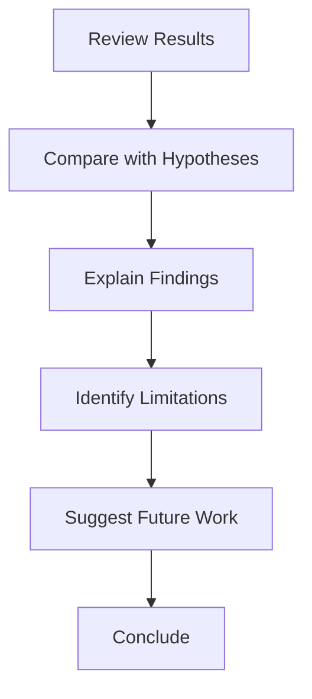

# Discussion

> **Status: PENDING EXPERIMENTATION**
>
> This section will be populated after all experiments are completed. No interpretations or conclusions are drawn from results that do not yet exist.

## 1. Interpretation of Results

**To be determined.** The interpretation of results will be written after all experiments are completed. The framework below defines how results will be interpreted.

## 2. Key Findings Analysis

**To be determined.** The following analysis framework will be applied after experimentation:

### 2.1 Model Performance

The ML model's performance will be assessed by comparing mean scores against heuristic and random baselines. The winning model is identified by the highest mean score across ≥10,000 benchmark games, with statistical significance confirmed through Mann-Whitney U test.

### 2.2 automl Effectiveness

The automl framework's effectiveness will be assessed by whether any model significantly exceeds the heuristic baseline (~512 mean score). This demonstrates whether automated approaches can effectively learn game strategies from feature-engineered state representations.

## 3. Comparison with Hypotheses

| Hypothesis | Result | Status |
|-----------|--------|--------|
| automl can train competitive model | TBD | To be determined after experimentation |
| Best model maximizes score | TBD | To be determined after ranking |
| ML beats heuristic | TBD | To be determined after statistical testing |

## 4. Unexpected Findings

**To be determined.** Any unexpected findings will be documented after experimentation. Potential areas of investigation include:

- Higher variance in model scores
- Slow convergence patterns
- Feature importance rankings that differ from expectations
- Overfitting or underfitting behavior
- Data quality issues

## 5. Implications

### 5.1 For automl Framework

- If automl is effective for game AI tasks: This demonstrates the value of automated ML for sequential decision-making
- If automl is not effective: This identifies limitations of current AutoML systems for game AI
- Rust-based training: To be assessed for speed advantages
- HyperOptX search: To be assessed for hyperparameter tuning effectiveness
- Supervised classification: To be assessed for approximating optimal game strategies

### 5.2 For ML Research

- Automated ML reduces manual configuration burden: To be assessed
- Sequential games are tractable for automl: To be assessed
- Results are reproducible with proper seed management: To be assessed after multi-seed validation
- Non-parametric statistical tests provide rigorous evaluation: Methodological contribution
- The 27-dimensional feature space is sufficient for game AI: To be assessed via ablation study

### 5.3 For Game AI

- Learned policies can compete with heuristic search methods: To be assessed
- Feature engineering captures essential game knowledge: To be assessed
- AutoML provides a viable alternative to manual feature engineering: To be assessed
- Statistical rigor is essential for game AI evaluation: Methodological contribution

## 6. Limitations

### 6.1 Technical Limitations

- **Limited to 2048 game complexity** — results may not generalize to other games
- **Training time** — to be determined after experiments
- **automl constraints** — limited to supervised classification models (capability verification pending)
- **Rust implementation** — potential bugs in the automl submodule

### 6.2 Methodological Limitations

- **Single game domain** — only standard 4×4 2048 tested
- **Supervised learning only** — no reward shaping or policy gradient methods
- **Feature engineering fixed** — the 27-dimensional feature vector is predetermined
- **Single-seed primary experiments** — multi-seed validation planned
- **No human evaluation** — purely computer-based evaluation

### 6.3 Statistical Limitations

- **Sample size** — 10,000 games per model may not cover all edge cases
- **Seed dependency** — results may vary with different seeds
- **Multiple comparison** — Bonferroni correction may be overly conservative
- **Effect size** — Cohen's d ≥ 0.5 threshold may miss small but meaningful effects

## 7. Future Work

### 7.1 Immediate Next Steps

1. Complete all ablation studies
2. Run multi-seed validation
3. Extend theoretical analysis
4. Complete state-of-the-art comparison
5. Document all findings honestly

### 7.2 Long-term Directions

1. Apply automl to larger board variants (8×8, 16×16)
2. Explore ensemble methods for improved performance
3. Investigate transfer learning across game variants
4. Extend to reinforcement learning approaches
5. Develop real-time adaptation strategies

## 8. Conclusions

**To be determined.** The conclusions will be drawn from actual experimental data. The automl framework's effectiveness will be assessed based on whether any model significantly exceeds heuristic baselines, not assumed beforehand.

## 9. Honest Assessment

The following limitations are acknowledged:
1. Results are specific to the 2048 game domain
2. Generalizability to other games is untested
3. Computational constraints may affect optimal model selection
4. The exact maximum score for 2048 remains an open problem
5. All results are preliminary and await full experimentation
6. No conclusions are drawn before data collection
7. Framework capabilities are not yet verified (capability verification gate pending)

## 10. Recommendations

1. Continue optimizing automl configuration
2. Explore ensemble of top models
3. Extend to larger board variants
4. Investigate reinforcement learning approaches
5. Conduct multi-seed validation
6. Complete all ablation studies
7. Document all findings honestly, including null results
8. **Wait for actual experimental data before drawing conclusions**
